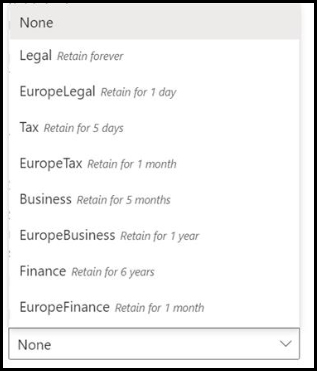
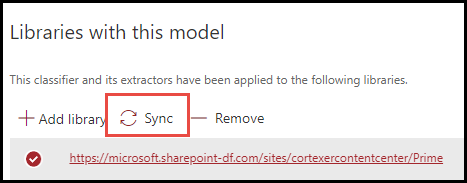
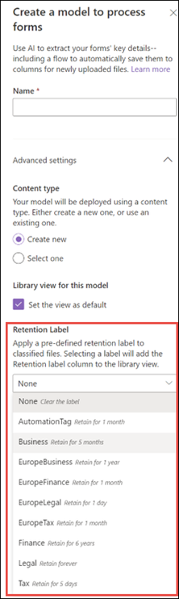

# Puede aplicar fácilmente una etiqueta de retención a un modelo en SharePoint Syntex.Apply a retention label to a model in SharePoint Syntex

 

> [!VIDEO https://www.microsoft.com/videoplayer/embed/RE4GydO]  

 

Puede aplicar fácilmente una [etiqueta de retención](../compliance/retention.md) a un modelo en Microsoft SharePoint Syntex.You can easily apply a [retention label](../compliance/retention.md) to a model in Microsoft SharePoint Syntex. Puede hacerlo tanto para modelos de comprensión de documentos como para modelos de procesamiento de formulariosYou can do this for both document understanding and form processing models.

Las etiquetas de retención le permiten aplicar la configuración de retención a los documentos que identifican sus modelos.Retention labels let you apply retention settings to the documents that your models identify.  Por ejemplo, si desea que el modelo no solo identifique cualquier documento de *Notificación de seguros* cargados en la biblioteca de documentos, sino que también pueda aplicar una etiqueta de retención de *negocios* para que estos documentos no se puedan eliminar de la biblioteca de documentos durante el período de tiempo especificado (por ejemplo, los próximos cinco meses).For example, you want your model to not only identify any *Insurance notice* documents that are uploaded to your document library, but to also apply a *Business* retention tag to them so that these documents cannot be deleted from the document library for the specified time period (the next five months, for example).

Puede aplicar una etiqueta de retención preexistente al modelo en la página principal del modelo.You can apply a pre-existing retention label to your model through your model settings on your model's home page. 

> [!Important]
> Para que las etiquetas de retención estén disponibles para aplicarlas a su modelo de comprensión mediante documentos, deben [crearse y publicarse en el Centro de cumplimiento de Microsoft 365](../compliance/create-apply-retention-labels.md#how-to-create-and-publish-retention-labels).For retention labels to be available to apply to your document understanding models, they need to be [created and published in the Microsoft 365 Compliance Center](../compliance/create-apply-retention-labels.md#how-to-create-and-publish-retention-labels).

## Aplicar una etiqueta de retención a un modelo de comprensión mediante documentosTo add a retention label to a document understanding model

1. En la página principal del modelo, seleccione **Configuración del modelo**.From the model home page, select **Model settings**. 
2. En **Configuración del modelo**, en la sección **Seguridad y cumplimiento**, seleccione el menú **Etiqueta de retención** para ver una lista de las etiquetas de retención disponibles para que se apliquen al modelo.In **Model settings**, in the **Security and compliance** section, select the **Retention label** menu to see a list of retention labels that are available for your to apply to the model. 
   
3. Seleccione la etiqueta de retención que desea aplicar al modelo y, a continuación, seleccione **Guardar**.Select the retention label you want to apply to the model, and then select **Save**. 

Después de aplicar la etiqueta de retención al modelo, podrá aplicarla a:After applying the retention label to your model, you are able to apply it to a:
- una nueva biblioteca de documentos yNew document library
- una biblioteca de documentos en la que ya se aplica el modelo.Document library to which the model is already applied
 
## Aplicar la etiqueta de retención a la biblioteca de documentos en la que ya se aplica el modeloApply the retention label to a document library to which the model is already applied

Si ya se ha aplicado el modelo de comprensión mediante documentos a una biblioteca de documentos, puede hacer lo siguiente para sincronizar la actualización de la etiqueta de retención y aplicarla en la biblioteca de documentos:If your document understanding model has already been applied to a document library, you can do the following to sync your retention label update to apply it to the document library: 

1. En la Página principal del modelo, en la sección **Bibliotecas con este modelo**, seleccione la biblioteca de documentos a la que quiera aplicar la actualización de la etiqueta de retención.On your model home page, in the **Libraries with this model** section, select the document library to which you want to apply the retention label update.   
2. Seleccione **Sincronizar**.Select **Sync**.  
   

Después de aplicar la actualización y sincronizarla con el modelo, puede confirmar que se ha aplicado haciendo lo siguiente:After applying the update and syncing it to your model, you can confirm that it has been applied by doing the following:

1. En el centro de contenido, en la sección **Bibliotecas con este modelo**, haga clic en la biblioteca a la que se ha aplicado el modelo actualizado.In the content center, in the **Libraries with this model** section, click on the library to which your updated model was applied.  
2. En la vista de la biblioteca de documentos, seleccione el icono de información para ver las propiedades del modelo.In your document library view, select the information icon to check the model properties.   
3. En la lista **Modelos activos**, seleccione el modelo actualizado.In the **Active models** list, select your updated model. 
4. En la sección **Etiqueta de retención** verá el nombre de la etiqueta de retención aplicada.In the **Retention label** section you will see the name of the applied retention label. 

En la página de vista del modelo de la biblioteca de documentos, se mostrará una nueva columna de la **Etiqueta de retención**.On your model's view page in your document library, a new **Retention label** column will display.  A medida que el modelo clasifica los archivos que identifica como pertenecientes al tipo de contenido y los muestra en la vista de biblioteca, en la columna Etiqueta de retención también se muestra el nombre de la etiqueta de retención que se ha aplicado a través del modelo.As your model classifies files it identifies as belonging to it's content type and lists them in the library view, the Retention label column will also display the name of the retention label that has been applied to it through the model.

Por ejemplo, todos los documentos de *Avisos de seguros* que su modelo identifique también tendrán la etiqueta de retención *Negocios* aplicada para que no se eliminen de la biblioteca de documentos durante cinco meses.For example, all *Insurance notice* documents that your model identifies will also have the *Business* retention label applied to them, preventing them from being deleted from the document library for five months. Si se intenta eliminar el archivo de la biblioteca de documentos, se mostrará un error que indica que no está permitido debido a la etiqueta de retención aplicada.If an attempt is made to delete the file from the document library, an error will display saying it is not allowed because of the applied retention label.

## Agregar una etiqueta de retención a un modelo de comprensión mediante documentosTo add a retention label to a form processing model

> [!Important]
> Para que las etiquetas de retención estén disponibles para aplicarlas a su modelo de procesamiento de formularios, deben [crearse y publicarse en el Centro de cumplimiento de Microsoft 365](../compliance/create-apply-retention-labels.md#how-to-create-and-publish-retention-labels).For retention labels to be available to apply to your form processing model, they need to be [created and published in the Microsoft 365 Compliance Center](../compliance/create-apply-retention-labels.md#how-to-create-and-publish-retention-labels).

Puede aplicar una etiqueta de retención a un modelo de procesamiento de formularios cuando cree el modelo, o bien aplicarlo a un modelo ya existente.You can either apply a retention label to a form processing model when you are creating a model, or apply it to an existing model.

### Agregar una etiqueta de retención a un modelo de comprensión mediante documentos cuando se crea el modeloTo add a retention label when you create a form processing model

1. Cuando cree un [nuevo modelo de procesamiento de formularios](./create-a-form-processing-model.md), seleccione la <b>Configuración avanzada.</b>When you are [creating a new form processing model](./create-a-form-processing-model.md), select <b>Advanced settings.</b>
2. En <b>Configuración avanzada</b>, en la sección <b>Etiqueta de retención</b>, seleccione el menú y, después, seleccione la etiqueta de retención que quiere aplicar al modelo.</b>In <b>Advanced settings</b>, in the <b>Retention label</b> section, select the menu and then select the retention label you want to apply to the model.</b>

 
      

3.  Cuando haya completado la configuración del modelo restante, seleccione <b>Crear</b> para crear el modelo.After you've completed your remaining model settings, select <b>Create</b> to build your model.

### Agregar una etiqueta de retención a un modelo de comprensión mediante documentos existenteTo add a retention label to an existing form processing model

Hay dos maneras de agregar una etiqueta de retención a un modelo de comprensión mediante documentos existente:You can add a retention label to an existing form processing model in different ways:
- A través del menú Automatizar de la biblioteca de documentosThrough the Automate menu in the document library
- A través de la configuración del Modelo activo en la biblioteca de documentosThrough the Active model settings in the document library 

#### Agregar una etiqueta de retención a un modelo de comprensión mediante documentos existente con el menú AutomatizarTo add a retention label to an existing form processing model through the Automate menu

Puede agregar una etiqueta de retención a un modelo de procesamiento de formularios existente del que sea propietario mediante el menú Automatizar de la biblioteca de documentos en la que se aplica el modelo.You can add a retention label to an existing form processing model that you own through the Automate menu in the document library in which the model is applied.

1. En la biblioteca de documentos a la que se aplica el modelo de procesamiento de formularios, seleccione el menú <b>Automatizar</b>, luego <b>AI Builder</b> y finalmente <b>Ver detalles del modelo de procesamiento de formularios</b>.In your document library to which the form processing model is applied, select the <b>Automate</b> menu, select <b>AI Builder</b>, then select <b>View form processing model details</b>.

    

2. En los detalles del modelo, en <b>Etiqueta de retención</b>, seleccione la etiqueta de retención que quiera aplicar.In the model details, in the <b>Retention Label</b> section, select the retention label you want to apply.  Después, seleccione <b>Guardar</b>.Then select <b>Save</b>.

       

#### Agregar una etiqueta de retención a un modelo de procesamiento de formularios existente en la configuración del modelo activoTo add a retention label to an existing form processing model in the active model settings

Puede agregar una etiqueta de retención a un modelo de procesamiento de formulario existente del que sea propietario en la configuración del Modelo activo de la biblioteca de documentos en la que se aplica el modelo.You can add a retention label to an existing form processing model that you own through the Active model settings in the document library in which the model is applied.

1. En la biblioteca de documentos de SharePoint en la que se aplica el modelo, seleccione el icono <b>Ver modelos activos</b> y, después, seleccione <b>Ver modelos activos</b>.</b>In the SharePoint document library in which the model is applied, select the <b>View active models</b> icon, and then select <b>View active models</b>.</b>

     

2. En <b>Modelos activos</b>, seleccione el modelo de procesamiento de formularios al que quiere aplicar la etiqueta de retención.In <b>Active models</b>, select the form processing model to which you want to apply the retention label.

       

3. En los detalles del modelo, en <b>Etiqueta de retención</b>, seleccione la etiqueta de retención que quiera aplicar.In the model details, in the <b>Retention Label</b> section, select the retention label you want to apply.  Después, seleccione <b>Guardar</b>.Then select <b>Save</b>.

> [!NOTE]
> Debe ser el propietario del modelo del panel de configuración del modelo para poder editarlo.You must be the model owner for the model settings pane to be editable. 

## Consulte tambiénSee Also
[Crear un clasificadorCreate a classifier](create-a-classifier.md)

[Crear un extractorCreate an extractor](create-an-extractor.md)

[Información general de la comprensión mediante documentos Document Understanding overview](document-understanding-overview.md)
