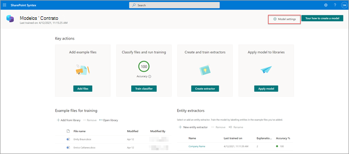
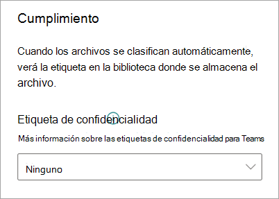
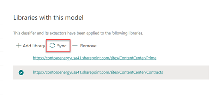

# Aplicar una etiqueta de confidencialidad a un modelo en Microsoft SharePoint Syntex

Puede aplicar fácilmente una [etiqueta de confidencialidad](../compliance/sensitivity-labels.md) a un modelo de comprensión mediante documentos en Microsoft SharePoint Syntex. Esta característica no está disponible todavía para los modelos de procesamiento de formularios.

Las etiquetas de confidencialidad le permiten aplicar directivas de cifrado, de uso compartido y de acceso condicional a los documentos que sus modelos identifiquen. Ejemplo de uso: desea que el modelo no solo identifique los documentos financieros que contienen números de cuenta bancaria o de tarjeta de crédito que se cargan en la biblioteca de documentos, sino también que aplique una etiqueta de confidencialidad de *Cifrado* para restringir quién puede tener acceso a ese contenido y cómo se puede usar. Los modelos SharePoint Syntex respetan las reglas del [orden de las etiquetas](../compliance/apply-sensitivity-label-automatically.md#how-multiple-conditions-are-evaluated-when-they-apply-to-more-than-one-label) y tampoco sobrescriben una etiqueta existente aplicada manualmente por un usuario al archivo. 

Puede aplicar una etiqueta de confidencialidad preexistente al modelo en la página principal del modelo. Para que esté disponible en la selección desde la configuración del modelo, la etiqueta ya debe haberse publicado.

> [!Important]
> Para que las etiquetas de confidencialidad estén disponibles para aplicarlas a su modelo de comprensión mediante documentos, deben [crearse y publicarse en el Centro de cumplimiento de Microsoft 365](../business-video/create-sensitivity-labels.md).

## Agregar una etiqueta de confidencialidad a un modelo de comprensión mediante documentos

1. En la página principal del modelo, seleccione **Configuración del modelo**.

   

2. En el panel **Configuración del modelo**, sección **Cumplimiento**, seleccione el menú **Etiqueta de confidencialidad** para ver una lista de las etiquetas de confidencialidad disponibles para que se apliquen al modelo.

    

3. Seleccione la etiqueta de confidencialidad que desea aplicar al modelo y, a continuación, seleccione **Guardar**.

Después de aplicar la etiqueta de confidencialidad al modelo, puede aplicarla a:

- una nueva biblioteca de documentos y
- una biblioteca de documentos en la que ya se aplica el modelo.
 
### Aplicar la etiqueta de confidencialidad a la biblioteca de documentos en la que ya se aplica el modelo

Si ya se ha aplicado el modelo de comprensión mediante documentos a una biblioteca de documentos, puede hacer lo siguiente para sincronizar la actualización de la etiqueta de confidencialidad y aplicarla en la biblioteca de documentos:

1. En la Página principal del modelo, sección **Bibliotecas con este modelo**, seleccione la biblioteca de documentos a la que quiera aplicar la actualización de la etiqueta de confidencialidad.

2. Seleccione **Sincronizar**.

   

Después de aplicar la actualización y sincronizarla con el modelo, puede confirmar que se ha aplicado haciendo lo siguiente:

1. En el centro de contenido, sección **Bibliotecas con este modelo**, seleccione la biblioteca a la que se ha aplicado el modelo actualizado. 

2. En la vista de la biblioteca de documentos, seleccione el icono de información para ver las propiedades del modelo.

3. En la lista **Modelos activos**, seleccione el modelo actualizado.

4. En la sección **etiqueta de confidencialidad**, verá el nombre de la etiqueta de confidencialidad aplicada.

En la página de vista del modelo de la biblioteca de documentos, se mostrará una nueva columna de la **Etiqueta de confidencialidad**. A medida que el modelo clasifica los archivos que identifica como pertenecientes al tipo de contenido y los muestra en la vista de biblioteca, en la columna **Etiqueta de confidencialidad** también se muestra el nombre de la etiqueta de confidencialidad que se ha aplicado con el modelo.

Por ejemplo, en todos los documentos financieros que identifique el modelo también se aplicará la etiqueta de confidencialidad *Cifrado*, lo que evitará que los usuarios no autorizados tengan acceso a ellos. Si una persona no autorizada intenta acceder al archivo desde la biblioteca de documentos, un error le informará de que no le está permitido debido a la etiqueta de confidencialidad aplicada.

<!---
## Add a sensitivity label to a form processing model

> [!Important]
> For sensitivity labels to be available to apply to your form processing model, they need to be [created and published in the Microsoft 365 Compliance Center](../business-video/create-sensitivity-labels.md).

You can either apply a sensitivity label to a form processing model when you are creating a model, or apply it to an existing model.

### Add a sensitivity label when you create a form processing model

1. When you [create a new form processing model](create-a-form-processing-model.md), select **Advanced settings**.

2. In **Advanced settings**, in the **Sensitivity label** section, select the menu and then select the sensitivity label you want to apply to the model.

3.  After you've completed your remaining model settings, select **Create** to build your model.

### Add a sensitivity label to an existing form processing model

You can add a sensitivity label to an existing form processing model in different ways:

- Through the **Automate** menu in the document library
- Through the **Active model** settings in the document library 

#### Add a sensitivity label to an existing form processing model through the Automate menu

You can add a sensitivity label to an existing form processing model that you own through the **Automate** menu in the document library in which the model is applied.

1. In your document library to which the form processing model is applied, select the **Automate** menu, select **AI Builder**, and then select **View form processing model details**.

2. On the **Model details** pane, in the **Sensitivity label** section, select the sensitivity label you want to apply. Then select **Save**.

#### Add a sensitivity label to an existing form processing model in the active model settings

You can add a sensitivity label to an existing form processing model that you own through the **Active model** settings in the document library in which the model is applied.

1. In the SharePoint document library in which the model is applied, select the **View active models** icon, and then select **View active models**.

2. In **Active models**, select the form processing model to which you want to apply the sensitivity label.

3. On the **Model details** pane, in the **Sensitivity label** section, select the sensitivity label you want to apply. Then select **Save**.

   > [!NOTE]
   > You must be the model owner for the **Model settings** pane to be editable. 
--->

## Ver también

[Aplicar una etiqueta de retención](apply-a-retention-label-to-a-model.md)

[Crear un clasificador](create-a-classifier.md)

[Crear un extractor](create-an-extractor.md)

[Información general de la comprensión mediante documentos ](document-understanding-overview.md)
