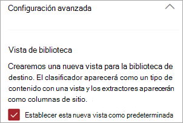

# Elección de la vista en una biblioteca de documentos en Microsoft Syntex

**Se aplica a:**  &ensp; &#10003; Todos los modelos &ensp; | &ensp; personalizados &#10003; Todos los modelos precompilados

Hay varias maneras de ver cómo ve la información en una biblioteca de documentos de SharePoint. Puede elegir la vista predeterminada o cambiar la vista de la biblioteca de documentos para que se ajuste a sus necesidades o preferencias.

## Elija la vista predeterminada.

Al aplicar cualquier modelo a una biblioteca, tiene la opción de establecer una nueva vista predeterminada para la biblioteca de documentos. 

Dado que un modelo está asociado a un tipo de contenido, al aplicarlo a la biblioteca, agregará el tipo de contenido y actualizará la vista predeterminada con las etiquetas extraídas que se muestran como columnas. Sin embargo, puede seleccionar **Configuración avanzada** para elegir, opcionalmente, conservar la vista de biblioteca actual o usar una nueva vista con información del modelo y miniaturas de archivo. Si decide mantener la vista de biblioteca actual, las nuevas vistas con información del modelo seguirán estando disponibles en el menú de vista de la biblioteca.

   

## Cambio de la vista de biblioteca

Puede cambiar la vista en una biblioteca de documentos en función de sus preferencias. Para cambiar la vista en la página de la biblioteca, seleccione el menú desplegable ver para mostrar las opciones y, a continuación, seleccione la vista que desea usar.

    

Por ejemplo, si selecciona **Iconos** en la lista, la página se mostrará como se muestra.

    

La vista **Iconos** muestra hasta ocho campos creados por el usuario. Si hay menos de ocho, se muestran hasta cuatro campos generados por el sistema: Confidencialidad (si está disponible), Retención (si está disponible), Tipo de contenido, Fecha de modificación, Modificado por y Fecha de clasificación.

Para editar cualquier vista actual, en el menú desplegable de la vista, seleccione **Editar vista actual**.

