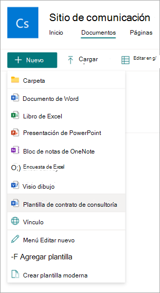

# Creación de un documento a partir de una plantilla moderna en Microsoft Syntex

Puede usar una plantilla moderna *publicada* para crear rápidamente documentos similares sin tener que empezar desde cero. Para crear un documento mediante una plantilla publicada, siga estos pasos:

1. En una biblioteca de documentos de SharePoint, seleccione **Nuevo** y, a continuación, seleccione la plantilla moderna que desea usar.

   

2. La plantilla se abre en el estudio de plantillas.

3. En el panel **Crear un documento a partir de una plantilla** , escriba la información y, a continuación, seleccione **Crear documento**.

   

   Para ayudar a reducir el tiempo y el esfuerzo implicados en el llenado de valores de marcadores de posición, Syntex proporciona:

      - Sugerencias para ayudarle a elegir fácilmente valores al seleccionar valores de una lista.
      - Autorrellenar los valores de marcador de posición si se puede identificar de forma única un registro de marcadores de posición asociados a la misma lista.
