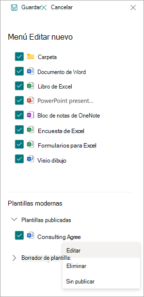

# Edición de una plantilla moderna en Microsoft Syntex

Si necesita editar una plantilla existente o eliminar o anular la publicación de una plantilla, siga estos pasos.

1. En una biblioteca de documentos de SharePoint, seleccione **nuevo** > **editar nuevo menú**.

   

2. En el panel de **menús Editar nuevo** , en la sección **Plantillas modernas** , seleccione la plantilla publicada o borrador que desea editar.

   

3. Para editar una plantilla publicada o una plantilla de borrador:

   - En **Plantillas publicadas**, seleccione **Editar** para abrir el estudio de plantillas, donde puede editar la plantilla publicada. También puede optar por eliminar o anular la publicación de la plantilla.

      

   - En **Plantillas de borrador**, seleccione **Editar** para abrir el estudio de plantillas, donde puede editar la plantilla de borrador. También puede optar por eliminar o publicar la plantilla.

      

