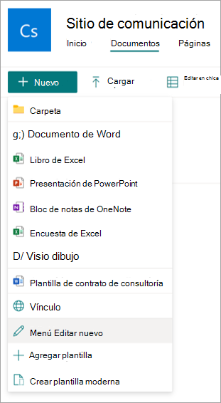

# Creación de una plantilla moderna en Microsoft Syntex

## Carga de un documento para crear una plantilla moderna

Siga estos pasos para crear una plantilla moderna.

1. En una biblioteca de documentos de SharePoint, seleccione **Nueva** > **plantilla crear moderna**.

   

2. Seleccione un documento de Word para cargarlo desde SharePoint o OneDrive de la organización, o desde el almacenamiento local.

   

3. Después de cargar el documento, el documento se muestra en el estudio de plantillas, donde puede convertir el documento en una plantilla agregando campos.

   

4. En la esquina superior izquierda de Template Studio, seleccione el nombre de la plantilla. El nombre predeterminado es el nombre del documento usado para crear la plantilla. Si desea cambiar el nombre de la plantilla, seleccione el nombre predeterminado o el icono de lápiz situado junto al nombre, escriba el nuevo nombre y, a continuación, seleccione **Entrar**.

   

<!---
5. Create placeholders for all dynamic text in the document that users might want to change from one document to another. For example, you might want to create a placeholder for input such as company name, client name, address, phone number, or date.

    To create a placeholder, select the text (such as the date). The **All placeholders** panel will open, where you'll give the placeholder a relevant name and choose the type of input you want to associate with the placeholder.
 
   

   Currently, there are three ways for users to fill in a placeholder:

   - [Enter text or select a date](#associate-a-placeholder-by-entering-text-or-selecting-a-date)
   - [Select from choices in a column of a list or library](#associate-a-placeholder-by-selecting-from-choices-in-a-column-of-a-list-or-library)
   - [Select from managed metadata term set or term](#associate-a-placeholder-by-selecting-from-managed-metadata-term-set-or-term)

   > [!NOTE]
   > You can create placeholders for text, and also placeholders for text within cells in a table. However, images, smart art, complete tables, and bulleted lists are currently not supported.   
--->

## Asociación de campos con diferentes orígenes de datos

Puede asociar campos y marcadores de posición mediante:

- [Escribir texto o seleccionar una fecha](#associate-a-placeholder-by-entering-text-or-selecting-a-date)

- [Selección de opciones en una columna de una lista o biblioteca](#associate-a-placeholder-by-selecting-from-choices-in-a-column-of-a-list-or-library)

- [Selección de un término o conjunto de términos de metadatos administrados](#associate-a-placeholder-by-selecting-from-a-managed-metadata-term-set-or-term)

### Asociar un marcador de posición escribiendo texto o seleccionando una fecha

En el panel **Todos los marcadores de posición** :

1. En el campo **Nombre** , escriba un nombre pertinente para el marcador de posición.

   

2. En la sección **How authors fill in this placeholder (Cómo rellenan los autores este marcador de posición** ), seleccione **Entrar texto o seleccione una fecha**.

3. En el campo **Tipo de información** , seleccione el tipo de datos que desea asociar al marcador de posición. Actualmente, hay seis opciones disponibles: **Línea única de texto**, **Varias líneas de texto**, **Número**, **Fecha y hora**, **Email** e **Hipervínculo**.

4. Seleccione **Agregar**.

   > [!NOTE]
   > Puede configurar varios formateadores de fecha, como MM/DD/AAAA, DD/MM/AAAA, AAAA/MM/DD y DD de mes, incluida la hora de configuración en formato de 12 horas y 24 horas. 

### Asociar un marcador de posición seleccionando entre las opciones de una columna de una lista o biblioteca

En el panel **Todos los marcadores de posición** :

1. En el campo **Nombre** , escriba un nombre pertinente para el marcador de posición.

   

2. En la sección **Cómo rellenan los autores este marcador de posición** , elija **Seleccionar entre las opciones de una columna de una lista o biblioteca** y, a continuación, seleccione **Seleccionar**.

3. En la página **Seleccionar una lista para agregar una columna de origen** , seleccione la lista que desea usar y, a continuación, seleccione **Siguiente**.

   

4. En la **página Seleccionar una columna de origen de la lista existente** , seleccione el nombre de columna que desea asociar al marcador de posición y, a continuación, seleccione **Guardar**.

   

    Si desea volver a ver la página original de listas, seleccione **Ir al vínculo (nombre de lista)** en la parte inferior de la lista.

5. Cuando haya terminado, verá que el campo de lista se ha asociado con el marcador de posición.

   

6. Si desea que los usuarios puedan agregar entradas manualmente, además de elegir entre una lista, seleccione **Permitir que los autores agreguen nuevas opciones**. En este caso, el valor predeterminado para el tipo de datos de entrada manual es *Una sola línea de texto*. Además, los valores introducidos por los autores solo se usarán para generar el documento. No se agregarán a la lista de SharePoint.

### Asociar un marcador de posición seleccionando un término o conjunto de términos de metadatos administrados

En el panel **Todos los marcadores de posición** :

1. En el campo **Nombre** , escriba un nombre pertinente para el marcador de posición.

   

2. En la sección **Cómo rellenan los autores este marcador de posición** , elija **Seleccionar entre términos o conjuntos de términos de metadatos administrados** y, a continuación, seleccione **Seleccionar**.

3. En la página **Seleccionar conjuntos de términos o términos** , busque o seleccione el conjunto de términos o el término que desea asociar al marcador de posición y, a continuación, seleccione **Guardar**.

   

4. Cuando haya terminado, verá que el término o conjunto de términos seleccionados se ha asociado con el marcador de posición. 

   

5. Si desea que los usuarios puedan agregar varios valores correspondientes al conjunto de términos o al término, seleccione **Permitir varios valores**. Además, si el conjunto de términos está configurado como un conjunto de términos abierto, puede seleccionar **Permitir nuevos valores**. Si habilita esta opción, los usuarios que generan documentos a partir de la plantilla moderna pueden agregar nuevos términos al conjunto de términos y agregar esos términos como valores de marcador de posición.

   > [!TIP]
   > Al habilitar la opción **Permitir nuevos valores** (solo se permite para conjuntos de términos abiertos), es más probable que los usuarios agreguen términos redundantes en el almacén de términos. Los términos redundantes pueden dificultar que los administradores administren un conjunto de términos.

## Guardar una plantilla moderna como borrador

Puede crear tantos campos como considere necesarios. Cuando haya terminado, puede elegir guardar la plantilla como borrador.

1. Seleccione **Guardar borrador** para guardar la plantilla como borrador y puede acceder a ella más adelante.

2. Para ver, editar o publicar borradores guardados en el menú desplegable **Plantillas de borrador** de las **plantillas modernas**, seleccione **Nuevo** > **editar nuevo menú** de la biblioteca de documentos.

## Publicación de una plantilla moderna

Cuando haya completado la adición de todos los campos pertinentes a la plantilla y desee que esté disponible para que la usen otros usuarios en la biblioteca de documentos, puede publicar la plantilla.

1. Seleccione **Publicar** para publicar la plantilla que usarán otros usuarios de la organización para crear documentos.

2. Para ver, editar o anular la publicación de plantillas *publicadas* en el menú desplegable **Plantillas publicadas** de la sección **Plantillas modernas** , seleccione **Nuevo** > **menú Editar nuevo** en la biblioteca de documentos. 

## Edición de una plantilla moderna

Si necesita editar una plantilla existente o eliminar o anular la publicación de una plantilla, siga estos pasos.

1. En una biblioteca de documentos de SharePoint, seleccione **nuevo** > **editar nuevo menú**.

   

2. En el panel de **menús Editar nuevo** , en la sección **Plantillas modernas** , seleccione la plantilla publicada o borrador que desea editar.

   

3. Para editar una plantilla publicada o una plantilla de borrador:

   - En **Plantillas publicadas**, seleccione **Editar** para abrir el estudio de plantillas, donde puede editar la plantilla publicada. También puede optar por eliminar o anular la publicación de la plantilla.

      

   - En **Plantillas de borrador**, seleccione **Editar** para abrir el estudio de plantillas, donde puede editar la plantilla de borrador. También puede optar por eliminar o publicar la plantilla.

      

> [!div class="nextstepaction"]
> [Siguiente paso > Crear un documento a partir de una plantilla moderna](content-assembly-create-document.md)