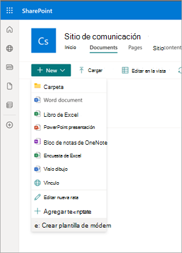
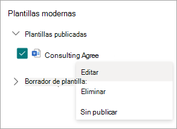

# Creación de documentos mediante el ensamblado de contenido en Microsoft SharePoint Syntex

Puede usar SharePoint Syntex para ayudarle a generar automáticamente documentos empresariales repetitivos estándar, como contratos, declaraciones de trabajo, contratos de servicio, cartas de consentimiento, lanzamientos de ventas y correspondencia. Puede hacer todo esto de forma más rápida, coherente y con menos errores mediante el uso del ensamblado de contenido en SharePoint Syntex.

Con el ensamblado de contenido, puede usar un documento existente para crear una *plantilla moderna* y, a continuación, usar esa plantilla para generar automáticamente contenido nuevo mediante listas de SharePoint o entradas manuales como origen de datos.

> [!NOTE]
> Debe ser un usuario con licencia SharePoint Syntex para acceder a las funcionalidades de ensamblado de contenido y usarlas. También debe tener permisos para administrar listas de SharePoint.

## Creación de una plantilla moderna

Siga estos pasos para crear una plantilla moderna.

1. En una biblioteca de documentos de SharePoint, seleccione **Nueva** > **plantilla crear moderna**.

   

2. Elija un documento de Word existente que quiera usar como base para crear una plantilla moderna y, a continuación, seleccione **Abrir**.

   

   > [!NOTE]
   > Actualmente, solo puede cargar documentos de Word (extensión .docx) para crear plantillas. Cargue documentos de Word desde el almacenamiento local o el escritorio.

3. Después de cargar el documento, el documento se muestra en el estudio de plantillas, donde puede convertir el documento en una plantilla.

   

4. En la esquina superior izquierda de Template Studio, seleccione el nombre de la plantilla. El nombre predeterminado es el nombre del documento usado para crear la plantilla. Si desea cambiar el nombre de la plantilla, seleccione el nombre predeterminado o el icono de lápiz situado junto al nombre, escriba el nuevo nombre y, a continuación, seleccione **Entrar**.

   

5. Cree marcadores de posición para todo el texto dinámico del documento que los usuarios quieran cambiar de un documento a otro. Por ejemplo, es posible que desee crear un marcador de posición para la entrada, como el nombre de la empresa, el nombre de cliente, la dirección, el número de teléfono o la fecha.

    Para crear un marcador de posición, seleccione el texto (por ejemplo, la fecha). Se abrirá el panel **Todos los marcadores de posición** , donde le dará un nombre relevante al marcador de posición y elegirá el tipo de entrada que desea asociar al marcador de posición.
 
   

   Actualmente, hay tres maneras de que los usuarios rellenen un marcador de posición:

   - [Escriba texto o seleccione una fecha.](#associate-a-placeholder-by-entering-text-or-selecting-a-date)
   - [Selección de opciones en una columna de una lista o biblioteca](#associate-a-placeholder-by-selecting-from-choices-in-a-column-of-a-list-or-library)
   - [Selección de un término o conjunto de términos de metadatos administrados](#associate-a-placeholder-by-selecting-from-managed-metadata-term-set-or-term)

   > [!NOTE]
   > Puede crear marcadores de posición para texto y también marcadores de posición para texto dentro de las celdas de una tabla. Sin embargo, actualmente no se admiten imágenes, arte inteligente, tablas completas y listas con viñetas.   

### Asociar un marcador de posición escribiendo texto o seleccionando una fecha

En el panel **Todos los marcadores de posición** :

1. En el campo **Nombre** , escriba un nombre pertinente para el marcador de posición.

   

2. En la sección **How authors fill in this placeholder (Cómo rellenan los autores este marcador de posición** ), seleccione **Entrar texto o seleccione una fecha**.

3. En el campo **Tipo de información** , seleccione el tipo de datos que desea asociar al marcador de posición. Actualmente, hay seis opciones disponibles: **Línea única de texto**, **Varias líneas de texto**, **Número**, **Fecha y hora**, **Email** e **Hipervínculo**.

4. Seleccione **Agregar**.

   > [!NOTE]
   > Puede configurar varios formateadores de fecha, como MM/DD/AAAA, DD/MM/AAAA, AAAA/MM/DD y DD de mes, incluida la hora de configuración en formato de 12 horas y 24 horas. 

### Asociar un marcador de posición seleccionando entre las opciones de una columna de una lista o biblioteca

En el panel **Todos los marcadores de posición** :

1. En el campo **Nombre** , escriba un nombre pertinente para el marcador de posición.

   

2. En la sección **Cómo rellenan los autores este marcador de posición** , elija **Seleccionar entre las opciones de una columna de una lista o biblioteca** y, a continuación, seleccione **Seleccionar**.

3. En la página **Seleccionar una lista para agregar una columna de origen** , seleccione la lista que desea usar y, a continuación, seleccione **Siguiente**.

   

4. En la **página Seleccionar una columna de origen de la lista existente** , seleccione el nombre de columna que desea asociar al marcador de posición y, a continuación, seleccione **Guardar**.

   

    Si desea volver a ver la página original de listas, seleccione **Ir al vínculo (nombre de lista)** en la parte inferior de la lista.

5. Cuando haya terminado, verá que el campo de lista se ha asociado con el marcador de posición.

   

6. Si desea que los usuarios puedan agregar entradas manualmente, además de elegir entre una lista, seleccione **Permitir que los autores agreguen nuevas opciones**. En este caso, el valor predeterminado para el tipo de datos de entrada manual es *Una sola línea de texto*. Además, los valores introducidos por los autores solo se usarán para generar el documento. No se agregarán a la lista de SharePoint.

### Asociación de un marcador de posición mediante la selección de un término o conjunto de términos de metadatos administrados

En el panel **Todos los marcadores de posición** :

1. En el campo **Nombre** , escriba un nombre pertinente para el marcador de posición.

   

2. En la sección **Cómo rellenan los autores este marcador de posición** , elija **Seleccionar entre términos o conjuntos de términos de metadatos administrados** y, a continuación, seleccione **Seleccionar**.

3. En la página **Seleccionar conjuntos de términos o términos** , busque o seleccione el conjunto de términos o el término que desea asociar al marcador de posición y, a continuación, seleccione **Guardar**.

   

4. Cuando haya terminado, verá que el término o conjunto de términos seleccionados se ha asociado con el marcador de posición. 

   

5. Si desea que los usuarios puedan agregar varios valores correspondientes al conjunto de términos o al término, seleccione **Permitir varios valores**. Además, si el conjunto de términos está configurado como un conjunto de términos abierto, puede seleccionar **Permitir nuevos valores**. Si habilita esta opción, los usuarios que generan documentos a partir de la plantilla moderna pueden agregar nuevos términos al conjunto de términos y agregar esos términos como valores de marcador de posición.

   > [!TIP]
   > Al habilitar la opción **Permitir nuevos valores** (solo se permite para conjuntos de términos abiertos), es más probable que los usuarios agreguen términos redundantes en el almacén de términos. Los términos redundantes pueden dificultar que los administradores administren un conjunto de términos.

Puede crear tantos marcadores de posición como considere necesarios. Cuando haya terminado, puede elegir guardar la plantilla como borrador o publicarla.

   - **Guardar borrador** : guarda la plantilla como borrador y puede acceder a ella más adelante. Para ver, editar o publicar borradores guardados en la sección **Plantillas modernas** , seleccione **el menú Nueva** > **edición nuevo** de la biblioteca de documentos.
 
   - **Publicar** : publica la plantilla que usarán otros usuarios de la organización para crear documentos. Puede ver, editar o anular la publicación de plantillas *publicadas* en la sección **Plantillas modernas** seleccionando **nuevo** > **editar nuevo menú** de la biblioteca de documentos. 

## Edición de una plantilla moderna

Si necesita editar una plantilla existente o eliminar o anular la publicación de una plantilla, siga estos pasos.

1. En una biblioteca de documentos de SharePoint, seleccione **nuevo** > **editar nuevo menú**.

   

2. En el panel de **menús Editar nuevo** , en la sección **Plantillas modernas** , seleccione la plantilla publicada o borrador que desea editar.

   

3. Para editar una plantilla publicada o una plantilla de borrador:

   - En **Plantillas publicadas**, seleccione **Editar** para abrir el estudio de plantillas, donde puede editar la plantilla publicada. También puede optar por eliminar o anular la publicación de la plantilla.

      

   - En **Plantillas de borrador**, seleccione **Editar** para abrir el estudio de plantillas, donde puede editar la plantilla de borrador. También puede optar por eliminar o publicar la plantilla.

      

## Creación de un documento a partir de una plantilla moderna

Puede usar una plantilla moderna *publicada* para crear rápidamente documentos similares sin tener que empezar desde cero. Para crear un documento mediante una plantilla publicada, siga estos pasos:

1. En una biblioteca de documentos de SharePoint, seleccione **Nuevo** y, a continuación, seleccione la plantilla moderna que desea usar.

   

2. La plantilla se abre en el estudio de plantillas.

3. En el panel **Crear un documento a partir de una plantilla** , escriba la información y, a continuación, seleccione **Crear documento**.

   

   Para ayudar a reducir el tiempo y el esfuerzo necesarios para rellenar los valores de los marcadores de posición, SharePoint Syntex proporciona:

      - Sugerencias para ayudarle a elegir fácilmente valores al seleccionar valores de una lista.
      - Autorrellenar los valores de marcador de posición si se puede identificar de forma única un registro de marcadores de posición asociados a la misma lista.

> [!NOTE]
> **Limitaciones actuales de la versión**
>- Actualmente solo se admiten documentos de Microsoft Word (extensión .docx) para crear una plantilla. Antes de cargar un documento de Word, asegúrese de que no incluya comentarios o que tenga habilitado **El seguimiento de cambios** . Si el documento contiene marcadores de posición de texto para imágenes, asegúrese de que no están encapsulados en texto. Actualmente no se admiten los controles de contenido de Word. Si desea crear una plantilla a partir de un documento de Word con controles de contenido, quítelos antes de crear una plantilla moderna.
>- La plantilla y el documento están asociados a una biblioteca de documentos. Para usar la plantilla en otra biblioteca de documentos, deberá volver a crearla en esa biblioteca de documentos.
>- El documento cargado que se usa para crear la plantilla moderna se guardará como una copia independiente y se colocará en el directorio /forms de la biblioteca de documentos. El archivo original del disco no se verá afectado.
>- Puede crear marcadores de posición para texto y también marcadores de posición para texto dentro de las celdas de una tabla. Sin embargo, actualmente no se admiten imágenes, arte inteligente, tablas completas y listas con viñetas.
>- Una vez que se crea un documento a partir de una plantilla, no está asociado a la plantilla.

 
