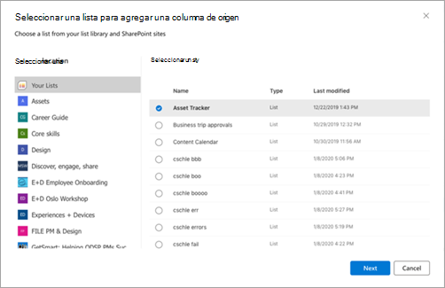

# Crear documentos mediante el ensamblado de contenido en Microsoft SharePoint Syntex

Puede usar SharePoint Syntex para ayudarle a generar automáticamente documentos comerciales repetitivos estándar, como contratos, declaraciones de trabajo, contratos de servicio, cartas de consentimiento, lanzamientos de ventas y correspondencia. Puede hacer todo esto de forma más rápida, coherente y menos propensa a errores mediante el ensamblado de contenido en SharePoint Syntex.

Con el ensamblado de contenido, puede usar un documento existente para crear una plantilla moderna y, a continuación, usar esa plantilla para generar automáticamente contenido nuevo mediante listas de SharePoint o entradas de usuario como origen de datos.

> [!NOTE]
> Debe ser un usuario con licencia SharePoint Syntex para tener acceso a las funcionalidades de ensamblado de contenido y usarlas. También debe tener permisos para administrar las SharePoint listas.

## Crear una plantilla moderna

Siga estos pasos para crear una plantilla moderna.

1. En una biblioteca de documentos de Sharepoint, seleccione **Nueva**  >  **plantilla Crear moderna.** 
 
   

2. Elija un documento de Word existente que desee usar como base para crear una plantilla moderna y, a continuación, **seleccione Abrir**. 
 
   

   > [!NOTE]
   > Actualmente, solo puede cargar documentos de Word (.docx extensión) para crear plantillas. Upload documentos de Word desde el escritorio o almacenamiento local.

3. Después de cargar el documento, el documento se muestra en el estudio de plantillas donde puede convertir el documento en una plantilla.
 
   

4. En la esquina superior izquierda del estudio de plantillas, seleccione el nombre de la plantilla. El nombre predeterminado es el nombre del documento usado para crear la plantilla. Si desea cambiar el nombre de la plantilla, seleccione el nombre predeterminado o el icono de lápiz junto al nombre, escriba el nuevo nombre y, a continuación, **seleccione Entrar**.
 
   

5. Cree marcadores de posición para todo el texto dinámico del documento que los usuarios podrían querer cambiar de un documento a otro. Por ejemplo, es posible que desee crear un marcador de posición para la entrada, como el nombre de la empresa, el nombre del cliente, la dirección, el número de teléfono o la fecha.

    Para crear un marcador de posición, seleccione el texto (como la fecha). Se abrirá el panel Todos los **marcadores** de posición, donde se le dará un nombre relevante al marcador de posición y se elegirá el tipo de entrada que desea asociar con el marcador de posición.
 
   

   Actualmente, hay dos formas de que los usuarios rellenen un marcador de posición:

   - [Escribir texto o seleccionar una fecha](#associate-a-placeholder-by-entering-text-or-selecting-a-date)
   - [Seleccionar entre opciones de una columna de una lista o biblioteca](#associate-a-placeholder-by-selecting-from-choices-in-a-column-of-a-list-or-library)

### Asociar un marcador de posición especificando texto o seleccionando una fecha 

En el **panel Todos los marcadores de posición:**

1. En el **campo** Nombre, escriba un nombre relevante para el marcador de posición.

   

2. En la **sección Cómo rellenan los autores este marcador de posición,** seleccione **Escribir texto o seleccione una fecha**.

3. En el **campo Tipo de información,** seleccione el tipo de datos que desea asociar con el marcador de posición. Actualmente, hay seis opciones disponibles: **Línea única** de texto , Varias **líneas** de texto , **Número**, **Fecha** y hora, **Correo** electrónico e **Hipervínculo**.

4. Seleccione **Agregar**.

### Asociar un marcador de posición seleccionando entre las opciones de una columna de una lista o biblioteca

En el **panel Todos los marcadores de posición:**

1. En el **campo** Nombre, escriba un nombre relevante para el marcador de posición.

   

2. En la **sección Cómo rellenan los** autores este marcador de posición, elija Seleccionar entre opciones de una columna de una lista o biblioteca y, **a** continuación, **elija Seleccionar**.

3. En la **página Seleccionar una lista para agregar una** columna de origen, seleccione la lista que desea usar y, a continuación, seleccione **Siguiente**.

   

4. En la **página Seleccionar una columna de** origen de la lista existente, seleccione el nombre de columna que desea asociar con el marcador de posición y, a continuación, seleccione **Guardar**. 

   

    Si desea volver a ver la página original de listas, seleccione **Ir a (nombre de lista)** vínculo en la parte inferior de la lista.

5. Cuando haya terminado, verá que el campo de lista se ha asociado con el marcador de posición.

   

6. Si desea que los usuarios puedan agregar entradas manualmente, además de elegir en una lista, seleccione Permitir que los autores **agreguen nuevas opciones.** En este caso, el valor predeterminado para el tipo de datos de entrada manual es *Línea única de texto*. También los valores que los autores introducen solo se usarán para generar el documento. No se agregarán a la lista SharePoint datos.
 
Puede crear tantos marcadores de posición como crea que sean necesarios. Cuando haya terminado, puede elegir guardar la plantilla como borrador o publicar la plantilla.

   - **Guardar borrador:** guarda la plantilla como borrador y puede obtener acceso a ella más adelante. Puede ver, editar o publicar borradores  guardados en la sección Plantillas modernas seleccionando Nuevo menú Editar  >  **nuevo** de la biblioteca de documentos. 
   - **Publicar:** publica la plantilla que otros usuarios de la organización usarán para crear documentos. Puede ver, editar o  anular la publicación  de plantillas publicadas en la sección Plantillas modernas seleccionando Nuevo menú Editar   >  **nuevo** en la biblioteca de documentos. 

## Editar una plantilla moderna

Si necesita editar una plantilla existente o eliminar o anular la publicación de una plantilla, siga estos pasos.

1. En una biblioteca de documentos de Sharepoint, seleccione **Nuevo**  >  **menú Editar nuevo**. 
 
   

2. En el **panel de menú Editar** nuevo, en la sección **Plantillas** modernas, seleccione la plantilla publicada o borrador que desee editar.
 
   

3. Para editar una plantilla publicada o un borrador de plantilla:

   - En **Plantillas publicadas,** seleccione  **Editar** para abrir el estudio de plantillas donde puede editar la   plantilla publicada. También puede eliminar o anular la publicación de la plantilla. 
 
      

   - Para **Plantillas borrador,** seleccione  **Editar** para abrir el estudio de plantillas donde puede editar la plantilla   de borrador. También puede elegir eliminar o publicar la plantilla.
 
      

## Crear un documento a partir de una plantilla moderna

Puede usar una *plantilla moderna* publicada para crear rápidamente documentos similares sin tener que empezar desde cero. Para crear un documento con una plantilla publicada, siga estos pasos:

1. En una biblioteca de documentos de Sharepoint, seleccione **Nuevo** y, a continuación, seleccione la plantilla moderna que desea usar.
 
   

2. La plantilla se abre en el estudio de plantillas.

3. En el **panel Crear un documento a partir** de una plantilla, escriba la información y, a continuación, seleccione Crear **documento**.

   

   Para ayudar a reducir el tiempo y el esfuerzo que implica rellenar valores para marcadores de posición, SharePoint Syntex proporciona:

      - Sugerencias para ayudarle a elegir valores fácilmente al seleccionar valores de una lista.
      - Autofill placeholder values if able to uniquely identify a record for placeholders associated with the same list.

> [!NOTE]
> - Actualmente, solo Microsoft Word documentos (.docx extensión) se admiten para crear una plantilla. Antes de cargar el documento, asegúrese de que el documento de Word no tiene habilitado realizar un seguimiento de **los** cambios ni de los comentarios. Si el documento contiene marcadores de posición de texto para imágenes, asegúrese de que no están ajustados por texto.
>- La plantilla y el documento están asociados a una biblioteca de documentos. Para usar la plantilla en otra biblioteca de documentos, deberá volver a crear la plantilla en esa biblioteca de documentos.
>- El documento cargado que se usa para crear la plantilla moderna se guardará como una copia independiente y se colocará en el directorio /forms de la biblioteca de documentos. El archivo original del disco no se verá afectado.
>- Solo puede crear marcadores de posición para texto. Actualmente, no se admiten imágenes, arte inteligente, tablas y listas de viñetas.
>- Una vez que se crea un documento a partir de una plantilla, no se asocia a la plantilla.

 
