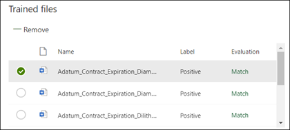

# Crear un clasificador en Microsoft SharePoint SyntexCreate a classifier in Microsoft SharePoint Syntex

El contenido de este artículo es para la versión preliminar privada de Project Cortex.The content in this article is for the Project Cortex Private Preview. [Obtenga más información sobre Project Cortex](https://aka.ms/projectcortex).[Find out more about Project Cortex](https://aka.ms/projectcortex).

 

> [!VIDEO https://www.microsoft.com/videoplayer/embed/RE4CL0R]  

 

Un clasificador es un tipo de modelo que puede usar para automatizar la identificación y clasificación de un tipo de documento.A classifier is a type of model that you can use to automate identification and classification of a document type. Por ejemplo, es posible que desee identificar todos los documentos de *renovación de contratos* que se agregan a la biblioteca de documentos, como se muestra en la siguiente ilustración.For example, you may want to identify all *Contract Renewal* documents that are added to your document library, such as is shown in the following illustration.

La creación de un clasificador permite crear un nuevo [tipo de contenido de SharePoint](https://docs.microsoft.com/sharepoint/governance/content-type-and-workflow-planning#content-type-overview) que se asociará al modelo.Creating a classifier enables you to create a new [SharePoint Content Type](https://docs.microsoft.com/sharepoint/governance/content-type-and-workflow-planning#content-type-overview) that will be associated to the model.

Al crear el clasificador, debe crear *explicaciones* para definir el modelo.When creating the classifier, you need to create *explanations* to define the model. Esto le permite anotar datos comunes que espera que encuentren de forma coherente este tipo de documento.This enables you to note common data that you would expect to consistently find this document type. 

Use ejemplos del tipo de documento ("archivos de ejemplo") para "entrenar" su modelo para identificar los archivos que tienen el mismo tipo de contenido.Use examples of the document type ("example files") to "train" your model to identify files that have the same content type.

Para crear un clasificador, debe:To create a classifier, you need to:
1. Asigne un nombre al modelo.Name your model.
2. Agregue los archivos de ejemplo.Add your example files.
3. Etiquete los archivos de ejemplo.Label your example files.
4. Cree una explicación.Create an explanation.
5. Pruebe el modelo.Test your model.

> [!NOTE]
> Aunque el modelo usa un clasificador para identificar y clasificar los tipos de documentos, también puede optar por extraer fragmentos específicos de información de cada archivo identificado por el modelo.While your model uses a classifier to identify and classify document types, you can also choose to pull specific pieces of information from each file identified by the model. Para ello, cree un **extractor** para agregarlo al modelo.Do this by creating an **extractor** to add to your model. Consulte [Create a extractor](create-an-extractor.md).See [Create an extractor](create-an-extractor.md).

## Asigne un nombre al modeloName your model

El primer paso para crear el modelo es darle un nombre:The first step to create your model is to give it a name:

1. En el centro de contenido, seleccione **nuevo**y, a continuación, **cree un modelo**.From the Content Center, select **New**, and then **Create a model**.
2. En el panel **nuevo documento que comprende el modelo** , en el campo **nombre** , escriba el nombre del modelo.In the **New document understanding model** pane, in the **Name** field type the name of the model. Por ejemplo, si desea identificar documentos de renovación de contratos, puede asignar un nombre a la *renovación del contrato*del modelo.For example, if you want to identify contract renewal documents, you could name the model *Contract Renewal*.
3. Seleccione **Crear**.Choose **Create**. Esto crea una página principal para el modelo.This creates a home page for the model. 

    

Al crear un modelo, también se crea un nuevo tipo de contenido de SharePoint.When you create a model, you are also creating a new SharePoint content type. Un tipo de contenido de SharePoint representa una categoría de documentos que tienen características comunes y comparten una colección de columnas o propiedades de metadatos para ese contenido en particular.A SharePoint content type represents a category of documents that have common characteristics and share a collection of columns or metadata properties for that particular content. Los tipos de contenido de SharePoint se administran a través de la [Galería de tipos de contenido](https://support.microsoft.com/office/create-or-customize-a-site-content-type-27eb6551-9867-4201-a819-620c5658a60f).SharePoint Content Types are managed through the [Content types gallery](https://support.microsoft.com/office/create-or-customize-a-site-content-type-27eb6551-9867-4201-a819-620c5658a60f). En este ejemplo, al crear el modelo, se crea un nuevo tipo de contenido de *renovación de contrato* .For this example, when you create the model, you are creating a new *Contract Renewal* content type.

Seleccione **Configuración avanzada** si desea asignar este modelo a un tipo de contenido existente en la galería de tipos de contenido de SharePoint para usar su esquema.Select **Advanced settings** if you want to map this model to an existing content type in the SharePoint Content types gallery to use its schema. Tenga en cuenta que, aunque puede usar un tipo de contenido existente para aprovechar su esquema para ayudar con la identificación y clasificación, debe entrenar el modelo para extraer información de los archivos que identifica.Note that while you can use an existing content type to leverage its schema to help with identification and classification, you still need to train your model to extract information from files it identifies. 

## Adición de los archivos de ejemploAdd your example files

En la Página principal del modelo, agregue los archivos de ejemplos que necesitará para entrenar el modelo para identificar el tipo de documento.On the model home page, add your examples files you will need to help train the model to identify your document type.  
 

> [!VIDEO https://www.microsoft.com/videoplayer/embed/RE4D0iX] 

 

> [!NOTE]
> Debe usar los mismos archivos para la formación de clasificador y [extractor](create-an-extractor.md).You should use the same files for both classifier and [extractor training](create-an-extractor.md). Siempre tiene la opción de agregar más adelante, pero normalmente agrega un conjunto completo de archivos de ejemplo.You always have the option to add more later, but typically you add a full set of sample files. Etiquete algunos para entrenar el modelo y pruebe los restantes no etiquetados para evaluar la idoneidad del modelo.Label some to train your model, and test the remaining unlabeled ones to evaluate model fitness. 

Para su conjunto de aprendizaje, desea usar ejemplos positivos y negativos:For your training set, you want to use both positive and negative examples:
- Ejemplo positivo: documentos que representan el tipo de documento.Positive example: Documents that represent the document type. Contienen cadenas e información que siempre estaría en este tipo de documento.These contain strings and information that would always be in this type of document.
- Ejemplo negativo: documentos que no representan el tipo de documento.Negative example: Documents that do not represent the document type. Faltan cadenas e información que deben estar presentes en este tipo de documento.These are missing strings and information that needs to be present in this type of document.

Asegúrese de usar al menos cinco ejemplos positivos y al menos un ejemplo negativo para entrenar el modelo.Be sure to use at least five positive examples and at least one negative example to train your model.  Desea crear otros para probar el modelo después del proceso de formación.You want to create additional ones to test your model after the training process.

Para agregar archivos de ejemplo:To add sample files:

1. En la Página principal del modelo, en el mosaico **biblioteca de ejemplo de compilación** , haga clic en **Agregar archivos**.From the model home page, in the **Build sample library** tile, click **Add files**.
2. En la página **seleccionar archivos de ejemplo para el modelo** , seleccione los archivos de ejemplo de la biblioteca de archivos de ejemplo en el centro de contenido.On the **Select sample files for your model** page, select your example files from the Sample files library in the Content Center. Si todavía no los ha cargado, elija cargarlos ahora haciendo clic en **cargar** para moverlos a la biblioteca de archivos de ejemplo.If you had not already uploaded them there, choose to upload them now by clicking **Upload** to move them the Sample file library.
3. Después de seleccionar los archivos de ejemplo que se usarán para entrenar el modelo, haga clic en **Agregar**.After selecting your example files to use to train the model, click **Add**.

     

## Etiquetar los archivos de ejemploLabel your example files

Después de agregar los archivos de ejemplo, debe etiquetarlos como ejemplos positivos o negativos.After adding your example files, you need to label them as either positive or negative examples.

1. En el cuadro **clasificar archivos y ejecutar formación** de la Página principal del modelo, haga clic en **formar clasificador**.From the model home page, on the **Classify files and run training** tile, click **Train Classifier**.
   Se muestra la página de etiqueta que muestra una lista de los archivos de ejemplo, con el primer archivo visible en el visor.This displays the label page that shows a listing of your example files, with the first file visible in the viewer.
2. En el visor de la parte superior del primer archivo de ejemplo, debería ver texto que le preguntará si el archivo es un ejemplo del modelo que acaba de crear.In the viewer on the top of the first example file, you should see text asking if the file is an example of the model you just created. Si es un ejemplo positivo, seleccione **sí**.If it is a positive example, select **Yes**. Si es un ejemplo negativo, seleccione **no**.If it is a negative example, select **No**.
3. En la lista de **ejemplos con etiquetas** de la izquierda, seleccione archivos adicionales que desee usar como ejemplos y etiquételo.From the **Labeled examples** list on the left, select additional files that you want to use as examples, and label them. 

     

> [!NOTE]
> Etiquete como mínimo cinco ejemplos positivos y un ejemplo negativo.Label at least five positive examples, and one negative example. 

## Crear una explicaciónCreate an explanation

El paso siguiente es para crear una explicación en la página del tren.The next step is for you to create an explanation on the Train page. Una explicación ayuda a que el modelo comprenda cómo reconocer el documento.An explanation helps the model understand how to recognize the document. Por ejemplo, los documentos de renovación de contratos siempre contienen una *solicitud de cadena de texto de divulgación adicional* .For example, the Contract Renewal documents always contain a *Request for additional disclosure* text string.

> [!Note]
> Cuando se usa con extractores, una explicación identifica la cadena que se desea extraer del documento.When used with extractors, an explanation identifies the string that you want to extract from the document. 

Para crear una explicación:To create an explanation:

1. En la Página principal del modelo, seleccione la ficha **tren** para ir a la página tren.From the model home page, select the **Train** tab to go to the Train page.
2. En la página tren, en la sección **archivos entrenados** , verá una lista de los archivos de ejemplo etiquetados previamente.On the Train page, in the **Trained files** section you should see a list of the sample files that you previously labeled. Seleccione uno de los archivos positivos de la lista y se muestra en el visor.Select one of the positive files from the list, and it displays in the viewer.
3. En la sección explicación, seleccione **nuevo** y, a continuación, **en blanco**.In the Explanation section, select **New** and then **Blank**.
4. En la página **crear una explicación** :On the **Create an explanation** page: 
    a.a. Escriba el **nombre** (por ejemplo, "bloque de revelación").Type the **Name** (for example, "Disclosure Block"). 
    b.b. Seleccione el **tipo**.Select the **Type**. Para el ejemplo, seleccione **lista de frases**, ya que agrega una cadena de texto.For the sample, select **Phrase list**, since you add a text string. 
    c.c. En el cuadro **Escriba aquí** , escriba la cadena.In the **Type here** box, type the string. Para ver el ejemplo, agregue "solicitud de divulgación adicional".For the sample, add "Request for additional disclosure". Puede seleccionar **mayúsculas** y minúsculas si la cadena debe distinguir mayúsculas de minúsculas.You can select **Case sensitive** if the string needs to be case sensitive. 
    d.d. Haga clic en \*\*Guardar \*\*.Click **Save**.

     
    
 
5. Ahora, el modelo comprueba si la explicación que ha creado fue lo suficientemente buena como para identificar correctamente los archivos de ejemplo con etiquetas restantes como ejemplos positivos y negativos.The model now checks to see if the explanation you created was good enough to identify the remaining labeled example files correctly, as positive and negative examples. En la sección archivos entrenados, revise la columna **evaluación** después de que se haya completado el entrenamiento para ver los resultados.In the Trained Files section, check the **Evaluation** column after the training has completed to see the results. Los archivos muestran un valor de **coincidencia**si las explicaciones que ha creado son suficientes para coincidir con lo que ha etiquetado como positivo o negativo.The files show a value of **Match**, if the explanations you created was enough to match what you labeled as positive or negative.

     

Si recibe un error de **coincidencia** con los archivos etiquetados, es posible que deba crear una explicación adicional para proporcionar al modelo más información para identificar el tipo de documento.If you receive a **Mismatch** on the labeled files, you may need to create an additional explanation to provide the model more information to identify the document type. Si esto ocurre, haga clic en el archivo para obtener más información acerca de por qué se ha producido un error de coincidencia.If this happens, click on the file to get more information about why the mismatch occurred.

## Probar el modeloTest your model

Si ha recibido una coincidencia en los archivos de ejemplo con la etiqueta, ahora puede probar el modelo en los restantes archivos de ejemplo sin etiqueta.If you received a match on your labeled sample files, you can now test your model on your remaining unlabeled example files.

1. En la Página principal del modelo, seleccione la pestaña **prueba** .  Esto ejecuta el modelo en los archivos de ejemplo sin etiqueta.From the model home page, select the **Test** tab.  This runs the model on your unlabeled sample files.
2. En la lista **archivos de prueba** , los archivos de ejemplo muestran y muestran si el modelo predictó para ser positivos o negativos.In the **Test files** list, your example files display and shows if the model predicted them to be positive or negative. Use esta información para ayudar a determinar la eficacia del clasificador en la identificación de los documentos.Use this information to help determine the effectiveness of your classifier in identifying your documents.

     

## Consulte tambiénSee Also
[Crear un extractorCreate an extractor](create-an-extractor.md) 
[Información general sobre el documentoDocument Understanding overview](document-understanding-overview.md) 
[Crear un modelo de procesamiento de formulariosCreate a form processing model](create-a-form-processing-model.md) 
[Aplicar un modeloApply a model](apply-a-model.md) 
