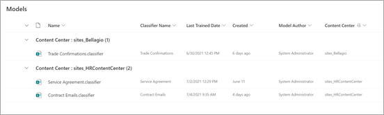

# Crear un centro de contenido en Microsoft SharePoint Syntex

 

> [!VIDEO https://www.microsoft.com/videoplayer/embed/RE4CPSF]

 

Para crear y administrar modelos de comprensión de documentos, primero necesita un centro de contenido. El centro de contenido es la interfaz de creación de modelos y también contiene información sobre los modelos publicados de bibliotecas de documentos que se han aplicado.

   

Puede crear un centro de contenido predeterminado durante la [configuración](set-up-content-understanding.md). Sin embargo, un administrador de SharePoint también puede optar por crear centros adicionales según sea necesario. Si bien un solo centro de contenido puede ser adecuado para entornos para los que desea un resumen de toda la actividad del modelo, es posible que desee tener centros adicionales para varios departamentos dentro de su organización, que pueden tener diferentes necesidades y requisitos de permisos para sus modelos.

Además, si desea probar SharePoint Syntex, puede crear un centro de contenido siguiendo las instrucciones de este artículo sin comprar licencias. Los usuarios sin licencia pueden crear modelos de comprensión de documentos, pero no pueden aplicarlos a una biblioteca de documentos.

> [!NOTE]
> En un [entorno de Microsoft 365 Multi-Geo](../enterprise/microsoft-365-multi-geo.md), si tiene un único centro de contenido predeterminado en su ubicación central, solo puede proporcionar una implementación de la actividad del modelo desde esa ubicación. Actualmente no puede obtener una implementación de la actividad del modelo fuera de los límites de la granja de servidores en entorno Multi-Geo. 

## Crear un centro de contenido

Un administrador de SharePoint puede crear un sitio del centro de contenido del mismo modo en que puede [crear cualquier otro sitio de SharePoint](/sharepoint/create-site-collection) a través del panel de aprovisionamiento del sitio del centro de administración.

Para crear un nuevo centro de contenido:

1. En el Centro de administración de Microsoft 365, vaya al <a href="https://go.microsoft.com/fwlink/?linkid=2185220" target="_blank">Centro de administración de SharePoint > **sitios activos**</a>.

2. En la página **Sitios activos**, haga clic en **Crear** y seleccione **Otras opciones**.

3. En el menú **Elegir una plantilla**, seleccione **Centro de contenido**.

4. Para el nuevo sitio, proporcione un **Nombre del sitio**, **Administrador principal** e **Idioma**. 

   > [!NOTE] 
   > Puede seleccionar un sitio de centro de contenido para que se procese en cualquiera de los idiomas disponibles, pero tenga en cuenta que actualmente los modelos solo se pueden crear para archivos en inglés. Además, tenga en cuenta que, al igual que otras plantillas de sitio, el idioma predeterminado del sitio no se puede modificar una vez creado el sitio.

5. Seleccione **Terminado**.
 
Después de crear un sitio del centro de contenido, verá que aparece en <a href="https://go.microsoft.com/fwlink/?linkid=2185220" target="_blank">**sitios activos**</a> en el Centro de administración de SharePoint. 

### Conceder acceso a otros usuarios
 
Después de crear el sitio, puede conceder acceso a usuarios adicionales al sitio a través del [modelo de permisos del sitio de SharePoint](/sharepoint/modern-experience-sharing-permissions) estándar.

### Acumulación de modelos en el centro de contenido predeterminado

En SharePoint Syntex, el primer centro de contenido creado durante la instalación es el *centro de contenido predeterminado*. Si se crean centros de contenido posteriores, sus modelos se muestran en la vista del centro de contenido predeterminada.

La biblioteca de **Models** en la vista del centro de contenido predeterminada agrupa los modelos creados por centro de contenido para obtener una vista resumida de todos los modelos de comprensión de documentos y modelos de procesamiento de formularios que se han creado.

> [!NOTE]
> No se puede cambiar el centro de contenido predeterminado designado. Siempre es el primer centro de contenido creado durante la instalación. 

## Vea también

[Crear un clasificador](create-a-classifier.md)

[Crear un extractor](create-an-extractor.md)

[Crear un centro de contenido](create-a-content-center.md)

[Información general sobre la comprensión de documentos](document-understanding-overview.md)

[Crear un modelo de procesamiento de formularios](create-a-form-processing-model.md)

[Aplicar un modelo](apply-a-model.md)