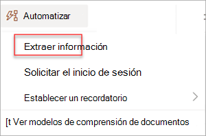
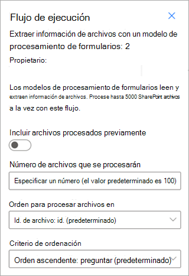

# Entrenamiento de un modelo de procesamiento estructurado de documentos en Microsoft Syntex

<!---
 

> [!VIDEO https://www.microsoft.com/videoplayer/embed/RE4GnhN]  

 

Using [AI Builder](/ai-builder/overview)—a feature in Microsoft Power Apps—Syntex users can create a [structured document processing](form-processing-overview.md) model directly from a SharePoint document library. 
--->

Siga las instrucciones de [Creación de un modelo en Syntex](create-syntex-model.md) para crear un modelo de procesamiento estructurado de documentos en un centro de contenido. O bien, siga las instrucciones de [Creación de un modelo en un sitio de SharePoint local](create-local-model.md) para crear el modelo en un sitio local. A continuación, use este artículo para entrenar el modelo.

Para entrenar un modelo de procesamiento estructurado de documentos, siga estos pasos:

 - [Paso 1: Agregar y analizar documentos](#step-1-add-and-analyze-documents)
 - [Paso 2: Etiquetar campos y tablas](#step-2-tag-fields-and-tables)
 - [Paso 3: Entrenamiento y publicación del modelo](#step-3-train-and-publish-your-model)
 - [Paso 4: Uso del modelo](#step-4-use-your-model)

## Paso 1: Agregar y analizar documentos

Después de crear el modelo de procesamiento estructurado de documentos, se abre la página **Elegir información para extraer** . Aquí se enumeran todos los fragmentos de información que desea que el modelo de inteligencia artificial extraiga de los documentos, como *nombre*, *dirección* o *cantidad*. 

> [!NOTE]
> Cuando busque archivos de ejemplo que usar, consulte los [requisitos de documento de entrada del modelo de procesamiento de documentos y sugerencias de optimización](/ai-builder/form-processing-model-requirements). 
 
1. En primer lugar, defina los campos y las tablas que quiere enseñar al modelo a extraer en la página **Elija la información para extraer**. Para ver los pasos detallados, vea [Definir campos y tablas para extraer](/ai-builder/create-form-processing-model#define-fields-and-tables-to-extract). 

2.  Puede crear tantas colecciones de diseños de documentos como quiera que procese el modelo. Para ver los pasos detallados, vea [Agrupar documentos por colecciones](/ai-builder/create-form-processing-model#group-documents-by-collections). 

3. Después de crear las colecciones y agregar al menos cinco archivos de ejemplo para cada una, AI Builder en Syntex examinará los documentos cargados para detectar los campos y las tablas. Este proceso suele tardar unos segundos. Una vez completado el análisis, puede continuar con el etiquetado de los documentos.

## Paso 2: Etiquetar campos y tablas

Debe etiquetar los documentos para enseñar al modelo a comprender los campos y los datos de tabla que quiere extraer. Para ver los pasos detallados, vea [Etiquetar documentos](/ai-builder/create-form-processing-model#tag-documents).

## Paso 3: Entrenamiento y publicación del modelo

1. Después de crear y entrenar el modelo, está listo para publicarlo y usarlo en SharePoint. Para publicar el modelo, seleccione **Publicar**. Para obtener pasos detallados, consulte [Entrenamiento y publicación del modelo de procesamiento de documentos](/ai-builder/form-processing-train). 

    

2. Una vez publicado el modelo, irá a la página principal del modelo. A continuación, tendrá la opción de aplicar el modelo a una biblioteca de documentos.

    

## Paso 4: Uso del modelo

1. En la vista de modelo de la biblioteca de documentos, tenga en cuenta que los campos que seleccionó se muestran como columnas.

    

2. Observe que el vínculo de información junto a **Documentos** indica que se aplica un modelo de procesamiento de formularios a esta biblioteca de documentos.
<!---
      
--->
3. Cargue los archivos a la biblioteca de documentos. Los archivos que el modelo identifica como su tipo de contenido muestran los archivos en la vista y muestra en las columnas los datos extraídos.

     

> [!NOTE]
> Si un modelo de procesamiento de documentos estructurado o de forma libre y un modelo de procesamiento de documentos no estructurados se aplican a la misma biblioteca, el archivo se clasifica mediante el modelo de procesamiento de documentos no estructurado y los extractores entrenados para ese modelo. Si hay columnas vacías que coincidan con el modelo de procesamiento de documentos, las columnas se rellenarán con esos valores extraídos.

### Campo Fecha de clasificación

Cuando se aplica cualquier modelo personalizado a una biblioteca de documentos, el campo **Fecha de clasificación** se incluye en el esquema de biblioteca. De forma predeterminada, este campo está vacío. Sin embargo, cuando un modelo procesa y clasifica documentos, este campo se actualiza con una marca de fecha y hora de finalización. 

Cuando un modelo se marca con la **fecha de clasificación**, puede usar **enviar un correo electrónico después de que Syntex procese un** flujo de archivos para notificar a los usuarios que un modelo ha procesado y clasificado un nuevo archivo en la biblioteca de documentos de SharePoint.

Para ejecutar el flujo:

1. Seleccione un archivo y, a continuación, seleccione **Integrar** > **Power Automate** > **Crear un flujo**.

2. En el panel **Crear un flujo** , seleccione **Enviar un correo electrónico después de que Syntex procese un archivo**.

     

### Uso de flujos para extraer información

> [!IMPORTANT]
> La información de esta sección no se aplica a la versión más reciente de Syntex. Solo se deja como referencia para los modelos de procesamiento de formularios creados en versiones anteriores. En la versión más reciente, ya no es necesario configurar los flujos para procesar los archivos existentes.

Hay dos flujos disponibles para procesar un archivo o lote de archivos seleccionados en una biblioteca donde se ha aplicado un modelo de procesamiento estructurado de documentos.

- **Extraer información de una imagen o un archivo PDF con un modelo de procesamiento de documentos** : se usa para extraer texto de una imagen o archivo PDF seleccionado mediante la ejecución de un modelo de procesamiento de documentos. Admite un único archivo seleccionado a la vez y solo admite archivos PDF y archivos de imagen (.png, .jpg y .jpeg). Para ejecutar el flujo, seleccione un archivo y, a continuación, seleccione **Automatizar** > **extracción de información**.

      

- **Extraer información de archivos con un modelo de procesamiento** de documentos: use con modelos de procesamiento de documentos para leer y extraer información de un lote de archivos. Procesa hasta 5000 archivos de SharePoint a la vez. Al ejecutar este flujo, se pueden establecer determinados parámetros. Puede:

    - Elija si desea incluir archivos procesados previamente (el valor predeterminado no es incluir los archivos procesados previamente).
    - Seleccione el número de archivos que se van a procesar (el valor predeterminado es 100 archivos).
    - Especifique el orden en el que se procesarán los archivos (las opciones son por identificador de archivo, nombre de archivo, hora de creación del archivo o hora de última modificación).
    - Especifique cómo desea ordenar el orden (orden ascendente o descendente).

      
    
> [!NOTE]
> La **opción Extraer información de una imagen o un archivo PDF con un** flujo de modelo de procesamiento de documentos está disponible automáticamente para una biblioteca con un modelo de procesamiento de documentos asociado. Extraer **información de archivos con un** flujo de modelo de procesamiento de documentos es una plantilla que se debe agregar a la biblioteca si es necesario.

## Vea también

[Creación de un modelo en Microsoft Syntex](create-syntex-model.md)

[Documentación de Power Automate](/power-automate/)

[Aprendizaje: mejorar el rendimiento empresarial con AI Builder](/training/paths/improve-business-performance-ai-builder/?source=learn)
