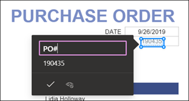

# Crear un modelo de procesamiento de formularios en Microsoft SharePoint SyntexCreate a form processing model in Microsoft SharePoint Syntex

El contenido de este artículo es para la versión preliminar privada de Project Cortex.The content in this article is for the Project Cortex Private Preview. [Obtenga más información sobre Project Cortex](https://aka.ms/projectcortex).[Find out more about Project Cortex](https://aka.ms/projectcortex).

Uso del [generador de AI](https://docs.microsoft.com/ai-builder/overview) : una característica de Microsoft PowerApps-Project Cortex los usuarios pueden crear un modelo de procesamiento de [formularios](form-processing-overview.md) directamente desde una biblioteca de documentos de SharePoint.Using [AI Builder](https://docs.microsoft.com/ai-builder/overview) - a feature in Microsoft PowerApps - Project Cortex users can create a [form processing model](form-processing-overview.md) directly from a SharePoint document library. 

La creación de un modelo de procesamiento de formularios implica lo siguiente:Creating a form processing model involves the following:
 - Paso 1: crear el modelo de procesamiento para crear el tipo de contenidoStep 1: Create the from processing model to create the content type
 - Paso 2: agregar y analizar archivos de ejemploStep 2: Add and analyze example files
 - Paso 3: seleccionar los campos de formularioStep 3: Select your form fields
 - Paso 4: entrenar y probar el modeloStep 4: Train and test your model
 - Paso 5: publicar el modeloStep 5: Publish your model
 - Paso 6: usar el modeloStep 6: Use your model

## RequisitosRequirements

Solo puede crear un modelo de procesamiento de formularios en las bibliotecas de documentos de SharePoint para las que está habilitado.You can only create a form processing model in SharePoint document libraries for which it is enabled. Si el procesamiento de formularios está habilitado, podrá ver el **generador de AI** **"crear un modelo de procesamiento de formularios"** en el menú **automatizar** de la biblioteca de documentos.If form processing is enabled, you are able to see the **AI Builder** **"Create a form processing model'** under the **Automate** menu in your document library.  Si necesita que el procesamiento esté habilitado en la biblioteca de documentos, debe ponerse en contacto con el administrador de SharePoint.If you need processing enabled on your document library, you must contact your SharePoint administrator.

  

## Paso 1: crear un modelo de procesamiento de formulariosStep 1: Create a form Processing model

El primer paso para crear un modelo de procesamiento de formularios es asignarle un nombre y crear la vista definir el nuevo tipo de contenido y crear una nueva biblioteca de documentos.The first step in creating a form processing model is to name it and create the define the new content type and create a new document library view for it.

1. En la biblioteca de documentos, seleccione el menú **automatizar** , seleccione **generador de AI**y, a continuación, seleccione **crear un modelo de procesamiento de formularios**.From the document library, select the **Automate** menu, select **AI Builder**, and then select **Create a Form Processing model**.

     

2. En el panel **nuevo modelo de procesamiento de formularios** , en el campo  **nombre** , escriba un nombre para el modelo (por ejemplo, *pedidos de compra*).In the **New form processing model** pane, in the  **Name** field, type a name for your model (for example, *Purchase Orders*).

      

3. Cuando se crea un modelo de procesamiento de formularios, se crea un nuevo tipo de contenido de SharePoint.When you create a form processing model, you create a new SharePoint content type. Un tipo de contenido de SharePoint representa una categoría de documentos que tienen características comunes y comparten una colección de columnas o propiedades de metadatos para ese contenido en particular.A SharePoint content type represents a category of documents that have common characteristics and share a collection of columns or metadata properties for that particular content. Los tipos de contenido de SharePoint se administran a través de la [Galería de tipos de contenido]().SharePoint Content Types are managed through the [Content types gallery]().

    Seleccione **Configuración avanzada** si desea asignar este modelo a un tipo de contenido existente en la galería de tipos de contenido de SharePoint para usar su esquema.Select **Advanced settings** if you want to map this model to an existing content type in the SharePoint Content types gallery to use its schema. 

4. El modelo crea una nueva vista en la biblioteca de documentos para los datos extraídos.Your model creates a new view in your document library for your extracted data. Si no desea que se ajuste a la vista predeterminada, anule **la selección de establecer la vista como predeterminada**.If you do not want it to the default view, deselect **Set the view as default**.

5. Seleccione **Crear**.Select **Create**.

## Paso 2: agregar y analizar documentosStep 2: Add and analyze documents

Después de crear el nuevo modelo de procesamiento de formularios, el explorador abre una nueva página del modelo de procesamiento de formularios de PowerApps AI Builder.After you create your new form processing model, your browser opens a new PowerApps AI Builder forms processing model page. En esta página, puede Agregar y analizar los documentos de ejemplo.On this page you can add and analyze your example documents.  

> [!NOTE]
> Al buscar archivos de ejemplo para usar, vea el [modelo de procesamiento de formularios requisitos de documentos de entrada y sugerencias de optimización](https://docs.microsoft.com/ai-builder/form-processing-model-requirements).When looking for example files to use, see the [form processing model input document requirements and optimization tips](https://docs.microsoft.com/ai-builder/form-processing-model-requirements). 

     
 
1. Seleccione **agregar documentos** para empezar a agregar documentos de ejemplo analizados para determinar los pares de valor con nombre que se pueden extraer.Select **Add documents** to begin adding example documents analyzed to determine the named value pairs that can be extracted. A continuación, puede elegir **cargar desde almacenamiento local**, **SharePoint**o **almacenamiento de blobs de Azure**.You can then choose either **Upload from local storage**, **SharePoint**, or **Azure Blob storage**. Debe usar al menos cinco archivos para el entrenamiento.You need to use at least five files for training.

2. Después de agregar archivos, seleccione **analizar** para comprobar si la información es común a todos los archivos.After adding files, select **Analyze** to check for any information common is all files. Esto puede tardar varios minutos en completarse.This may take several minutes to complete.  
 
      

3. Una vez analizados los archivos, en la página **Seleccione los campos de formulario que desea guardar** , seleccione el archivo para ver los campos detectados.After the files have been analyzed, in the **Select the form fields you want to save** page select the file to view the detected fields. 

      

## Paso 3: seleccionar los campos de formularioStep 3: Select your form fields

Después de analizar los documentos para los campos, ahora puede ver los campos encontrados e identificar los que desea guardar.After analyzing the documents for fields, you can now see the fields that were found, and identify the ones that you want to save. Los campos guardados se muestran como columnas en la vista de la biblioteca de documentos del modelo y muestran los valores extraídos de cada documento.Saved fields display as columns in your model's document library view and show the values extracted from each document.

1. En la página siguiente se muestra uno de los archivos de ejemplo y se resaltarán todos los campos comunes detectados automáticamente por el sistema.The next page displays one of your sample files and will highlight all common fields that were automatically detected by the system.  

      

2. Seleccione los campos que desea guardar y active la casilla de verificación para confirmar la selección.Select the fields that you want to save and select the checkbox to confirm your selection. Por ejemplo, en el modelo de pedido de compra, seleccione los campos *fecha*, *po*y *total* .For example, in the Purchase Order model, choose to select the *Date*, *PO*, and *Total* fields.  Tenga en cuenta que también puede cambiar el nombre de un campo si lo prefiere.Note that you can also choose to rename a field if you choose.  

      

3. Si el análisis no ha detectado un campo, puede optar por agregarlo.If a field was not detected by analysis, you can still choose to add it. Resalte la información que desea extraer y, en el cuadro Nombre, escriba el nombre que desee.Highlight the information you want to extract, and in the name box type in the name you want. A continuación, active la casilla.Then select the check box. Tenga en cuenta que debe confirmar los campos no detectados en los archivos de ejemplo restantes.Note that you need to confirm undetected fields in your remaining sample files.

4. Haga clic en **confirmar campos** después de haber seleccionado los campos que desea guardar.Click **Confirm fields** after you have selected the fields that you want to save.  
 
      
 
5. En la página **Seleccione los campos de formulario que desea guardar** , se muestra el número de campos que ha seleccionado.On the **Select the form fields you want to save** page, it shows the number of fields you have selected. Seleccione **Listo**.Select **Done**.

## Paso 4: entrenar y probar el modeloStep 4: Train and test your model

Después de seleccionar los campos que desea guardar, la página de **Resumen del modelo** le permite entrenar y probar el modelo.After selecting the fields you want to save, the **Model Summary** page lets you train and test your model.

1. En la página de **Resumen del modelo** , los campos guardados se mostrarán en la sección **campos seleccionados** .On the **Model Summary** page, the saved fields will show in the **Selected fields** section. Seleccione **entrenar** para empezar a entrenar en los archivos de ejemplo.Select **Train** to begin training on your example files. Tenga en cuenta que esta operación puede tardar unos minutos en completarse.Note that this may take a few minutes to complete. 

       

2. Cuando vea la notificación de que se ha completado el entrenamiento, seleccione **ir a la página de detalles**.When you see the notification that training has completed, select **Go to details page**. 

3. En la página **detalles del modelo** , puede elegir probar el funcionamiento del modelo seleccionando **prueba rápida**.On the **Model details** page, you can choose to test how your model works by selecting **Quick test**. Esto le permite arrastrar y soltar archivos a la página y ver si se detectan los campos.This lets you drag and drop files to the page and see if the fields are detected.

      

2. Cuando vea la notificación de que se ha completado el entrenamiento, seleccione **ir a la página de detalles**.When you see the notification that training has completed, select **Go to details page**. 

3. En la página **detalles del modelo** , elija **prueba rápida**para probar el funcionamiento del modelo.On the **Model details** page, choose to test how your model works by selecting **Quick test**. Esto le permite arrastrar y soltar archivos a la página y ver si se detectan los campos.This lets you drag and drop files to the page and see if the fields are detected.

## Paso 5: publicar el modeloStep 5: Publish your model

1. Si está satisfecho con los resultados del modelo, seleccione **publicar** para que esté disponible para su uso.If you are satisfied with the results of your model, select **Publish** to make it available for use.

2. Una vez publicado el modelo, seleccione **usar modelo**.After the model is published, select **Use model**. Esto crea un flujo de PowerAutomate que puede ejecutarse en la biblioteca de documentos de SharePoint y extrae los campos identificados en el modelo y, a continuación, seleccione **Crear flujo**.This creates a PowerAutomate flow that can run in your SharePoint document library and extracts the fields that have been identified in the model, then select **Create Flow**.
  
3. Una vez completado, verá el mensaje el **flujo se ha creado correctamente**.When completed, you will see the message **Your flow has been successfully created**.
 
## Paso 6: usar el modeloStep 6: Use your model

Después de publicar el modelo y crear su flujo de PowerAutomate, puede usar el modelo en la biblioteca de documentos de SharePoint.After publishing your model and creating it's PowerAutomate flow, you can use your model in your SharePoint document library.

1. Después de publicar el modelo, seleccione **ir a SharePoint** para ir a la biblioteca de documentos.After publishing your model, select **Go to SharePoint** to go to your document library.

2. En la vista modelo de la biblioteca de documentos, observe que los campos que seleccionó se muestran como columnas.In the document library model view, notice that the fields you selected now display as columns. 

      

3. Observe que el vínculo de información que hay junto a **documentos** notas que se aplica un modelo de procesamiento de formularios a esta biblioteca de documentos.Notice that the information link next to **Documents** notes that a forms processing model is applied to this document library.

       

4. Cargar archivos en la biblioteca de documentos.Upload files to your document library. Los archivos que el modelo identifica como tipo de contenido, enumeran los archivos en la vista y muestran los datos extraídos en las columnas.Any files that the model identifies as it's content type lists the files in your view and displays the extracted data in the columns. 

       

## Consulte tambiénSee Also
  
[Documentación automatizada de la energíaPower Automate documentation](https://docs.microsoft.com/power-automate/) 
[Aprendizaje: mejorar el rendimiento empresarial con el generador de AITraining: Improve business performance with AI Builder](https://docs.microsoft.com/learn/paths/improve-business-performance-ai-builder/?source=learn) 
