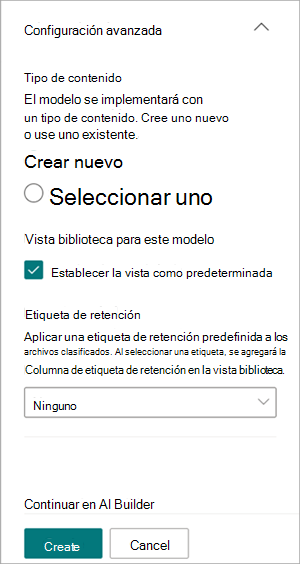

# Crear un modelo de procesamiento de formularios en Microsoft SharePoint Syntex

 

> [!VIDEO https://www.microsoft.com/videoplayer/embed/RE4GnhN]  

 

Con [AI Builder](/ai-builder/overview) (una característica de Microsoft Power Apps), los usuarios de SharePoint Syntex pueden crear un [modelo de procesamiento de formularios](form-processing-overview.md) directamente desde una biblioteca de documentos de SharePoint. 

La creación de un modelo de procesamiento de formularios implica los pasos siguientes:

 - [Paso 1: crear un modelo de procesamiento de formularios](create-a-form-processing-model.md#step-1-create-a-form-processing-model)
 - [Paso 2: agregar y analizar documentos](create-a-form-processing-model.md#step-2-add-and-analyze-documents)
 - [Paso 3: etiquetar campos y tablas](create-a-form-processing-model.md#step-3-tag-fields-and-tables)
 - [Paso 4: entrenar y publicar el modelo](create-a-form-processing-model.md#step-4-train-and-publish-your-model)
 - [Paso 5: usar el modelo](create-a-form-processing-model.md#step-5-use-your-model)

## Requisitos

Solo puede crear un modelo de procesamiento de formularios en las bibliotecas de documentos de SharePoint para las que está habilitado. Si el procesamiento de formularios está habilitado, puede ver el menú **Automatizar** > **AI Builder** > **Crear un modelo para procesar formularios** en la biblioteca de documentos. Si necesita el procesamiento habilitado en la biblioteca de documentos, póngase en contacto con el Administrador de SharePoint.

## Paso 1: crear un modelo de procesamiento de formularios

El primer paso para crear un modelo de procesamiento de formularios es asignar un nombre al modelo, definir el nuevo tipo de contenido y crear una nueva vista de biblioteca de documentos para él.

1. En la biblioteca de documentos, seleccione el menú **Automatizar**, seleccione **AI Builder** y seleccione **Crear un modelo para procesar formularios**.

    

2. En el panel **Crear un modelo para procesar formularios**, en el campo **Nombre**, escriba el nombre del modelo (por ejemplo, *Pedidos de compra*).

     

3. Ahora puede extraer y guardar automáticamente información de una *colección* de archivos estructurados que comparten un diseño similar, como facturas o documentos fiscales, que se encuentran en una biblioteca de documentos de SharePoint. Esto le permite componer varios modelos en un único modelo y extraer información específica de elementos de tabla.

   El nombre de la colección se guarda en una columna dedicada de la biblioteca de documentos donde se aplica el modelo, lo que permite distinguir diferentes diseños de archivo procesados por el mismo modelo.

   Además, la información de tabla extraída se guarda en una lista especificada y se asocia con el archivo cargado para facilitar la visualización o para la automatización adicional de procesos empresariales.

   Para extraer información de tabla en una lista asociada:  

     1. En la sección **¿Extraer información de tablas?**, seleccione **Sí**.

       

     2. En la sección **¿Dónde se debe guardar la información de la tabla?**:
 
        - Si selecciona **Una nueva lista** (la configuración predeterminada), se proporciona automáticamente un nombre sugerido en el cuadro **Nuevo nombre de lista**. Puede modificar el nombre si quiere. Si quiere mostrar la lista en la navegación del sitio, active la casilla **Mostrar en la navegación del sitio**.

        - Si selecciona **Una lista existente**, en el cuadro **Lista seleccionada**, elija la lista que quiere usar.

4. Al crear un modelo de procesamiento de formularios, también crea un nuevo tipo de contenido de SharePoint. Un tipo de contenido de SharePoint representa una categoría de documentos que tienen características comunes y comparten una colección de columnas o propiedades de metadatos para ese contenido en particular. Los tipos de contenido de SharePoint se administran a través del <a href="https://go.microsoft.com/fwlink/?linkid=2185219" target="_blank">Centro de administración de SharePoint</a>.

   Para asignar este modelo a un tipo de contenido existente en la galería de tipos de contenido de SharePoint, seleccione **Configuración avanzada**.

     

   1. En la <a href="https://go.microsoft.com/fwlink/?linkid=2185074" target="_blank">galería Tipo</a> de contenido, elija si desea crear un nuevo tipo de contenido o usar uno existente. 

   2. Para usar un tipo de contenido existente, seleccione **Seleccionar uno** y elija un tipo de contenido de la lista.

   3. El modelo crea una nueva vista en la biblioteca de documentos para los datos obtenidos. Si no quiere que sea la vista predeterminada, en la sección **Vista de biblioteca de este modelo**, desactive la casilla **Establecer la vista como predeterminada**.

   4. Para aplicar una etiqueta de retención a los archivos, en la sección **Etiqueta de retención**, seleccione la etiqueta de retención que quiera usar.

5. Seleccione **Crear**.

## Paso 2: agregar y analizar documentos

Después de crear el nuevo modelo de procesamiento de formularios, el explorador abrirá una nueva página de modelo de procesamiento de formularios de Power Apps AI Builder. En esta página, puede agregar y analizar sus documentos de ejemplo. 

> [!NOTE]
> Al buscar archivos de ejemplo para usar, vea los [requisitos del documento de entrada del modelo de procesamiento de formularios y los consejos de optimización](/ai-builder/form-processing-model-requirements). 
 
1. En primer lugar, defina los campos y las tablas que quiere enseñar al modelo a extraer en la página **Elija la información para extraer**. Para ver los pasos detallados, vea [Definir campos y tablas para extraer](/ai-builder/create-form-processing-model#define-fields-and-tables-to-extract). 

2.  Puede crear tantas colecciones de diseños de documentos como quiera que procese el modelo. Para ver los pasos detallados, vea [Agrupar documentos por colecciones](/ai-builder/create-form-processing-model#group-documents-by-collections). 

3. Después de crear las colecciones y agregar los archivos de ejemplo para cada una, AI Builder examinará los documentos cargados para detectar los campos y las tablas. Esto suele tardar unos minutos. Una vez completado el análisis, puede continuar con el etiquetado de los documentos.

## Paso 3: etiquetar campos y tablas

Debe etiquetar los documentos para enseñar al modelo a comprender los campos y los datos de tabla que quiere extraer. Para ver los pasos detallados, vea [Etiquetar documentos](/ai-builder/create-form-processing-model#tag-documents).

## Paso 4: entrenar y publicar el modelo

1. Después de crear y entrenar el modelo, está listo para publicarlo y usarlo en SharePoint. Para ver los pasos detallados, vea [Entrenar y publicar el modelo de procesamiento de formularios](/ai-builder/form-processing-train). 

2. Una vez publicado el modelo, seleccione **Usar modelo** y seleccione **Crear flujo**. Esto crea un flujo de Power Automate que puede ejecutarse en la biblioteca de documentos de SharePoint y extrae los campos que se han identificado en el modelo.

    
 
3. Cuando finalice, verá el mensaje: *Su flujo se ha creado correctamente*.

4. Seleccione el botón **Ir a SharePoint** para ver la biblioteca de documentos actualizada con el modelo.

## Paso 5: usar el modelo

1. En la vista de modelo de la biblioteca de documentos, tenga en cuenta que los campos que seleccionó se muestran como columnas.

    

2. Observe que el vínculo de información junto a **Documentos** indica que se aplica un modelo de procesamiento de formularios a esta biblioteca de documentos.

      

3. Cargue los archivos a la biblioteca de documentos. Los archivos que el modelo identifica como su tipo de contenido muestran los archivos en la vista y muestra en las columnas los datos extraídos.

     

> [!NOTE]
> Si un modelo de procesamiento de formularios personalizado y un modelo de comprensión de documentos se aplican a la misma biblioteca, el archivo se clasifica mediante el modelo de comprensión de documentos y los extractores entrenados para ese modelo. Si hay columnas vacías que coincidan con el modelo de procesamiento de formularios, las columnas se rellenarán con esos valores extraídos.

### Uso de flujos para extraer información

Hay dos flujos disponibles para procesar un archivo o lote de archivos seleccionados en una biblioteca donde se ha aplicado un modelo de procesamiento de formularios.

- **Extraer información de una imagen o un archivo PDF con un modelo de procesamiento de formularios** : se usa para extraer texto de una imagen o archivo PDF seleccionado mediante la ejecución de un modelo de procesamiento de formularios. Admite un único archivo seleccionado a la vez y solo admite archivos PDF y archivos de imagen (PNG, JPG y JPEG). Para ejecutar el flujo, seleccione un archivo y, a continuación, seleccione **Automatizar** > **extracción de información**.

      

- **Extraer información de archivos con un modelo de procesamiento de formularios** : use con modelos de procesamiento de formularios para leer y extraer información de un lote de archivos. Procesa hasta 5000 archivos de SharePoint a la vez. Al ejecutar este flujo, se pueden establecer determinados parámetros. Puede:

    - Elija si desea incluir archivos procesados previamente (el valor predeterminado es no incluir los archivos procesados previamente).
    - Seleccione el número de archivos que se van a procesar (el valor predeterminado es 100 archivos).
    - Especifique el orden en el que se procesarán los archivos (las opciones son por identificador de archivo, nombre de archivo, hora de creación del archivo o hora de última modificación).
    - Especifique cómo desea ordenar el orden (orden ascendente o descendente).

      
    
> [!NOTE]
> La **opción Extraer información de una imagen o archivo PDF con un flujo de modelo de procesamiento de formularios** está disponible automáticamente para una biblioteca con un modelo de procesamiento de formularios asociado. **Extract info from files with a form processing model flow (Extraer información de archivos con un flujo de modelo de procesamiento de formularios**) es una plantilla que se debe agregar a la biblioteca si es necesario.

### Campo Fecha de clasificación

Cuando se aplica un modelo de procesamiento de formularios de SharePoint Syntex (o un modelo de comprensión de documentos) a una biblioteca de documentos, el campo **Fecha de clasificación** se incluye en el esquema de la biblioteca. De forma predeterminada, este campo está vacío. Sin embargo, cuando un modelo procesa y clasifica documentos, este campo se actualiza con una marca de fecha y hora de finalización. 

Cuando un modelo se marca con la **fecha de clasificación**, puede usar enviar **un correo electrónico después de SharePoint Syntex procesa un** flujo de archivo para notificar a los usuarios que un modelo ha procesado y clasificado un nuevo archivo en la biblioteca de documentos de SharePoint.

Para ejecutar el flujo:

1. Seleccione un archivo y, a continuación, seleccione **Integrar** > **Power Automate** > **Crear un flujo**.

2. En el panel **Crear un flujo**, seleccione **Enviar un correo electrónico después de SharePoint Syntex procese un archivo**.

     

## Vea también
  
[Documentación de Power Automate](/power-automate/)

[Aprendizaje: mejorar el rendimiento empresarial con AI Builder](/learn/paths/improve-business-performance-ai-builder/?source=learn)
