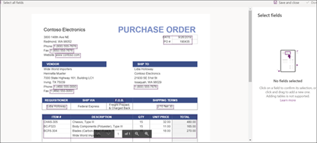

# Crear un modelo de procesamiento de formularios en Microsoft SharePoint SyntexCreate a form processing model in Microsoft SharePoint Syntex

 

> [!VIDEO https://www.microsoft.com/videoplayer/embed/RE4GnhN]  

 

Usar [AI Builder](https://docs.microsoft.com/ai-builder/overview): característica en Microsoft PowerApps - SharePoint Syntex los usuarios pueden crear un [modelo de procesamiento de formularios](form-processing-overview.md) directamente desde una biblioteca de documentos de SharePoint.Using [AI Builder](https://docs.microsoft.com/ai-builder/overview) - a feature in Microsoft PowerApps - SharePoint Syntex users can create a [form processing model](form-processing-overview.md) directly from a SharePoint document library. 

Crear un modelo de procesamiento de formularios implica lo siguiente:Creating a form processing model involves the following:
 - Paso 1: crear el modelo de procesamiento de formularios para crear el tipo de contenidoStep 1: Create the from processing model to create the content type
 - Paso 2: agregar y analizar archivos de ejemploStep 2: Add and analyze example files
 - Paso 3: seleccionar los campos de formularioStep 3: Select your form fields
 - Paso 4: entrenar y probar el modeloStep 4: Train and test your model
 - Paso 5: publicar el modeloStep 5: Publish your model
 - Paso 6: usar el modeloStep 6: Use your model

## RequisitosRequirements

Solo puede crear un modelo de procesamiento de formularios en las bibliotecas de documentos de SharePoint para las que está habilitado. Si el procesamiento de formularios está habilitado, podrá ver el **AI Builder** **"Crear un modelo de procesamiento de formularios"** en el menú **Automatizar** de la biblioteca de documentos.  Si necesita el procesamiento habilitado en la biblioteca de documentos, debe ponerse en contacto con el Administrador de SharePoint.You can only create a form processing model in SharePoint document libraries for which it is enabled. If form processing is enabled, you are able to see the **AI Builder** **"Create a form processing model'** under the **Automate** menu in your document library.  If you need processing enabled on your document library, you must contact your SharePoint administrator.

  

## Paso 1: crear un modelo de procesamiento de formulariosStep 1: Create a form processing model

El primer paso para crear un modelo de procesamiento de formularios es asignarle un nombre, crear la definición, crear el nuevo tipo de contenido y crear una nueva vista de la biblioteca de documentos para este.The first step in creating a form processing model is to name it and create the define the new content type and create a new document library view for it.

1. En la biblioteca de documentos, seleccione el menú **Automatizar**, seleccione **AI Builder** y, después elija **Crear un modelo de procesamiento de formularios**.From the document library, select the **Automate** menu, select **AI Builder**, and then select **Create a Form Processing model**.

     

2. En el panel **Nuevo modelo de procesamiento de formularios**, en el campo **Nombre**, escriba el nombre del modelo (por ejemplo, *Pedidos de compra*).In the **New form processing model** pane, in the  **Name** field, type a name for your model (for example, *Purchase Orders*).

      

3. Cuando se crea un modelo de procesamiento de formularios, se crea un nuevo tipo de contenido de SharePoint. Un tipo de contenido de SharePoint representa una categoría de documentos con características comunes y comparte una colección de columnas o de propiedades de metadatos para ese contenido concreto. Los tipos de contenido de SharePoint se administran en la [Galería tipos de contenido]().When you create a form processing model, you create a new SharePoint content type. A SharePoint content type represents a category of documents that have common characteristics and share a collection of columns or metadata properties for that particular content. SharePoint Content Types are managed through the [Content types gallery]().

    Seleccione **Configuración avanzada** si quiere asignar este modelo a un tipo de contenido existente en la galería de tipos de contenido de SharePoint para usar su esquema.Select **Advanced settings** if you want to map this model to an existing content type in the SharePoint Content types gallery to use its schema. 

4. El modelo crea una nueva vista de la biblioteca de documentos para los datos extraídos. Si no quiere que aparezca en la vista predeterminada, anule la selección de **Establecer la vista como** predeterminada.Your model creates a new view in your document library for your extracted data. If you do not want it to the default view, deselect **Set the view as default**.

5. Seleccione **Crear**.Select **Create**.

## Paso 2: agregar y analizar documentosStep 2: Add and analyze documents

Después de crear el nuevo modelo de procesamiento de formularios, el explorador abrirá una nueva página de modelo de procesamiento de formularios de PowerApps AI Builder. En esta página puede agregar y analizar sus documentos de ejemplo.After you create your new form processing model, your browser opens a new PowerApps AI Builder forms processing model page. On this page you can add and analyze your example documents.  

> [!NOTE]
> Al buscar archivos de ejemplo para usar, vea los [requisitos del documento de entrada del modelo de procesamiento de formularios y los consejos de optimización](https://docs.microsoft.com/ai-builder/form-processing-model-requirements).When looking for example files to use, see the [form processing model input document requirements and optimization tips](https://docs.microsoft.com/ai-builder/form-processing-model-requirements). 

     
 
1. Seleccione **Agregar documentos** para empezar a agregar documentos de ejemplo analizados para determinar los pares de valores con nombre que se pueden extraer. A continuación, puede elegir **Carga desde almacenamiento local**, **SharePoint** o **Azure Blob Storage**. Debe usar al menos cinco archivos para el entrenamiento.Select **Add documents** to begin adding example documents analyzed to determine the named value pairs that can be extracted. You can then choose either **Upload from local storage**, **SharePoint**, or **Azure Blob storage**. You need to use at least five files for training.

2. Después de agregar archivos, seleccione **Analizar** para comprobar si hay información común en todos los archivos. Esto debería llevar varios minutos.After adding files, select **Analyze** to check for any information common is all files. This may take several minutes to complete.  
 
      

3. Después de que se hayan analizados los archivos, en la página **Seleccionar los campos de formulario que quiere guardar** seleccione el archivo para ver los campos detectados.After the files have been analyzed, in the **Select the form fields you want to save** page select the file to view the detected fields. 

      

## Paso 3: seleccionar los campos de formularioStep 3: Select your form fields

Después de analizar los documentos para los campos, puede ver los campos que encontró e identificar los que quiere guardar. Los campos guardados se muestran como columnas en la vista de la biblioteca de documentos del modelo y muestran los valores obtenidos de cada documento.After analyzing the documents for fields, you can now see the fields that were found, and identify the ones that you want to save. Saved fields display as columns in your model's document library view and show the values extracted from each document.

1. En la página siguiente se mostrará uno de los archivos de ejemplo y se resaltarán todos los campos comunes que el sistema detectó automáticamente.The next page displays one of your sample files and will highlight all common fields that were automatically detected by the system.  

      

2. Seleccione los campos que desee guardar y marque la casilla para confirmar la selección. Por ejemplo, en el modelo Orden de compra, elija para seleccionar los campos *Fecha*, *OC* y *Total*. Tenga en cuenta que también puede elegir cambiar el nombre de un campo. Select the fields that you want to save and select the checkbox to confirm your selection. For example, in the Purchase Order model, choose to select the *Date*, *PO*, and *Total* fields.  Note that you can also choose to rename a field if you choose.  

      

3. Si un análisis no ha detectado un campo, aún puede agregarlo. Resalte la información que desea extraer y, en el cuadro Nombre, escriba el nombre que desee. Después, seleccione la casilla. Tenga en cuenta que necesita confirmar campos no detectados en los archivos de ejemplo restantes.If a field was not detected by analysis, you can still choose to add it. Highlight the information you want to extract, and in the name box type in the name you want. Then select the check box. Note that you need to confirm undetected fields in your remaining sample files.

4. Haga clic en **Confirmar campos** después de seleccionar los campos que quiere guardar.Click **Confirm fields** after you have selected the fields that you want to save.  
 
      
 
5. La página **Seleccionar los campos de formulario que quiere guardar**, muestra el número de campos que ha seleccionado. Seleccione **Listo**.On the **Select the form fields you want to save** page, it shows the number of fields you have selected. Select **Done**.

## Paso 4: entrenar y probar el modeloStep 4: Train and test your model

Después de seleccionar los campos que quiere guardar, la página **Resumen del modelo** le permite entrenar y probar el modelo.After selecting the fields you want to save, the **Model Summary** page lets you train and test your model.

1. En la página **Resumen del modelo**, los campos guardados se mostrarán en la sección **Campos seleccionados**. Seleccione **Entrenar** para comenzar el entrenamiento en sus archivos de ejemplo. Tenga en cuenta que esto puede tardar unos minutos en completarse.On the **Model Summary** page, the saved fields will show in the **Selected fields** section. Select **Train** to begin training on your example files. Note that this may take a few minutes to complete. 

       

2. Cuando vea la notificación de que el entrenamiento ha finalizado, seleccione **Ir a la página de detalles**.When you see the notification that training has completed, select **Go to details page**. 

3. En la página **Detalles del modelo**, puede elegir probar el funcionamiento del modelo seleccionando **Prueba rápida**. Esto le permite arrastrar y soltar archivos a la página y ver si los campos se detectan.On the **Model details** page, you can choose to test how your model works by selecting **Quick test**. This lets you drag and drop files to the page and see if the fields are detected.

      

2. Cuando vea la notificación de que el entrenamiento ha finalizado, seleccione **Ir a la página de detalles**.When you see the notification that training has completed, select **Go to details page**. 

3. En la página **Detalles del modelo**, puede elegir probar el funcionamiento del modelo seleccionando **Prueba rápida**. Esto le permite arrastrar y soltar archivos a la página y ver si los campos se detectan.On the **Model details** page, choose to test how your model works by selecting **Quick test**. This lets you drag and drop files to the page and see if the fields are detected.

## Paso 5: publicar el modeloStep 5: Publish your model

1. Si está de acuerdo con los resultados de su modelo, seleccione **Publicar** para que esté disponible para su uso.If you are satisfied with the results of your model, select **Publish** to make it available for use.

2. Después de publicar el modelo, seleccione **Usar modelo**. Esto crea un flujo de PowerAutomate que puede ejecutarse en la biblioteca de documentos de SharePoint y extrae los campos que se han identificado en el modelo, luego seleccione **Crear flujo**.After the model is published, select **Use model**. This creates a PowerAutomate flow that can run in your SharePoint document library and extracts the fields that have been identified in the model, then select **Create Flow**.
  
3. Cuando finalice, verá el mensaje **Su flujo se ha creado correctamente**.When completed, you will see the message **Your flow has been successfully created**.
 
## Paso 6: usar el modeloStep 6: Use your model

Después de publicar el modelo y crear el flujo de PowerAutomate, puede usar el modelo en la biblioteca de documentos de SharePoint.After publishing your model and creating it's PowerAutomate flow, you can use your model in your SharePoint document library.

1. Después de publicar el modelo, seleccione **Ir a SharePoint** para ir a la biblioteca de documentos.After publishing your model, select **Go to SharePoint** to go to your document library.

2. En la vista modelo de la biblioteca de documentos, tenga en cuenta que los campos que seleccionó se muestran como columnas.In the document library model view, notice that the fields you selected now display as columns. 

      

3. Observe que el vínculo de información junto a **Documentos** indica que se aplica un modelo de procesamiento de formularios a esta biblioteca de documentos.Notice that the information link next to **Documents** notes that a forms processing model is applied to this document library.

       

4. Cargar archivos a su biblioteca de documentos. Los archivos que el modelo identifica como su tipo de contenido muestran los archivos en la vista y muestra en las columnas los datos extraídos.Upload files to your document library. Any files that the model identifies as it's content type lists the files in your view and displays the extracted data in the columns. 

       

## Vea tambiénSee Also
  
[Documentación de Power AutomatePower Automate documentation](https://docs.microsoft.com/power-automate/)

[Aprendizaje: mejorar el rendimiento empresarial con AI BuilderTraining: Improve business performance with AI Builder](https://docs.microsoft.com/learn/paths/improve-business-performance-ai-builder/?source=learn)
