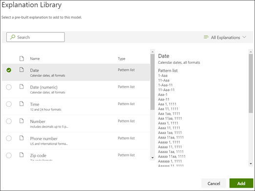

# Crear un extractor en Microsoft SharePoint Syntex

 

> [!VIDEO https://www.microsoft.com/videoplayer/embed/RE4CL2G]

  

Antes o después de crear un modelo de clasificación para automatizar la identificación y la clasificación de tipos de documentos específicos, puede optar por agregar extractores a su modelo para extraer información específica de estos documentos. Por ejemplo, es posible que desee que su modelo no sólo identifique todos los documentos de *Renovación de contrato* agregados a su biblioteca de documentos, sino que también muestre la *Fecha inicial del servicio* de cada documento como un valor de columna en la biblioteca de documentos.

Es necesario crear un extractor para cada entidad del documento que se desea extraer. En nuestro ejemplo, queremos extraer la  **Fecha inicial del servicio**  para cada  **Renovación de contrato**  de contrato identificado por el modelo. Queremos tener la posibilidad de tener una visión en la biblioteca de documentos de todos los documentos de  **Renovación de contratos** , con una columna que muestre el valor de la fecha de **Inicio del servicio** de cada documento. 

> [!NOTE]
> Para crear un extractor, utilice los mismos archivos que ha subido previamente para entrenar al clasificador. 

## Asigne un nombre a su extractor

1. En la página de inicio del modelo, en el ícono **Crear y entrenar extractores**, haga clic en **Entrenar extractor**.
2. En la pantalla del extractor de **Nueva entidad**, escriba el nombre de su extractor en el campo **Nombre del nuevo extractor**. Por ejemplo, llámelo **Fecha de inicio del servicio** si desea extraer la fecha de inicio del servicio de cada documento de renovación de contrato. También puede optar por reutilizar una columna creada previamente (por ejemplo, una columna de metadatos administrados).
> [!NOTE]
> Si crea un nuevo extractor, seleccione **Nuevo tipo de columna** y elija **Una línea de texto**, el límite máximo de caracteres es 255. Cualquier carácter que escriba que exceda el límite se trunca. 
3. Cuando termine, haga clic en **Crear**.

## Agregar una etiqueta

El siguiente paso es etiquetar la entidad que desea extraer en sus archivos de entrenamiento de ejemplo.

Al crear el extractor se abre la página del extractor. Aquí puede ver una lista de sus archivos de muestra, con el primer archivo de la lista mostrado en el visor.

1. En el visor, seleccione los datos que desea extraer de los archivos. Por ejemplo, si se quiere extraer la *Fecha de inicio del servicio*, se resalta el valor de la fecha en el primer archivo (*lunes 14 de octubre de 2019*). luego haga clic en **Guardar**.  Debería ver la visualización del valor del archivo en la lista de ejemplos etiquetados, bajo la columna **Etiqueta**.
2. Seleccione **Siguiente archivo** para guardarlo automáticamente y abra el siguiente archivo de la lista en el visor. O seleccione **Guardar** y luego seleccione otro archivo de la lista de **Ejemplos etiquetados**.
3. En el visor, repita los pasos 1 y 2, y luego repita hasta que haya guardado la etiqueta en los cinco archivos.

     

 
Una vez que etiquetó cinco archivos, se muestra un banner de notificación que le informa de pasar al entrenamiento. Puedes elegir entre etiquetar más documentos o avanzar a la formación. 

### Usar Buscar para buscar en el archivo
Puede usar la característica <b>Buscar</b> para buscar una entidad que quiera etiquetar en el documento.

    

La característica Buscar es útil si está buscando en un documento grande o si hay varias instancias de la entidad en el documento. Si encuentra varias instancias, puede seleccionar la que necesite en los resultados de búsqueda para ir a esa ubicación en el visor y etiquetarla.

## Agregue una explicación

Para nuestro ejemplo, vamos a crear una explicación que proporciona una pista sobre el formato de la entidad en sí y las variaciones que puede tener en los documentos de muestra. Por ejemplo, el valor de una fecha puede estar en varios formatos diferentes, como:
- 14/10/2019
- 14 de octubre de 2019
- Lunes 14 de octubre de 2019
 

Para ayudar a identificar la *Fecha de inicio del servicio*, puede crear una explicación del patrón.

1. En la sección de Explicación, seleccione **Nuevo** y escriba un nombre (por ejemplo, *Fecha*).
2. Para Tipo, seleccione **Lista de patrones**.
3. Para el Valor, proporcione la variación de la fecha tal como aparece en los archivos de muestra. Por ejemplo, si tiene formatos de fecha que aparecen como 0/00/0000, introduzca cualquier variación que aparezca en sus documentos, como por ejemplo:
    - 0/0/0000
    - 0/00/0000
    - 00/0/0000
    - 00/00/0000
4. Seleccione **Guardar**.

> [!NOTE]
> Para obtener más información sobre los tipos de explicación, consulte [Tipos de explicación](./explanation-types-overview.md)..  

### Usar la biblioteca de explicación

Para crear explicaciones para elementos como las fechas, es más fácil [utilizar la biblioteca de explicaciones ](./explanation-types-overview.md)que introducir manualmente todas las variaciones. La biblioteca de explicaciones es un conjunto de explicaciones de frases y patrones pre generados. La biblioteca trata de proporcionar todos los formatos de listas, frases o patrones comunes, como fechas, números de teléfono, códigos postales y muchos otros. 

Para la muestra de la *Fecha de inicio del servicio*, es más eficiente usar la explicación pre generada para *Fecha* en la biblioteca de explicaciones:

1. En la sección de **Explicación**, seleccione **Nuevo**, y luego seleccione **Desde la biblioteca de explicaciones**.
2. En la biblioteca de explicación, seleccione **Fecha**. Puede ver todas las variaciones de fecha que son reconocidas
3. Seleccione **Agregar**. 

     

4. En la página **Crear una explicación**, la información de la *Fecha* de la biblioteca de explicaciones rellena automáticamente los campos. Seleccione **Guardar**. 

     

## Entrenar el modelo 

Guardando su explicación inicio del entrenamiento. Si su modelo tiene suficiente información para extraer los datos de los archivos de ejemplo etiquetados, verá cada archivo etiquetado con **Coincidencia**.  

 

Si la explicación no tiene suficiente información para encontrar los datos que quiere extraer, cada archivo será etiquetado con **No coincide**. Puede hacer clic en los archivos de **No coincide** para ver más información sobre por qué no coincide.

## Agregar otra explicación

A menudo la no coincidencia es una indicación de que la explicación que dimos no proporcionó suficiente información para extraer el valor de la fecha de inicio del servicio para que coincida con nuestros archivos etiquetados. Puede que necesite editarlo, o agregar otra explicación.

Para nuestro ejemplo, note que la cadena de texto *Fecha de Inicio del servicio de* siempre precede al valor real. Para ayudar a identificar la fecha de Inicio del servicio, necesita crear una frase de explicación.

1. En la sección de Explicación, seleccione **Nuevo**, y luego escriba un nombre (por ejemplo, *Cadena de prefijos*).
2. Para el Tipo, seleccione **Lista de frases**.
3. Utilice la *Fecha de inicio del servicio de* como valor.
4. Seleccione **Guardar**.

     

## Entrenar el modelo de nuevo

Guardando la explicación inicie el entrenamiento de nuevo, esta vez usando ambas explicaciones en el ejemplo. Si su modelo tiene suficiente información para extraer los datos de los archivos de ejemplo etiquetados, verá cada archivo etiquetado con **Coincidencia**. 

Si vuelve a recibir un **No coincidencia** en sus archivos etiquetados, es probable que necesite crear otra explicación para proporcionar al modelo más información para identificar el tipo de documento, o considerar la posibilidad de hacer cambios en los ya existentes.

## Pruebe el modelo

Si recibe una coincidencia en sus archivos de muestra etiquetados, ahora puede probar su modelo en los archivos de muestra no etiquetados restantes. Se trata de un paso opcional, pero resulta útil para evaluar la idoneidad del modelo o determinar si está preparado antes de usarlo, y para ello se prueba en archivos que el modelo no ha visto antes.

1. En la página principal del modelo, haga clic en la pestaña **Prueba**. Se ejecutará el modelo en sus archivos de muestra sin etiquetar.
2. En la lista de **Archivos de prueba**, sus archivos de ejemplo son presentados para mostrar si el modelo es capaz de extraer la información que necesita. Utilice esta información para ayudar a determinar la eficacia de su clasificador en la identificación de sus documentos.

     

## Consulte también
[Crear un clasificador](create-a-classifier.md)

[Tipos de explicación](explanation-types-overview.md)

[Aprovechar la taxonomía del almacén de términos al crear un extractor](leverage-term-store-taxonomy.md)

[Información general sobre la comprensión mediante documentos](document-understanding-overview.md)

[Aplicar un modelo](apply-a-model.md) 

[Modo de accesibilidad de SharePoint Syntex](accessibility-mode.md)