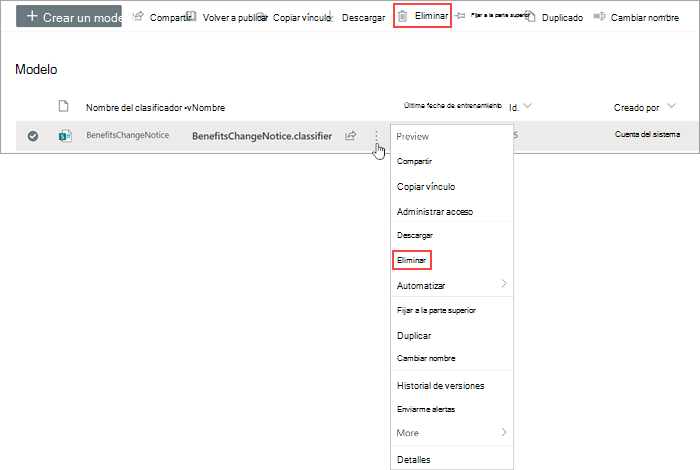

# Eliminación de un modelo en Microsoft Syntex

En algún momento, es posible que desee eliminar un modelo de comprensión de documentos o un modelo precompilado. Antes de eliminar el modelo, primero debe quitarlo de todas las bibliotecas de documentos de SharePoint donde se ha aplicado.

## Eliminación de un modelo de una biblioteca

Puede quitar un modelo de una biblioteca de documentos de la página principal del modelo o de la biblioteca de documentos (**Automatizar vista** >  de **modelos** >  aplicados **Quitar de la biblioteca**).

> [!NOTE]
> La eliminación de un modelo no elimina el tipo de contenido asociado. 

## Eliminar un modelo

Siga estos pasos para eliminar un modelo de comprensión de documentos o un modelo precompilado.

1. Asegúrese de que el modelo se ha [quitado](#remove-a-model-from-a-library) de su biblioteca de documentos.
 
2. Desde el centro de contenido, seleccione **Modelos** para ver la lista de modelos.

3. En la página **Modelos** , seleccione el modelo que desea eliminar.

4. Mediante la cinta de opciones o el botón **Mostrar acciones** (junto al nombre del modelo), seleccione **Eliminar**. 

    

5. En el panel **Eliminar modelo** , seleccione **Eliminar**.

## Ver también

[Información general sobre la comprensión de documentos](document-understanding-overview.md)

[Aplicar un modelo](apply-a-model.md) 
