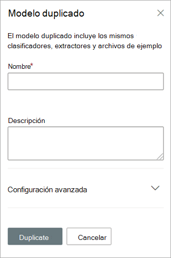

# Duplicar un modelo en Microsoft SharePoint SyntexDuplicate a model in Microsoft SharePoint Syntex

Duplicar un modelo de compresión mediante documentos puede ahorrarle tiempo y esfuerzo si necesita crear un modelo nuevo y saber si un modelo existente es muy similar a lo que necesita.Duplicating a document understanding model can save you time and effort if you need to create a new model, and know that an existing model is very similar to what you need.

Por ejemplo, un modelo existente denominado "Contratos" clasifica los mismos archivos con los que tiene que trabajar.For example, an existing model named “Contracts” classifies the same files you need to work with. El nuevo modelo extraerá algunos de los datos existentes, pero necesitará ser actualizado para poder extraer datos adicionales.Your new model will extract some of the existing data, but will need to be updated to extract some additional data. En lugar de crear y entrenar un modelo desde cero, puede usar la característica de modelo duplicado para hacer una copia del modelo Contratos, que también copiará todos los elementos de aprendizaje asociados, como los archivos de ejemplo y los extractores de entidades.Instead of creating and training a new model from scratch, you can use the duplicate model feature to make a copy of the Contracts model, which will also copy all associated training items, such as example files and entity extractors.

Cuando duplique el modelo, después de cambiarle el nombre (por ejemplo, a "Renovaciones de contrato"), podrá realizar actualizaciones en él.When you duplicate the model, after you rename it (for example, to “Contract Renewals”), you can then make updates to it. Por ejemplo, puede quitar algunos de los campos extraídos existentes que no necesite y, después, entrenar el modelo para extraer uno nuevo (por ejemplo, "Fecha de renovación").For example, you can choose to remove some of the existing extracted fields that you don’t need, and then train the model to extract a new one (for example, “Renewal date”).

## Duplicar un modeloDuplicate a model

Siga estos pasos para duplicar un modelo de comprensión mediante documentos.Follow these steps to duplicate a document understanding model.

1. Desde el centro de contenido, seleccione **Modelos** para ver la lista de modelos.From the content center, select **Models** to see your models list.

2. En la página **Modelos**, seleccione el modelo que quiere duplicar.On the **Models** page, select the model you want to duplicate.

3. Mediante la cinta de opciones o el botón **Mostrar acciones** (junto al nombre del modelo), seleccione **Duplicar**.By using either the ribbon or the **Show actions** button (next to the model name), select **Duplicate**. 

      

4. En el panel **Duplicar modelo**:On the **Duplicate model** panel:

   a.a. En **Nombre**, escriba el nuevo nombre del modelo que quiere duplicar.Under **Name**, enter the new name of the model that you want to duplicate. 

      

   b.b. En **Descripción**, agregue una descripción del modelo nuevo.Under **Description**, add a description of your new model.

   c.c. (Opcional) En **Configuración avanzada**, seleccione si quiere asociar un [tipo de contenido](/sharepoint/governance/content-type-and-workflow-planning#content-type-overview) existente.(Optional) Under **Advanced settings**, select whether you want to associate an existing [content type](/sharepoint/governance/content-type-and-workflow-planning#content-type-overview).

5. Seleccione **Duplicar**.Select **Duplicate**.

## Consulte tambiénSee Also
[Crear un clasificadorCreate a classifier](create-a-classifier.md)

[Cambiar el nombre de un modeloRename a model](rename-a-model.md)

[Crear un extractorCreate an extractor](create-an-extractor.md)

[Información general sobre la comprensión de los documentosDocument Understanding overview](document-understanding-overview.md)

[Tipos de explicaciónExplanation types](explanation-types-overview.md)

[Aplicar un modeloApply a model](apply-a-model.md) 

[Modo de accesibilidad de SharePoint SyntexSharePoint Syntex Accessibility Mode](accessibility-mode.md)