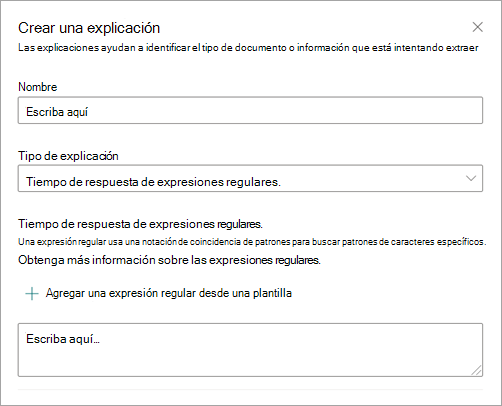
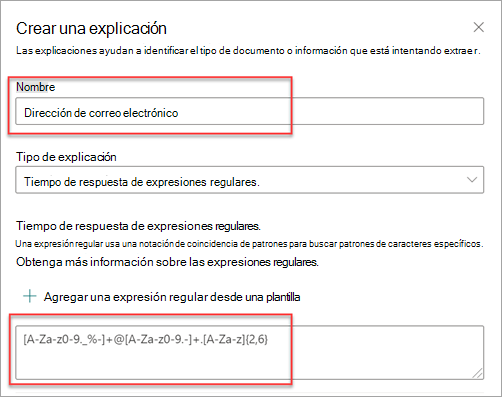
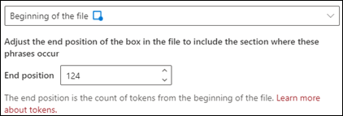
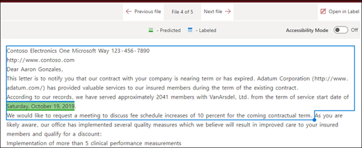
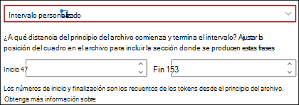

# Tipos de explicación en Microsoft SharePoint Syntex

Las explicaciones se utilizan para ayudar a definir la información que desea etiquetar y extraer en los modelos de comprensión de documentos en Microsoft SharePoint Syntex. Al crear una explicación, debe seleccionar un tipo de explicación. Este artículo le ayudará a comprender los distintos tipos de explicación y cómo se usan.

 
   
Estos son los tipos de explicación disponibles:

- [**Lista de frases**](#phrase-list): lista de palabras, frases, números u otros caracteres que se pueden usar en el documento o la información que se va a extraer. Por ejemplo, la cadena de texto *médico remitente* está en todos los documentos de derivación médica que identifica. O la cadena *número de teléfono* del médico remitente está en todos los documentos de derivación médica que identifica.

- [**Expresión regular**](#regular-expression): usa una notación que coincida con patrones de caracteres específicos. Por ejemplo, puede usar una expresión regular para buscar todas las instancias de una *dirección de correo electrónico* en un conjunto de documentos.

- [**Proximidad**](#proximity): describe la cercanía que existe entre varias explicaciones. Por ejemplo, el *número de la calle* se mostrará justo antes de la lista de *nombre de la calle*, sin tokens entre ellas (aprenderá sobre los tokens más adelante en este artículo). Usar el tipo de proximidad requiere que tenga al menos dos explicaciones en su modelo o la opción se deshabilitará. 

## Lista de frases

Un tipo de explicación de la lista de frases se usa normalmente para identificar y clasificar un documento a través del modelo. Como se describe en el ejemplo de etiqueta *médico remitente*, se trata de una cadena de palabras, frases, números o caracteres que aparece uniformemente en los documentos que se identifican.

Aunque no es obligatorio, puede tener más éxito con su explicación si la frase que captura se encuentra habitualmente en el mismo lugar en los documentos. Por ejemplo, puede que la etiqueta *médico remitente* se encuentre siempre en el primer párrafo del documento. También puede usar la opción avanzada **[Configurar dónde aparecen las frases en el documento](https://docs.microsoft.com/microsoft-365/contentunderstanding/explanation-types-overview#configure-where-phrases-occur-in-the-document)** para seleccionar áreas específicas donde se encuentra la frase, especialmente si existe la posibilidad de que la frase aparezca en varias ubicaciones del documento.

Si la distinción de mayúsculas y minúsculas es un requisito para identificar la etiqueta, usar el tipo Lista de frases le permite especificarla en la explicación si activa la casilla de verificación **Solo mayúsculas exactas**.

 

Un tipo de frase es especialmente útil cuando crea una explicación que identifica y extrae información en diferentes formatos, como fechas, números de teléfono y números de tarjetas de crédito. Por ejemplo, una fecha puede mostrarse en diferentes formatos (1/1/2020, 1-1-2020, 01/01/20, 01/01/2020, 1 de enero de 2020, etc.). Definir una lista de frases hace que su explicación sea más eficiente cuando capture cualquier posible variación en los datos que trata de identificar y extraer. 

Para el ejemplo del *número de teléfono*, extraiga el número de teléfono de cada médico remitente de todos los documentos de derivación médica que el modelo identifique. Cuando cree la explicación, escriba los distintos formatos que pueda mostrar un número de teléfono en el documento para poder capturar posibles variaciones. 

Para este ejemplo, en **Configuración avanzada**, seleccione la casilla **Cualquier dígito entre 0 y 9** para reconocer cada valor de "0" usado en la lista de frases para ser cualquier dígito del 0 al 9.

De forma similar, si crea una lista de frases que incluya caracteres de texto, active la casilla de verificación **Cualquier letra de la a a la z** para reconocer cada carácter "a" que se use en la lista de frases como un carácter entre "a" y "z".

Por ejemplo, si crea una lista de frases de **Fecha** y quiere asegurarse de que un formato de fecha como *1 de enero de 2020* se reconozca, tendrá que:

- Agregar *aaa 0, 0000* y *aaa 00, 0000* a la lista de frases.
- Asegúrese de que **Cualquier letra de la a a la z** también esté seleccionada.

Si tiene requisitos de usar mayúsculas y minúsculas en su lista de frases, puede seleccionar la casilla de verificación **Solo usar mayúsculas y minúsculas exactamente**. Para el ejemplo de fecha, si requiere que la primera letra del mes esté en mayúscula, debe:

- Agregar *Aaa 0, 0000* y *Aaa 00, 0000* a la lista de frases.
- Asegúrese de que **Solo usar mayúsculas y minúsculas exactamente** también está seleccionado.

> [!NOTE]
> En lugar de crear manualmente una explicación de las listas de frases, utilice la [Biblioteca de explicación](https://docs.microsoft.com/microsoft-365/contentunderstanding/explanation-types-overview#use-explanation-templates) para usar plantillas de listas de frases para las listas de frases comunes, como *fecha*, *números de teléfono* o *número de tarjeta de crédito*.

## Expresión regular

Un tipo de explicación de expresiones regulares le permite crear patrones que ayudan a buscar e identificar determinadas cadenas de texto en los documentos. Puede usar expresiones regulares para analizar rápidamente grandes cantidades de texto de la siguiente manera:

- Buscar patrones de caracteres específicos.
- Validar el texto para asegurarse de que coincida con un patrón predefinido (por ejemplo, una dirección de correo electrónico).
- Extraer, editar, reemplazar o eliminar subcadenas de texto.

Un tipo de expresión regular es especialmente útil cuando se crea una explicación que identifica y extrae información en formatos regulares, como direcciones de correo electrónico, números de cuentas bancarias o direcciones URL. Por ejemplo, una dirección de correo electrónico, como megan@contoso.com, se muestra siempre con un patrón determinado (en el ejemplo, "megan" es la primera parte y "com" es la última). 

La expresión regular de una dirección de correo electrónico es: **[A-Za-z0-9._%-]+@[A-Za-z0-9.-]+.[A-Za-z]{2,6}**.

Esta expresión se compone de cinco partes, en este orden:

1. cualquier cantidad de los siguientes caracteres:

   a. letras de la "a" a la "z"

   b. números del 0 al 9

   c. punto, subrayado, porcentaje o guion

2. El símbolo @

3. cualquier cantidad de los mismos caracteres como en la primera parte de la dirección de correo electrónico

4. Un punto

5. De dos a seis letras

Para agregar un tipo de explicación de expresiones regulares:

1. Desde el panel **Crear una explicación**, en **Tipo de explicación**, seleccione la **Expresión regular**.

   

2. Puede escribir una expresión en el cuadro de texto **Expresión regular** o seleccionar **Agregar una expresión regular desde una plantilla**.

   Cuando agregue una expresión regular con una plantilla, el nombre y la expresión regular se agregarán automáticamente al cuadro de texto. Por ejemplo, si elige la plantilla **dirección de correo electrónico**, se rellenará el panel **Crear una explicación**.

   

## Proximidad 

El tipo de explicación de proximidad ayuda al modelo a identificar los datos definiendo la proximidad que otros datos tienen con estos. Por ejemplo, en su modelo ha definido dos explicaciones que etiquetan tanto el *número de la dirección de la calle* como el *número de teléfono* del cliente. 

Sabemos que los números de teléfono del cliente siempre aparecen antes que el número de la calle. 

Alex Wilburn 
555-555-5555 
One Microsoft Way 
Redmond, WA 98034 

Use la explicación de proximidad para definir el número de teléfono que se debe desplazar para identificar mejor el número de la calle en los documentos.

#### ¿Qué son los tokens?

Para usar el tipo de explicación de proximidad es necesario comprender qué es un token. El número de tokens muestra cómo la explicación de proximidad mide la distancia entre una explicación y otra. Un token es un intervalo continuo (sin incluir espacios ni signos de puntuación) de letras y números. 

En la siguiente tabla se muestran algunos ejemplos de cómo determinar el número de tokens en una frase.

|Frase|Número de tokens|Explicación|
|--|--|--|
|`Dog`|1|Una sola palabra sin signos de puntuación o espacios.|
|`RMT33W`|1|Un número de localizador de registros. Puede incluir números y letras, pero no signos de puntuación.|
|`425-555-5555`|5|Un número de teléfono Cada signo de puntuación es un token único, por lo que `425-555-5555` tiene 5 tokens: `425` `-` `555` `-` `5555` |
|`https://luis.ai`|7|`https` `:` `/` `/` `luis` `.` `ai` |

#### Configurar el tipo de explicación de proximidad

Para el ejemplo, configure el ajuste de proximidad de manera que podamos definir el rango del número de tokens en la explicación *número de teléfono* a partir de la explicación *número de la dirección de la calle*. Vea que el intervalo mínimo es "0", ya que no hay ningún token entre el número de teléfono y el número de la dirección postal.

Sin embargo, algunos números de teléfono de los documentos de muestra incluyen *(móvil)* al final.

Nestor Wilke 
111-111-1111 (móvil) 
One Microsoft Way 
Redmond, WA 98034 

Hay tres tokens en *(móvil)*:

|Frase|Cuenta de tokens|
|--|--|
|(|1|
|móvil|2|
|)|3|

Configure la opción de proximidad para tener un intervalo de 0 a 3.

## Configurar dónde aparecen frases en el documento

Cuando crea una explicación, de forma predeterminada se busca en todo el documento la frase que intenta extraer. Sin embargo, puede usar la opción avanzada **Dónde se aparezcan estas frases** para ayudar a aislar una ubicación específica del documento donde aparezca una frase. Esta configuración es útil cuando pueden aparecer instancias similares de una frase en otra parte del documento y quiere asegurarse de que se ha seleccionado la correcta.

Si nos referimos a nuestro ejemplo de documento de derivación médica, siempre se menciona el *médico remitente* en el primer párrafo del documento. Con la opción **Dónde se aparezcan estas frases**, en este ejemplo puede configurar su explicación para que busque esta etiqueta solo en la sección inicial del documento o en cualquier otra ubicación en la que pueda aparecer.

Puede seleccionar una de las siguientes opciones para este valor:

- En cualquier lugar del archivo: se busca la frase en todo el documento.

- Principio del archivo: se busca en el documento desde el principio hasta la ubicación de la frase.

   

    En el visor, puede ajustar manualmente el cuadro de selección para que incluya la ubicación donde aparezca la fase. El valor **Posición final** se actualizará para mostrar el número de tokens que incluye el área seleccionada. Puede actualizar el valor de la **posición final** para ajustar el área seleccionada.

   

- Final del archivo: se busca en el documento desde el principio hasta la ubicación de la frase.

   

    En el visor, puede ajustar manualmente el cuadro de selección para que incluya la ubicación donde aparezca la fase. El valor **Posición inicial** se actualizará para mostrar el número de tokens que incluye el área seleccionada. También puede actualizar el valor Posición inicial para ajustar el área seleccionada.

   

- Intervalo personalizado: se busca dentro de un rango especificado en el documento.

   

    En el visor, puede ajustar manualmente el cuadro de selección para que incluya la ubicación donde aparezca la fase. Para esta opción, necesita seleccionar una posición **Inicio** y una posición **Fin**. Estos valores representan el número de tokens desde el principio del documento. Aunque puede escribir los valores manualmente, es más fácil ajustarlos en el cuadro de selección en el visor. 
   
## Usar plantillas de explicación

Aunque se pueden agregar manualmente varios valores de la lista de frases para la explicación, puede resultar más fácil usar las plantillas que se le proporcionan en la biblioteca de explicación.

Por ejemplo, en lugar de añadir manualmente todas las variaciones para *fecha*, puede utilizar la plantilla de la lista de frases para *fecha* que ya incluye una serie de valores de la lista de frases:

 
La biblioteca de explicación incluye varias explicaciones de la *lista de frases* más utilizadas, entre las que se incluyen:

- Fecha: fechas del calendario, todos los formatos. Incluye texto y números (por ejemplo, "9 de diciembre de 2020").
- Fecha (numérica): fechas del calendario, todos los formatos. Incluye números (por ejemplo, 1-11-2020).
- Hora: formatos de 12 y 24 horas.
- Número: números positivos y negativos, hasta 2 decimales. 
- Porcentaje: una lista de patrones que representan un porcentaje. Por ejemplo, 1 %, 11 %, 100 % o 11,11 %.
- Número de teléfono: formatos comunes de EE. UU. e internacionales. Por ejemplo, 000 000 0000, 000-000-0000, (000)000-0000 o (000) 000-0000.
- Código postal: formatos de código postal de Estados Unidos. Por ejemplo, 11111, 11111-1111.
- Primera palabra de una frase: patrones comunes para palabras de hasta nueve caracteres. 
- Final de una oración: signos de puntuación comunes para el final de una oración
- Tarjeta de crédito: formatos de número de tarjeta de crédito comunes. Por ejemplo, 1111-1111-1111-1111. 
- Número de la seguridad social: formato de número del seguro social de EE. UU. Por ejemplo, 111-11-1111. 
- Casilla: una lista de frases que representa variaciones en una casilla rellenada. Por ejemplo, _X_, _ _X_.
- Moneda: principales símbolos internacionales. Por ejemplo: .$ 
- Correo electrónico CC: lista de frases con el término "CC:" que se suele encontrar cerca de los nombres o direcciones de correo electrónico de otras personas o grupos a los que se envió el mensaje.
- Fecha del correo electrónico: lista de frases con el término "Enviado el:", que se suele encontrar cerca de la fecha en que se envió el correo electrónico.
- Saludo de correo electrónico: líneas de apertura comunes de los correos electrónicos.
- Destinatario de correo electrónico: lista de frases con el término "Para:", que a menudo se encuentra cerca de los nombres o direcciones de correo electrónico de personas o grupos a los que se envió el mensaje. 
- Remitente de correo electrónico: lista de frases con el término "De:" que se suele encontrar cerca del nombre o la dirección de correo del remitente. 
- Asunto del correo electrónico: lista de frases con el término "Asunto:" que se suele encontrar cerca del asunto del correo electrónico.

La biblioteca de explicación incluye varias explicaciones de *expresiones regulares* frecuentemente utilizadas, entre ellas:

- Números de 6 a 17 dígitos: coincide con cualquier número de 6 a 17 dígitos de longitud. Los números de cuenta bancaria de EE. UU. se ajustan a este patrón.
- Correo electrónico: coincide con un tipo común de dirección de correo electrónico como meganb@contoso.com
- Número de identificación fiscal de los EE. UU.: coincide con un número de tres dígitos que empieza por nueve seguido de un número de seis dígitos que empieza por siete u ocho. 
- Dirección web (URL): coincide con el formato de una dirección web que empieza por http:// o https://.

La biblioteca de explicación también incluye tres tipos de plantillas automáticas que funcionan con los datos que ha etiquetado en los archivos de ejemplo:

- Después de la etiqueta: las palabras o caracteres que aparecen después de las etiquetas en los archivos de ejemplo.
- Antes de la etiqueta: las palabras o caracteres que aparecen antes de las etiquetas en los archivos de ejemplo.
- Etiquetas: hasta las 10 primeras etiquetas de los archivos de ejemplo.

Para ilustrar cómo funcionan las plantillas automáticas, en el siguiente archivo de ejemplo usaremos la plantilla de explicación Antes de la etiqueta para dar más información al modelo y obtener una coincidencia más precisa.

Al seleccionar la plantilla de explicación Antes de la etiqueta, buscará el primer conjunto de palabras que aparezca antes de la etiqueta en los archivos de ejemplo. Como puede ver en la imagen, las palabras que se identifican en el primer archivo de ejemplo son "As of".

Puede seleccionar **Agregar** para crear una explicación a partir de la plantilla.  A medida que agregue más archivos de ejemplo, se identificarán y agregarán palabras adicionales a la lista de frases.

 
#### Para usar una plantilla de la biblioteca de explicación

1. En la sección de **Explicaciones** de la página de **Entrenamiento** de su modelo, seleccione **Nuevo**, y luego seleccione **De Una Plantilla**.

   

2.  En la página **Plantillas de explicación**, seleccione la explicación que desee usar y, a continuación, seleccione **Agregar**.

    

3. La información de la plantilla que ha seleccionado se mostrará en la página **Crear una explicación**. Si es necesario, edite el nombre de la explicación y agregue o elimine elementos de la lista de frases.  

    

4. Cuando finalice, haga clic en **Guardar**.