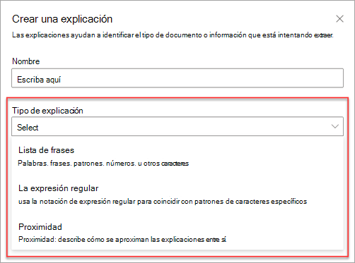
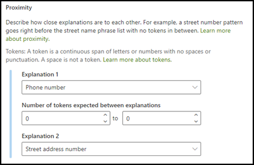
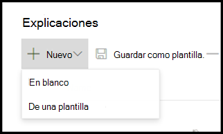
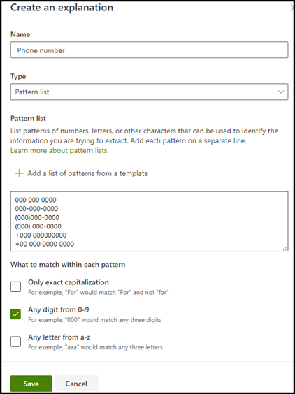

# Introducción a los tipos de explicación

Use explicaciones para definir la información que desea etiquetar y extraiga en el documento los conceptos de comprensión de los modelos de Microsoft SharePoint Syntex. Al crear una explicación, asegúrese de seleccionar un tipo de explicación. 

Este artículo ayuda a comprender los diferentes tipos de explicación y cómo se usan.

    
   
Estos son los tipos de explicación disponibles:

- **Lista de frases**: lista de palabras, frases, números u otros caracteres que se pueden usar en el documento o la información que se va a extraer. Por ejemplo, la cadena de texto que **hace referencia al doctor** está en todos los documentos de referencia médica que está identificando. 

- **Lista de patrones**: enumerar los patrones de números, letras u otros caracteres que puede usar para identificar la información que va a extraer. Por ejemplo, puede extraer el **número de teléfono** del médico de referencia de todos los documentos de referencia médica que va a identificar. 

- **Proximidad**: describe cómo se explican las explicaciones de cierre. Por ejemplo, una lista de patrones de *números de calle* se coloca justo antes de la lista de frases con *nombre de calle* , sin tokens entre (obtendrá información sobre los tokens más adelante en este artículo). 
 
## Lista de frases

Un tipo de explicación de la lista de frases se suele usar para identificar y clasificar un documento a través del modelo. Como se describe en el ejemplo de la etiqueta *doctor de referencia* , es una cadena de palabras, frases, números o caracteres que se encuentran de forma coherente en los documentos que se identifican.

Aunque no es un requisito, puede lograr un mejor éxito con su explicación si la frase que está capturando se encuentra en una ubicación coherente en el documento. Por ejemplo, la etiqueta de *médico de referencia* puede encontrarse de forma coherente en el primer párrafo del documento.

Si la distinción entre mayúsculas y minúsculas es un requisito para identificar la etiqueta, al usar el tipo de lista de frases podrá especificarla en su explicación seleccionando la casilla de verificación **sólo mayúsculas exactas** .

    

## Listas de patrones

Un tipo de lista de patrones es especialmente útil cuando se crea una explicación que identifica y extrae información de un documento. Por lo general, se presenta en diferentes formatos, como fechas, números de teléfono o números de tarjetas de crédito. Por ejemplo, una fecha se puede mostrar en varios formatos diferentes (1/1/2020, 1-1-2020, 01/01/20, 01/01/2020, 1 de enero de 2020, etc.). La definición de una lista de patrones hace que la explicación sea más eficaz al capturar cualquier variación posible en los datos que se intenta identificar y extraer. 

Para el ejemplo de **número de teléfono** , extraiga el número de teléfono de cada médico de referencia de todos los documentos de referencia médica que identifique el modelo. Al crear la explicación, seleccione el tipo de lista trama para permitir los diferentes formatos que puede espera que se devuelvan.

   

Para este ejemplo, active la casilla **cualquier dígito de 0-9** . La selección de esta opción reconoce cada valor "0" que se usa en la lista de patrones para que sea cualquier dígito comprendido entre 0 y 9.

   

De forma similar, si crea una lista de tramas que incluya caracteres de texto, active la casilla **cualquier letra de a-z** . Al seleccionar esta opción, se reconoce cada carácter "a" usado en la lista de patrones para que sea cualquier carácter de "a" a "z".

Por ejemplo, si crea una lista de patrones de **fecha** y desea asegurarse de que se reconoce un formato de fecha como el *1 de enero de 2020* , debe:
- Agregue *AAA 0, 0000* y *AAA 00, 0000* a la lista de tramas.
- Asegúrese de que **cualquier letra de la a a la z** también está seleccionada.

   

Además, si tiene requisitos de capitalización en la lista trama, tiene la opción de activar la casilla de verificación **sólo mayúsculas exactas** . Para el ejemplo de la fecha, si necesita que la primera letra del mes esté en mayúsculas, debe:

- Agregue *AAA 0, 0000* y *AAA 00, 0000* a la lista de tramas.
- Asegúrese de que **solo se selecciona mayúsculas exactas** .

   

> [!NOTE]
> En lugar de crear manualmente una explicación de la lista de patrones, use la [biblioteca de explicación]() para usar plantillas de lista de patrones predefinidas para la lista de patrones comunes, como *fecha*, *número de teléfono*, número de *tarjeta de crédito*, etc. 

## Proximidad 

El tipo de explicación de proximidad ayuda a que el modelo identifique los datos mediante la definición del modo en que se va a cerrar otro dato. Por ejemplo, en el modelo, ha definido dos explicaciones que etiquetan tanto el número de teléfono de la *calle* del cliente como el *número de teléfono*. 

También tiene en cuenta que los números de teléfono del cliente siempre aparecen antes del número de la dirección postal. 

Alex Wilburn 
555-555-5555 
One Microsoft Way 
Redmond, WA 98034 

Use la explicación de Proximity para definir la distancia a la que se explica el número de teléfono para identificar mejor el número de la calle en los documentos.

    

#### ¿Qué son los tokens?

Para usar el tipo de explicación de proximidad, comprenda qué es un token, ya que el número de tokens es cómo la explicación de proximidad mide la distancia de una explicación a otra.  

Un token es un intervalo continuo (sin espacios ni signos de puntuación) de letras y números. Un espacio no es un token. Cada carácter de puntuación es un token. En la tabla siguiente se muestran algunos ejemplos de cómo determinar el número de tokens en una frase.

|Frase|Número de tokens|Explicación|
|--|--|--|
|`Dog`|1 |Una sola palabra sin signos de puntuación o espacios.|
|`RMT33W`|1 |Un número de localizador de registros. Puede tener números y letras, pero no tiene ningún signo de puntuación.|
|`425-555-5555`|5 |Un número de teléfono. Cada signo de puntuación es un único token que  `425-555-5555` puede ser 5 tokens: `425` `-` `555` `-` `5555` |
|`https://luis.ai`|7 |`https` `:` `/` `/` `luis` `.` `ai` |

#### Configurar el tipo de explicación de proximidad

Para la muestra, configure el valor de Proximity para que podamos definir el intervalo del número de tokens que la explicación del *número de teléfono* proviene de la explicación del número de dirección de la *calle* .

Debe ver que el intervalo mínimo es "0", ya que no hay tokens entre el número de teléfono y el número de dirección postal.

Sin embargo, algunos números de teléfono de los documentos de muestra se anexan *(móviles)*.

Sergio Wilke 
111-111-1111 (móvil) 
One Microsoft Way 
Redmond, WA 98034 

Hay tres tokens en *(móvil)*:

|Frase|Número de tokens|
|--|--|
|(|1 |
|móviles|2 |
|)|3 |

Configure el valor de Proximity para que tenga un intervalo comprendido entre 0 y 3.

    

## Usar la biblioteca de explicación

Aunque puede Agregar de forma manual varios valores de la lista de patrones para la explicación, es mucho más fácil usar las plantillas creadas previamente que se proporcionan en la biblioteca de explicación.

Por ejemplo, en lugar de agregar manualmente todas las variaciones de la *fecha*, use la plantilla de lista de patrones para *Date*, que ya incluye un número de valores de listas de patrones: 

    
 
La biblioteca de explicación incluye varias explicaciones de la lista de patrones que se usan con más frecuencia, entre las que se incluyen: 

- Fecha 
- Fecha (numérica) 
- Time 
- Número 
- Número de teléfono 
- Código postal 
- Primera palabra de la oración 
- Tarjeta de crédito 
- Número de la seguridad social 

Tenga en cuenta que la biblioteca de explicación también incluye plantillas para las explicaciones de la lista de frases, entre las que se incluyen:
- Fin de la oración
- Moneda

#### Para usar una plantilla de la biblioteca de explicación

1. En la sección **explicaciones** de la página **tren** de su modelo, seleccione **nuevo**y, a continuación, seleccione **desde una plantilla**. 

    

2.  En la página **plantillas de explicación** , seleccione la explicación que desea usar y, a continuación, seleccione **Agregar**. 

        

3. La información de la plantilla seleccionada se mostrará en la página **crear una explicación** . Si es necesario, edite el nombre de la explicación y agregue o quite los elementos de la lista trama.   

    

4. Cuando termine, seleccione **Guardar**.
