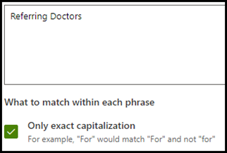
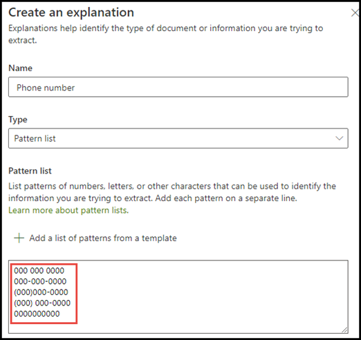

# Introducción a los tipos de explicaciónIntroduction to explanation types

Las explicaciones se utilizan para ayudar a definir la información que desea etiquetar y extraer en los modelos de comprensión de documentos en Microsoft SharePoint Syntex.Explanations are used to help to define the information you want to label and extract in your document understanding models in Microsoft SharePoint Syntex. Al crear una explicación, debe seleccionar un tipo de explicación.When creating an explanation, you need to select an explanation type. Este artículo le ayudará a comprender los distintos tipos de explicación y cómo se usan.This article helps you understand the different explanation types and how they are used. 

    
   
Estos son los tipos de explicación disponibles:These explanation types are available:

- **Lista de frases**: lista de palabras, frases, números u otros caracteres que se pueden usar en el documento o la información que se va a extraer.**Phrase list**: List of words, phrases, numbers, or other characters you can use in the document or information that you are extracting. Por ejemplo, la cadena de texto: **el médico remitente** está en todos los documentos de referencia médica que está identificando.For example, the text string **Referring Doctor** is in all Medical Referral documents you are identifying. 

- **Lista de patrones:** enumera los modelos de números, letras u otros caracteres que se pueden utilizar para identificar la información que se está extrayendo.**Pattern list**: List patterns of numbers, letters, or other characters that you can use to identify the information that you are extracting. Por ejemplo, puede extraer el **número de teléfono** del médico remitente de todos los documentos de referencia médica que está identificando.For example, you can extract the **Phone number** of the referring doctor from all Medical Referral document that you are identifying. 

- **Proximidad:** Describe cómo se aproximan las explicaciones entre sí.**Proximity**: Describes how close explanations are to each other. Por ejemplo, el *número de la calle* se mostrará justo antes de la lista de *nombre de la calle*, sin tokens entre ellas (aprenderá sobre los tokens más adelante en este artículo).For example, a *street number* pattern list goes right before the *street name* phrase list, with no tokens in between (you'll learn about tokens later in this article). Usar el tipo de proximidad requiere que tenga al menos dos explicaciones en su modelo o la opción se deshabilitará.Using the proximity type requires you to have at least two explanations in your model or the option will be disabled. 
 
## Lista de frasesPhrase list

Un tipo de explicación de la lista de frases se usa normalmente para identificar y clasificar un documento a través del modelo.A phrase list explanation type is typically used to identify and classify a document through your model. Como se describe en el ejemplo de etiqueta *médico remitente*, se trata de una cadena de palabras, frases, números o caracteres que es coherente en los documentos que se están identificando.As described in the *Referring Doctor* label example, it is a string of words, phrases, numbers, or characters that is consistently in the documents that you are identifying.

Aunque no es un requisito, puede lograr un mayor éxito con su explicación si la frase que está registrando se encuentra en un lugar consistente en su documento.While not a requirement, you can achieve better success with your explanation if the phrase you are capturing is located in a consistent location in your document. Por ejemplo, puede que la etiqueta *médico remitente* se encuentre sistemáticamente en el primer párrafo del documento.For example, the *Referring Doctor* label may be consistently located in the first paragraph of the document.

Si la distinción de mayúsculas y minúsculas es un requisito para identificar la etiqueta, usar el tipo Lista de frases le permite especificarla en la explicación si activa la casilla de verificación **Solo mayúsculas exactas**.If case sensitivity is a requirement in identifying your label, using the phrase list type allows you to specify it in your explanation by selecting the **Only exact capitalization** checkbox.

    

## Listas de patronesPattern lists

Un tipo de lista de patrones es especialmente útil cuando se crea una explicación que identifica y extrae la información de un documento.A pattern list type is especially useful when you create an explanation that identifies and extracts information from a document. Por lo general, se presenta en diferentes formatos, como fechas, números de teléfono o números de tarjeta de crédito.It is typically presented in different formats, such as dates, phone numbers, and credit card numbers. Por ejemplo, una fecha puede ser mostrada en diferentes formatos (1/1/2020, 1-1-2020, 01/01/20, 01/01/2020, 1 de enero de 2020, etc.).For example, a date can be displayed in a number of different formats (1/1/2020, 1-1-2020, 01/01/20, 01/01/2020, Jan 1,2020, etc.). Definir una lista de patrones hace que su explicación sea más eficiente al capturar cualquier posible variación en los datos que está tratando de identificar y extraer.Defining a pattern list makes your explanation more efficient by capturing any possible variations in the data that you are trying to identify and extract. 

Para el ejemplo del **número de teléfono**, extraiga el número de teléfono de cada médico remitente de todos los documentos de remisión médica que el modelo identifica.For the **Phone number** example, you extract the phone number for each referring doctor from all Medical Referral documents that the model identifies. Cuando cree la explicación, seleccione el tipo Lista de patrones para permitir que se devuelvan los distintos formatos que esperaba.When you create the explanation, select the Pattern list type to allow the different formats that you may expect to be returned.

   

Para este ejemplo, active la casilla de verificación **Cualquier dígito entre 0-9** para reconocer cada valor "0" que se usa en la lista de patrones como un dígito entre 0 y 9.For this example, select the **Any digit from 0-9** checkbox to recognize each "0" value used in your pattern list to be any digit from 0 through 9.

   

De forma similar, si crea una lista de patrones que incluya caracteres de texto, active la casilla de verificación **Cualquier letra de la a a la z** para reconocer cada carácter "a" que se use en la lista de patrones como un carácter entre "a" y "z".Similarly, if you create a pattern list that includes text characters, select the **Any letter from a-z** checkbox to recognize each "a" character used in the pattern list to be any character from "a" to "z".

Por ejemplo, si crea una lista de patrones **Fecha** y desea asegurarse de que un formato de fecha como *el 1 de enero de 2020* se reconozca, tendrá que:For example, if you create a **Date** pattern list and you want to make sure that a date format such as *Jan 1, 2020* is recognized, you need to:
- Agregar *aaa 0, 0000* y *aaa 00, 0000* a la lista de patronesAdd *aaa 0, 0000* and *aaa 00, 0000* to your pattern list.
- Asegúrese de que **Cualquier letra de la a a la z** también esté seleccionada.Make sure that **Any letter from a-z** is also selected.

   

Además, si tiene requisitos de usar mayúsculas y minúsculas en su lista de patrones, tiene la opción de seleccionar la casilla de verificación **Solo usar mayúsculas y minúsculas exactamente**.Additionally, if you have capitalization requirements in your pattern list, you have the option to select the **Only exact capitalization** checkbox. En el ejemplo de la fecha, si necesita que la primera letra del mes se ponga en mayúsculas, deberá:For the Date example, if you require the first letter of the month to be capitalized, you need to:

- Agregar *Aaa 0, 0000* y *Aaa 00, 0000* a la lista de patrones.Add *Aaa 0, 0000* and *Aaa 00, 0000* to your pattern list.
- Asegúrese de que **Solo usar mayúsculas y minúsculas exactamente** también está seleccionado.Make sure that **Only exact capitalization** is also selected.

   

> [!NOTE]
> En lugar de crear manualmente una explicación de las listas de patrones, utilice la [Biblioteca de explicación](https://docs.microsoft.com/microsoft-365/contentunderstanding/explanation-types-overview#use-explanation-templates) para usar plantillas de listas de patrones para las listas de patrones comunes, como *fecha*, *números de teléfono*, *número de tarjeta de crédito*, etc.Instead of manually creating a pattern list explanation, use the [explanation library](https://docs.microsoft.com/microsoft-365/contentunderstanding/explanation-types-overview#use-explanation-templates) to use pattern list templates for a common pattern list, such as *date*, *phone number*, *credit card number*, etc.

## ProximidadProximity 

El tipo de explicación de proximidad ayuda al modelo a identificar los datos definiendo la proximidad que otros datos tienen con estos.The proximity explanation type helps your model identify data by defining how close another piece of data is to it. Por ejemplo, en su modelo ha definido dos explicaciones que etiquetan tanto el *Número de la dirección de la calle* como el *Número de teléfono* del cliente.For example, in your model say you have defined two explanations that label both the customer *Street address number* and *Phone number*. 

Sabemos que los números de teléfono del cliente siempre aparecen antes que el número de la calle.Notice that customer phone numbers always appear before the street address number. 

Alex WilburnAlex Wilburn 
555-555-5555555-555-5555 
One Microsoft WayOne Microsoft Way 
Redmond, WA 98034Redmond, WA 98034 

Use la explicación de proximidad para definir el número de teléfono que se debe desplazar para identificar mejor el número de la calle en los documentos.Use the proximity explanation to define how far away the phone number explanation is to better identify the street address number in your documents.

    

#### ¿Qué son los tokens?What are tokens?

Para poder usar el tipo de explicación de proximidad, necesita entender qué es un token, ya que la explicación de proximidad utiliza el número de tokens para medir la distancia entre una explicación y otra.In order to use the proximity explanation type, you need to understand what a token is, as the number of tokens is how the proximity explanation measures distance from one explanation to another. Un token es un intervalo continuo (sin incluir espacios ni signos de puntuación) de letras y números.A token is a continuous span (not including spaces or punctuation) of letters and numbers. 

En la siguiente tabla se muestran algunos ejemplos de cómo determinar el número de tokens en una frase.The following table shows examples for how to determine the number of tokens in a phrase.

|FrasePhrase|Número de tokensNumber of tokens|ExplicaciónExplanation|
|--|--|--|
|`Dog`|11|Una sola palabra sin signos de puntuación o espacios.A single word with no punctuation or spaces.|
|`RMT33W`|11|Un número de localizador de registros.A record locator number. Es posible que tenga números y letras, pero no tiene signos de puntuación.It may include numbers and letters, but does not have punctuation.|
|`425-555-5555`|55|Un número de teléfonoA phone number. Cada signo de puntuación es un token único, por lo que `425-555-5555` tiene 5 tokens:Each punctuation mark is a single token, so `425-555-5555` is 5 tokens: `425` `-` `555` `-` `5555` |
|`https://luis.ai`|77|`https` `:` `/` `/` `luis` `.` `ai` |

#### Configurar el tipo de explicación de proximidadConfigure the proximity explanation type

Para el ejemplo, configure el ajuste de proximidad de manera que podamos definir el rango del número de tokens en la explicación *Número de teléfono* a partir de la explicación *Número de la dirección de la calle*.For the example, configure the proximity setting to define the range of the number of tokens in the *Phone number* explanation from the *Street address number* explanation. Vea que el intervalo mínimo es "0", ya que no hay ningún token entre el número de teléfono y el número de la dirección postal.Notice that the minimum range is "0", because there are no tokens between the phone number and street address number.

Sin embargo, algunos números de teléfono de los documentos de muestra incluyen *(móvil)* al final.But some phone numbers in the sample documents are appended with *(mobile)*.

Nestor WilkeNestor Wilke 
111-111-1111 (móvil)111-111-1111 (mobile) 
One Microsoft WayOne Microsoft Way 
Redmond, WA 98034Redmond, WA 98034 

Hay tres tokens en *(móvil)*:There are three tokens in *(mobile)*:

|FrasePhrase|Cuenta de tokensToken count|
|--|--|
|((|11|
|móvilmobile|22|
|))|33|

Configure la opción de proximidad para tener un intervalo de 0 a 3.Configure the proximity setting to have a range of 0 through 3.

    

## Configurar dónde aparecen frases en el documentoConfigure where phrases occur in the document

Cuando crea una explicación, de forma predeterminada se busca en todo el documento la frase que intenta extraer.When you create an explanation, by default the entire document is searched for the phrase you are trying to extract. Sin embargo, puede usar la opción avanzada <b>Dónde se aparezcan estas frases</b> para ayudar a aislar una ubicación específica del documento donde aparezca una frase.However, you can use the <b>Where these phrases occur</b> advanced setting to help in isolating a specific location in the document that a phrase occurs. Esto es útil en situaciones en las que es posible que aparezcan instancias similares de una frase en otra parte del documento y quiera asegurarse de que se ha seleccionado la correcta.This is useful in situations where similar instances of a phrase might appear somewhere else in the document, and you want to make sure that the correct one is selected. Si nos referimos a nuestro ejemplo de documento Derivación médica, siempre se menciona el **médico remitente** en el primer párrafo del documento.Referring to our Medical Referral document example, the **Referring Doctor** is always mentioned in the first paragraph of the document. Con la opción <b>Dónde se aparezcan estas frases</b>, en este ejemplo puede configurar su explicación para que busque esta etiqueta solo en la sección inicial del documento o en cualquier otra ubicación en la que pueda aparecer.With the <b>Where these phrases occur</b> setting, in this example you can configure your explanation to search for this label only in the beginning section of the document, or any other location in which it might occur.

    

Puede seleccionar una de las siguientes opciones para este valor:You can choose the following options for this setting:

- En cualquier lugar del archivo: se busca la frase en todo el documento.Anywhere in the file: The entire document is searched for the phrase.
- Principio del archivo: se busca en el documento desde el principio hasta la ubicación de la frase.Beginning of the file:  The document is searched from the beginning to the phrase location.  
    
En el visor, puede ajustar manualmente el cuadro de selección para que incluya la ubicación donde aparezca la fase.In the viewer, you can manually adjust the select box to include the location where the phase occurs. El valor <b>Posición final</b> se actualizará para mostrar el número de tokens que incluye el área seleccionada.The <b>End position</b> value will update to show the number of tokens your selected area includes. Tenga en cuenta que también puede actualizar el valor de la posición final para ajustar el área seleccionada.Note that you can update the End position value as well to adjust the selected area. 
    

- Final del archivo: se busca en el documento desde el principio hasta la ubicación de la frase.End of the file:  The document is searched from the end to the phrase location.  
    
En el visor, puede ajustar manualmente el cuadro de selección para que incluya la ubicación donde aparezca la fase.In the viewer, you can manually adjust the select box to include the location where the phase occurs. El valor <b>Posición inicial</b> se actualizará para mostrar el número de tokens que incluye el área seleccionada.The <b>Starting position</b> value will update to show the number of tokens your selected area includes. Tenga en cuenta que también puede actualizar el valor Posición inicial para ajustar el área seleccionada.Note that you can update the Starting position value as well to adjust the selected area.  
    
- Intervalo personalizado: se busca la ubicación de la frase en un intervalo especificado dentro del documento.Custom range:  The document is searched in a specified range within the it for the phrase location.  
    
En el visor, puede ajustar manualmente el cuadro de selección para que incluya la ubicación donde aparezca la fase.In the viewer, you can manually adjust the select box to include the location where the phase occurs. Para esta opción, necesita seleccionar una posición <b>Inicio</b> y una posición <b>Fin</b>.For this setting, you need to select a <b>Start</b> and an <b>End</b> position. Estos valores representan el número de tokens desde el principio del documento.These values represent the number of tokens from the begging of the document. Aunque puede especificar estos valores manualmente, es más fácil ajustar manualmente el cuadro de selección en el visor.While you can manually enter in these values, it is easier to manually adjust the select box in the viewer.  
   

## Usar plantillas de explicaciónUse explanation templates

Aunque se pueden agregar manualmente varios valores de la lista de patrones para la explicación, puede resultar más fácil usar las plantillas que se le proporcionan en la biblioteca de explicación.While you can manually add various pattern list values for your explanation, it can be easier to use the templates provided to you in the explanation library.

Por ejemplo, en lugar de añadir manualmente todas las variaciones para *Fecha*, se puede utilizar la plantilla de la lista de patrones para *Fecha* que ya incluye una serie de valores de la lista de patrones:For example, instead of manually adding all the variations for *Date*, you can use the pattern list template for *Date* as it already includes a number of pattern lists values: 

    
 
La biblioteca de explicación incluye varias explicaciones de la lista de patrones más utilizados, entre las que se incluyen:The explanation library includes commonly used pattern list explanations, including: 

- FechaDate 
- Fecha (numérica)Date (numeric) 
- HoraTime 
- NúmeroNumber 
- Número de teléfonoPhone number 
- Código postalZip code 
- Primera palabra de la fraseFirst word of sentence 
- Tarjeta de créditoCredit card 
- Número de la seguridad socialSocial security number 

Tenga en cuenta que la biblioteca de explicación también incluye plantillas para las explicaciones de la lista de frases:Note that the explanation library also includes templates for phrase list explanations:
- Final de la oraciónEnd of sentence
- DivisaCurrency

#### Para usar una plantilla de la biblioteca de explicaciónTo use a template from the explanation library

1. En la sección de **Explicaciones** de la página de **Entrenamiento** de su modelo, seleccione **Nuevo**, y luego seleccione **De Una Plantilla**.From the **Explanations** section of your model's **Train** page, select **New**, then select **From a template**. 

    

2.  En la página **Plantillas de explicación**, seleccione la explicación que desee usar y, a continuación, seleccione **Agregar**.On the **Explanation templates** page, select the explanation you want to use, then select **Add**. 

        

3. La información de la plantilla que ha seleccionado se mostrará en la página **Crear una explicación**.The information for the template you selected displays on the **Create an explanation** page. Si es necesario, edite el nombre de la explicación y agregue o elimine elementos de la lista de patrones.If needed, edit the explanation name and add or remove items from the pattern list.   

    

4. Cuando finalice, haga clic en **Guardar**.When finished, select **Save**.
