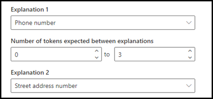

# Introducción a los tipos de explicación

Las explicaciones se utilizan para ayudar a definir la información que desea etiquetar y extraer en los modelos de comprensión de documentos en Microsoft SharePoint Syntex. Al crear una explicación, debe seleccionar un tipo de explicación. Este artículo le ayudará a comprender los distintos tipos de explicación y cómo se usan. 

 
   
Estos son los tipos de explicación disponibles:

- **Lista de frases**: lista de palabras, frases, números u otros caracteres que se pueden usar en el documento o la información que se va a extraer. Por ejemplo, la cadena de texto: **el médico remitente** está en todos los documentos de referencia médica que está identificando. O el **número de teléfono** del médico remitente de todos los documentos de referencia médica que está identificando.

- **Proximidad:** describe cómo se aproximan las explicaciones entre sí. Por ejemplo, el *número de la calle* se mostrará justo antes de la lista de *nombre de la calle*, sin tokens entre ellas (aprenderá sobre los tokens más adelante en este artículo). Usar el tipo de proximidad requiere que tenga al menos dos explicaciones en su modelo o la opción se deshabilitará. 
 
## Lista de frases

Un tipo de explicación de la lista de frases se usa normalmente para identificar y clasificar un documento a través del modelo. Como se describe en el ejemplo de etiqueta *médico remitente*, se trata de una cadena de palabras, frases, números o caracteres que es coherente en los documentos que se están identificando.

Aunque no es un requisito, puede lograr un mayor éxito con su explicación si la frase que está registrando se encuentra en un lugar consistente en su documento. Por ejemplo, puede que la etiqueta *médico remitente* se encuentre sistemáticamente en el primer párrafo del documento. También puede usar la opción avanzada **[Configurar dónde aparecen las frases en el documento](https://docs.microsoft.com/microsoft-365/contentunderstanding/explanation-types-overview#configure-where-phrases-occur-in-the-document)** para seleccionar áreas específicas donde se encuentra la frase, especialmente si existe la posibilidad de que la frase se produzca en varias ubicaciones del documento.

Si la distinción de mayúsculas y minúsculas es un requisito para identificar la etiqueta, usar el tipo Lista de frases le permite especificarla en la explicación si activa la casilla de verificación **Solo mayúsculas exactas**.

 

Un tipo de frase es especialmente útil cuando crea una explicación que identifica y extrae información en diferentes formatos, como fechas, números de teléfono y números de tarjetas de crédito. Por ejemplo, una fecha puede mostrarse en diferentes formatos (1/1/2020, 1-1-2020, 01/01/20, 01/01/2020, 1 de enero de 2020, etc.). Definir una lista de frases hace que su explicación sea más eficiente al capturar cualquier posible variación en los datos que está tratando de identificar y extraer. 

Para el ejemplo del **número de teléfono**, extraiga el número de teléfono de cada médico remitente de todos los documentos de remisión médica que el modelo identifica. Cuando cree la explicación, escriba los distintos formatos que pueda mostrar un número de teléfono en el documento para poder capturar posibles variaciones. 

Para este ejemplo, en **Configuración avanzada**, seleccione la casilla **Cualquier dígito entre 0 y 9** para reconocer cada valor de "0" usado en la lista de frases para ser cualquier dígito del 0 al 9.

De forma similar, si crea una lista de frases que incluya caracteres de texto, active la casilla de verificación **Cualquier letra de la a a la z** para reconocer cada carácter "a" que se use en la lista de frases como un carácter entre "a" y "z".

Por ejemplo, si crea una lista de frases de **Fecha** y quiere asegurarse de que un formato de fecha como *1 de enero de 2020* se reconozca, tendrá que:
- Agregar *aaa 0, 0000* y *aaa 00, 0000* a la lista de frases.
- Asegúrese de que **Cualquier letra de la a a la z** también esté seleccionada.

Además, si tiene requisitos de usar mayúsculas y minúsculas en su lista de frases, tiene la opción de seleccionar la casilla de verificación **Solo usar mayúsculas y minúsculas exactamente**. En el ejemplo de la fecha, si necesita que la primera letra del mes se ponga en mayúsculas, deberá:

- Agregar *Aaa 0, 0000* y *Aaa 00, 0000* a la lista de frases.
- Asegúrese de que **Solo usar mayúsculas y minúsculas exactamente** también está seleccionado.

> [!NOTE]
> En lugar de crear manualmente una explicación de las listas de frases, utilice la [Biblioteca de explicación](https://docs.microsoft.com/microsoft-365/contentunderstanding/explanation-types-overview#use-explanation-templates) para usar plantillas de listas de frases para las listas de frases comunes, como *fecha*, *números de teléfono*, *número de tarjeta de crédito*, etc.

## Proximidad 

El tipo de explicación de proximidad ayuda al modelo a identificar los datos definiendo la proximidad que otros datos tienen con estos. Por ejemplo, en su modelo ha definido dos explicaciones que etiquetan tanto el *Número de la dirección de la calle* como el *Número de teléfono* del cliente. 

Sabemos que los números de teléfono del cliente siempre aparecen antes que el número de la calle. 

Alex Wilburn 
555-555-5555 
One Microsoft Way 
Redmond, WA 98034 

Use la explicación de proximidad para definir el número de teléfono que se debe desplazar para identificar mejor el número de la calle en los documentos.

#### ¿Qué son los tokens?

Para poder usar el tipo de explicación de proximidad, necesita entender qué es un token, ya que la explicación de proximidad utiliza el número de tokens para medir la distancia entre una explicación y otra. Un token es un intervalo continuo (sin incluir espacios ni signos de puntuación) de letras y números. 

En la siguiente tabla se muestran algunos ejemplos de cómo determinar el número de tokens en una frase.

|Frase|Número de tokens|Explicación|
|--|--|--|
|`Dog`|1|Una sola palabra sin signos de puntuación o espacios.|
|`RMT33W`|1|Un número de localizador de registros. Es posible que tenga números y letras, pero no tiene signos de puntuación.|
|`425-555-5555`|5|Un número de teléfono Cada signo de puntuación es un token único, por lo que `425-555-5555` tiene 5 tokens: `425` `-` `555` `-` `5555` |
|`https://luis.ai`|7|`https` `:` `/` `/` `luis` `.` `ai` |

#### Configurar el tipo de explicación de proximidad

Para el ejemplo, configure el ajuste de proximidad de manera que podamos definir el rango del número de tokens en la explicación *Número de teléfono* a partir de la explicación *Número de la dirección de la calle*. Vea que el intervalo mínimo es "0", ya que no hay ningún token entre el número de teléfono y el número de la dirección postal.

Sin embargo, algunos números de teléfono de los documentos de muestra incluyen *(móvil)* al final.

Nestor Wilke 
111-111-1111 (móvil) 
One Microsoft Way 
Redmond, WA 98034 

Hay tres tokens en *(móvil)*:

|Frase|Cuenta de tokens|
|--|--|
|(|1|
|móvil|2|
|)|3|

Configure la opción de proximidad para tener un intervalo de 0 a 3.

## Configurar dónde aparecen frases en el documento

Cuando crea una explicación, de forma predeterminada se busca en todo el documento la frase que intenta extraer. Sin embargo, puede usar la opción avanzada **Dónde se aparezcan estas frases** para ayudar a aislar una ubicación específica del documento donde aparezca una frase. Esto es útil en situaciones en las que es posible que aparezcan instancias similares de una frase en otra parte del documento y quiera asegurarse de que se ha seleccionado la correcta. Si nos referimos a nuestro ejemplo de documento Derivación médica, siempre se menciona el **médico remitente** en el primer párrafo del documento. Con la opción **Dónde se aparezcan estas frases, en este ejemplo puede configurar su explicación para que busque esta etiqueta solo en la sección inicial del documento o en cualquier otra ubicación en la que pueda aparecer.

Puede seleccionar una de las siguientes opciones para este valor:

- En cualquier lugar del archivo: se busca la frase en todo el documento.

- Principio del archivo: se busca en el documento desde el principio hasta la ubicación de la frase.

   

    En el visor, puede ajustar manualmente el cuadro de selección para que incluya la ubicación donde aparezca la fase. El valor **Posición final** se actualizará para mostrar el número de tokens que incluye el área seleccionada. Tenga en cuenta que también puede actualizar el valor de la posición final para ajustar el área seleccionada.

   

- Final del archivo: se busca en el documento desde el principio hasta la ubicación de la frase.

   

    En el visor, puede ajustar manualmente el cuadro de selección para que incluya la ubicación donde aparezca la fase. El valor **Posición inicial** se actualizará para mostrar el número de tokens que incluye el área seleccionada. Tenga en cuenta que también puede actualizar el valor Posición inicial para ajustar el área seleccionada.

   

- Intervalo personalizado: se busca la ubicación de la frase en un intervalo especificado dentro del documento.

   

    En el visor, puede ajustar manualmente el cuadro de selección para que incluya la ubicación donde aparezca la fase. Para esta opción, necesita seleccionar una posición **Inicio** y una posición **Fin**. Estos valores representan el número de tokens desde el principio del documento. Aunque puede especificar estos valores manualmente, es más fácil ajustar manualmente el cuadro de selección en el visor. 
   
## Usar plantillas de explicación

Aunque se pueden agregar manualmente varios valores de la lista de frases para la explicación, puede resultar más fácil usar las plantillas que se le proporcionan en la biblioteca de explicación.

Por ejemplo, en lugar de añadir manualmente todas las variaciones para *Fecha*, puede utilizar la plantilla de la lista de frases para *Fecha* que ya incluye una serie de valores de la lista de frases:

 
La biblioteca de explicación incluye varias explicaciones de la lista de frases más utilizadas, entre las que se incluyen:

- Fecha: fechas del calendario, todos los formatos. Incluye texto y números (por ejemplo, "9 de diciembre de 2020").
- Fecha (numérica): fechas del calendario, todos los formatos. Incluye números (por ejemplo, 1-11-2020).
- Hora: formatos de 12 y 24 horas.
- Número: números positivos y negativos, hasta 2 decimales. 
- Porcentaje: una lista de patrones que representan un porcentaje. Por ejemplo, 1 %, 11 %, 100 %, 11,11 %, etc.
- Número de teléfono: formatos comunes de EE. UU. e internacionales. Por ejemplo, 000 000 0000, 000-000-0000, (000)000-0000, (000) 000-0000, etc.
- Código postal: formatos de código postal de Estados Unidos. Por ejemplo, 11111, 11111-1111.
- Primera palabra de frase: patrones comunes para palabras de hasta 9 caracteres. 
- Final de una oración: signos de puntuación comunes para el final de una oración
- Tarjeta de crédito: formatos de número de tarjeta de crédito comunes. Por ejemplo, 1111-1111-1111-1111. 
- Número de la seguridad social: formato de número del seguro social de EE. UU. Por ejemplo, 111-11-1111. 
- Casilla: una lista de frases que representa variaciones en una casilla rellenada. Por ejemplo, _X_, _ _X_, etc.
- Moneda: principales símbolos internacionales. Por ejemplo: .$ 
- Correo electrónico CC: lista de frases con el término "CC:" que se suele encontrar cerca de los nombres o direcciones de correo electrónico de más personas o grupos a los que se envió el mensaje.
- Fecha del correo electrónico: lista de frases con el término "Enviado el:", que se suele encontrar cerca de la fecha en que se envió el correo electrónico.
- Saludo de correo electrónico: líneas de apertura comunes de los correos electrónicos.
- Destinatario de correo electrónico: lista de frases con el término "Para:", que a menudo se encuentra cerca de los nombres o direcciones de correo electrónico de personas o grupos a los que se envió el mensaje. 
- Remitente de correo electrónico: lista de frases con el término "De:" que se suele encontrar cerca del nombre o la dirección de correo del remitente. 
- Asunto del correo electrónico: lista de frases con el término "Asunto:" que se suele encontrar cerca del asunto del correo electrónico. 

La biblioteca de explicación también incluye tres tipos de plantillas automáticas que funcionan con los datos que ha etiquetado en los archivos de ejemplo:

- Después de la etiqueta: las palabras o caracteres que aparecen después de las etiquetas en los archivos de ejemplo.
- Antes de la etiqueta: las palabras o caracteres que aparecen antes de las etiquetas en los archivos de ejemplo.
- Etiquetas: hasta las 10 primeras etiquetas de los archivos de ejemplo.

Para ilustrar cómo funcionan las plantillas automáticas, en el siguiente archivo de ejemplo usaremos la plantilla de explicación Antes de la etiqueta para dar más información al modelo y obtener una coincidencia más precisa.

Al seleccionar la plantilla de explicación Antes de la etiqueta, buscará el primer conjunto de palabras que aparezcan antes de la etiqueta en los archivos de ejemplo. Como puede ver en la imagen, las palabras que se identifican en el primer archivo de ejemplo son "As of".

Puede seleccionar **Agregar** para crear una explicación a partir de la plantilla.  A medida que agregue más archivos de ejemplo, se identificarán y agregarán palabras adicionales a la lista de frases.

 
#### Para usar una plantilla de la biblioteca de explicación

1. En la sección de **Explicaciones** de la página de **Entrenamiento** de su modelo, seleccione **Nuevo**, y luego seleccione **De Una Plantilla**.

   

2.  En la página **Plantillas de explicación**, seleccione la explicación que desee usar y, a continuación, seleccione **Agregar**.

    

3. La información de la plantilla que ha seleccionado se mostrará en la página **Crear una explicación**. Si es necesario, edite el nombre de la explicación y agregue o elimine elementos de la lista de frases.  

    

4. Cuando finalice, haga clic en **Guardar**.