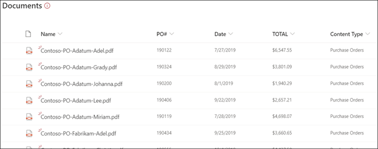

# Información general del procesamiento de formulariosForm processing overview

  

Microsoft SharePoint Syntex usa el procesamiento de formularios del [generador de IA](https://docs.microsoft.com/ai-builder/overview) de Microsoft PowerApps para crear modelos en las bibliotecas de documentos de SharePoint.Microsoft SharePoint Syntex uses Microsoft PowerApps [AI Builder](https://docs.microsoft.com/ai-builder/overview) form processing to create models within SharePoint document libraries.

Puede usar el procesamiento de formularios del generador de IA para crear modelos de IA que usan la tecnología de aprendizaje automático para identificar y extraer pares de valor-clave y datos de tabla de documentos estructurados o semiestructurados, como formularios y facturas.You can use AI Builder form processing to create AI models that use machine learning technology to identify and extract key-value pairs and table data from structured or semi-structured  documents, like forms and invoices.

La mayoría de las organizaciones suelen recibir facturas en grandes cantidades y de una gran variedad de orígenes, como correo, fax, correo electrónico, etc. Procesar estos documentos y añadirlos manualmente a una base de datos puede suponer un tiempo considerable.Organizations often receive invoices in large quantities from a variety of sources, such as mail, fax, email, etc. Processing these documents and manually entering them into a database can take a considerable amount of time. Mediante el uso de IA para extraer el texto, los pares clave o de valor y las tablas de los documentos, el procesamiento de formularios automatiza este proceso.By using AI to extract the text, key/value pairs, and tables from your documents, form processing automates this process. 

> [!NOTE]
> Consulte la guía [Adopción de SharePoint Syntex: Guía de introducción](https://docs.microsoft.com/microsoft-365/contentunderstanding/adoption-getstarted#form-processing-scenario-example) para obtener más información sobre ejemplos de escenarios de procesamiento de formularios.See the [SharePoint Syntex adoption: Get started guide](https://docs.microsoft.com/microsoft-365/contentunderstanding/adoption-getstarted#form-processing-scenario-example) for more information about form processing scenario examples.

Por ejemplo, puede crear un modelo de procesamiento de formularios que identifique todos los documentos de pedido de compra que se hayan cargado en la biblioteca de documentos.For example, you can create a form processing model that identifies all purchase order documents that are uploaded to the document library. A partir de cada pedido de compra, puede extraer y mostrar datos específicos que sean importantes para usted, como el *Número de pedido de compra*, la *Fecha* o el *Coste total*.From each purchase order you can then extract and display specific data that is important to you, such as *PO Number*, *Date*, or *Total Cost*.

   

Use archivos de ejemplo para entrenar el modelo y definir la información que se extrae del formulario.You use example files to train your model and define the information to be extracted from your form. El diseño del documento viene se aprende al entrenar el modelo.The layout of your document is learned by training your model. Solo necesita cinco documentos de formulario para empezar.You only need five form documents to get started. El generador de IA analizará los archivos de ejemplo para pares de clave y valor, y también puede identificar manualmente los que no se hayan detectado.AI Builder will analyze your example files for key-value pairs, and you can also manually identify ones that may not have been detected.  El generador de IA le permite probar la precisión de su modelo en los archivos de ejemplo.AI builder lets you test the accuracy of your model on your example files.

Necesita un mínimo de cinco documentos de formulario para empezar.You need a minimum of five form documents to get started. La creación de IA analiza los archivos de ejemplo para buscar pares de clave-valor e identifica manualmente los que es posible que no se hayan detectado.AI building analyzes your example files for key-value pairs, and then manually identifies the ones that may not have been detected.  El generador de IA le permite probar la precisión de su modelo en los archivos de ejemplo.AI builder lets you test the accuracy of your model on your example files.

Una vez que haya entrenado y publicado el modelo, el modelo crea un [flujo de Power Automate](https://docs.microsoft.com/power-automate/getting-started).After you train and publish your model, your model creates a [Power Automate Flow](https://docs.microsoft.com/power-automate/getting-started). El flujo se ejecuta cuando se carga un archivo en la biblioteca de documentos de SharePoint y se extraen los datos identificados en el modelo.The flow runs when a file is uploaded to the SharePoint document library and will extract data that has been identified in the model. Los datos extraídos se mostrarán en columnas en la vista de la biblioteca de documentos del modelo.The extracted data will display in columns in your model's document library view.

Los administradores de Office 365 deben [habilitar el procesamiento de formularios](https://docs.microsoft.com/microsoft-365/contentunderstanding/set-up-content-understanding#to-set-up-content-understanding) para la biblioteca de documentos de SharePoint para que los usuarios puedan [crear un modelo de procesamiento de formularios](create-a-form-processing-model.md) en ella.An Office 365 admin needs to [enable Form processing](https://docs.microsoft.com/microsoft-365/contentunderstanding/set-up-content-understanding#to-set-up-content-understanding) for the SharePoint document library for users to be able to [create a form processing model](create-a-form-processing-model.md) in it. Puede seleccionar los sitios durante la instalación o después de la misma, en la configuración de administración.You can select the sites during setup, or after setup in your management settings.

## Consulte tambiénSee Also
  
[Documentación de Power AutomatePower Automate documentation](https://docs.microsoft.com/power-automate/)

[Crear un modelo de procesamiento de formulariosCreate a form processing model](create-a-form-processing-model.md)

[Información general sobre la comprensión de documentosDocument understanding overview](document-understanding-overview.md)

[Aprendizaje: mejorar el rendimiento empresarial con el generador de IATraining: Improve business performance with AI Builder](https://docs.microsoft.com/learn/paths/improve-business-performance-ai-builder/?source=learn)
