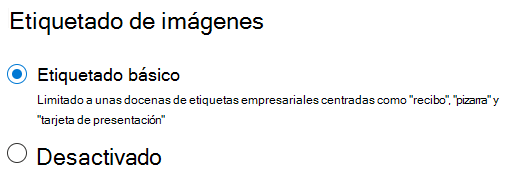

# Etiquetado de imágenes en SharePoint SyntexImage tagging in SharePoint Syntex

Con el etiquetado de imágenes en SharePoint Syntex, los usuarios pueden encontrar las imágenes mediante la búsqueda. Pare ello, pueden buscar en etiquetas de imagen y crear flujos de trabajo basados en etiquetas de imagen.With image tagging in SharePoint Syntex, users can find images through search by searching on image tags, and create workflows based on image tags. De forma predeterminada, el etiquetado básico de imágenes está activado para SharePoint y OneDrive.By default, basic image tagging is turned on for SharePoint and OneDrive. Las imágenes cargadas en cualquiera de las ubicaciones se digitalizan automáticamente y se aplican las etiquetas aplicables, si están disponibles, en una lista de 37 etiquetas básicas.Images uploaded to either location are automatically scanned and applicable tags are applied, if available, from a list of 37 basic tags. Los usuarios pueden encontrar las imágenes mediante búsquedas en las etiquetas de imagen.Users can find images through search by searching on the image tags.

Cuando un usuario carga una imagen, el proceso de etiquetado se ejecutará automáticamente.When a user uploads an image, the  tagging process runs automatically. Si edita una imagen, el proceso de etiquetado se ejecuta nuevamente para actualizar las etiquetas.If an image is edited, the tagging process runs again to update the tags.

Los usuarios con permisos para el archivo de imagen pueden ver y editar las etiquetas en el panel de información de archivo o en la página de resultados de búsqueda.Users with permissions to the image file can see and edit the tags in the file information panel or in the search results page. Cuando un usuario edita las etiquetas de una imagen, el sistema ya no realiza el etiquetado automático de la imagen, incluso si se edita.Once a user edits an image's tags, the system no longer auto-tags that image, even if it's edited.

Si desactiva el etiquetado, las imágenes ya no se etiquetarán automáticamente.If you turn tagging off, images will no longer be automatically tagged. Las etiquetas existentes no se eliminarán.Existing tags won't be removed.

> [!NOTE]
> Las etiquetas generadas por el sistema pueden cambiar con actualizaciones de la imagen o nuestra tecnología de etiquetas.System generated tags may change with updates to the image or our tag technology.

## Configurar el etiquetado de imágenesConfigure image tagging

Después de [configurar SharePoint Syntex](set-up-content-understanding.md), puede configurar el etiquetado de imágenes en el Centro de administración de Microsoft 365.After you [set up SharePoint Syntex](set-up-content-understanding.md), you can configure image tagging in the Microsoft 365 admin center.  

Para activar o desactivar el etiquetado de imágenesTo turn image tagging on or off

1. En el Centro de administración de Microsoft 365, haga clic en **Configuración**.In the Microsoft 365 admin center, click **Setup**.

2. En **Información de la organización**, haga clic en **Automatizar el contenido**.Under **Organizational knowledge**, click **Automate content understanding**.

3. Haga clic en **Administrar**.Click **Manage**.

4. En la pestaña **Etiquetado de imágenes**, haga clic en **Editar**.On the **Image tagging** tab, click **Edit**.

5. Elija permitir **Etiquetado básico** o **Desactivar** etiquetado.Choose to allow **Basic tagging** or turn tagging **Off**.

6. Haga clic en **Guardar**.Click **Save**.

    
