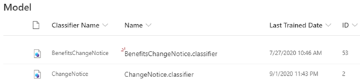

# Obtenga información sobre cómo documentar los modelos a través de un modelo de ejemploLearn about document understanding models through a sample model

Microsoft SharePoint Syntex proporciona un modelo de ejemplo que puede usar para examinar, lo que le ofrece una mejor comprensión sobre cómo crear sus propios modelos.Microsoft SharePoint Syntex provides you a with a sample model you can use to examine, giving you a better understanding of how to create your own models. El modelo de ejemplo también le permite examinar los componentes del modelo, como su clasificador, extractores y explicaciones.The sample model also allows you to examine model components, such as its classifier, extractors, and explanations. También puede usar los archivos de ejemplo para entrenar el modelo.You can also use the sample files to train the model.

## Importación del modelo de ejemploImport the sample model

Para obtener acceso al modelo de ejemplo, primero debe importar el modelo al centro de contenido.To access the sample model, you need to first import the model to your content center.

1. En el centro de contenido, seleccione **modelos** para ver la lista de modelos.From the content center, select **Models** to see your models list. 
2. En la página **modelos** , seleccione **importar modelo de ejemplo**.On the **Models** page, select **Import sample model**. 

      

3. Busque el modelo de ejemplo titulado *BenefitsChangeNotice. Classifier* que aparece en la lista de modelos.Look for the sample model titled *BenefitsChangeNotice.classifier* that appears in your models list. 

      

4. Seleccione *BenefitsChangeNotice. Classifier*para abrir la Página principal del modelo.Select the *BenefitsChangeNotice.classifier*, to open the model's home page. 
  
     

5. En la Página principal del modelo, examine el modelo más detenidamente para ver cómo se ha creado.From the model home page, examine the model more closely to see how it was created.
 
- Vea los archivos de ejemplo que se usan para entrenar el modelo.View the sample files used to train the model.
- Examine los extractores de entidad del modelo más detenidamente para ver cómo el modelo de ejemplo ha configurado las explicaciones.Examine the model's entity extractors more closely to see how the sample model configured the explanations.

     

## Consulte tambiénSee Also
[Crear un clasificadorCreate a classifier](create-a-classifier.md) 
[Crear un extractorCreate an extractor](create-an-extractor.md) 
[Información general sobre el documentoDocument Understanding overview](document-understanding-overview.md) 
[Crear un modelo de procesamiento de formulariosCreate a form processing model](create-a-form-processing-model.md)  
