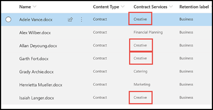

# Aprovechar la taxonomía del almacén de términos al crear un extractor en Microsoft Syntex

**Se aplica a:**  &ensp; &#10003; procesamiento de documentos no estructurados

<!---
 

> [!VIDEO https://www.microsoft.com/videoplayer/embed/RE4GpJJ]  

 
--->

Al crear un extractor en el modelo de procesamiento de documentos no estructurado mediante Microsoft Syntex, puede aprovechar los conjuntos de términos globales del [almacén de términos](/sharepoint/managed-metadata) para mostrar los términos preferidos para los datos que extrae.  

Por ejemplo, el modelo identifica y clasifica todos los documentos de **Contrato** cargados en la biblioteca de documentos.  Además, el modelo también extrae un valor de **Servicio de contrato** de cada contrato, y lo mostrará en una columna de la vista de la biblioteca. Entre los distintos valores de Servicios de contrato en los contratos, hay varios valores anteriores que la empresa ya no usa y a los que se les ha cambiado el nombre. Por ejemplo, todas las referencias a los términos de los servicios de contratos *Diseño*, *Gráficos* o *Topografía* ahora deberían llamarse *Creativo*. Cada vez que el modelo extrae uno de los términos obsoletos de un documento de contrato, quiere que muestre el término actual (*Creativo*) en la vista de biblioteca. En el ejemplo siguiente, al entrenar el modelo, vemos que un documento de ejemplo contiene el término obsoleto *de Diseño*.

    

## Uso de una columna de metadatos administrados en el extractor

Los conjuntos de términos se configuran en el almacén de términos de Servicios de metadatos administrados (MMS) en el <a href="https://go.microsoft.com/fwlink/?linkid=2185219" target="_blank">Centro de administración de SharePoint</a>. En el ejemplo siguiente, el *conjunto de términos* de [Servicios de contrato](/sharepoint/managed-metadata#term-set) se configura para incluir varios términos, incluido *Creativo*.  En los detalles, se muestra que el término tiene tres sinónimos (*Diseño*, *Gráficos* y *Topografía*) y los sinónimos se deberían traducir como *Creativo*. 

    

Puede haber varios motivos por los que quiera usar un sinónimo en el conjunto de términos. Por ejemplo, es posible que haya términos no actualizados, términos con nombre cambiado o variaciones en la denominación entre los departamentos de su organización.

Para que el campo de metadatos administrados esté disponible para que lo seleccione cuando cree el extractor en el modelo, debe [agregarlo como una columna de sitio de metadatos administrados](https://support.microsoft.com/office/8fad9e35-a618-4400-b3c7-46f02785d27f). Después de agregar la columna de sitio, puede seleccionarla cuando cree el extractor para el modelo.

    

Después de aplicar el modelo a la biblioteca de documentos, cuando los documentos se carguen en la biblioteca, en la columna *Servicios creativos* se mostrará el término preferido (*Creativo*) cuando el extractor encuentre cualquiera de los valores de los sinónimos (*Diseño*, *Gráficos* y *Topografía*).

    

> [!NOTE]
> Si el conjunto de términos está abierto, los valores extraídos que no coincidan con un término preferido o un valor de sinónimo se agregarán como un nuevo término a la raíz del conjunto de términos. Estos nuevos términos se pueden mover, combinar o convertir en sinónimos en el almacén de términos donde reside el conjunto de términos.

## Consulte también

[Introducción a los metadatos administrados](/sharepoint/managed-metadata#terms)

[Crear un extractor](create-an-extractor.md)

[Crear una columna de metadatos administrados](https://support.microsoft.com/office/create-a-managed-metadata-column-8fad9e35-a618-4400-b3c7-46f02785d27f?redirectSourcePath=%252farticle%252fc2a06717-8105-4aea-890d-3082853ab7b7&ui=en-US&rs=en-US&ad=US)