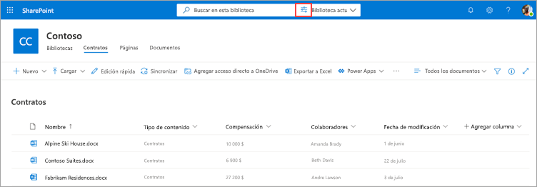
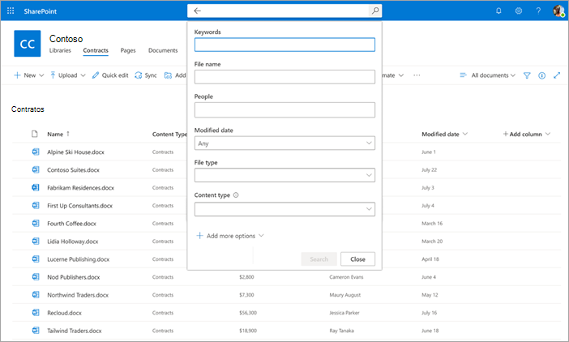
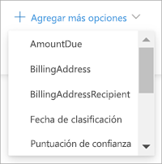

# Buscar metadatos en bibliotecas de documentos en Microsoft SharePoint Syntex

La característica de búsqueda avanzada de metadatos de SharePoint Syntex le permite realizar consultas específicas basadas en metadatos en bibliotecas de documentos de SharePoint. Puede realizar consultas más rápidas y precisas basadas en valores de columna de metadatos específicos, en lugar de simplemente buscar palabras clave.

La búsqueda avanzada de metadatos le permite usar los metadatos asociados a un documento para ayudar a localizar el archivo en una biblioteca de documentos de SharePoint. Esta función es especialmente útil cuando tiene una parte específica de la información que desea buscar, por ejemplo, cuándo se modificó por última vez un documento, una persona específica asociada a un archivo o un tipo de archivo específico.

> [!NOTE]
> Esta característica solo está disponible para los usuarios con licencia para SharePoint Syntex. 

## Para usar la búsqueda avanzada de metadatos

1. En una biblioteca de documentos de SharePoint, en el cuadro **Busca esta biblioteca**, seleccione el icono de búsqueda de metadatos ().

    

2. En el panel de búsqueda de metadatos, escriba el texto o seleccione el parámetro que desea buscar en uno o varios de los campos de búsqueda.

    

   Actualmente hay los siguientes campos de búsqueda de metadatos disponibles. En el futuro se agregarán más campos.

   |Field    |Use este campo para  |
   |---------|---------|
   |Palabras clave |Busque una coincidencia de cadena en los metadatos o en el texto completo de un documento. |
   |Nombre de archivo     |Busque en la columna **Nombre** en la biblioteca.          |
   |Contactos   |Busque una coincidencia en las personas de cualquier columna de la biblioteca.   |
   |Fecha de modificación |Buscar por intervalo de fechas seleccionado en la columna **Modificado** en la biblioteca.         |
   |Tipo de archivo     |Buscar por tipo de archivo seleccionado (por ejemplo, documento de Word o PDF).        |
   |Tipo de contenido  |Buscar por tipo de contenido seleccionado. Esta opción solo aparecerá si hay un tipo de contenido no predeterminado aplicado a la biblioteca. Los tipos de contenido predeterminado son *documento* y *carpeta*.        |

3. También puede buscar columnas de sitio personalizadas que se encuentran en la vista de la biblioteca actual. Esto es especialmente útil si tiene un modelo que se ejecuta en la biblioteca porque los extractores de metadatos rellenan automáticamente la información en las columnas del sitio.  

    Para agregar una columna de sitio personalizada a la búsqueda, seleccione **Agregar más opciones** y, a continuación, seleccione el nombre de la columna del sitio.

    

4. Seleccione **Buscar**. Los documentos que coinciden con su búsqueda de metadatos se muestran en la página de resultados. 
