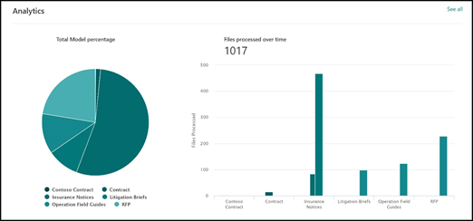

# Análisis de uso del modelo de comprensión mediante documentosDocument understanding model usage analytics

 

> [!VIDEO https://www.microsoft.com/videoplayer/embed/RE4GpJY]  

 

El centro de contenido de Microsoft SharePoint Syntex proporciona análisis de uso de modelos para obtener más información sobre cómo se usan los modelos que se publicaron desde el centro de contenido.Your Microsoft SharePoint Syntex content center provides you model usage analytics to provide more information about how your models that have been published from the content center are being used. Esto incluye un resumen de la siguiente información:This includes a roll-up of the following information:

- ¿Dónde se aplican los modelos?Where your models are being applied
- ¿Cuántos archivos se procesan a lo largo del tiempo?How many files are being processes over time

   

## Porcentaje de modelo totalTotal model percentage

     

El gráfico circular del **Porcentaje de modelo total** muestra cada modelo publicado como un porcentaje del total de los archivos procesados por todos los modelos publicados en el centro de contenido.The **Total model percentage** pie chart displays each published model as a percentage of the total files processed by all published models on the content center.

Asimismo, cada modelo presenta una **Tasa de exhaustividad**. Es decir, el porcentaje de los archivos cargados que el modelo analizó correctamente.Each model also shows the **Completeness Rate**, the percentage of uploaded files that were successfully analyzed by the model. Una tasa de exhaustividad baja puede significar que existen problemas con el modelo o los archivos que se están analizando.A low completeness rate may mean that there are issues with either the model or the files that are being analyzed.

## Archivos procesados a lo largo del tiempoFiles processed over time

     

El gráfico de barras de los **Archivos procesados a lo largo del tiempo** no solo muestra el número de archivos que se procesó a lo largo del tiempo para cada modelo, sino también las bibliotecas de documentos a las que se aplicó el modelo.The **Files processed over time** bar chart shows you not only the number of files processed over time for each model, but also shows you the document libraries to which the model was applied.

     

## Consulte tambiénSee Also
[Crear un clasificadorCreate a classifier](create-a-classifier.md)

[Crear un extractorCreate an extractor](create-an-extractor.md)

[Información general de la comprensión mediante documentos Document Understanding overview](document-understanding-overview.md)

[Crear un modelo de procesamiento de formulariosCreate a form processing model](create-a-form-processing-model.md)  
