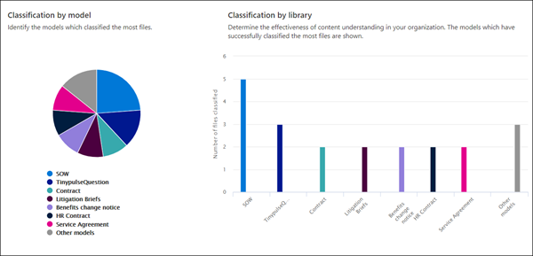

# Documento sobre el análisis de uso de modelosDocument understanding model usage analytics

 

> [!VIDEO https://www.microsoft.com/videoplayer/embed/RE4CSoL]

 

El centro de contenido de Microsoft SharePoint Syntex proporciona análisis de uso de modelos para proporcionar más información sobre cómo se usan los modelos que se publicaron desde el centro de contenido.Your Microsoft SharePoint Syntex content center provides you model usage analytics to provide more information about how your models that have been published from the content center are being used. Esto incluye una distribución de la siguiente información:This includes a roll-up of the following information:

- Dónde se aplican los modelosWhere your models are being applied
- El número de archivos que se procesan con el tiempoHow many files are being processes over time

   

## Porcentaje total del modeloTotal model percentage

     

El gráfico circular **porcentaje de modelo total** muestra cada modelo publicado como un porcentaje del total de archivos procesados por todos los modelos publicados en el centro de contenido.The **Total model percentage** pie chart displays each published model as a percentage of the total files processed by all published models on the content center.

Cada modelo también muestra la **tasa de integridad**, el porcentaje de archivos cargados que el modelo analizó correctamente.Each model also shows the **Completeness Rate**, the percentage of uploaded files that were successfully analyzed by the model. Una tasa de finalización baja puede significar que hay problemas con el modelo o con los archivos que se están analizando.A low completeness rate may mean that there are issues with either the model or the files that are being analyzed.

## Archivos procesados a lo largo del tiempoFiles processed over time

     

El gráfico de **archivos procesados con** barra de tiempo muestra el número de archivos procesados en el tiempo para cada modelo, pero también muestra las bibliotecas de documentos a las que se aplicó el modelo.The **Files processed over time** bar chart shows you not only the number of files processed over time for each model, but also shows you the document libraries to which the model was applied.

     

## Consulte tambiénSee Also
[Crear un clasificadorCreate a classifier](create-a-classifier.md) 
[Crear un extractorCreate an extractor](create-an-extractor.md) 
[Información general sobre el documentoDocument Understanding overview](document-understanding-overview.md) 
[Crear un modelo de procesamiento de formulariosCreate a form processing model](create-a-form-processing-model.md)  
