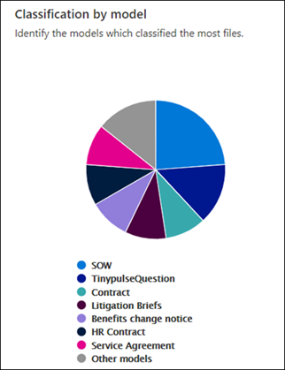

# Documento sobre el análisis de uso de modelos

 

> [!VIDEO https://www.microsoft.com/videoplayer/embed/RE4CSoL]

 

El centro de contenido de Microsoft SharePoint Syntex proporciona análisis de uso de modelos para proporcionar más información sobre cómo se usan los modelos que se publicaron desde el centro de contenido. Esto incluye una distribución de la siguiente información:

- Dónde se aplican los modelos
- El número de archivos que se procesan con el tiempo

   

## Porcentaje total del modelo

     

El gráfico circular **porcentaje de modelo total** muestra cada modelo publicado como un porcentaje del total de archivos procesados por todos los modelos publicados en el centro de contenido.

Cada modelo también muestra la **tasa de integridad**, el porcentaje de archivos cargados que el modelo analizó correctamente. Una tasa de finalización baja puede significar que hay problemas con el modelo o con los archivos que se están analizando.

## Archivos procesados a lo largo del tiempo

     

El gráfico de **archivos procesados con** barra de tiempo muestra el número de archivos procesados en el tiempo para cada modelo, pero también muestra las bibliotecas de documentos a las que se aplicó el modelo.

     

## Consulte también
[Crear un clasificador](create-a-classifier.md) 
[Crear un extractor](create-an-extractor.md) 
[Información general sobre el documento](document-understanding-overview.md) 
[Crear un modelo de procesamiento de formularios](create-a-form-processing-model.md)  
