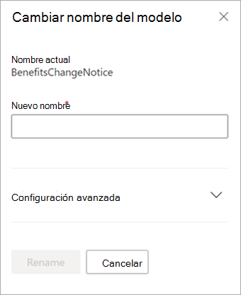

# Cambiar el nombre de un modelo en Microsoft SharePoint SyntexRename a model in Microsoft SharePoint Syntex

En algún momento, puede que quiera cambiar el nombre de un modelo de comprensión mediante documentos.At some point, you might want to rename a document understanding model. Un ejemplo común es cuando crea un borrador inicial de un modelo, para el que posiblemente no haya pensado demasiado en el nombre final (por ejemplo, es posible que lo llamara "AlexInerbaModel1").A common example is when you create an initial draft of a model, you might not have given a lot of thought as to the final name (for example, you might have named it “AlexWilburModel1”). A medida que está más cerca de finalizar el modelo y ponerlo en uso, se da cuenta de que un nombre más apropiado sería "Renovaciones de contrato" y decide cambiarle el nombre.As you come closer to finalizing the model and putting it to use, you realize that a more proper name would be “Contract Renewals,” and you want to rename it.  

Otro ejemplo es cuando su organización toma la decisión de referirse a un proceso o tipo de documento con un nombre diferente.Another example is when your organization makes a decision to refer to a process or document type by a different name. Por ejemplo, después de crear el modelo y estar listo para aplicarlo, su organización podría pensar que todos los elementos con el nombre "Contratos" ahora se denominarán formalmente "Acuerdos".For example, after you create your model and are ready to apply it, your organization might mandate that all “Contracts” will now formally be referred to as “Agreements.” Si es necesario, puede elegir cambiar el nombre del modelo de "Renovaciones de contrato" a "Renovaciones de contrato".If needed, you can choose to rename your model from “Contract Renewals” to “Agreement Renewals.”

> [!IMPORTANT]
> Solo puede cambiar el nombre de un modelo de comprensión mediante documentos si no se ha aplicado a una biblioteca de documentos.You can only rename a document understanding model if it has not been applied to a document library. 

Al cambiar el nombre de un modelo también se cambia el [tipo de contenido](/sharepoint/governance/content-type-and-workflow-planning#content-type-overview) que está asociado al modelo.Renaming a model also renames the [content type](/sharepoint/governance/content-type-and-workflow-planning#content-type-overview) that is associated with the model.

## Cambiar el nombre de un modeloRename a model

Siga estos pasos para cambiar el nombre a un modelo de comprensión mediante documentos.Follow these steps to rename a document understanding model.

1. Desde el centro de contenido, seleccione **Modelos** para ver la lista de modelos.From the content center, select **Models** to see your models list.

2. En la página **Modelos**, seleccione el modelo al que quiere cambiar el nombre.On the **Models** page, select the model you want to rename.

3. Mediante la cinta de opciones o el botón **Mostrar acciones** (junto al nombre del modelo), seleccione **Cambiar nombre**.By using either the ribbon or the **Show actions** button (next to the model name), select **Rename**.  

      

4. En el panel **Cambiar nombre del modelo**:On the **Rename model** panel:

   a.a. En **Nuevo nombre**, escriba el nuevo nombre del modelo cuyo nombre quiere cambiar.Under **New name**, enter the new name of the model that you want to rename. 

      

   b.b. (Opcional) En **Configuración avanzada**, seleccione si quiere asociar un [tipo de contenido](/sharepoint/governance/content-type-and-workflow-planning#content-type-overview) existente.(Optional) Under **Advanced settings**, select whether you want to associate an existing [content type](/sharepoint/governance/content-type-and-workflow-planning#content-type-overview). Si elige **Usar un tipo de contenido existente**, se cambiará el nombre del modelo para que coincida con el tipo de contenido seleccionado.If you choose **Use an existing content type**, the model will be renamed to match the selected content type.

5. Seleccione **Cambiar nombre**.Select **Rename**.

## Consulte tambiénSee Also
[Crear un clasificadorCreate a classifier](create-a-classifier.md)

[Crear un extractorCreate an extractor](create-an-extractor.md)

[Cambiar el nombre de un extractorRename an extractor](rename-an-extractor.md)

[Información general sobre la comprensión de los documentosDocument Understanding overview](document-understanding-overview.md)

[Tipos de explicaciónExplanation types](explanation-types-overview.md)

[Aplicar un modeloApply a model](apply-a-model.md) 
