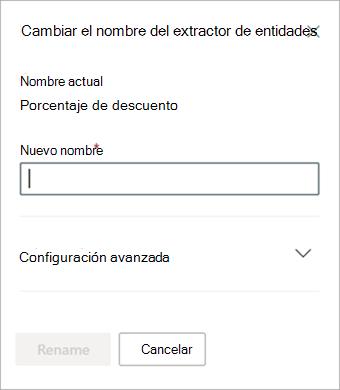

# Cambiar el nombre de un extractor en Microsoft SharePoint Syntex

En algún momento, puede que tenga que cambiar el nombre de un extractor para referirse a un campo de datos extraído por un nombre diferente. Por ejemplo, su organización decide realizar cambios en sus documentos de contrato y se refiere a los "consumidores" como "clientes" en sus documentos. Si estaba extrayendo un campo "Consumidor" en su modelo, puede cambiarle el nombre a "Cliente".

Al sincronizar el modelo actualizado con la biblioteca de documentos de SharePoint, verá una nueva columna de "Cliente" en la vista de biblioteca de documentos. La vista conservará la columna "Consumidor" para la actividad anterior, pero actualizará la nueva columna "Cliente" para todos los documentos nuevos que procese su modelo. 

> [!IMPORTANT]
>  Asegúrese de sincronizar el modelo actualizado con las bibliotecas de documentos donde lo había aplicado anteriormente para que se muestre el nuevo nombre de la columna. 

## Cambiar el nombre de un extractor

Siga estos pasos para cambiar el nombre de un extractor de entidades.

1. Desde el centro de contenido, seleccione **Modelos** para ver la lista de modelos.

2. En la página **Modelos**, en la columna **Nombre**, seleccione el modelo para el que quiere cambiar el nombre de un extractor.

3. En **Extractores de entidades**, seleccione el nombre del extractor al que quiere cambiar el nombre y, después, **Cambiar nombre**. 

      

4. En el panel **Cambiar nombre al extractor de entidades**:

   a. En **Nuevo nombre**, escriba el nuevo nombre del extractor. 

      

   b. (Opcional) En **Configuración avanzada**, seleccione si quiere asociar una columna de sitio existente.

5. Seleccione **Cambiar nombre**.

## Consulte también
[Crear un extractor](create-an-extractor.md)

[Crear un clasificador](create-a-classifier.md)

[Cambiar el nombre de un modelo](rename-a-model.md)

[Tipos de explicación](explanation-types-overview.md)

[Aprovechar la taxonomía del almacén de términos al crear un extractor](leverage-term-store-taxonomy.md)

[Información general sobre la comprensión mediante documentos](document-understanding-overview.md)

[Aplicar un modelo](apply-a-model.md) 
