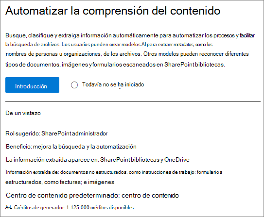
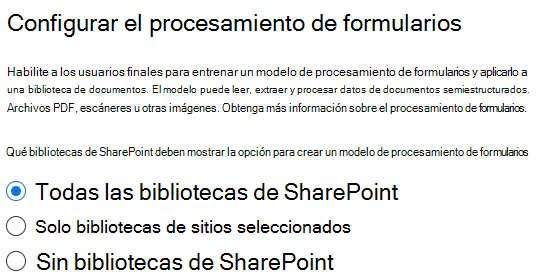
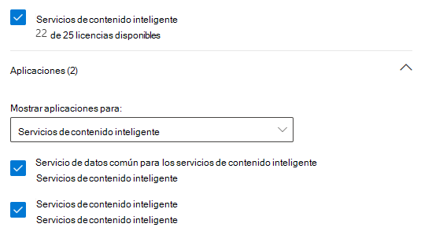

# Configurar SharePoint SyntexSet up SharePoint Syntex

Los administradores pueden usar el Centro de administración de Microsoft 365 para configurar [Microsoft SharePoint Syntex](index.md).Admins can use the Microsoft 365 admin center to set up [Microsoft SharePoint Syntex](index.md). 

Considere lo siguiente antes de empezar:Consider the following before you start:

- Which SharePoint sites will you enable form processing? All of them, some, or select sites?Which SharePoint sites will you enable form processing? All of them, some, or select sites?
- ¿Qué nombre le pondrá a su centro de contenido predeterminado?What will you name of your default content center?

Puede cambiar su configuración después de la configuración inicial en el Centro de administración de Microsoft 365.You can change your settings after initial setup in the Microsoft 365 admin center.

Prior to setup, make sure to plan for the best way to set up and configure content understanding in your environment. For example, you need to make considerations about the following names of:Prior to setup, make sure to plan for the best way to set up and configure content understanding in your environment. For example, you need to make considerations about the following names of:

- Los sitios de SharePoint que desea habilitar para el procesamiento de formularios: todos ellos, algunos, o sitios seleccionadosThe SharePoint sites that you want to enable form processing - all of them, some, or selected sites
- Su centro de contenido y el nombre del administrador principal del sitioYour content center and the name of the primary site admin

## RequirementsRequirements 

> [!NOTE]
> Debe tener permisos de administrador global o de administrador de SharePoint para poder acceder al Centro de administración de Microsoft 365 y configurar la comprensión del contenido.You must have Global admin or SharePoint admin permissions to be able to access the Microsoft 365 admin center and set up content understanding.

Como administrador, también puede realizar cambios en la configuración seleccionada en cualquier momento después de la configuración, y a lo largo de la comprensión del contenido de la configuración de administración en el Centro de administración de Microsoft 365.As an admin, you can also make changes to your selected settings anytime after setup, and throughout the content understanding management settings in the Microsoft 365 Admin Center.

## Para configurar SharePoint SyntexTo set up SharePoint Syntex

1. En el Centro de administración de Microsoft 365, seleccione **Configuración** y luego vea la sección **Archivos y contenido**.In the Microsoft 365 admin center, select **Setup**, and then view the **Files and content** section.

2. En la sección **Archivos y contenido**, seleccione **Automatizar la comprensión del contenido**.In the **Files and content** section, select **Automate content understanding**. 

3. En la página para **Automatizar la comprensión del contenido**, haga clic en **Introducción** para recorrer el proceso de configuración.On the **Automate content understanding** page, click **Get started** to walk through the setup process. 

    > [!div class="mx-imgBorder"]
    >  

4. On the **Configure Form Processing** page, you can choose if you want to let users be able to create form processing models in specific SharePoint document libraries. A menu option will be available in the document library ribbon to **Create a form processing model** in SharePoint document libraries in which it is enabled.On the **Configure Form Processing** page, you can choose if you want to let users be able to create form processing models in specific SharePoint document libraries. A menu option will be available in the document library ribbon to **Create a form processing model** in SharePoint document libraries in which it is enabled.
 
     Para **Qué bibliotecas de SharePoint debe mostrar la opción de crear un modelo de procesamiento de formularios**, puede seleccionar:For **Which SharePoint libraries should show option to create a form processing model**, you can select: 
      - **Todas las bibliotecas de SharePoint** para que estén disponibles para todas las bibliotecas de SharePoint de su organización.**All SharePoint libraries** to make it available to all SharePoint libraries in your organization. 
      - **Sólo las bibliotecas de los sitios seleccionados**, y luego seleccione los sitios en los que desea que esté disponible o cargue una lista de hasta 50 sitios.**Only libraries in selected sites**, and then select the sites in which you want to make it available or upload a list of up to 50 sites. 
      - **No hay bibliotecas de SharePoint** si no quiere que esté disponible para ningún sitio (puede cambiar esto después de la configuración).**No SharePoint libraries** if you don't want to make it available to any sites (you can change this after setup).

   > [!div class="mx-imgBorder"]
   > 

   > [!Note]
   > Quitando un sitio después de incluirlo no afecta a los modelos existentes aplicados a las bibliotecas de ese sitio ni a la capacidad de aplicar modelos de comprensión de documentos a una biblioteca.Removing a site after it has been included does not affect existing models applied to the libraries in that site or the ability to apply document understanding models to a library. 
    
5. En la página **Crear centro de contenido**, puede crear un sitio de centro de contenido de SharePoint en el que sus usuarios puedan crear y administrar modelos de comprensión de documentos.On the **Create Content Center** page, you can create a SharePoint content center site on which your users can create and manage document understanding models.

    1. Para el **Nombre del sitio**, escriba el nombre que quiere darle a su sitio de centro de contenido.For **Site name**, type the name you want to give your content center site.
    
    1. The **Site address** will show the URL for your site, based on what you selected for the site name. If you want to change it, click **Edit**.The **Site address** will show the URL for your site, based on what you selected for the site name. If you want to change it, click **Edit**.

       > [!div class="mx-imgBorder"]
       >  

       Seleccione **Siguiente**.Select **Next**.

6. On the **Review and finish** page, you can look at your selected setting and choose to make changes. If you are satisfied with your selections, select **Activate**.On the **Review and finish** page, you can look at your selected setting and choose to make changes. If you are satisfied with your selections, select **Activate**.

7. En la página de confirmación, haga clic en **Listo**.On the confirmation page, click **Done**.

8. You'll be returned to your **Automate content understanding** page. From this page, you can select **Manage** to make any changes to your configuration settings.You'll be returned to your **Automate content understanding** page. From this page, you can select **Manage** to make any changes to your configuration settings. 

## Asignar licenciasAssign licenses

Una vez que haya configurado SharePoint Syntex, debe asignar licencias para los usuarios que utilizarán cualquier función de SharePoint Syntex.Once you have configured SharePoint Syntex, you must assign licenses for the users who will be using any SharePoint Syntex features.

Para asignar licencias:To assign licenses:

1. En el Centro de administración de Microsoft 365, en **Usuarios**, haga clic en **Usuarios activos**.In the Microsoft 365 admin center, under **Users**, click **Active users**.

2. Seleccione los usuarios a los que desea conceder licencias y haga clic en **Administrar licencias de productos**.Select the users that you want to license, and click **Manage product licenses**.

3. Seleccione **Asignar más**.Select **Assign more**.

4. Select **SharePoint Syntex**. Under **Apps**, make sure **Common Data Service for SharePoint Syntex**, **SharePoint Syntex**, and **SharePoint Syntex - SPO type** are all selected.Select **SharePoint Syntex**. Under **Apps**, make sure **Common Data Service for SharePoint Syntex**, **SharePoint Syntex**, and **SharePoint Syntex - SPO type** are all selected.

    > [!div class="mx-imgBorder"]
    > 

5. Haga clic en **Guardar cambios**.Click **Save changes**.

## Créditos de Generador de IAAI Builder credits

If you have 300 or more SharePoint Syntex licenses for SharePoint Syntex in your organization, you will be allocated one million AI Builder credits. If you have fewer than 300 licenses, you must purchase AI Builder credits in order to use forms processing.If you have 300 or more SharePoint Syntex licenses for SharePoint Syntex in your organization, you will be allocated one million AI Builder credits. If you have fewer than 300 licenses, you must purchase AI Builder credits in order to use forms processing.

Puede estimar la capacidad del Generador de IA que lo hace adecuado para usted con la calculadora del [Generador de IA](https://powerapps.microsoft.com/ai-builder-calculator).You can estimate the AI Builder capacity that’s right for you with the [AI Builder calculator](https://powerapps.microsoft.com/ai-builder-calculator).

Vaya al [Centro de administración de la Power Platform](https://admin.powerplatform.microsoft.com/resources/capacity) para comprobar sus créditos y el uso.Go to the [Power Platform admin center](https://admin.powerplatform.microsoft.com/resources/capacity) to check your credits and usage.

## Consulte tambiénSee also

[Visión general del modelo de procesamiento de formulariosOverview of the form processing model](https://docs.microsoft.com/ai-builder/form-processing-model-overview)

[Paso a paso: cómo crear un modelo de comprensión de documentos (video)Step-by-Step: How to Build a Document Understanding Model (video)](https://www.youtube.com/watch?v=DymSHObD-bg)

