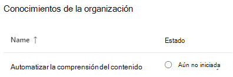

# Configurar SharePoint SyntexSet up SharePoint Syntex

Los administradores pueden usar el centro de administración de Microsoft 365 para instalar y Microsoft SharePoint Syntex.Admins can use the Microsoft 365 admin center to set up and Microsoft SharePoint Syntex. 

Antes de empezar, tenga en cuenta lo siguiente:Consider the following before you start:

- ¿Qué sitios de SharePoint habilitará el procesamiento de formularios?Which SharePoint sites will you enable form processing? Todos ellos, algunos o seleccione sitios?All of them, some, or select sites?
- ¿Cuál será el nombre de su centro de contenido y quién es el administrador del sitio principal?What will you name of your content center, and who is the primary site admin?

Puede cambiar la configuración después de la configuración inicial en el centro de administración de Microsoft 365.You can change your settings after initial setup in the Microsoft 365 admin center.

El contenido de este artículo es para la versión preliminar privada de Project Cortex.The content in this article is for the Project Cortex Private Preview. [Obtenga más información sobre Project Cortex](https://aka.ms/projectcortex).[Find out more about Project Cortex](https://aka.ms/projectcortex).

Antes de la instalación, asegúrese de planear la mejor manera de configurar y configurar la comprensión del contenido en su entorno.Prior to setup, make sure to plan for the best way to set up and configure content understanding in your environment. Por ejemplo, debe tener en cuenta los siguientes nombres de:For example, you need to make considerations about the following names of:

- Los sitios de SharePoint en los que desea habilitar el procesamiento de formularios: todos, algunos o determinados sitiosThe SharePoint sites that you want to enable form processing - all of them, some, or selected sites
- El centro de contenido y el nombre del administrador del sitio principalYour content center and the name of the primary site admin

## RequisitosRequirements 

> [!NOTE]
> Debe tener permisos de administrador global o de administrador de SharePoint para poder obtener acceso al centro de administración de 365 de Microsoft y configurar el conocimiento del contenido.You must have Global admin or SharePoint admin permissions to be able to access the Microsoft 365 admin center and set up content understanding.

Como administrador, también puede realizar cambios en la configuración seleccionada en cualquier momento después de la instalación y en todo el contenido que comprenda la configuración de administración en el centro de administración de Microsoft 365.As an admin, you can also make changes to your selected settings anytime after setup, and throughout the content understanding management settings in the Microsoft 365 Admin Center.

## Para configurar SharePoint SyntexTo set up SharePoint Syntex

1. En el centro de administración de Microsoft 365, seleccione **instalación**y, a continuación, ver la sección de conocimientos de la **organización** .In the Microsoft 365 admin center, select **Setup**, and then view the **Organizational knowledge** section.

2. En la sección conocimientos de la **organización** , seleccione **automatizar el conocimiento del contenido**.In the **Organizational knowledge** section, select **Automate content understanding**. 

     

3. En la página **automatizar Syntex de SharePoint** , **haga clic en introducción para** recorrer el proceso de instalación.On the **Automate SharePoint Syntex** page, click **Get started** to walk through the setup process. 

     

4. En la página activar el etiquetado de imágenes, elija si quiere permitir el [etiquetado de imágenes](image-tagging.md).On the Turn on image tagging page, choose if you want to allow [image tagging](image-tagging.md).

     

5. En la página **configurar procesamiento de formularios** , puede elegir si desea permitir que los usuarios puedan usar el generador de AI para crear modelos de procesamiento de formularios en bibliotecas de documentos de SharePoint específicas.On the **Configure Form Processing** page, you can choose if you want to let users be able to use AI Builder to create form processing models in specific SharePoint document libraries. Una opción de menú estará disponible en la cinta de la biblioteca de documentos para **crear un modelo de procesamiento de formularios** en las bibliotecas de documentos de SharePoint en las que esté habilitado.A menu option will be available in the document library ribbon to **Create a form processing model** in SharePoint document libraries in which it is enabled.
 
     Para **qué bibliotecas de SharePoint se debe mostrar la opción para crear un modelo de procesamiento de formularios**, puede seleccionar:For **Which SharePoint libraries should show option to create a form processing model**, you can select: 
      - **Todas las bibliotecas de SharePoint** para que estén disponibles para todas las bibliotecas de SharePoint de la organización.**All SharePoint libraries** to make it available to all SharePoint libraries in your organization. 
      - **Solo las bibliotecas de los sitios seleccionados**y, a continuación, seleccione los sitios en los que desea que estén disponibles.**Only libraries in selected sites**, and then select the sites in which you want to make it available. 

   

   > [!Note]
   > La habilitación de esta opción en una biblioteca de documentos de SharePoint no afecta a los modelos existentes aplicados a la biblioteca o a la capacidad de aplicar documentos que comprenden los modelos a una biblioteca.Enabling this setting on a SharePoint document library does not affect existing models applied to the library or the ability to apply document understanding models to a library. 
    
6. En la página **crear centro de contenido** , puede crear un sitio del centro de contenido de SharePoint en el que los usuarios puedan crear y administrar los modelos de comprensión de documentos.On the **Create Content Center** page, you can create a SharePoint content center site on which your users can create and manage document understanding models.  
    a.a. En **nombre del sitio**, escriba el nombre que desea asignar al sitio del centro de contenido.For **Site name**, type the name you want to give your content center site. 
    b.b. La **dirección del sitio** mostrará la dirección URL del sitio, en función de lo que haya seleccionado para el nombre del sitio.The **Site address** will show the URL for your site, based on what you selected for the site name. Si desea cambiarla, haga clic en **Editar**.If you want to change it, click **Edit**. 

       

    Seleccione **Siguiente**.Select **Next**.

7. En la página **revisar y finalizar** , puede mirar la configuración seleccionada y elegir realizar cambios.On the **Review and finish** page, you can look at your selected setting and choose to make changes. Si está satisfecho con las selecciones, seleccione **Activar**.If you are satisfied with your selections, select **Activate**.

8. En la página Confirmación, haga clic en **listo**.On the confirmation page, click **Done**.

9. Volverá a la página de **comprensión automatizada del contenido** .You'll be returned to your **Automate content understanding** page. En esta página, puede seleccionar **administrar** para realizar cambios en las opciones de configuración.From this page, you can select **Manage** to make any changes to your configuration settings. 

## Asignar licenciasAssign licenses

Una vez configurados los Syntex de SharePoint, debe asignar licencias para los usuarios que van a usar las características de procesamiento de formularios y de descripción de documentos.Once you have configured SharePoint Syntex, you must assign licenses for the users who will be using form processing and document understanding features.

Para asignar licencias:To assign licenses:

1. En el centro de administración de Microsoft 365, en **usuarios**, haga clic en **usuarios activos**.In the Microsoft 365 admin center, under **Users**, click **Active users**.

2. Seleccione los usuarios a los que quiera conceder una licencia y haga clic en **administrar licencias de producto**.Select the users that you want to license, and click **Manage product licenses**.

3. Seleccione **asignar más**.Select **Assign more**.

4. Seleccione **servicios de contenido inteligente**.Select **Intelligent Content Services**. En **aplicaciones**, asegúrese **de que servicio de datos común para servicios de contenido inteligente** y **servicios de contenido inteligente** están seleccionados.Under **Apps**, make sure **Common Data Service for Intelligent Content Services** and **Intelligent Content Services** are both selected.

    

5. Haga clic en **Guardar cambios**.Click **Save changes**.

## Créditos del generador de AIAI Builder credits

Si tiene 300 o más licencias de Syntex de SharePoint para SharePoint Syntex en su organización, se le asignarán 1 millón los créditos del generador de AI.If you have 300 or more SharePoint Syntex licenses for SharePoint Syntex in your organization, you will be allocated one million AI Builder credits. Si tiene menos de 300 licencias, debe adquirir créditos del generador de AI para poder usar el procesamiento de formularios.If you have fewer than 300 licenses, you must purchase AI Builder credits in order to use forms processing.

Puede calcular la capacidad del generador de AI que más le conviene con la [calculadora del generador de AI](https://powerapps.microsoft.com/ai-builder-calculator).You can estimate the AI Builder capacity that’s right for you with the [AI Builder calculator](https://powerapps.microsoft.com/ai-builder-calculator).

Vaya al centro de administración de la [plataforma de energía](https://admin.powerplatform.microsoft.com/resources/capacity) para comprobar los créditos y el uso.Go to the [Power Platform admin center](https://admin.powerplatform.microsoft.com/resources/capacity) to check your credits and usage.

## Vea tambiénSee also

[Información general sobre el modelo de procesamiento de formulariosOverview of the form processing model](https://docs.microsoft.com/ai-builder/form-processing-model-overview)

[Paso a paso: Cómo crear un documento que comprenda el modelo (vídeo)Step-by-Step: How to Build a Document Understanding Model (video)](https://www.youtube.com/watch?v=DymSHObD-bg)

