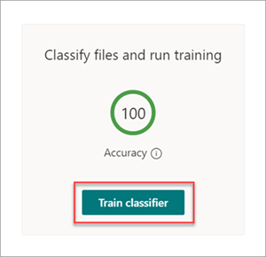

# Paso 1.Step 1. Usar SharePoint Syntex para identificar archivos de contrato y extraer datosUse SharePoint Syntex to identify contract files and extract data

Su organización necesita una forma de identificar y clasificar todos los documentos de contrato de los muchos archivos que recibe.Your organization needs a way to identify and classify all contract documents from the many files you receive. También desea poder ver rápidamente varios elementos clave en cada uno de los archivos de contrato identificados (por ejemplo, *Client*, *Contractor* y *Fee amount*).You also want to be able to quickly view several key elements in each of the contract files identified (for example, *Client*, *Contractor*, and *Fee amount*). Para ello, use [SharePoint Syntex](index.md) para crear un modelo de descripción de documentos y aplicarlo a una biblioteca de documentos.You can do this by using [SharePoint Syntex](index.md) to create a document understanding model and applying it to a document library.

## Información general del procesoOverview of the process

[La comprensión de](document-understanding-overview.md) documentos usa modelos de inteligencia artificial (IA) para automatizar la clasificación de archivos y la extracción de información.[Document understanding](document-understanding-overview.md) uses artificial intelligence (AI) models to automate classification of files and extraction of information. Los modelos de comprensión de documentos también son óptimos para extraer información de documentos no estructurados y semiestructurados donde la información que necesita no está contenida en tablas o formularios, como contratos.Document understanding models are also optimal in extracting information from unstructured and semi-structured documents where the information you need isn't contained in tables or forms, such as contracts. 

En los modelos de comprensión mediante documentos se usa la tecnología de reconocimiento óptico de caracteres (OCR) para digitalizar archivos PDF, imágenes y archivos TIFF, tanto al entrenar un modelo con archivos de ejemplo como al ejecutar el modelo en archivos de una biblioteca de documentos.Document understanding models use Optical Character Recognition (OCR) technology to scan PDFs, images, and TIFF files, both when you train a model with example files and when you run the model against files in a document library.

1. En primer lugar, debe buscar al menos cinco archivos de ejemplo que pueda usar para "entrenar" el modelo para buscar características específicas del tipo de contenido que está intentando identificar (un contrato).First, you need to find at least five example files that you can use to "train" the model to search for characteristics that are specific to the content type you're trying to identify (a contract). 

2. Con SharePoint Syntex, cree un nuevo modelo de comprensión de documentos.Using SharePoint Syntex, create a new document understanding model. Con los archivos de ejemplo, debe [crear un clasificador](create-a-classifier.md).Using your example files, you need to [create a classifier](create-a-classifier.md). Al entrenar al clasificador con los archivos de ejemplo, se le enseña a buscar características específicas de lo que vería en los contratos de su empresa.By training the classifier with your example files, you teach it to search for characteristics that are specific to what you would see in your company's contracts. Por ejemplo, [cree una "explicación"](create-a-classifier.md#create-an-explanation) que busque cadenas específicas que estén en sus contratos, como *Contrato* de servicio, *Términos* de contrato y *Compensación*.For example, [create an "explanation"](create-a-classifier.md#create-an-explanation) that searches for specific strings that are in your contracts, such as *Service Agreement*, *Terms of Agreement*, and *Compensation*. Incluso puede entrenar su explicación para buscar estas cadenas en secciones específicas del documento o ubicadas junto a otras cadenas.You can even train your explanation to look for these strings in specific sections of the document, or located next to other strings. Cuando piense que ha formado al clasificador con la información que necesita, puede probar el modelo en un conjunto de ejemplos de archivos de ejemplo para ver su eficacia.When you think you have trained your classifier with the information it needs, you can test your model on a sample set of example files to see how efficient it is. Después de realizar las pruebas, si es necesario, puede elegir realizar cambios en sus explicaciones para hacerlos más eficientes.After testing, if needed you can choose to make changes to your explanations to make them more efficient. 

3. En el modelo, puede crear [un extractor](create-an-extractor.md) para extraer partes específicas de datos de cada contrato.In your model, you can [create an extractor](create-an-extractor.md) to pull out specific pieces of data from each contract. Por ejemplo, para cada contrato, la información que más le preocupa es quién es el cliente, el nombre del contratista y el costo total.For example, for each contract, the information you're most concerned about is who the client is, the name of the contractor, and the total cost.

4. Después de crear correctamente el modelo, [apliquenlo a](apply-a-model.md)una biblioteca SharePoint documentos .After you successfully create your model, [apply it to a SharePoint document library](apply-a-model.md). Al cargar documentos en la biblioteca de documentos, el modelo de descripción de documentos se ejecutará e identificará y clasificará todos los archivos que coincidan con el tipo de contenido de contratos definido en el modelo.As you upload documents to the document library, your document understanding model will run and will identify and classify all files that match the contracts content type you defined in your model. Todos los archivos clasificados como contratos se mostrarán en una vista de biblioteca personalizada.All files that are classified as contracts will display in a custom library view. Los archivos también mostrarán los valores de cada contrato definido en el extractor.The files will also display the values from each contract that you defined in your extractor.

   

5. Si tiene requisitos de retención o seguridad para sus contratos, también  puede usar el modelo para aplicar una etiqueta de retención o una etiqueta de confidencialidad que impedirá que los contratos se eliminen durante un período de tiempo especificado o para restringir quién puede acceder [a](apply-a-retention-label-to-a-model.md) los contratos.If you have retention or security requirements for your contracts, you can also use your model to apply a [retention label](apply-a-retention-label-to-a-model.md) or a [sensitivity label](apply-a-sensitivity-label-to-a-model.md) that will prevent your contracts from being deleted for a specified period of time or to restrict who can access the contracts.

## Pasos para crear y entrenar el modeloSteps to create and train your model

> [!NOTE]
> Para estos pasos, puede usar los archivos de ejemplo en el repositorio activos de solución de administración [de contratos](https://github.com/pnp/syntex-samples/tree/main/scenario%20assets/Contracts%20Management).For these steps, you can use the example files in the [Contracts Management Solution Assets repository](https://github.com/pnp/syntex-samples/tree/main/scenario%20assets/Contracts%20Management). Los ejemplos de este repositorio contienen tanto los archivos del modelo de descripción de documentos como los archivos usados para entrenar el modelo.The examples in this repository contain both the document understanding model files and the files used to train the model.

### Crear un modelo de contratoCreate a Contract model

El primer paso es crear el modelo de contrato.The first step is to create your Contract model.

1. En el centro de contenido, seleccione **Nuevo** y, a continuación, **Crear un modelo**.From the content center, select **New**, and then **Create a model**.

2. En el **panel Nuevo modelo de comprensión** de documentos, en el campo **Nombre,** escriba el nombre del modelo.On the **New document understanding model** pane, in the **Name** field, type the name of the model. Para esta solución de administración de contratos, puede nombrar el modelo *Contract*.For this contract management solution, you can name the model *Contract*.

4. Seleccione **Crear**.Choose **Create**. Esto crea una página principal para el modelo.This creates a home page for the model. 

    

### Entrenar al modelo para clasificar un tipo de archivoTrain your model to classify a type of file

#### Agregar archivos de ejemplo para el modeloAdd example files for your model

Debe agregar al menos cinco archivos de ejemplo que sean documentos de contrato y un archivo de ejemplo que no sea un documento de contrato (por ejemplo, una instrucción de trabajo).You need to add at least five example files that are contract documents, and one example file that's not a contract document (for example, a statement of work). 

1. En la **página Modelos > Contrato,** en **Acciones** clave Agregar  >  **archivos de** ejemplo, seleccione **Agregar archivos**.On the **Models > Contract** page, under **Key actions** > **Add example files**, select **Add files**.

   

2. En la **página Seleccionar archivos de ejemplo para el** modelo, abra la carpeta Contrato, seleccione los archivos que desea usar y, a continuación, seleccione **Agregar**.On the **Select example files for your model** page, open the Contract folder, select files you want to use, and then select **Add**. Si no tiene archivos de ejemplo, **seleccione Upload** para agregarlos.If you don't have example files there, select **Upload** to add them.

#### Etiquetar los archivos como ejemplos positivos o negativosLabel the files as positive or negative examples

1. En la **página Modelos > contrato,** en **Acciones** clave Clasificar archivos y ejecutar  >  **aprendizaje,** seleccione **Clasificador de aprendizaje**.On the **Models > Contract** page, under **Key actions** > **Classify files and run training**, select **Train classifier**.

   

2. En  la página Clasificador > contrato > Contrato, en el visor de la parte superior del primer archivo de ejemplo, verá texto preguntando si el archivo es un ejemplo del modelo de contrato que creó.On the **Models > Contract > Contract classifier** page, in the viewer on the top of the first example file, you'll see text asking if the file is an example of the Contract model you created. Si es un ejemplo positivo, seleccione **sí**.If it is a positive example, select **Yes**. Si es un ejemplo negativo, seleccione **no**.If it is a negative example, select **No**.

3. En la **lista Ejemplos etiquetados** de la izquierda, seleccione otros archivos que desee usar como ejemplos y rótulos.From the **Labeled examples** list on the left, select other files that you want to use as examples, and label them. 

     

#### Agregar al menos una explicación para entrenar al clasificadorAdd at least one explanation to train the classifier 

1. En la **página > modelo > clasificador** de contrato, seleccione la **pestaña** Entrenar.On the **Models > Contract > Contract classifier** page, select the **Train** tab.

2. En la **sección Archivos entrenados,** verá una lista de los archivos de ejemplo etiquetados anteriormente.In the **Trained files** section, you'll see a list of the example files that you previously labeled. Seleccione uno de los archivos positivos de la lista para mostrarlo en el visor.Select one of the positive files from the list to display it in the viewer.

3. En la **sección Explicaciones,** seleccione **Nuevo** y, a continuación, **En blanco**.In the **Explanations** section, select **New** and then **Blank**.

4. En la **página** Crear una explicación:On the **Create an explanation** page:

    a.a. En el **campo** Nombre, escriba el nombre de la explicación (por ejemplo, &quot;Contrato").In the **Name** field, type the name of the explanation (such as "Agreement").

    b.b. En el **campo Tipo de explicación,** seleccione **Lista de frases**, porque agrega una cadena de texto.In the **Explanation type** field, select **Phrase list**, because you add a text string.

    c.c. En el **cuadro de lista** Frase, escriba la cadena (por ejemplo, "AGREEMENT").In the **Phrase list** box, type the string (such as "AGREEMENT"). Puede seleccionar Distingue **mayúsculas de** minúsculas si la cadena debe distingue mayúsculas de minúsculas.You can select **Case sensitive** if the string needs to be case-sensitive.

    d.d. Seleccione **Guardar y entrenar**.Select **Save and train**.

     

#### Pruebe el modeloTest your model

Puede probar el modelo de contrato en archivos de ejemplo que no haya visto antes.You can test your Contract model on example files it hasn’t seen before. Esto es opcional, pero puede ser un procedimiento recomendado útil.This is optional, but it can be a useful best practice.

1. En la **página Modelos > clasificador de > contrato,** seleccione la **pestaña** Prueba. Esto ejecuta el modelo en los archivos de ejemplo sin etiquetar.On the **Models > Contract > Contract classifier** page, select the **Test** tab. This runs the model on your unlabeled example files.

2. En la **lista Archivos de** prueba, los archivos de ejemplo se muestran y muestran si el modelo predijo que son positivos o negativos.In the **Test Files** list, your example files display and shows if the model predicted them to be positive or negative. Utilice esta información para ayudar a determinar la eficacia de su clasificador en la identificación de sus documentos.Use this information to help determine the effectiveness of your classifier in identifying your documents.

     

3. Cuando haya terminado, seleccione **Salir del aprendizaje**.When done, select **Exit Training**.

### Crear y entrenar un extractorCreate and train an extractor

1. En la **página Modelos > contrato,** en **Acciones** clave Crear y entrenar  >  **extractores,** seleccione Crear **extractor**.On the **Models > Contract** page, under **Key actions** > **Create and train extractors**, select **Create extractor**.

   

2. En el **panel Nuevo extractor de entidades,** en el campo Nuevo **nombre,** escriba el nombre del extractor.On the **New entity extractor** panel, in the **New name** field, type the name of your extractor. Por ejemplo, descóyenlo *Cliente* si desea extraer el nombre del cliente de cada contrato.For example, name it *Client* if you want to extract the name of the client from each contract.

3. Cuando haya terminado, seleccione **Crear**.When you're done, select **Create**.

#### Etiquetar la entidad que desea extraerLabel the entity you want to extract

Al crear el extractor, se abre la página del extractor.When you create the extractor, the extractor page opens. Aquí puede ver una lista de sus archivos de muestra, con el primer archivo de la lista mostrado en el visor.Here you see a list of your sample files, with the first file on the list displayed in the viewer.

 

Para etiquetar la entidad:To label the entity:

1. En el visor, seleccione los datos que desea extraer de los archivos.From the viewer, select the data that you want to extract from the files. Por ejemplo, si desea extraer el *client*, resalte el valor de cliente en el primer archivo (en este ejemplo, *Best For You Organics*) y, a continuación, **seleccione Guardar**.For example, if you want to extract the *Client*, you highlight the client value in the first file (in this example, *Best For You Organics*), and then select **Save**. Verá el valor que se muestra en el archivo en la lista **Ejemplos etiquetados,** en la **columna Etiqueta.**You'll see the value display from the file in the **Labeled examples** list, under the **Label** column.

2. Seleccione **Siguiente archivo** para guardar automáticamente y abra el siguiente archivo de la lista en el visor.Select **Next file** to autosave and open the next file in the list in the viewer. O **bien, seleccione Guardar** y, a continuación, seleccione otro archivo de la **lista Ejemplos etiquetados.**Or select **Save**, and then select another file from the **Labeled examples** list.

3. En el visor, repita los pasos 1 y 2 y repita hasta que guarde la etiqueta en todos los archivos.In the viewer, repeat steps 1 and 2, then repeat until you saved the label in all the files.

Después de etiquetar los archivos, se muestra un banner de notificación que le informa de que debe pasar al aprendizaje.After you've labeled the files, a notification banner displays informing you to move to training. Puede elegir etiquetar más documentos o avanzar a la formación.You can choose to label more documents or advance to training.

#### Agregue una explicaciónAdd an explanation

Puede crear una explicación que proporciona una sugerencia sobre el propio formato de entidad y las variaciones que puede tener en los archivos de ejemplo.You can create an explanation that provides a hint about the entity format itself and variations it might have in the example files. Por ejemplo, un valor de fecha puede estar en muchos formatos diferentes, como:For example, a date value can be in many different formats, such as:

- 14/10/201910/14/2019
- 14 de octubre de 2019October 14, 2019
- Lunes 14 de octubre de 2019Monday, October 14, 2019

Para ayudar a identificar la *fecha de inicio del contrato,* puede crear una explicación de patrón.To help identify the *Contract Start Date*, you can create a pattern explanation.

1. En la **sección Explicaciones,** seleccione **Nuevo** y, a continuación, **En blanco**.In the **Explanations** section, select **New** and then **Blank**.

2. En la **página** Crear una explicación:On the **Create an explanation** page:

    a.a. En el **campo** Nombre, escriba el nombre de la explicación (por *ejemplo, Fecha).*In the **Name** field, type the name of the explanation (such as *Date*).

    b.b. En el **campo Tipo de explicación,** seleccione **Lista patrón**.In the **Explanation type** field, select **Pattern list**.

    c.c. En el **campo** Valor, proporcione la variación de fecha tal como aparecen en los archivos de ejemplo.In the **Value** field, provide the date variation as they appear in the sample files. Por ejemplo, si tiene formatos de fecha que aparecen como 0/00/0000, introduzca cualquier variación que aparezca en sus documentos, como por ejemplo:For example, if you have date formats that appear as 0/00/0000, you enter any variations that appear in your documents, such as:

    - 0/0/00000/0/0000
    - 0/00/00000/00/0000
    - 00/0/000000/0/0000
    - 00/00/000000/00/0000

4. Seleccione **Guardar y entrenar**.Select **Save and train**.

#### Vuelva a probar el modeloTest your model again

Puede probar el modelo de contrato en archivos de ejemplo que no haya visto antes.You can test your Contract model on example files it hasn’t seen before. Esto es opcional, pero puede ser un procedimiento recomendado útil.This is optional, but it can be a useful best practice.

1. En la **página Modelos > clasificador de > contrato,** seleccione la **pestaña** Prueba. Esto ejecuta el modelo en los archivos de ejemplo sin etiquetar.On the **Models > Contract > Contract classifier** page, select the **Test** tab. This runs the model on your unlabeled example files.

2. En la **lista Archivos de** prueba, los archivos de ejemplo se muestran y muestran si el modelo puede extraer la información que necesita.In the **Test files** list, your example files display and shows if the model is able to extract the information you need. Utilice esta información para ayudar a determinar la eficacia de su clasificador en la identificación de sus documentos.Use this information to help determine the effectiveness of your classifier in identifying your documents.

3. Cuando haya terminado, seleccione **Salir del aprendizaje**.When done, select **Exit Training**.

### Aplicar el modelo a una biblioteca de documentosApply your model to a document library

Para aplicar el modelo a una SharePoint de documentos:To apply your model to a SharePoint document library:

1. En la **página Modelos > contrato,** en **Acciones** clave Aplicar modelo  >  **a bibliotecas,** seleccione **Aplicar modelo**.On the **Models > Contract** page, under **Key actions** > **Apply model to libraries**, select **Apply model**.

   

2. En el panel **Agregar contrato,** seleccione el SharePoint que contiene la biblioteca de documentos a la que desea aplicar el modelo.On the **Add Contract** panel, select the SharePoint site that contains the document library that you want to apply the model to. Si el sitio no aparece en la lista, use el cuadro de búsqueda para encontrarlo.If the site does not show in the list, use the search box to find it. Seleccione **Agregar**.Select **Add**.

    > [!NOTE]
    > Debe tener permisos de *Administración de lista* o de *Edición* en la biblioteca de documentos a la que va a aplicar el modelo.You must have *Manage List* permissions or *Edit* rights to the document library you are applying the model to.

3. Después de seleccionar el sitio, seleccione la biblioteca de documentos a la que desea aplicar el modelo.After you select the site, select the document library to which you want to apply the model.

4. Dado que el modelo está asociado a un tipo de contenido, al aplicarlo a la biblioteca, agregará el tipo de contenido y su vista con las etiquetas extraídas que se muestran como columnas.Because the model is associated to a content type, when you apply it to the library it will add the content type and its view with the labels you extracted showing as columns. Esta vista es la vista predeterminada de la biblioteca de forma predeterminada, pero opcionalmente  puede elegir  que no sea la vista predeterminada seleccionando Configuración avanzada y desactivando la casilla Establecer esta nueva vista como predeterminada.This view is the library's default view by default, but you can optionally choose to have it not be the default view by selecting **Advanced settings** and clearing the **Set this new view as default** check box.

5. Seleccione **Agregar** para aplicar el modelo a la biblioteca.Select **Add** to apply the model to the library.

6. En la **página Modelos > contrato,** en la sección **Bibliotecas** con este modelo, verá la dirección URL del sitio SharePoint lista.On the **Models > Contract** page, in the **Libraries with this model** section, you'll see the URL to the SharePoint site listed.

    

7. En **Configuración**  >  **configuración de biblioteca:**Under **Settings** > **Library settings**:

   - Agregue una columna denominada **Status** y seleccione **Choice** como tipo de columna.Add a column named **Status** and select **Choice** as the column type.
   - Aplique los **valores En revisión,** **Aprobado** y **Rechazado.**Apply the **In review**, **Approved**, and **Rejected** values.

Después de aplicar el modelo a la biblioteca de documentos, puede empezar a cargar documentos en el sitio y ver los resultados.After you apply the model to the document library, you can begin uploading documents to the site and see the results.

## Paso siguienteNext step

[Paso 2. Usar Microsoft Teams para crear el canal de administración de contratosStep 2. Use Microsoft Teams to create your contract management channel](solution-manage-contracts-step2.md)