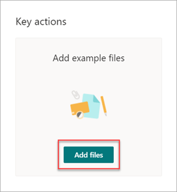
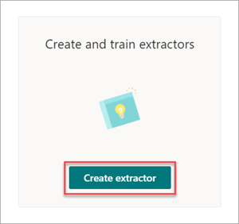

# Paso 1. Uso de SharePoint Syntex para identificar archivos de contrato y extraer datos

Su organización necesita una manera de identificar y clasificar todos los documentos de contrato de los muchos archivos que recibe. También quiere poder ver rápidamente varios elementos clave en cada uno de los archivos de contrato identificados (por ejemplo, *Cliente*, *Contratista* y *Importe de cuota*). Para ello, use [SharePoint Syntex](index.md) para crear un modelo de comprensión de documentos y aplicarlo a una biblioteca de documentos.

## Información general del proceso

[La comprensión de documentos](document-understanding-overview.md) usa modelos de inteligencia artificial (IA) para automatizar la clasificación de los archivos y la extracción de información. Los modelos de comprensión de documentos también son óptimos para extraer información de documentos no estructurados y semiestructurados donde la información que necesita no está contenida en tablas o formularios, como contratos. 

En los modelos de comprensión mediante documentos se usa la tecnología de reconocimiento óptico de caracteres (OCR) para digitalizar archivos PDF, imágenes y archivos TIFF, tanto al entrenar un modelo con archivos de ejemplo como al ejecutar el modelo en archivos de una biblioteca de documentos.

1. En primer lugar, debe encontrar al menos cinco archivos de ejemplo que puede usar para "entrenar" el modelo para buscar características específicas del tipo de contenido que intenta identificar (un contrato). 

2. Con SharePoint Syntex, cree un nuevo modelo de comprensión de documentos. Con los archivos de ejemplo, debe [crear un clasificador](create-a-classifier.md). Al entrenar el clasificador con los archivos de ejemplo, se le enseña a buscar características específicas de lo que vería en los contratos de su empresa. Por ejemplo, [cree una "explicación"](create-a-classifier.md#create-an-explanation) que busque cadenas específicas que estén en sus contratos, como contrato de *servicio*, *términos de contrato* y *compensación*. Incluso puede entrenar la explicación para buscar estas cadenas en secciones específicas del documento o situadas junto a otras cadenas. Cuando crea que ha entrenado el clasificador con la información que necesita, puede probar el modelo en un conjunto de ejemplo de archivos de ejemplo para ver lo eficaz que es. Después de las pruebas, si es necesario, puede optar por realizar cambios en las explicaciones para que sean más eficaces. 

3. En el modelo, puede [crear un extractor](create-an-extractor.md) para extraer fragmentos de datos específicos de cada contrato. Por ejemplo, para cada contrato, la información que más le preocupa es quién es el cliente, el nombre del contratista y el costo total.

4. Después de crear correctamente el modelo, [aplíquelo a una biblioteca de documentos SharePoint](apply-a-model.md). Al cargar documentos en la biblioteca de documentos, el modelo de comprensión de documentos se ejecutará e identificará y clasificará todos los archivos que coincidan con el tipo de contenido de contratos definido en el modelo. Todos los archivos clasificados como contratos se mostrarán en una vista de biblioteca personalizada. Los archivos también mostrarán los valores de cada contrato definido en el extractor.

   

5. Si tiene requisitos de retención o seguridad para los contratos, también puede usar el modelo para aplicar una [etiqueta de retención](apply-a-retention-label-to-a-model.md) o una [etiqueta de confidencialidad](apply-a-sensitivity-label-to-a-model.md) que impida que los contratos se eliminen durante un período de tiempo especificado o para restringir quién puede acceder a los contratos.

## Pasos para crear y entrenar el modelo

> [!NOTE]
> Para estos pasos, puede usar los archivos de ejemplo en el [repositorio Activos de solución de administración de contratos](https://github.com/pnp/syntex-samples/tree/main/scenario%20samples/Contracts%20Management). Los ejemplos de este repositorio contienen tanto los archivos de modelo de comprensión de documentos como los archivos usados para entrenar el modelo.

### Creación de un modelo de contrato

El primer paso es crear el modelo de contrato.

1. En el centro de contenido, seleccione **Nuevo** y, a continuación, **Crear un modelo**.

2. En el panel **Nuevo modelo de comprensión de documentos** , en el campo **Nombre** , escriba el nombre del modelo. Para esta solución de administración de contratos, puede asignar un nombre al modelo *Contrato*.

4. Seleccione **Crear**. Esto crea una página principal para el modelo. 

    

### Entrenamiento del modelo para clasificar un tipo de archivo

#### Adición de archivos de ejemplo para el modelo

Debe agregar al menos cinco archivos de ejemplo que son documentos de contrato y un archivo de ejemplo que no sea un documento de contrato (por ejemplo, una instrucción de trabajo). 

1. En la página **Modelos > contrato**, en **Acciones** **claveAgregar** >  archivos de ejemplo, seleccione **Agregar archivos**.

   

2. En la página **Seleccionar archivos de ejemplo para el modelo** , abra la carpeta Contrato, seleccione los archivos que desea usar y, a continuación, seleccione **Agregar**. Si no tiene archivos de ejemplo, seleccione **Upload** para agregarlos.

#### Etiquetar los archivos como ejemplos positivos o negativos

1. En la página **Modelos > contrato**, en **Acciones** >  **claveClasificar archivos y ejecutar el entrenamiento**, seleccione **Entrenar clasificador**.

   

2. En la página **Clasificador** de contratos > modelos > contrato, en el visor de la parte superior del primer archivo de ejemplo, verá texto que le preguntará si el archivo es un ejemplo del modelo de contrato que creó. Si es un ejemplo positivo, seleccione **sí**. Si es un ejemplo negativo, seleccione **no**.

3. En la lista **Ejemplos etiquetados** de la izquierda, seleccione otros archivos que quiera usar como ejemplos y rótelos. 

     

#### Agregar al menos una explicación para entrenar el clasificador 

1. En la página **Clasificador** de contratos > modelos >, seleccione la pestaña **Entrenar** .

2. En la sección **Archivos entrenados** , verá una lista de los archivos de ejemplo que ha etiquetado anteriormente. Seleccione uno de los archivos positivos de la lista para mostrarlo en el visor.

3. En la sección **Explicaciones** , seleccione **Nuevo** y, a continuación, **En blanco**.

4. En la **página** Crear una explicación:

    a. En el campo **Nombre** , escriba el nombre de la explicación (por ejemplo, "Contrato").

    b. En el campo **Tipo de explicación** , seleccione **Lista de frases**, ya que agrega una cadena de texto.

    c. En el cuadro **de lista Frase** , escriba la cadena (por ejemplo, "AGREEMENT"). Puede seleccionar **Distinguir mayúsculas de minúsculas** si la cadena debe distinguir entre mayúsculas y minúsculas.

    d. Seleccione **Guardar y entrenar**.

     

#### Pruebe el modelo

Puede probar el modelo de contrato en los archivos de ejemplo que no ha visto antes. Esto es opcional, pero puede ser un procedimiento recomendado útil.

1. En la página **Clasificador de contratos > modelos >** contrato, seleccione la pestaña **Prueba** . Esto ejecuta el modelo en los archivos de ejemplo sin etiquetar.

2. En la lista **Archivos de prueba** , los archivos de ejemplo se muestran y muestran si el modelo predijo que fueran positivos o negativos. Utilice esta información para ayudar a determinar la eficacia de su clasificador en la identificación de sus documentos.

     

3. Cuando haya terminado, seleccione **Salir del entrenamiento**.

### Creación y entrenamiento de un extractor

1. En la página **Modelos > contrato**, en **Acciones** >  **claveCrear y entrenar extractores**, seleccione **Crear extractor**.

   

2. En el panel **Nuevo extractor de entidades** , en el campo **Nuevo nombre** , escriba el nombre del extractor. Por ejemplo, asígnele el nombre *Cliente* si desea extraer el nombre del cliente de cada contrato.

3. Cuando haya terminado, seleccione **Crear**.

#### Etiquetar la entidad que desea extraer

Al crear el extractor, se abre la página del extractor. Aquí puede ver una lista de sus archivos de muestra, con el primer archivo de la lista mostrado en el visor.

 

Para etiquetar la entidad:

1. En el visor, seleccione los datos que desea extraer de los archivos. Por ejemplo, si desea extraer el *cliente*, resalte el valor de cliente en el primer archivo (en este ejemplo, *Best For You Organics*) y, a continuación, seleccione **Guardar**. Verá que el valor se muestra en el archivo en la lista **Ejemplos etiquetados** , en la columna **Etiqueta** .

2. Seleccione **Siguiente archivo** para guardar automáticamente y abra el siguiente archivo en la lista en el visor. O bien, seleccione **Guardar** y, a continuación, seleccione otro archivo en la lista **Ejemplos etiquetados** .

3. En el visor, repita los pasos 1 y 2 y repita hasta que haya guardado la etiqueta en todos los archivos.

Después de etiquetar los archivos, aparece un banner de notificación que le informa de que debe pasar al entrenamiento. Puede elegir etiquetar más documentos o avanzar al entrenamiento.

#### Agregue una explicación

Puede crear una explicación que proporcione una sugerencia sobre el propio formato de entidad y las variaciones que podría tener en los archivos de ejemplo. Por ejemplo, un valor de fecha puede estar en muchos formatos diferentes, como:

- 14/10/2019
- 14 de octubre de 2019
- Lunes 14 de octubre de 2019

Para ayudar a identificar la *fecha de inicio del contrato*, puede crear una explicación de patrón.

1. En la sección **Explicaciones** , seleccione **Nuevo** y, a continuación, **En blanco**.

2. En la **página** Crear una explicación:

    a. En el campo **Nombre** , escriba el nombre de la explicación (por ejemplo *, Fecha*).

    b. En el campo **Tipo de explicación** , seleccione **Lista de patrones**.

    c. En el campo **Valor** , proporcione la variación de fecha tal como aparecen en los archivos de ejemplo. Por ejemplo, si tiene formatos de fecha que aparecen como 0/00/0000, introduzca cualquier variación que aparezca en sus documentos, como por ejemplo:

    - 0/0/0000
    - 0/00/0000
    - 00/0/0000
    - 00/00/0000

4. Seleccione **Guardar y entrenar**.

#### Vuelva a probar el modelo

Puede probar el modelo de contrato en los archivos de ejemplo que no ha visto antes. Esto es opcional, pero puede ser un procedimiento recomendado útil.

1. En la página **Clasificador de contratos > modelos >** contrato, seleccione la pestaña **Prueba** . Esto ejecuta el modelo en los archivos de ejemplo sin etiquetar.

2. En la lista **Archivos de prueba** , se muestran los archivos de ejemplo y se muestra si el modelo puede extraer la información que necesita. Utilice esta información para ayudar a determinar la eficacia de su clasificador en la identificación de sus documentos.

3. Cuando haya terminado, seleccione **Salir del entrenamiento**.

### Aplicación del modelo a una biblioteca de documentos

Para aplicar el modelo a una biblioteca de documentos SharePoint:

1. En la página **Modelos > contrato**, en **Acciones** >  **claveAplicar modelo a bibliotecas**, seleccione **Aplicar modelo**.

   

2. En el panel **Agregar contrato**, seleccione el sitio SharePoint que contiene la biblioteca de documentos a la que desea aplicar el modelo. Si el sitio no aparece en la lista, use el cuadro de búsqueda para encontrarlo. Seleccione **Agregar**.

    > [!NOTE]
    > Debe tener permisos de *Administración de lista* o de *Edición* en la biblioteca de documentos a la que va a aplicar el modelo.

3. Después de seleccionar el sitio, seleccione la biblioteca de documentos a la que desea aplicar el modelo.

4. Dado que el modelo está asociado a un tipo de contenido, al aplicarlo a la biblioteca, agregará el tipo de contenido y su vista con las etiquetas extraídas que se muestran como columnas. Esta vista es la vista predeterminada de la biblioteca de forma predeterminada, pero, opcionalmente, puede optar por que no sea la vista predeterminada seleccionando **Configuración avanzada** y desactivando la casilla **Establecer esta nueva vista como predeterminada** .

5. Seleccione **Agregar** para aplicar el modelo a la biblioteca.

6. En la página **Modelos > contrato**, en la sección **Bibliotecas con este modelo**, verá la dirección URL al sitio de SharePoint que aparece.

    

7. En **Configuración** **Configuración de la** >  biblioteca:

   - Agregue una columna denominada **Status (Estado)** y seleccione **Choice (Elección** ) como tipo de columna.
   - Aplique los valores **En revisión**, **Aprobado** y **Rechazado** .

Después de aplicar el modelo a la biblioteca de documentos, puede empezar a cargar documentos en el sitio y ver los resultados.

## Paso siguiente

[Paso 2. Uso de Microsoft Teams para crear el canal de administración de contratos](solution-manage-contracts-step2.md)
