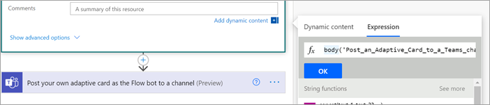

# <a name="step-3-use-power-automate-to-create-your-flow-to-process-your-contracts"></a><span data-ttu-id="11053-104">Paso 3.</span><span class="sxs-lookup"><span data-stu-id="11053-104">Step 3.</span></span> <span data-ttu-id="11053-105">Usar Power Automate para crear el flujo para procesar los contratos</span><span class="sxs-lookup"><span data-stu-id="11053-105">Use Power Automate to create your flow to process your contracts</span></span>

<span data-ttu-id="11053-106">Ha creado el canal de administración de contratos y ha adjuntado su SharePoint de documentos.</span><span class="sxs-lookup"><span data-stu-id="11053-106">You've created your Contract Management channel and have attached your SharePoint document library.</span></span> <span data-ttu-id="11053-107">El siguiente paso es crear un flujo de Power Automate para procesar los contratos que el SharePoint Syntex identifica y clasifica.</span><span class="sxs-lookup"><span data-stu-id="11053-107">The next step is to create a Power Automate flow to process your contracts that your SharePoint Syntex model identifies and classifies.</span></span> <span data-ttu-id="11053-108">Puede realizar este paso creando [un flujo de Power Automate en la SharePoint de documentos](https://support.microsoft.com/office/create-a-flow-for-a-list-or-library-in-sharepoint-or-onedrive-a9c3e03b-0654-46af-a254-20252e580d01).</span><span class="sxs-lookup"><span data-stu-id="11053-108">You can do this step by [creating a Power Automate flow in your SharePoint document library](https://support.microsoft.com/office/create-a-flow-for-a-list-or-library-in-sharepoint-or-onedrive-a9c3e03b-0654-46af-a254-20252e580d01).</span></span>

<span data-ttu-id="11053-109">Para la solución de administración de contratos, desea crear un flujo Power Automate para realizar las siguientes acciones:</span><span class="sxs-lookup"><span data-stu-id="11053-109">For your contracts management solution, you want to create a Power Automate flow to do the following actions:</span></span>

-  <span data-ttu-id="11053-110">Después de clasificar un contrato por su SharePoint Syntex, cambie el estado del contrato a **En revisión**.</span><span class="sxs-lookup"><span data-stu-id="11053-110">After a contract has been classified by your SharePoint Syntex model, change the contract status to **In review**.</span></span>
- <span data-ttu-id="11053-111">A continuación, se revisa el contrato y se aprueba o se rechaza.</span><span class="sxs-lookup"><span data-stu-id="11053-111">The contract is then reviewed and is either approved or rejected.</span></span>
- <span data-ttu-id="11053-112">Para los contratos aprobados, la información del contrato se publica en una pestaña para el procesamiento de pagos.</span><span class="sxs-lookup"><span data-stu-id="11053-112">For approved contracts, the contract information is posted to a tab for payment processing.</span></span>
- <span data-ttu-id="11053-113">En el caso de los contratos rechazados, se notifica al equipo para su análisis posterior.</span><span class="sxs-lookup"><span data-stu-id="11053-113">For rejected contracts, the team is notified for further analysis.</span></span> 

<span data-ttu-id="11053-114">En el siguiente diagrama se muestra el Power Automate de la solución de administración de contratos.</span><span class="sxs-lookup"><span data-stu-id="11053-114">The following diagram shows the Power Automate flow for the contract management solution.</span></span>


## <a name="prepare-your-contract-for-review"></a><span data-ttu-id="11053-116">Preparar el contrato para revisión</span><span class="sxs-lookup"><span data-stu-id="11053-116">Prepare your contract for review</span></span>

<span data-ttu-id="11053-117">Cuando el modelo de comprensión de documentos de SharePoint Syntex identifica y clasifica un contrato, el flujo de Power Automate primero cambiará el estado a **En revisión**.</span><span class="sxs-lookup"><span data-stu-id="11053-117">When a contract is identified and classified by your SharePoint Syntex document understanding model, the Power Automate flow will first change the status to **In review**.</span></span>


<span data-ttu-id="11053-119">Después de desaltear el archivo, cambie el valor de estado a **En revisión**.</span><span class="sxs-lookup"><span data-stu-id="11053-119">After checking out the file, change the status value to **In review**.</span></span>


<span data-ttu-id="11053-121">El siguiente paso es crear una tarjeta adaptable que indique que el contrato está esperando su revisión y publicarla en el canal de administración de contratos.</span><span class="sxs-lookup"><span data-stu-id="11053-121">The next step is to create an adaptive card stating that the contract is waiting for review and posting it to the Contract Management channel.</span></span>


<span data-ttu-id="11053-124">El siguiente código es el JSON usado para este paso en el flujo Power Automate datos.</span><span class="sxs-lookup"><span data-stu-id="11053-124">The following code is the JSON used for this step in the Power Automate flow.</span></span>

```JSON
{
"$schema": "http://adaptivecards.io/schemas/adaptive-card.json",
"type": "AdaptiveCard",
"version": "1.0",
"body": [
    {
    "type": "TextBlock",
    "text": "Contract approval request",
    "size": "large",
    "weight": "bolder",
     "wrap": true
    },
        {
            "type": "Container",
            "items": [
                {
                    "type": "FactSet",
                    "spacing": "Large",
                    "facts": [
                        {
                            "title": "Client",
                            "value": "@{triggerOutputs()?['body/Client']}"
                        },
                        {
                            "title": "Contractor",
                            "value": "@{triggerOutputs()?['body/Contractor']}"
                        },
                        {
                            "title": "Fee amount",
                            "value": "@{triggerOutputs()?['body/FeeAmount']}"
                        },
                        {
                            "title": "Date created",
                            "value": "@{triggerOutputs()?['body/Modified']} "
                        },
                        {
                            "title": "Link",
                            "value": "[@{triggerOutputs()?['body/{FilenameWithExtension}']}](@{triggerOutputs()?['body/{Link}']})"
                        }
                    ]
                }
            ]
         },
    {
    "type": "TextBlock",
    "text": "Comment:"
    },
        {
            "type": "Input.Text",
            "placeholder": "Enter comments",
            "id": "acComments"
        }
],
"actions": [
    {
    "type": "Action.Submit",
    "title": "Approve",
    "data": {
        "x": "Approve"
    }
    },
    {
    "type": "Action.Submit",
    "title": "Reject",
    "data": {
        "x": "Reject"
    }
    }
]
}
```


## <a name="conditional-context"></a><span data-ttu-id="11053-125">Contexto condicional</span><span class="sxs-lookup"><span data-stu-id="11053-125">Conditional context</span></span>

<span data-ttu-id="11053-126">En el flujo, a continuación, debe crear una [](#if-the-contract-is-approved) condición en la que se aprobará o [rechazará el contrato.](#if-the-contract-is-rejected)</span><span class="sxs-lookup"><span data-stu-id="11053-126">In your flow, next you need to create a condition in which your contract will be either  [approved](#if-the-contract-is-approved) or [rejected](#if-the-contract-is-rejected).</span></span>


## <a name="if-the-contract-is-approved"></a><span data-ttu-id="11053-128">Si se aprueba el contrato</span><span class="sxs-lookup"><span data-stu-id="11053-128">If the contract is approved</span></span>

<span data-ttu-id="11053-129">Cuando se ha aprobado un contrato, se producen los siguientes aspectos:</span><span class="sxs-lookup"><span data-stu-id="11053-129">When a contract has been approved, the following things occur:</span></span>

- <span data-ttu-id="11053-130">En la **pestaña Contratos,** el estado de la tarjeta de contrato cambiará a **Aprobado**.</span><span class="sxs-lookup"><span data-stu-id="11053-130">On the **Contracts** tab, the status in the contract card will change to **Approved**.</span></span>

   

- <span data-ttu-id="11053-132">En el flujo, el estado cambia a **Aprobado**.</span><span class="sxs-lookup"><span data-stu-id="11053-132">In your flow, the status is changed to **Approved**.</span></span>

   

- <span data-ttu-id="11053-134">En esta solución, los datos del contrato se agregarán a la pestaña **Para** pago para que se puedan administrar los pagos.</span><span class="sxs-lookup"><span data-stu-id="11053-134">In this solution, the contract data will be added to the **For Payout** tab so that the payouts can be managed.</span></span> <span data-ttu-id="11053-135">Este proceso se puede extender para permitir que el flujo envíe los contratos para su pago mediante una aplicación financiera de terceros (por ejemplo, Dynamics CRM).</span><span class="sxs-lookup"><span data-stu-id="11053-135">This process can be extended to allow the flow to submit the contracts for payment by a third-party financial application (for example, Dynamics CRM).</span></span>

   

- <span data-ttu-id="11053-137">En el flujo, se crea el siguiente elemento para mover los contratos aprobados a la **pestaña Para pago.**</span><span class="sxs-lookup"><span data-stu-id="11053-137">In the flow, you create the following item to move approved contracts to the **For Payout** tab.</span></span>

   

    <span data-ttu-id="11053-139">Para obtener las expresiones de la información necesaria desde la Teams, use los valores que se muestran en la tabla siguiente.</span><span class="sxs-lookup"><span data-stu-id="11053-139">To get the expressions for the information needed from the Teams card, use the values shown in the following table.</span></span>
 
    |<span data-ttu-id="11053-140">Nombre</span><span class="sxs-lookup"><span data-stu-id="11053-140">Name</span></span>     |<span data-ttu-id="11053-141">Expression</span><span class="sxs-lookup"><span data-stu-id="11053-141">Expression</span></span> |
    |---------|-----------|
    | <span data-ttu-id="11053-142">Estado de aprobación</span><span class="sxs-lookup"><span data-stu-id="11053-142">Approval state</span></span>  | <span data-ttu-id="11053-143">body('Post_an_Adaptive_Card_to_a_Teams_channel_and_wait_for_a_response')? ['submitActionId']</span><span class="sxs-lookup"><span data-stu-id="11053-143">body('Post_an_Adaptive_Card_to_a_Teams_channel_and_wait_for_a_response')?['submitActionId']</span></span>         |
    | <span data-ttu-id="11053-144">Aprobado por</span><span class="sxs-lookup"><span data-stu-id="11053-144">Approved by</span></span>     | <span data-ttu-id="11053-145">body('Post_an_Adaptive_Card_to_a_Teams_channel_and_wait_for_a_response')? ['responder'] ['displayName']</span><span class="sxs-lookup"><span data-stu-id="11053-145">body('Post_an_Adaptive_Card_to_a_Teams_channel_and_wait_for_a_response')?['responder']['displayName']</span></span>        |
    | <span data-ttu-id="11053-146">Fecha de aprobación</span><span class="sxs-lookup"><span data-stu-id="11053-146">Approval date</span></span>     | <span data-ttu-id="11053-147">body('Post_an_Adaptive_Card_to_a_Teams_channel_and_wait_for_a_response')? ['responseTime']</span><span class="sxs-lookup"><span data-stu-id="11053-147">body('Post_an_Adaptive_Card_to_a_Teams_channel_and_wait_for_a_response')?['responseTime']</span></span>         |
    | <span data-ttu-id="11053-148">Comentario</span><span class="sxs-lookup"><span data-stu-id="11053-148">Comment</span></span>     | <span data-ttu-id="11053-149">body('Post_an_Adaptive_Card_to_a_Teams_channel_and_wait_for_a_response')? ['data'] ['acComments']</span><span class="sxs-lookup"><span data-stu-id="11053-149">body('Post_an_Adaptive_Card_to_a_Teams_channel_and_wait_for_a_response')?['data']['acComments']</span></span>         |
    
    <span data-ttu-id="11053-150">En el ejemplo siguiente se muestra cómo usar el cuadro de fórmula de Power Automate para escribir una expresión.</span><span class="sxs-lookup"><span data-stu-id="11053-150">The following example shows how to use the formula box in Power Automate to write an expression.</span></span>

       

- <span data-ttu-id="11053-152">Se crea una tarjeta adaptable que indica que el contrato se ha aprobado y se publica en el canal de administración de contratos.</span><span class="sxs-lookup"><span data-stu-id="11053-152">An adaptive card stating that the contract has been approved is created and posted to the Contract Management channel.</span></span>

   

   


   <span data-ttu-id="11053-155">El siguiente código es el JSON usado para este paso en el flujo Power Automate datos.</span><span class="sxs-lookup"><span data-stu-id="11053-155">The following code is the JSON used for this step in the Power Automate flow.</span></span>

```JSON
{ 
    "type": "AdaptiveCard",
    "body": [
        {
            "type": "Container",
            "style": "emphasis",
            "items": [
                {
                    "type": "ColumnSet",
                    "columns": [
                        {
                            "type": "Column",
                            "items": [
                                {
                                    "type": "TextBlock",
                                    "size": "Large",
                                    "weight": "Bolder",
                                    "text": "CONTRACT APPROVED"
                                }
                            ],
                            "width": "stretch"
                        }
                    ]
                }
            ],
            "bleed": true
        },
        {
            "type": "Container",
            "items": [
                {
                    "type": "FactSet",
                    "spacing": "Large",
                    "facts": [
                        {
                            "title": "Client",
                            "value": "@{triggerOutputs()?['body/Client']}"
                        },
                        {
                            "title": "Contractor",
                            "value": "@{triggerOutputs()?['body/Contractor']}"
                        },
                        {
                            "title": "Fee amount",
                            "value": "@{triggerOutputs()?['body/FeeAmount']}"
                        },
                        {
                            "title": "Approval by",
                            "value": "@{body('Post_an_Adaptive_Card_to_a_Teams_channel_and_wait_for_a_response')?['responder']['displayName']}"
                        },
                        {
                            "title": "Approved date",
                            "value": "@{body('Post_an_Adaptive_Card_to_a_Teams_channel_and_wait_for_a_response')?['responseTime']}"
                        },
                        {
                            "title": "Approval comment",
                            "value": "@{body('Post_an_Adaptive_Card_to_a_Teams_channel_and_wait_for_a_response')?['data']['acComments']}"
                        },
                        {
                            "title": " ",
                            "value": " "
                        },
                        {
                            "title": "Status",
                            "value": "Ready for payout"
                        }
                    ]
                }
            ]
        }
    ],
    "$schema": "http://adaptivecards.io/schemas/adaptive-card.json",
    "version": "1.2",
    "fallbackText": "This card requires Adaptive Cards v1.2 support to be rendered properly."
}
```

## <a name="if-the-contract-is-rejected"></a><span data-ttu-id="11053-156">Si se rechaza el contrato</span><span class="sxs-lookup"><span data-stu-id="11053-156">If the contract is rejected</span></span>

<span data-ttu-id="11053-157">Cuando se rechaza un contrato, se producen lo siguiente:</span><span class="sxs-lookup"><span data-stu-id="11053-157">When a contract has been rejected, the following things occur:</span></span>

- <span data-ttu-id="11053-158">En la **pestaña Contratos,** el estado de la tarjeta de contrato cambiará a **Rechazado**.</span><span class="sxs-lookup"><span data-stu-id="11053-158">On the **Contracts** tab, the status in the contract card will change to **Rejected**.</span></span>

   

- <span data-ttu-id="11053-160">En el flujo, se desvía el archivo de contrato, se cambia el estado a **Rechazado** y, a continuación, se vuelve a comprobar el archivo.</span><span class="sxs-lookup"><span data-stu-id="11053-160">In your flow, you check out the contract file, change the status to **Rejected**, and then check the file back in.</span></span>

   

- <span data-ttu-id="11053-162">En el flujo, se crea una tarjeta adaptable que indica que se ha rechazado el contrato.</span><span class="sxs-lookup"><span data-stu-id="11053-162">In your flow, you create an adaptive card stating that the contract has been rejected.</span></span>

   

<span data-ttu-id="11053-164">El siguiente código es el JSON usado para este paso en el flujo Power Automate datos.</span><span class="sxs-lookup"><span data-stu-id="11053-164">The following code is the JSON used for this step in the Power Automate flow.</span></span>

```JSON
{ 
    "type": "AdaptiveCard",
    "body": [
        {
            "type": "Container",
            "style": "attention",
            "items": [
                {
                    "type": "ColumnSet",
                    "columns": [
                        {
                            "type": "Column",
                            "items": [
                                {
                                    "type": "TextBlock",
                                    "size": "Large",
                                    "weight": "Bolder",
                                    "text": "CONTRACT REJECTED"
                                }
                            ],
                            "width": "stretch"
                        }
                    ]
                }
            ],
            "bleed": true
        },
        {
            "type": "Container",
            "items": [
                {
                    "type": "FactSet",
                    "spacing": "Large",
                    "facts": [
                        {
                            "title": "Client",
                            "value": "@{triggerOutputs()?['body/Client']}"
                        },
                        {
                            "title": "Contractor",
                            "value": "@{triggerOutputs()?['body/Contractor']}"
                        },
                        {
                            "title": "Fee amount",
                            "value": "@{triggerOutputs()?['body/FeeAmount']}"
                        },
                        {
                            "title": "Rejected by",
                            "value": "@{body('Post_an_Adaptive_Card_to_a_Teams_channel_and_wait_for_a_response')?['responder']['displayName']}"
                        },
                        {
                            "title": "Rejected date",
                            "value": "@{body('Post_an_Adaptive_Card_to_a_Teams_channel_and_wait_for_a_response')?['responseTime']}"
                        },
                        {
                            "title": "Comment",
                            "value": "@{body('Post_an_Adaptive_Card_to_a_Teams_channel_and_wait_for_a_response')?['data']['acComments']}"
                        },
                        {
                            "title": " ",
                            "value": " "
                        },
                        {
                            "title": "Status",
                            "value": "Needs review"
                        }
                    ]
                }
            ]
        }
    ],
    "$schema": "http://adaptivecards.io/schemas/adaptive-card.json",
    "version": "1.2",
    "fallbackText": "This card requires Adaptive Cards v1.2 support to be rendered properly."
}
```

- <span data-ttu-id="11053-165">La tarjeta se publica en el canal de administración de contratos.</span><span class="sxs-lookup"><span data-stu-id="11053-165">The card is posted in the Contract Management channel.</span></span>

   