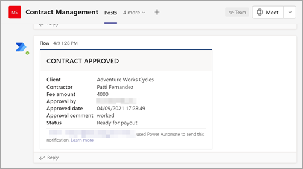

# <a name="step-3-use-power-automate-to-create-your-flow-to-process-your-contracts"></a>Paso 3. Usar Power Automate para crear el flujo para procesar los contratos

Ha creado el canal de administración de contratos y ha adjuntado su SharePoint de documentos. El siguiente paso es crear un flujo de Power Automate para procesar los contratos que el SharePoint Syntex identifica y clasifica. Puede realizar este paso creando [un flujo de Power Automate en la SharePoint de documentos](https://support.microsoft.com/office/create-a-flow-for-a-list-or-library-in-sharepoint-or-onedrive-a9c3e03b-0654-46af-a254-20252e580d01).

Para la solución de administración de contratos, desea crear un flujo Power Automate para realizar las siguientes acciones:

-  Después de clasificar un contrato por su SharePoint Syntex, cambie el estado del contrato a **En revisión**.
- A continuación, se revisa el contrato y se aprueba o se rechaza.
- Para los contratos aprobados, la información del contrato se publica en una pestaña para el procesamiento de pagos.
- En el caso de los contratos rechazados, se notifica al equipo para su análisis posterior. 

En el siguiente diagrama se muestra el Power Automate de la solución de administración de contratos.


## <a name="prepare-your-contract-for-review"></a>Preparar el contrato para revisión

Cuando el modelo de comprensión de documentos de SharePoint Syntex identifica y clasifica un contrato, el flujo de Power Automate primero cambiará el estado a **En revisión**.


Después de desaltear el archivo, cambie el valor de estado a **En revisión**.


El siguiente paso es crear una tarjeta adaptable que indique que el contrato está esperando su revisión y publicarla en el canal de administración de contratos.


El siguiente código es el JSON usado para este paso en el flujo Power Automate datos.

```JSON
{
"$schema": "http://adaptivecards.io/schemas/adaptive-card.json",
"type": "AdaptiveCard",
"version": "1.0",
"body": [
    {
    "type": "TextBlock",
    "text": "Contract approval request",
    "size": "large",
    "weight": "bolder",
     "wrap": true
    },
        {
            "type": "Container",
            "items": [
                {
                    "type": "FactSet",
                    "spacing": "Large",
                    "facts": [
                        {
                            "title": "Client",
                            "value": "@{triggerOutputs()?['body/Client']}"
                        },
                        {
                            "title": "Contractor",
                            "value": "@{triggerOutputs()?['body/Contractor']}"
                        },
                        {
                            "title": "Fee amount",
                            "value": "@{triggerOutputs()?['body/FeeAmount']}"
                        },
                        {
                            "title": "Date created",
                            "value": "@{triggerOutputs()?['body/Modified']} "
                        },
                        {
                            "title": "Link",
                            "value": "[@{triggerOutputs()?['body/{FilenameWithExtension}']}](@{triggerOutputs()?['body/{Link}']})"
                        }
                    ]
                }
            ]
         },
    {
    "type": "TextBlock",
    "text": "Comment:"
    },
        {
            "type": "Input.Text",
            "placeholder": "Enter comments",
            "id": "acComments"
        }
],
"actions": [
    {
    "type": "Action.Submit",
    "title": "Approve",
    "data": {
        "x": "Approve"
    }
    },
    {
    "type": "Action.Submit",
    "title": "Reject",
    "data": {
        "x": "Reject"
    }
    }
]
}
```


## <a name="conditional-context"></a>Contexto condicional

En el flujo, a continuación, debe crear una [](#if-the-contract-is-approved) condición en la que se aprobará o [rechazará el contrato.](#if-the-contract-is-rejected)


## <a name="if-the-contract-is-approved"></a>Si se aprueba el contrato

Cuando se ha aprobado un contrato, se producen los siguientes aspectos:

- En la **pestaña Contratos,** el estado de la tarjeta de contrato cambiará a **Aprobado**.

   

- En el flujo, el estado cambia a **Aprobado**.

   

- En esta solución, los datos del contrato se agregarán a la pestaña **Para** pago para que se puedan administrar los pagos. Este proceso se puede extender para permitir que el flujo envíe los contratos para su pago mediante una aplicación financiera de terceros (por ejemplo, Dynamics CRM).

   

- En el flujo, se crea el siguiente elemento para mover los contratos aprobados a la **pestaña Para pago.**

   

    Para obtener las expresiones de la información necesaria desde la Teams, use los valores que se muestran en la tabla siguiente.
 
    |Nombre     |Expression |
    |---------|-----------|
    | Estado de aprobación  | body('Post_an_Adaptive_Card_to_a_Teams_channel_and_wait_for_a_response')? ['submitActionId']         |
    | Aprobado por     | body('Post_an_Adaptive_Card_to_a_Teams_channel_and_wait_for_a_response')? ['responder'] ['displayName']        |
    | Fecha de aprobación     | body('Post_an_Adaptive_Card_to_a_Teams_channel_and_wait_for_a_response')? ['responseTime']         |
    | Comentario     | body('Post_an_Adaptive_Card_to_a_Teams_channel_and_wait_for_a_response')? ['data'] ['acComments']         |
    
    En el ejemplo siguiente se muestra cómo usar el cuadro de fórmula de Power Automate para escribir una expresión.

       

- Se crea una tarjeta adaptable que indica que el contrato se ha aprobado y se publica en el canal de administración de contratos.

   

   


   El siguiente código es el JSON usado para este paso en el flujo Power Automate datos.

```JSON
{ 
    "type": "AdaptiveCard",
    "body": [
        {
            "type": "Container",
            "style": "emphasis",
            "items": [
                {
                    "type": "ColumnSet",
                    "columns": [
                        {
                            "type": "Column",
                            "items": [
                                {
                                    "type": "TextBlock",
                                    "size": "Large",
                                    "weight": "Bolder",
                                    "text": "CONTRACT APPROVED"
                                }
                            ],
                            "width": "stretch"
                        }
                    ]
                }
            ],
            "bleed": true
        },
        {
            "type": "Container",
            "items": [
                {
                    "type": "FactSet",
                    "spacing": "Large",
                    "facts": [
                        {
                            "title": "Client",
                            "value": "@{triggerOutputs()?['body/Client']}"
                        },
                        {
                            "title": "Contractor",
                            "value": "@{triggerOutputs()?['body/Contractor']}"
                        },
                        {
                            "title": "Fee amount",
                            "value": "@{triggerOutputs()?['body/FeeAmount']}"
                        },
                        {
                            "title": "Approval by",
                            "value": "@{body('Post_an_Adaptive_Card_to_a_Teams_channel_and_wait_for_a_response')?['responder']['displayName']}"
                        },
                        {
                            "title": "Approved date",
                            "value": "@{body('Post_an_Adaptive_Card_to_a_Teams_channel_and_wait_for_a_response')?['responseTime']}"
                        },
                        {
                            "title": "Approval comment",
                            "value": "@{body('Post_an_Adaptive_Card_to_a_Teams_channel_and_wait_for_a_response')?['data']['acComments']}"
                        },
                        {
                            "title": " ",
                            "value": " "
                        },
                        {
                            "title": "Status",
                            "value": "Ready for payout"
                        }
                    ]
                }
            ]
        }
    ],
    "$schema": "http://adaptivecards.io/schemas/adaptive-card.json",
    "version": "1.2",
    "fallbackText": "This card requires Adaptive Cards v1.2 support to be rendered properly."
}
```

## <a name="if-the-contract-is-rejected"></a>Si se rechaza el contrato

Cuando se rechaza un contrato, se producen lo siguiente:

- En la **pestaña Contratos,** el estado de la tarjeta de contrato cambiará a **Rechazado**.

   

- En el flujo, se desvía el archivo de contrato, se cambia el estado a **Rechazado** y, a continuación, se vuelve a comprobar el archivo.

   

- En el flujo, se crea una tarjeta adaptable que indica que se ha rechazado el contrato.

   

El siguiente código es el JSON usado para este paso en el flujo Power Automate datos.

```JSON
{ 
    "type": "AdaptiveCard",
    "body": [
        {
            "type": "Container",
            "style": "attention",
            "items": [
                {
                    "type": "ColumnSet",
                    "columns": [
                        {
                            "type": "Column",
                            "items": [
                                {
                                    "type": "TextBlock",
                                    "size": "Large",
                                    "weight": "Bolder",
                                    "text": "CONTRACT REJECTED"
                                }
                            ],
                            "width": "stretch"
                        }
                    ]
                }
            ],
            "bleed": true
        },
        {
            "type": "Container",
            "items": [
                {
                    "type": "FactSet",
                    "spacing": "Large",
                    "facts": [
                        {
                            "title": "Client",
                            "value": "@{triggerOutputs()?['body/Client']}"
                        },
                        {
                            "title": "Contractor",
                            "value": "@{triggerOutputs()?['body/Contractor']}"
                        },
                        {
                            "title": "Fee amount",
                            "value": "@{triggerOutputs()?['body/FeeAmount']}"
                        },
                        {
                            "title": "Rejected by",
                            "value": "@{body('Post_an_Adaptive_Card_to_a_Teams_channel_and_wait_for_a_response')?['responder']['displayName']}"
                        },
                        {
                            "title": "Rejected date",
                            "value": "@{body('Post_an_Adaptive_Card_to_a_Teams_channel_and_wait_for_a_response')?['responseTime']}"
                        },
                        {
                            "title": "Comment",
                            "value": "@{body('Post_an_Adaptive_Card_to_a_Teams_channel_and_wait_for_a_response')?['data']['acComments']}"
                        },
                        {
                            "title": " ",
                            "value": " "
                        },
                        {
                            "title": "Status",
                            "value": "Needs review"
                        }
                    ]
                }
            ]
        }
    ],
    "$schema": "http://adaptivecards.io/schemas/adaptive-card.json",
    "version": "1.2",
    "fallbackText": "This card requires Adaptive Cards v1.2 support to be rendered properly."
}
```

- La tarjeta se publica en el canal de administración de contratos.

   