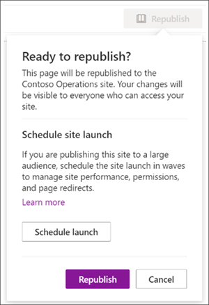

# <a name="launch-your-portal-using-the-sharepoint-portal-launch-scheduler"></a>Inicie el portal con el programador de inicio SharePoint portal de inicio

Un portal es un sitio de comunicación SharePoint en la intranet que es de alto tráfico, un sitio que tiene entre 10.000 y más de 100.000 espectadores en el transcurso de varias semanas. Use el programador de inicio del portal para iniciar el portal para garantizar que los usuarios tengan una experiencia de visualización fluida al obtener acceso a su nuevo SharePoint portal.
<br>
<br>
El programador de inicio del portal está diseñado para ayudarle a seguir un enfoque de implementación por fases mediante el procesamiento por lotes de visores en oleadas y la administración de los redireccionamientos de dirección URL para el nuevo portal. Durante el inicio de cada oleada, puede recopilar comentarios de los usuarios, supervisar el rendimiento del portal y pausar el inicio para resolver problemas antes de continuar con la siguiente oleada. Obtenga más información sobre cómo [planear un inicio de portal en SharePoint](https://docs.microsoft.com/microsoft-365/Enterprise/Planportallaunchroll-out?view=o365-worldwide). 

**Hay dos tipos de redirección:**

- **Bidireccional: inicie** un nuevo portal de SharePoint moderno para reemplazar un portal SharePoint clásico o moderno
- **Redirigir a una página temporal:** inicie un nuevo portal de SharePoint moderno sin un portal SharePoint existente

Los permisos de sitio deben configurarse por separado de las oleadas como parte del inicio. Por ejemplo, si va a liberar un portal para toda la organización, puede establecer permisos en "Todos excepto los usuarios externos", a continuación, separar los usuarios en oleadas mediante grupos de seguridad. Agregar un grupo de seguridad a una ola no proporciona a ese grupo de seguridad acceso al sitio. 


> [!NOTE]
> - Esta característica será accesible desde el panel **de Configuración** en la página principal de los sitios de comunicación de SharePoint para clientes de lanzamiento dirigido a partir de mayo de 2021 y estará disponible para todos los clientes en julio de 2021
> - La versión de PowerShell de esta herramienta está disponible hoy
> - Esta característica solo se puede usar en sitios de comunicación SharePoint modernos
> - Debe tener permisos de propietario del sitio para que el sitio personalice y programe el inicio de un portal
> - Los inicios deben programarse con al menos siete días de antelación y cada oleada puede durar entre uno y siete días.
> - El número de oleadas requeridas se determina automáticamente por el número esperado de usuarios 
> - Antes de programar el inicio de un portal, se debe ejecutar la herramienta Diagnóstico [de](https://aka.ms/perftool) página para SharePoint para comprobar que la página principal del sitio está en buen estado
> - Al final del inicio, todos los usuarios con permisos para el sitio podrán acceder al nuevo sitio
> - Si su organización usa [Viva Connections,](https://docs.microsoft.com/SharePoint/viva-connections)es posible que los usuarios vean el icono de su organización en la barra de aplicaciones de Microsoft Teams, pero cuando el icono esté seleccionado los usuarios no podrán acceder al portal hasta que se haya iniciado la ola.
> - Esta característica no está disponible para Office 365 Alemania, Office 365 operado por 21Vianet (China) o Microsoft 365 planes del Gobierno de Estados Unidos

### <a name="understand-the-differences-between-portal-launch-scheduler-options"></a>Comprender las diferencias entre las opciones del programador de inicio del portal:

Anteriormente, los inicios del portal solo se podían programar a través SharePoint PowerShell. Ahora, tiene dos opciones para ayudarle a programar y administrar el inicio del portal. Obtenga información sobre las diferencias clave entre ambas herramientas:

**SharePoint Versión de PowerShell:**

- Las credenciales de administrador son necesarias para [usar SharePoint PowerShell](https://docs.microsoft.com/powershell/sharepoint/sharepoint-online/introduction-sharepoint-online-management-shell?view=sharepoint-ps) 
- Requisito mínimo de una ola 
- Programar el inicio en función de la zona horaria universal coordinada (UTC)

**Versión del producto:**

- Las credenciales del propietario del sitio son necesarias 
- Requisito mínimo de dos oleadas
- Programar el inicio en función de la zona horaria local del portal, tal como se indica en la configuración regional


## <a name="get-started-using-the-portal-launch-scheduler"></a>Introducción al programador de inicio del portal

1.  Antes de usar la herramienta programador de inicio del [portal,](https://support.microsoft.com/office/share-a-site-958771a8-d041-4eb8-b51c-afea2eae3658) agregue todos los usuarios que necesiten acceso a este sitio a través de permisos de sitio como propietario del sitio, miembro del sitio o visitante. 

2.  A continuación, comience a programar el inicio del portal accediendo al programador de inicio del portal de dos maneras:

    **Opción 1:** las primeras veces que edite y vuelva a publicar los cambios en la página principal (o hasta la versión 3.0 de la página principal) se le pedirá que use la herramienta programador de inicio del portal. Seleccione **Programar inicio** para avanzar con la programación. O **bien, seleccione Volver a publicar** para volver a publicar las ediciones de la página sin programar el inicio.
    
    
    
    **Opción 2:** En cualquier momento, puede navegar a la página principal del sitio  de comunicación de SharePoint, seleccionar **Configuración** y, a continuación, programar el inicio del sitio para programar el inicio del portal.
    
    

3.  A continuación, confirme la puntuación de mantenimiento del portal y realice mejoras en el portal si es necesario mediante la herramienta Diagnóstico [de](https://aka.ms/perftool) página para SharePoint hasta que el portal reciba una **puntuación en** buen estado. A continuación, **seleccione Siguiente**.

    
       
    > [!NOTE] 
    > El nombre y la descripción del sitio no se pueden editar desde  el programador  de inicio del portal y, en su lugar, se pueden cambiar seleccionando Configuración y, a continuación, la información del sitio de la página principal.
 
4.  Seleccione el **número de usuarios esperados** en la lista desplegable. Esta figura representa el número de usuarios que probablemente necesitarán acceso al sitio. El programador de inicio del portal determinará automáticamente el número ideal de oleadas en función de los usuarios esperados como este:
    
    - Menos de 10.000 usuarios: dos oleadas
    - Usuarios de 10 a 30 k: tres oleadas 
    - Usuarios de entre 30 y 100 k: cinco oleadas
    - Más de 100.000 usuarios: cinco oleadas y póngase en contacto con Microsoft a través de los pasos enumerados en la sección Iniciar portal con más de 100.000 usuarios. 

5.  A continuación, determine **el tipo de redireccionamiento** necesario:

    **Opción 1: Enviar** usuarios a una página de SharePoint existente (bidireccional): use esta opción al iniciar un nuevo portal SharePoint moderno para reemplazar un portal de SharePoint existente. Los usuarios en oleadas activas se redirigirán al nuevo sitio independientemente de si navegan al sitio antiguo o nuevo. Los usuarios de una oleada no iniciada que intenten acceder al nuevo sitio se redirigirán de nuevo al sitio antiguo hasta que se inicia la oleada.
    
    > [!NOTE] 
    > Al usar la opción bidireccional, la persona que programa el inicio también debe tener permisos de propietario del sitio en el otro portal SharePoint web.
       
    Opción 2: Enviar usuarios a una página temporal **autogenerada (redirección** temporal de páginas): se debe usar una redirección de página temporal cuando no exista ningún portal de SharePoint página existente. Los usuarios se dirigen a un nuevo portal de SharePoint moderno y si un usuario está en una ola que no se ha iniciado, se redirigirá a una página temporal.
    
    **Opción 3: Enviar** usuarios a una página externa: proporcionar una dirección URL externa a una experiencia de página de aterrizaje temporal hasta que se inicia la ola del usuario.
    
6.  Divide tu audiencia en oleadas. Agregue hasta 20 grupos de seguridad por oleada. Los detalles de la onda se pueden editar hasta el inicio de cada onda. Cada onda puede durar como mínimo un día (24 horas) y como máximo siete días. Esto permite SharePoint y su entorno técnico una oportunidad de aclimatarse y escalar al gran volumen de usuarios del sitio. Al programar un inicio a través de la interfaz de usuario, la zona horaria se basa en la configuración regional del sitio. 

    >[!NOTE] 
    > - El programador de inicio del portal tendrá automáticamente como valor predeterminado un mínimo de 2 oleadas. Sin embargo, la versión de PowerShell de esta herramienta permitirá 1 oleada.
    >  - Microsoft 365 los grupos no son compatibles con esta versión del programador de inicio del portal.

7. Determine quién debe ver el sitio inmediatamente e introduzca su información en el **campo Usuarios exentos de oleadas.** Estos usuarios se excluyen de las oleadas y no se redirigirán antes, durante o después del inicio.

8.  Confirme los detalles de inicio del portal y seleccione **Programar**. Una vez programado el inicio, los cambios en la página principal del portal de SharePoint tendrán que recibir un resultado de diagnóstico correcto antes de que se reanude el inicio del portal.

### <a name="launch-portal-with-over-100k-users"></a>Iniciar portal con más de 100.000 usuarios

Si tiene previsto iniciar un portal con más de 100.000 usuarios, envíe una solicitud de soporte técnico siguiendo los pasos que se indican a continuación. Asegúrese de incluir toda la información solicitada.

Siga estos pasos:
1. Vaya a https://admin.microsoft.com
2. Asegúrese de que está usando la nueva vista previa del centro de administración.
3. En el panel de navegación izquierdo, seleccione **Soporte técnico** y luego **Nueva solicitud de servicio**. 


   Se activará el panel **¿Necesita ayuda?**, en la parte derecha de la pantalla.

4.  En el **área Describir brevemente el** problema, escriba "Iniciar SharePoint portal con 100 mil usuarios".</br>
5. Seleccione **Ponerse en contacto con el soporte técnico**.
6. En **Descripción,** escriba "Iniciar SharePoint Portal con 100k usuarios". 
7. Rellene el resto de la información y seleccione la **opción de contacto**.
8. Una vez que se haya creado el vale, asegúrese de que proporciona al agente de soporte técnico la siguiente información:
- Iniciar dirección URL del portal 
- Número de usuarios esperados
- Tiempo estimado de lanzamiento 

## <a name="make-changes-to-a-scheduled-portal-launch"></a>Realizar cambios en un inicio de portal programado

Los detalles de inicio se pueden editar para cada onda hasta la fecha de inicio de la onda. 

1.  Para editar los detalles de inicio del portal, vaya **a Configuración** y seleccione Programar inicio **de sitio**.
2.  A continuación, **seleccione Editar**.
3.  Cuando haya terminado de realizar las modificaciones, seleccione **Actualizar**.


## <a name="delete-a-scheduled-portal-launch"></a>Eliminar un inicio de portal programado

Los inicios programados con la herramienta programador de inicio del portal se pueden cancelar o eliminar en cualquier momento, incluso si ya se han iniciado algunas oleadas.

1.  Para cancelar el inicio del portal, vaya a **Configuración** **y Programar inicio del sitio**.

2.  A continuación, **seleccione Eliminar** y, a continuación, cuando vea el mensaje siguiente, seleccione **Eliminar de** nuevo.

    


## <a name="use-the-powershell-portal-launch-scheduler"></a>Usar el programador de inicio de PowerShell Portal

La herramienta de programador de inicio de SharePoint Portal de SharePoint estaba disponible originalmente a través de [powershell](https://docs.microsoft.com/powershell/sharepoint/sharepoint-online/introduction-sharepoint-online-management-shell?view=sharepoint-ps) y seguirá siendo compatible con PowerShell para los clientes que prefieran este método. Las mismas notas al principio de este artículo se aplican a ambas versiones del programador de inicio del portal. 

>[!NOTE]
> Necesita permisos de administrador para usar SharePoint PowerShell.
> Los detalles de inicio del portal para los inicios creados en PowerShell aparecerán y se pueden administrar en la nueva herramienta del programador de inicio de portal en SharePoint.


### <a name="app-setup-and-connecting-to-sharepoint-online"></a>Configuración de la aplicación y conexión a SharePoint Online
1. [Descargue el Shell de administración de SharePoint Online más reciente](https://go.microsoft.com/fwlink/p/?LinkId=255251).

    > [!NOTE]
    > Si instaló una versión anterior del Shell de administración de SharePoint Online, vaya a Agregar o quitar programas y desinstale "Shell de administración de SharePoint Online".<br>En la página Centro de descarga, seleccione su idioma y haga clic en el botón Descargar. Se le pedirá que elija entre descargar un archivo .msi x64 y x86. Descargue el archivo x64 si está ejecutando la versión de 64 bits de Windows o el archivo x86 si está ejecutando la versión de 32 bits. Si no lo sabe, consulte [¿Qué versión del sistema operativo Windows estoy ejecutando?](https://support.microsoft.com/help/13443/windows-which-operating-system) Después de descargar el archivo, ejecútelo y siga los pasos del Asistente de configuración.

2. Conéctese a SharePoint como un [administrador global o como un administrador de SharePoint](/sharepoint/sharepoint-admin-role) en Microsoft 365. Para saber cómo hacerlo, consulte [Introducción al Shell de administración de SharePoint Online](/powershell/sharepoint/sharepoint-online/connect-sharepoint-online).


### <a name="view-any-existing-portal-launch-setups"></a>Ver las configuraciones de inicio de portal existentes

Para ver si hay configuraciones de inicio de portal existentes:

   ```PowerShell
   Get-SPOPortalLaunchWaves -LaunchSiteUrl <object> -DisplayFormat <object>
   ```

### <a name="schedule-a-portal-launch-on-the-site"></a>Programar un inicio de portal en el sitio

El número de oleadas necesarias depende del tamaño de inicio esperado. 
- Menos de 10.000 usuarios: una ola
- Usuarios de 10 a 30 k: tres oleadas 
- Usuarios de entre 30 y 100 k: cinco oleadas
- Más de 100.000 usuarios: cinco oleadas y póngase en contacto con el equipo de su cuenta microsoft

#### <a name="steps-for-bidirectional-redirection"></a>Pasos para la redirección bidireccional

La redirección bidireccional implica el lanzamiento de un nuevo portal SharePoint Online para reemplazar un portal SharePoint clásico o moderno. Los usuarios en oleadas activas se redirigirán al nuevo sitio independientemente de si navegan al sitio antiguo o nuevo. Los usuarios de una oleada no iniciada que intenten acceder al nuevo sitio se redirigirán de nuevo al sitio antiguo hasta que se inicia la oleada. 

Solo se admite el redireccionamiento entre la página principal predeterminada del sitio antiguo y la página principal predeterminada del nuevo sitio. Si tiene administradores o propietarios que necesitan acceso a los sitios antiguos y nuevos sin ser redirigidos, asegúrese de que aparecen con el `WaveOverrideUsers` parámetro.

Para migrar usuarios de un sitio SharePoint a un nuevo SharePoint de forma por fases:

1. Ejecute el siguiente comando para designar las oleadas de inicio del portal.
   
   ```PowerShell
   New-SPOPortalLaunchWaves -LaunchSiteUrl <object> -RedirectionType Bidirectional -RedirectUrl <string> -ExpectedNumberOfUsers <object> -WaveOverrideUsers <object> -Waves <object>
   ```

   Ejemplo:

   ```PowerShell
   New-SPOPortalLaunchWaves -LaunchSiteUrl "https://contoso.sharepoint.com/teams/newsite" -RedirectionType Bidirectional -RedirectUrl "https://contoso.sharepoint.com/teams/oldsite" -ExpectedNumberOfUsers 10kTo30kUsers -WaveOverrideUsers "admin@contoso.com" -Waves ' 
   [{Name:"Wave 1", Groups:["Viewers 1"], LaunchDateUtc:"2020/10/14"}, 
   {Name:"Wave 2", Groups:["Viewers 2"], LaunchDateUtc:"2020/10/15"}, 
   {Name:"Wave 3", Groups:["Viewers 3"], LaunchDateUtc:"2020/10/16"}]'
   ```

2. Validación completa. El redireccionamiento puede tardar entre 5 y 10 minutos en completar su configuración en todo el servicio. 

#### <a name="steps-for-redirection-to-temporary-page"></a>Pasos para la redirección a la página temporal

El redireccionamiento temporal de páginas debe usarse cuando no exista SharePoint portal existente. Los usuarios se dirigen a un nuevo portal SharePoint Online de forma por fases. Si un usuario está en una oleada que no se ha iniciado, se le redirigirá a una página temporal (cualquier dirección URL). 

1. Ejecute el siguiente comando para designar las oleadas de inicio del portal.
   
   ```PowerShell
   New-SPOPortalLaunchWaves -LaunchSiteUrl <object> -RedirectionType ToTemporaryPage -RedirectUrl <string> -ExpectedNumberOfUsers <object> -WaveOverrideUsers <object> -Waves <object>
   ```

   Ejemplo:

   ```PowerShell
   New-SPOPortalLaunchWaves -LaunchSiteUrl "https://contoso.sharepoint.com/teams/newsite" -RedirectionType ToTemporaryPage -RedirectUrl "https://portal.contoso.com/UnderConstruction.aspx" -ExpectedNumberOfUsers 10kTo30kUsers -WaveOverrideUsers "admin@contoso.com" -Waves ' 
   [{Name:"Wave 1", Groups:["Viewers 1"], LaunchDateUtc:"2020/10/14"}, 
   {Name:"Wave 2", Groups:["Viewers 2"], LaunchDateUtc:"2020/10/15"}, 
   {Name:"Wave 3", Groups:["Viewers 3"], LaunchDateUtc:"2020/10/16"}]'
   ```

2. Validación completa. El redireccionamiento puede tardar entre 5 y 10 minutos en completar su configuración en todo el servicio. 

### <a name="pause-or-restart-a-portal-launch-on-the-site"></a>Pausar o reiniciar el inicio de un portal en el sitio

1. Para pausar el inicio de un portal en curso y evitar temporalmente que se produzcan próximas progresión de onda, ejecute el siguiente comando:

   ```PowerShell
   Set-SPOPortalLaunchWaves -Status Pause - LaunchSiteUrl <object>
   ```

2. Valide que todos los usuarios se redirigen al sitio antiguo. 

3. Para reiniciar un inicio de portal que se ha pausado, ejecute el siguiente comando:

   ```PowerShell
   Set-SPOPortalLaunchWaves -Status Restart - LaunchSiteUrl <object>
   ```
   
4. Valide que el redireccionamiento ya está restaurado. 

### <a name="delete-a-portal-launch-on-the-site"></a>Eliminar un inicio de portal en el sitio

1. Ejecute el siguiente comando para eliminar un inicio de portal programado o en curso para un sitio.

   ```PowerShell
   Remove-SPOPortalLaunchWaves -LaunchSiteUrl <object>
   ```

2. Valide que no se produce ninguna redirección para todos los usuarios.

## <a name="learn-more"></a>Más información

[Planeación del plan de lanzamiento del portal en SharePoint Online](./planportallaunchroll-out.md)

[Planear el sitio de comunicación](https://support.microsoft.com/office/plan-your-sharepoint-communication-site-35d9adfe-d5cc-462f-a63a-bae7f2529182)
