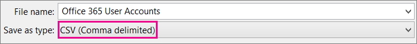
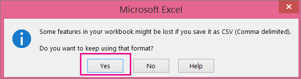

# <a name="add-several-users-at-the-same-time-to-microsoft-365---admin-help"></a>Agregar varios usuarios al mismo tiempo a Microsoft 365: Ayuda para administradores

Cada persona de su equipo necesita una cuenta de usuario para poder iniciar sesión y acceder a los servicios de Microsoft 365, como el correo electrónico y Office. Si son muchas personas, puede agregar sus cuentas de una vez desde una hoja de cálculo de Excel u otro archivo guardado en formato CSV. [¿No está seguro de qué es el formato CSV?](add-several-users-at-the-same-time.md#not-sure-what-csv-format-is)
  
> [!NOTE]
> Si no usa el nuevo Centro de administración de Microsoft 365, puede activarlo seleccionando **Probar el nuevo centro de administración** ubicado en la parte superior de la página de inicio.

## <a name="add-multiple-users-in-the-microsoft-365-admin-center"></a>Agregar varios usuarios en el Centro de administración de Microsoft 365

1. Inicie sesión en Microsoft 365 con su cuenta profesional o educativa.

2. En el centro de administración, elija **Usuarios** \> **activos.**

3. Seleccione **Agregar varios usuarios.**

4. En el panel **Importar varios usuarios**, tiene la opción de descargar un archivo CSV de ejemplo con datos de ejemplo o sin rellenar.

    La hoja de cálculo debe incluir exactamente los **mismos encabezados** de columna que el de ejemplo (Nombre de usuario, Nombre, entre otros). Si usa la plantilla, ábrala en una herramienta de edición de texto, como el Bloc de notas, y considere la posibilidad de dejar solos todos los datos de la fila 1 y solo escribir datos en las filas 2 y adicionales.

    La hoja de cálculo también debe incluir valores para el nombre de usuario (por ejemplo, alberto@contoso.com) y un nombre para mostrar (por ejemplo, Alberto Hermosilla) para cada usuario.

  ```
  User Name,First Name,Last Name,Display Name,Job Title,Department,Office Number,Office Phone,Mobile Phone,Fax,Address,City,State or Province,ZIP or Postal Code,Country or Region
  chris@contoso.com,Chris,Green,Chris Green,IT Manager,Information Technology,123451,123-555-1211,123-555-6641,123-555-6700,1 Microsoft way,Redmond,Wa,98052,United States
  ben@contoso.com,Ben,Andrews,Ben Andrews,IT Manager,Information Technology,123452,123-555-1212,123-555-6642,123-555-6700,1 Microsoft way,Redmond,Wa,98052,United States
  david@contoso.com,David,Longmuir,David Longmuir,IT Manager,Information Technology,123453,123-555-1213,123-555-6643,123-555-6700,1 Microsoft way,Redmond,Wa,98052,United States
  cynthia@contoso.com,Cynthia,Carey,Cynthia Carey,IT Manager,Information Technology,123454,123-555-1214,123-555-6644,123-555-6700,1 Microsoft way,Redmond,Wa,98052,United States
  melissa@contoso.com,Melissa,MacBeth,Melissa MacBeth,IT Manager,Information Technology,123455,123-555-1215,123-555-6645,123-555-6700,1 Microsoft way,Redmond,Wa,98052,United States
  
  ```

5. Escriba una ruta de acceso al archivo en el cuadro o elija **Examinar** para ir a la ubicación del archivo CSV y, a continuación, elija **Comprobar**.
  
    Si hay problemas con el archivo, se mostrarán en el panel. También puede descargar un archivo de registro.

6. En el cuadro de diálogo **Establecer opciones de usuario**, puede establecer el estado de inicio de sesión y elegir qué licencia de producto se asignará a cada uno de los usuarios.

7. En el cuadro de diálogo **Ver el resultado**, puede elegir si desea enviar los resultados a su usuario o a otros usuarios (las contraseñas se mostrarán en texto sin formato). Además, puede ver cuántos usuarios se crearon y, si lo necesita, comprar más licencias para asignárselas a algunos de los nuevos usuarios.

## <a name="next-steps"></a>Pasos siguientes

- Ahora que estas personas tienen cuentas, necesitan descargar e instalar o reinstalar [Microsoft 365 u Office 2016 en un equipo PC o Mac.](https://support.office.com/article/4414eaaf-0478-48be-9c42-23adc4716658) Cada persona de su equipo puede instalar Microsoft 365 en hasta 5 equipos PC o Mac.

- Cada persona también puede configurar aplicaciones de [Office](https://support.office.com/article/7dabb6cb-0046-40b6-81fe-767e0b1f014f) y correo electrónico en un dispositivo móvil en hasta 5 tabletas y 5 teléfonos, como iPhone, iPad y teléfonos y tabletas Android. De esta forma, puede editar archivos de Office desde cualquier lugar.

    Consulte [Configurar Microsoft 365 para empresas](https://support.office.com/article/6a3a29a0-e616-4713-99d1-15eda62d04fa) para obtener una lista completa de los pasos de configuración.

## <a name="more-information-about-how-to-add-users-to-microsoft-365"></a>Más información sobre cómo agregar usuarios a Microsoft 365

### <a name="not-sure-what-csv-format-is"></a>¿No tiene claro qué es un archivo CSV?

Un archivo CSV es un archivo con valores separados por comas. Puede crear o editar un archivo como este con cualquier editor de textos o programa de hojas de cálculo, como Excel.
  
Puede descargar [esta hoja de cálculo de muestra](https://www.microsoft.com/download/details.aspx?id=45485) como punto de partida. Recuerde que Microsoft 365 requiere encabezados de columna en la primera fila, así que no los reemplace por otra cosa. 
  
Guarde el archivo con un nuevo nombre y especifique el formato CSV.
  

  
Cuando guarde el archivo, probablemente recibirá un mensaje que le informará de que se perderán algunas características del libro si guarda el archivo en formato CSV. No pasa nada. Haga clic en **Sí** para continuar.
  

  
### <a name="tips-for-formatting-your-spreadsheet"></a>Consejos para aplicar formato a la hoja de cálculo

- **¿Debo mantener los mismos encabezados de columna que en la hoja de cálculo de muestra?** Sí. La hoja de cálculo de muestra contiene los encabezados de columna en la primera fila. Estos encabezados son necesarios. Para cada usuario que quiera agregar a Microsoft 365, cree una fila bajo el encabezado. Si agrega, cambia o elimina cualquiera de los encabezados de columna, Es posible que Microsoft 365 no pueda crear usuarios a partir de la información del archivo.

- **¿Qué ocurre si no tengo toda la información requerida para cada usuario?** El nombre de usuario y el nombre para mostrar son obligatorios, y no puede agregar un nuevo usuario sin esta información. Si le falta parte de la información, como el fax, puede usar un espacio más una coma para indicar que el campo debe dejarse en blanco.

- **¿Qué tamaño puede tener la hoja de cálculo?** La hoja de cálculo debe tener al menos dos filas. One is for the column headings (the user data column label) and one for the user. You cannot have more than 251 rows. If you need to import more than 250 users, you can create more than one spreadsheet.

- **¿Qué idiomas puedo usar?** Al crear la hoja de cálculo, puede escribir etiquetas de columna de datos de usuario en cualquier idioma o carácter, pero no debe cambiar el orden de las etiquetas, como se muestra en el ejemplo. You can then make entries into the fields, using any language or characters, and save your file in a Unicode or UTF-8 format.

- **¿Qué ocurre si voy a agregar usuarios de diferentes países o regiones?** Cree una hoja de cálculo para cada área. Deberá seguir los pases del asistente para agregar usuarios en bloque para cada una de las hojas de cálculo y dar una única ubicación a todos los usuarios incluidos en el archivo con los que trabaja.

- **¿Existe algún límite de caracteres que se pueden usar?** En la siguiente tabla se muestran las etiquetas de las columnas de datos de usuario y la longitud máxima (en caracteres) para cada una en la hoja de cálculo de muestra.

|**Etiquetas columnas datos usuarios**|**Longitud máxima (en caracteres)**|
|:-----|:-----|
|Nombre de usuario (obligatorio)  <br/> |79, incluido el signo (@), con el formato name@domain. \<extension\> . El alias del usuario no puede superar los 50 caracteres y el nombre de dominio no puede superar los 48 caracteres.  <br/> |
|Nombre  <br/> |64  <br/> |
|Apellido  <br/> |64  <br/> |
|Nombre para mostrar (obligatorio)  <br/> |256  <br/> |
|Puesto  <br/> |64  <br/> |
|Departamento  <br/> |64  <br/> |
|Número del trabajo  <br/> |128  <br/> |
|Teléfono del trabajo  <br/> |64  <br/> |
|Teléfono móvil  <br/> |64  <br/> |
|Fax  <br/> |64  <br/> |
|Dirección  <br/> |1023  <br/> |
|Ciudad  <br/> |128  <br/> |
|Estado o provincia  <br/> |128  <br/> |
|Código postal  <br/> |40  <br/> |
|País o región  <br/> |128  <br/> |

### <a name="still-having-problems-when-adding-users-to-microsoft-365"></a>¿Sigue teniendo problemas al agregar usuarios a Microsoft 365?

- **Asegúrese una vez más de que el archivo tenga un formato correcto.** Compruebe que los encabezados de las columnas coincidan con los encabezados del archivo de muestra. Asegúrese de haber respetado los límites de longitud y de que los campos estén separados por comas.

- **Si no ve los nuevos usuarios de Microsoft 365 inmediatamente, espere unos minutos.** Los cambios pueden tardar un poco en realizarse en todos los servicios de Microsoft 365. 

## <a name="related-articles"></a>Artículos relacionados

[Agregar usuarios individualmente o de forma masiva a Microsoft 365](https://docs.microsoft.com/office365/admin/add-users/add-users)
