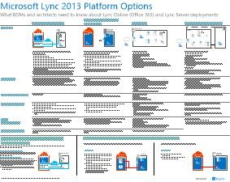

# Modelos de arquitectura para SharePoint, Exchange, Skype Empresarial y LyncArchitectural models for SharePoint, Exchange, Skype for Business, and Lync

En los pósteres de TI de este artículo se describen los modelos de arquitectura y las opciones de implementación para SharePoint, Exchange, Skype Empresarial y Lync.The IT posters in this article describe the architectural models and deployment options for SharePoint, Exchange, Skype for Business, and Lync. También proporcionan información de diseño para implementar SharePoint en Microsoft Azure.They also provide design information for deploying SharePoint in Microsoft Azure.
  
Con Microsoft 365, puede proporcionar servicios familiares de colaboración y comunicación a través de la nube.By using Microsoft 365, you can provide familiar collaboration and communication services through the cloud. Con algunas excepciones, la experiencia del usuario sigue siendo la misma tanto si mantiene una implementación local como si usa Microsoft 365.With a few exceptions, the user experience remains the same whether you're maintaining an on-premises deployment or using Microsoft 365. 

Esta experiencia de usuario unificada complica la decisión de dónde colocar cada carga de trabajo.This unified user experience complicates the decision of where to place each workload. También plantea preguntas:It also raises questions:
  
- ¿Cómo elegir una plataforma para cargas de trabajo individuales?How do you choose a platform for individual workloads?
    
- ¿Tiene sentido conservar los servicios locales?Does it make sense to keep any service on-premises?
    
- ¿En qué escenario es adecuada una implementación híbrida?In what scenario is a hybrid deployment appropriate?
    
- ¿Cómo encaja Azure en la imagen?How does Azure fit into the picture?
    
- ¿Qué configuraciones de cargas de trabajo de servidor de Office admite Azure?What configurations of Office server workloads does Azure support?
    
> [!TIP]
> La mayoría de los pósteres de este artículo están disponibles en varios idiomas.Most posters in this article are available in multiple languages. Los idiomas disponibles incluyen chino, inglés, francés, alemán, italiano, japonés, coreano, portugués, ruso y español.Available languages include Chinese, English, French, German, Italian, Japanese, Korean, Portuguese, Russian, and Spanish. Para descargar un póster en uno de estos idiomas, en la imagen en miniatura del póster, seleccione **Más idiomas**.To download a poster in one of these languages, under the poster thumbnail image, select **More languages**.
  
Háganos saber lo que piensa.Let us know what you think! Envíenos un correo electrónico a [cloudadopt@microsoft.com](mailto:cloudadopt@microsoft.com).Send us email at [cloudadopt@microsoft.com](mailto:cloudadopt@microsoft.com). 
  
Use los siguientes vínculos para obtener los pósteres que necesita:Use the following links to get the posters you need:
  
- **Modelos de** arquitectura: use estos recursos para determinar la plataforma y configuración ideales para SharePoint 2016 y Skype Empresarial 2015.**Architectural models**: Use these resources to determine your ideal platform and configuration for SharePoint 2016 and Skype for Business 2015.
    
  - [Modelos de arquitectura de Microsoft SharePoint 2016Microsoft SharePoint 2016 architectural models](architectural-models-for-sharepoint-exchange-skype-for-business-and-lync.md#SP2016_ArchModel)
    
  - [Bases de datos de SharePoint Server 2016SharePoint Server 2016 databases](architectural-models-for-sharepoint-exchange-skype-for-business-and-lync.md#SP2016_Databases)
    
  - [Modelos de arquitectura de Microsoft Skype Empresarial 2015Microsoft Skype for Business 2015 architectural models](architectural-models-for-sharepoint-exchange-skype-for-business-and-lync.md#SfB2015_ArchModel)
    
- **Plataforma:** use estos recursos para determinar la plataforma y configuración ideales para SharePoint 2013, Exchange 2013 y Lync 2013.**Platform**: Use these resources to determine your ideal platform and configuration for SharePoint 2013, Exchange 2013, and Lync 2013.
    
  - [Opciones de plataforma de SharePoint 2013SharePoint 2013 platform options](architectural-models-for-sharepoint-exchange-skype-for-business-and-lync.md#SP2013_Options)
    
  - [Opciones de plataforma de Exchange 2013Exchange 2013 platform options](architectural-models-for-sharepoint-exchange-skype-for-business-and-lync.md#Exch2013_options)
    
  - [Opciones de la plataforma Lync 2013Lync 2013 platform options](architectural-models-for-sharepoint-exchange-skype-for-business-and-lync.md#Lync2013_Options)
    
- **SharePoint Server 2013 en Azure:** use estos pósteres de TI para diseñar y configurar cargas de trabajo de SharePoint Server 2013 en los servicios de infraestructura de Azure.**SharePoint Server 2013 in Azure**: Use these IT posters to design and configure SharePoint Server 2013 workloads in Azure infrastructure services.
    
  - [Sitios de Internet en Azure con SharePoint Server 2013Internet sites in Azure using SharePoint Server 2013](architectural-models-for-sharepoint-exchange-skype-for-business-and-lync.md#Azure_sharepoint2013)
    
  - [Ejemplo de diseño: sitios de Internet en Azure para SharePoint 2013Design sample: Internet sites in Azure for SharePoint 2013](architectural-models-for-sharepoint-exchange-skype-for-business-and-lync.md#DesignSampleInternetSites)
    
  - [Recuperación ante desastres de SharePoint en AzureSharePoint disaster recovery to Azure](architectural-models-for-sharepoint-exchange-skype-for-business-and-lync.md#sharepoint_recovery_Azure)
    
## Pósteres de modelos de arquitecturaArchitectural models posters

Los pósteres de TI para SharePoint 2016 y Skype Empresarial 2015 proporcionan una forma de comparar los métodos de implementación en un formato fácil de imprimir.The IT posters for SharePoint 2016 and Skype for Business 2015 provide a way to compare deployment methods in an easy-to-print format. Los pósteres enumeran todas las opciones de configuración o plataforma.The posters list all configuration or platform options. Proporcionan la siguiente información para cada opción:They provide the following information for each option:
  
- **Información** general: un breve resumen de la plataforma, incluido un diagrama conceptual.**Overview**: A brief summary of the platform, including a conceptual diagram.
    
- **Ideal para:** escenarios comunes que son ideales para la plataforma.**Best for**: Common scenarios that are ideally suited for the platform.
    
- **Requisitos de** licencia: las licencias que necesita para la implementación.**License requirements**: The licenses you need for deployment.
    
- **Tareas de arquitectura:** las decisiones que debe tomar como arquitecto.**Architecture tasks**: The decisions you need to make as an architect.
    
- **Tareas o responsabilidades** profesionales de TI: las responsabilidades diarias que el personal de TI necesita planear.**IT pro tasks or responsibilities**: The daily responsibilities that your IT staff needs to plan for.
    

### Modelos de arquitectura de Microsoft SharePoint Server 2016Microsoft SharePoint Server 2016 Architectural Models

|ItemItem|DescripciónDescription|
|---|---|
|[          ](https://www.microsoft.com/download/details.aspx?id=52650)[          ](https://www.microsoft.com/download/details.aspx?id=52650)   [PDF](https://download.microsoft.com/download/4/F/A/4FA0F94B-EE2F-41DB-A047-D9864FEF41E9/SharePoint2016ArchitecturalModels.pdf)  \| [Visio](https://download.microsoft.com/download/4/F/A/4FA0F94B-EE2F-41DB-A047-D9864FEF41E9/SharePoint2016ArchitecturalModels.vsdx)  \| [Más idiomas](https://www.microsoft.com/download/details.aspx?id=52650)[PDF](https://download.microsoft.com/download/4/F/A/4FA0F94B-EE2F-41DB-A047-D9864FEF41E9/SharePoint2016ArchitecturalModels.pdf)  \| [Visio](https://download.microsoft.com/download/4/F/A/4FA0F94B-EE2F-41DB-A047-D9864FEF41E9/SharePoint2016ArchitecturalModels.vsdx)  \| [More languages](https://www.microsoft.com/download/details.aspx?id=52650)|En este póster de TI se describen las configuraciones locales de SharePoint Online, Azure y SharePoint que los responsables de la toma de decisiones empresariales y los arquitectos de soluciones necesitan conocer.This IT poster describes the SharePoint Online, Azure, and SharePoint on-premises configurations that business decision makers and solutions architects need to know about.    - **SharePoint Online (SaaS):** consumir SharePoint a través de un modelo de suscripción de software como servicio (SaaS).- **SharePoint Online (SaaS)**: Consume SharePoint through a software as a service (SaaS) subscription model.   - **SharePoint híbrido:** mueva los sitios y aplicaciones de SharePoint a la nube a su propio ritmo.- **SharePoint hybrid**: Move your SharePoint sites and apps to the cloud at your own pace.   - **SharePoint en Azure (IaaS):** amplíe el entorno local en Azure e implemente servidores de SharePoint 2016 allí.- **SharePoint in Azure (IaaS)**: Extend your on-premises environment into Azure, and deploy SharePoint 2016 servers there. (Este modelo se recomienda para entornos de alta disponibilidad o recuperación ante desastres y entornos de desarrollo y pruebas).(This model is recommended for high availability or disaster recovery environments and dev/test environments.)   - **SharePoint local:** planee, implemente, mantenga y personalice el entorno de SharePoint en un centro de datos que mantenga.- **SharePoint on-premises**: Plan, deploy, maintain, and customize your SharePoint environment in a datacenter that you maintain.|
   

### Bases de datos de SharePoint Server 2016SharePoint Server 2016 Databases

|ItemItem|DescripciónDescription|
|---|---|
|   [PDF](https://download.microsoft.com/download/D/5/D/D5DC1121-8BC5-4953-834F-1B5BB03EB691/DBrefguideSPS2016_tabloid.pdf)  \| [Visio](https://download.microsoft.com/download/D/5/D/D5DC1121-8BC5-4953-834F-1B5BB03EB691/DBrefguideSPS2016_tabloid.vsdx)  \| [Más idiomas](https://www.microsoft.com/download/details.aspx?id=55041)[PDF](https://download.microsoft.com/download/D/5/D/D5DC1121-8BC5-4953-834F-1B5BB03EB691/DBrefguideSPS2016_tabloid.pdf)  \| [Visio](https://download.microsoft.com/download/D/5/D/D5DC1121-8BC5-4953-834F-1B5BB03EB691/DBrefguideSPS2016_tabloid.vsdx)  \| [More languages](https://www.microsoft.com/download/details.aspx?id=55041)|Este póster de TI es una referencia rápida para bases de datos de SharePoint Server 2016.This IT poster is a quick reference for SharePoint Server 2016 databases. Verá los detalles de cada base de datos:You'll see details for each database:    - Tamaño- Size   - Instrucciones de escalado- Scaling guidance   - Patrones de E/S- I/O patterns   - Requisitos- Requirements     La primera página muestra las bases de datos del sistema de SharePoint y las aplicaciones de servicio que tienen varias bases de datos.The first page shows the SharePoint system databases and the service applications that have multiple databases. En la segunda página se muestran todas las aplicaciones de servicio que tienen las bases de datos únicas.The second page shows all of the service applications that have single databases.     Para obtener más información, vea [Database types and descriptions in SharePoint Server 2016](/SharePoint/technical-reference/database-types-and-descriptions).For more information, see [Database types and descriptions in SharePoint Server 2016](/SharePoint/technical-reference/database-types-and-descriptions).|
   

### Modelos de arquitectura de Microsoft Skype Empresarial 2015Microsoft Skype for Business 2015 Architectural Models

|ItemItem|DescripciónDescription|
|---|---|
|   [PDF](https://download.microsoft.com/download/7/7/4/7741262C-A60D-41F7-863B-99BF5964FBFE/Skype%20for%20Business%20Architectural%20Models.pdf)  \| [Visio](https://download.microsoft.com/download/7/7/4/7741262C-A60D-41F7-863B-99BF5964FBFE/Skype%20for%20Business%20Architectural%20Models.vsd)  \| [Más idiomas](https://www.microsoft.com/download/details.aspx?id=55022)[PDF](https://download.microsoft.com/download/7/7/4/7741262C-A60D-41F7-863B-99BF5964FBFE/Skype%20for%20Business%20Architectural%20Models.pdf)  \| [Visio](https://download.microsoft.com/download/7/7/4/7741262C-A60D-41F7-863B-99BF5964FBFE/Skype%20for%20Business%20Architectural%20Models.vsd)  \| [More languages](https://www.microsoft.com/download/details.aspx?id=55022)|En este póster se describe Skype Empresarial Online, local, híbrido y central de conmutación (PBX).This poster describes Skype for Business Online, on-premises, hybrid, and cloud private branch exchange (PBX). También describe la integración con las configuraciones de Exchange y SharePoint que los responsables de la toma de decisiones empresariales y los arquitectos de soluciones necesitan conocer.It also describes integration with Exchange and SharePoint configurations that business decision makers and solutions architects need to know about.    El póster está dirigido a profesionales de TI para concienciar sobre los modelos de arquitectura fundamentales a través de los cuales se puede consumir Skype Empresarial Online y Skype Empresarial local.The poster is intended for IT pros to raise awareness of the fundamental architectural models through which Skype for Business Online and Skype for Business on-premises can be consumed.   Comience con la configuración que mejor se adapte a las necesidades y planes de su organización.Start with the configuration that best suits your organization's needs and plans. Considere y use otras configuraciones según sea necesario.Consider and use other configurations as needed. Por ejemplo, es posible que desee considerar la integración con Exchange y SharePoint o una solución que aproveche la oferta de PBX en la nube de Microsoft.For example, you might want to consider integration with Exchange and SharePoint or a solution that takes advantage of the Microsoft cloud PBX offering.|
   
## Pósteres de opciones de plataformaPlatform options posters

Los pósteres de TI para SharePoint 2013, Exchange 2013 y Lync 2013 proporcionan una forma de comparar los métodos de implementación de un vistazo.The IT posters for SharePoint 2013, Exchange 2013, and Lync 2013 provide a way to compare the deployment methods at a glance. Cada póster enumera todas las configuraciones o opciones de plataforma.Each poster lists all of the configurations or platform options. Proporciona la siguiente información para cada opción:It provides the following information for each option:
  
- **Información** general: un breve resumen de la plataforma, incluido un diagrama conceptual.**Overview**: A brief summary of the platform, including a conceptual diagram.
    
- **Ideal para:** escenarios comunes que son ideales para la plataforma.**Best for**: Common scenarios that are ideally suited for the platform.
    
- **Requisitos de** licencia: las licencias que necesita para la implementación.**License requirements**: The licenses you need for deployment.
    
- **Tareas de arquitectura:** las decisiones que debe tomar como arquitecto.**Architecture tasks**: The decisions you need to make as an architect.
    
- **Tareas o responsabilidades** profesionales de TI: las responsabilidades diarias que el personal de TI necesita planear.**IT pro tasks or responsibilities**: The daily responsibilities that your IT staff needs to plan for.
    

## Opciones de plataforma para SharePoint 2013SharePoint 2013 Platform Options

|ItemItem|DescripciónDescription|
|---|---|
|   [PDF](https://go.microsoft.com/fwlink/p/?LinkId=324594)  \| [Visio](https://go.microsoft.com/fwlink/p/?LinkId=324593)  \| [Más idiomas](https://www.microsoft.com/download/details.aspx?id=40332)[PDF](https://go.microsoft.com/fwlink/p/?LinkId=324594)  \| [Visio](https://go.microsoft.com/fwlink/p/?LinkId=324593)  \| [More languages](https://www.microsoft.com/download/details.aspx?id=40332)|Para los responsables de la toma de decisiones empresariales y los arquitectos, este póster muestra las opciones de plataforma para SharePoint 2013, SharePoint en Microsoft 365, híbrido local con Microsoft 365, Azure y las implementaciones de solo local.For business decision makers and architects, this poster shows the platform options for SharePoint 2013, SharePoint in Microsoft 365, on-premises hybrid with Microsoft 365, Azure, and on-premises-only deployments. Incluye una introducción a cada arquitectura, recomendaciones, requisitos de licencia y listas de tareas de arquitecto y profesionales de TI para cada plataforma.It includes an overview of each architecture, recommendations, license requirements, and lists of architect and IT pro tasks for each platform. En el póster se destacan varias soluciones de SharePoint en Azure.The poster highlights several SharePoint solutions on Azure.|
   

## Opciones de plataforma para Exchange 2013Exchange 2013 Platform Options

|ItemItem|DescripciónDescription|
|---|---|
|[          ](https://www.microsoft.com/download/details.aspx?id=42676)[          ](https://www.microsoft.com/download/details.aspx?id=42676)   [PDF](https://go.microsoft.com/fwlink/p/?LinkID=398740)  \| [Visio](https://go.microsoft.com/fwlink/p/?LinkID=398742)  \| [Más idiomas](https://www.microsoft.com/download/details.aspx?id=42676)[PDF](https://go.microsoft.com/fwlink/p/?LinkID=398740)  \| [Visio](https://go.microsoft.com/fwlink/p/?LinkID=398742)  \| [More languages](https://www.microsoft.com/download/details.aspx?id=42676)|Para los responsables de la toma de decisiones empresariales y los arquitectos, en este póster se describen las opciones de plataforma para Exchange 2013.For business decision makers and architects, this poster describes the platform options for Exchange 2013. Los clientes pueden elegir entre Exchange Online con Microsoft 365, Exchange híbrido, Exchange Server local y Exchange hospedado.Customers can choose from Exchange Online with Microsoft 365, hybrid Exchange, Exchange Server on-premises, and hosted Exchange. El póster detalla cada opción de arquitectura, incluidos los escenarios ideales para cada uno, los requisitos de licencia y las responsabilidades de profesionales de TI.The poster details each architectural option, including the ideal scenarios for each, the license requirements, and IT pro responsibilities.|
   

## Opciones de plataforma para Lync 2013Lync 2013 Platform Options

|ItemItem|DescripciónDescription|
|---|---|
|[          ](https://www.microsoft.com/download/details.aspx?id=41677)[          ](https://www.microsoft.com/download/details.aspx?id=41677)   [PDF](https://go.microsoft.com/fwlink/p/?LinkID=391837)  \| [Visio](https://go.microsoft.com/fwlink/p/?LinkID=391839)  \| [Más idiomas](https://www.microsoft.com/download/details.aspx?id=41677)[PDF](https://go.microsoft.com/fwlink/p/?LinkID=391837)  \| [Visio](https://go.microsoft.com/fwlink/p/?LinkID=391839)  \| [More languages](https://www.microsoft.com/download/details.aspx?id=41677)|Para los responsables de la toma de decisiones empresariales y los arquitectos, este póster describe las opciones de plataforma para Lync 2013.For business decision makers and architects, this poster describes the platform options for Lync 2013. Los clientes pueden elegir entre Lync Online con Microsoft 365, Lync híbrido, Lync Server local y Lync hospedado.Customers can choose from Lync Online with Microsoft 365, hybrid Lync, Lync Server on-premises, and hosted Lync. El póster de TI detalla cada opción de arquitectura, incluidos los escenarios ideales para cada uno, los requisitos de licencia y las responsabilidades de profesionales de TI.The IT poster details each architectural option, including the ideal scenarios for each, the license requirements, and IT pro responsibilities.|
   

## Pósteres de soluciones de SharePoint en AzureSharePoint in Azure solutions posters

Los pósteres de TI para SharePoint en Azure muestran soluciones basadas en Azure que usan SharePoint Server 2013.The IT posters for SharePoint in Azure show Azure-based solutions that use SharePoint Server 2013.
  

### Sitios de Internet en Microsoft Azure con SharePoint Server 2013Internet Sites in Microsoft Azure Using SharePoint Server 2013

|ItemItem|DescripciónDescription|
|---|---|
|[          ](https://www.microsoft.com/download/details.aspx?id=41992)[          ](https://www.microsoft.com/download/details.aspx?id=41992)   [PDF](https://go.microsoft.com/fwlink/p/?LinkId=392552)  \| [Visio](https://go.microsoft.com/fwlink/p/?LinkId=392551)  \| [Más idiomas](https://www.microsoft.com/download/details.aspx?id=41992)[PDF](https://go.microsoft.com/fwlink/p/?LinkId=392552)  \| [Visio](https://go.microsoft.com/fwlink/p/?LinkId=392551)  \| [More languages](https://www.microsoft.com/download/details.aspx?id=41992)|En este póster se describen las principales actividades de diseño y la arquitectura recomendada para sitios con conexión a Internet en Azure.This poster outlines key design activities and recommended architecture for internet-facing sites in Azure.     Para más información, consulte los siguientes artículos:For more information, see the following articles:     - [Sitios de Internet en Azure con SharePoint Server 2013](internet-sites-in-microsoft-azure-using-sharepoint-server-2013.md)- [Internet sites in Azure using SharePoint Server 2013](internet-sites-in-microsoft-azure-using-sharepoint-server-2013.md)   - [Arquitecturas de Azure para SharePoint 2013](microsoft-azure-architectures-for-sharepoint-2013.md)- [Azure architectures for SharePoint 2013](microsoft-azure-architectures-for-sharepoint-2013.md)|
   

### Sitios de Internet en Azure para SharePoint 2013Internet sites in Azure for SharePoint 2013

|ItemItem|DescripciónDescription|
|---|---|
|[          ](https://www.microsoft.com/download/details.aspx?id=41991)[          ](https://www.microsoft.com/download/details.aspx?id=41991)   [PDF](https://go.microsoft.com/fwlink/p/?LinkId=392549)  \| [Visio](https://go.microsoft.com/fwlink/p/?LinkId=392548)  \| [Más idiomas](https://www.microsoft.com/download/details.aspx?id=41991)[PDF](https://go.microsoft.com/fwlink/p/?LinkId=392549)  \| [Visio](https://go.microsoft.com/fwlink/p/?LinkId=392548)  \| [More languages](https://www.microsoft.com/download/details.aspx?id=41991)|Use este ejemplo de diseño como punto de partida para su propia arquitectura de un sitio con conexión a Internet en Azure con SharePoint Server 2013.Use this design sample as a starting point for your own architecture of an internet-facing site in Azure using SharePoint Server 2013.    Para más información, consulte los siguientes artículos:For more information, see the following articles:     - [Sitios de Internet en Azure con SharePoint Server 2013](internet-sites-in-microsoft-azure-using-sharepoint-server-2013.md)- [Internet sites in Azure using SharePoint Server 2013](internet-sites-in-microsoft-azure-using-sharepoint-server-2013.md)   - [Arquitecturas de Azure para SharePoint 2013](microsoft-azure-architectures-for-sharepoint-2013.md)- [Azure architectures for SharePoint 2013](microsoft-azure-architectures-for-sharepoint-2013.md)|
   

### Recuperación ante desastres de SharePoint en Microsoft AzureSharePoint Disaster Recovery to Microsoft Azure

|ItemItem|DescripciónDescription|
|---|---|
|[          ](https://www.microsoft.com/download/details.aspx?id=41993)[          ](https://www.microsoft.com/download/details.aspx?id=41993)   [PDF](https://go.microsoft.com/fwlink/p/?LinkId=392555)  \| [Visio](https://go.microsoft.com/fwlink/p/?LinkId=392554)  \| [Más idiomas](https://www.microsoft.com/download/details.aspx?id=41993)[PDF](https://go.microsoft.com/fwlink/p/?LinkId=392555)  \| [Visio](https://go.microsoft.com/fwlink/p/?LinkId=392554)  \| [More languages](https://www.microsoft.com/download/details.aspx?id=41993)|En este póster de TI se muestran los principios de arquitectura de un entorno de recuperación ante desastres en Azure.This IT poster shows architecture principles for a disaster recovery environment in Azure.    Para obtener más información, consulte los siguientes artículos:For more information, see the following articles:     - [Recuperación ante desastres de SharePoint Server 2013 en Azure](sharepoint-server-2013-disaster-recovery-in-microsoft-azure.md)- [SharePoint Server 2013 disaster recovery in Azure](sharepoint-server-2013-disaster-recovery-in-microsoft-azure.md)   - [Arquitecturas de Azure para SharePoint 2013](microsoft-azure-architectures-for-sharepoint-2013.md)- [Azure architectures for SharePoint 2013](microsoft-azure-architectures-for-sharepoint-2013.md)|
   
## Vea tambiénSee also

- [Centro de soluciones y arquitectura de Microsoft 365Microsoft 365 solution and architecture center](../solutions/index.yml)
  
- [Modelos de arquitectura de la nube de MicrosoftMicrosoft cloud architecture models](../solutions/cloud-architecture-models.md)
  
- [Guías del laboratorio de pruebas de Microsoft 365Microsoft 365 test lab guides](m365-enterprise-test-lab-guides.md)
  
- [Soluciones híbridasHybrid solutions](hybrid-solutions.md)