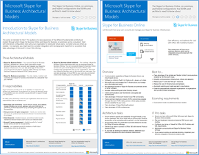

# Modelos de arquitectura para SharePoint, Exchange, Skype Empresarial y Lync

En los pósteres de TI de este artículo se describen los modelos arquitectónicos y las opciones de implementación de SharePoint, Exchange, Skype Empresarial y Lync. También proporcionan información de diseño para implementar SharePoint en Microsoft Azure.
  
Mediante el uso de Microsoft 365, puede proporcionar servicios de colaboración y comunicación conocidos a través de la nube. Con algunas excepciones, la experiencia del usuario sigue siendo la misma tanto si se mantiene una implementación local como si se usa Microsoft 365. 

Esta experiencia de usuario unificada complica la decisión de dónde colocar cada carga de trabajo. También plantea preguntas:
  
- ¿Cómo se elige una plataforma para cargas de trabajo individuales?
    
- ¿Tiene sentido conservar los servicios locales?
    
- ¿En qué escenario es adecuada una implementación híbrida?
    
- ¿Cómo encaja Azure en la imagen?
    
- ¿Qué configuraciones de Office cargas de trabajo de servidor Soporte técnico de Azure?
    
> [!TIP]
> La mayoría de los pósteres de este artículo están disponibles en varios idiomas. Los idiomas disponibles son chino, inglés, francés, alemán, italiano, japonés, coreano, portugués, ruso y español. Para descargar un póster en uno de estos idiomas, en la imagen en miniatura del póster, seleccione **Más idiomas**.
  
Queremos conocer su opinión. Envíenos un correo electrónico a [cloudadopt@microsoft.com](mailto:cloudadopt@microsoft.com). 
  
Use los siguientes vínculos para obtener los pósteres que necesita:
  
- **Modelos arquitectónicos**: use estos recursos para determinar la plataforma y la configuración ideales para SharePoint 2016 y Skype Empresarial 2015.
    
  - [Modelos arquitectónicos de Microsoft SharePoint 2016](architectural-models-for-sharepoint-exchange-skype-for-business-and-lync.md#SP2016_ArchModel)
    
  - [bases de datos de SharePoint Server 2016](architectural-models-for-sharepoint-exchange-skype-for-business-and-lync.md#SP2016_Databases)
    
  - [Modelos arquitectónicos de Microsoft Skype Empresarial 2015](architectural-models-for-sharepoint-exchange-skype-for-business-and-lync.md#SfB2015_ArchModel)
    
- **Plataforma**: use estos recursos para determinar la plataforma y la configuración ideales para SharePoint 2013, Exchange 2013 y Lync 2013.
    
  - [opciones de plataforma de SharePoint 2013](architectural-models-for-sharepoint-exchange-skype-for-business-and-lync.md#SP2013_Options)
    
  - [opciones de plataforma de Exchange 2013](architectural-models-for-sharepoint-exchange-skype-for-business-and-lync.md#Exch2013_options)
    
  - [Opciones de la plataforma Lync 2013](architectural-models-for-sharepoint-exchange-skype-for-business-and-lync.md#Lync2013_Options)
    
- **SharePoint Server 2013 en Azure**: use estos pósteres de TI para diseñar y configurar cargas de trabajo de SharePoint Server 2013 en servicios de infraestructura de Azure.
    
  - [Sitios de Internet en Azure mediante SharePoint Server 2013](architectural-models-for-sharepoint-exchange-skype-for-business-and-lync.md#Azure_sharepoint2013)
    
  - [Ejemplo de diseño: sitios de Internet en Azure para SharePoint 2013](architectural-models-for-sharepoint-exchange-skype-for-business-and-lync.md#DesignSampleInternetSites)
    
  - [SharePoint recuperación ante desastres en Azure](architectural-models-for-sharepoint-exchange-skype-for-business-and-lync.md#sharepoint_recovery_Azure)
    
## Pósteres de modelos de arquitectura

Los pósteres de TI de SharePoint 2016 y Skype Empresarial 2015 proporcionan una manera de comparar los métodos de implementación en un formato fácil de imprimir. Los pósteres muestran todas las opciones de configuración o plataforma. Proporcionan la siguiente información para cada opción:
  
- **Información general**: breve resumen de la plataforma, incluido un diagrama conceptual.
    
- **Mejor para**: escenarios comunes que son idealmente adecuados para la plataforma.
    
- **Requisitos de licencia**: las licencias que necesita para la implementación.
    
- **Tareas de arquitectura**: las decisiones que debe tomar como arquitecto.
    
- **Tareas o responsabilidades profesionales de TI**: las responsabilidades diarias que el personal de TI debe planear.
    

### Modelos de arquitectura de Microsoft SharePoint Server 2016

|Elemento|Descripción|
|---|---|
|[          ](https://www.microsoft.com/download/details.aspx?id=52650)   [PDF](https://download.microsoft.com/download/4/F/A/4FA0F94B-EE2F-41DB-A047-D9864FEF41E9/SharePoint2016ArchitecturalModels.pdf)  \| [Visio](https://download.microsoft.com/download/4/F/A/4FA0F94B-EE2F-41DB-A047-D9864FEF41E9/SharePoint2016ArchitecturalModels.vsdx)  \| [Más idiomas](https://www.microsoft.com/download/details.aspx?id=52650)|En este póster de TI se describen las configuraciones locales de SharePoint Online, Azure y SharePoint que los arquitectos de soluciones y responsables de la toma de decisiones empresariales necesitan conocer.    - **SharePoint Online (SaaS):** consuma SharePoint a través de un modelo de suscripción de software como servicio (SaaS).   - **SharePoint híbrido**: mueva los sitios y aplicaciones de SharePoint a la nube a su propio ritmo.   - **SharePoint en Azure (IaaS):** amplíe el entorno local en Azure e implemente allí SharePoint servidores de 2016. (Este modelo se recomienda para entornos de alta disponibilidad o recuperación ante desastres y entornos de desarrollo y pruebas).   - **SharePoint local**: planee, implemente, mantenga y personalice el entorno de SharePoint en un centro de datos que mantenga.|
   

### Bases de datos de SharePoint Server 2016

|Elemento|Descripción|
|---|---|
|   [PDF](https://download.microsoft.com/download/D/5/D/D5DC1121-8BC5-4953-834F-1B5BB03EB691/DBrefguideSPS2016_tabloid.pdf)  \| [Visio](https://download.microsoft.com/download/D/5/D/D5DC1121-8BC5-4953-834F-1B5BB03EB691/DBrefguideSPS2016_tabloid.vsdx)  \| [Más idiomas](https://www.microsoft.com/download/details.aspx?id=55041)|Este póster de TI es una referencia rápida para las bases de datos de SharePoint Server 2016. Verá los detalles de cada base de datos:    - Tamaño   - Instrucciones de escalado   - Patrones de E/S   - Requisitos     En la primera página se muestran las bases de datos del sistema de SharePoint y las aplicaciones de servicio que tienen varias bases de datos. En la segunda página se muestran todas las aplicaciones de servicio que tienen las bases de datos únicas.     Para obtener más información, vea [Tipos de base de datos y descripciones en SharePoint Server 2016](/SharePoint/technical-reference/database-types-and-descriptions).|
   

### Modelos de arquitectura de Microsoft Skype Empresarial 2015

|Elemento|Descripción|
|---|---|
|   [PDF](https://download.microsoft.com/download/7/7/4/7741262C-A60D-41F7-863B-99BF5964FBFE/Skype%20for%20Business%20Architectural%20Models.pdf)  \| [Visio](https://download.microsoft.com/download/7/7/4/7741262C-A60D-41F7-863B-99BF5964FBFE/Skype%20for%20Business%20Architectural%20Models.vsd)  \| [Más idiomas](https://www.microsoft.com/download/details.aspx?id=55022)|En este póster se describe Skype Empresarial en línea, local, híbrido y en la nube de intercambio de sucursales privadas (PBX). También describe la integración con configuraciones de Exchange y SharePoint que los arquitectos de soluciones y responsables de la toma de decisiones empresariales necesitan conocer.    El póster está destinado a profesionales de TI para dar a conocer los modelos arquitectónicos fundamentales a través de los cuales se pueden consumir Skype Empresarial Online y Skype Empresarial local.   Comience con la configuración que mejor se adapte a las necesidades y planes de su organización. Considere y use otras configuraciones según sea necesario. Por ejemplo, es posible que desee considerar la integración con Exchange y SharePoint o una solución que aproveche la oferta de PBX en la nube de Microsoft.|
   
## Pósteres de opciones de plataforma

Los pósteres de TI de SharePoint 2013, Exchange 2013 y Lync 2013 proporcionan una manera de comparar los métodos de implementación de un vistazo. Cada póster muestra todas las configuraciones o opciones de plataforma. Proporciona la siguiente información para cada opción:
  
- **Información general**: breve resumen de la plataforma, incluido un diagrama conceptual.
    
- **Mejor para**: escenarios comunes que son idealmente adecuados para la plataforma.
    
- **Requisitos de licencia**: las licencias que necesita para la implementación.
    
- **Tareas de arquitectura**: las decisiones que debe tomar como arquitecto.
    
- **Tareas o responsabilidades profesionales de TI**: las responsabilidades diarias que el personal de TI debe planear.
    

## Opciones de plataforma para SharePoint 2013

|Elemento|Descripción|
|---|---|
|   [PDF](https://go.microsoft.com/fwlink/p/?LinkId=324594)  \| [Visio](https://go.microsoft.com/fwlink/p/?LinkId=324593)  \| [Más idiomas](https://www.microsoft.com/download/details.aspx?id=40332)|Para los responsables de la toma de decisiones empresariales y los arquitectos, este póster muestra las opciones de plataforma para SharePoint 2013, SharePoint en Microsoft 365, híbrido local con implementaciones de Microsoft 365, Azure y solo locales. Incluye información general de cada arquitectura, recomendaciones, requisitos de licencia y listas de tareas de arquitectos y profesionales de TI para cada plataforma. En el póster se resaltan varias soluciones de SharePoint en Azure.|
   

## Opciones de plataforma para Exchange 2013

|Elemento|Descripción|
|---|---|
|[          ](https://www.microsoft.com/download/details.aspx?id=42676)   [PDF](https://go.microsoft.com/fwlink/p/?LinkID=398740)  \| [Visio](https://go.microsoft.com/fwlink/p/?LinkID=398742)  \| [Más idiomas](https://www.microsoft.com/download/details.aspx?id=42676)|Para los responsables de la toma de decisiones empresariales y los arquitectos, en este póster se describen las opciones de plataforma para Exchange 2013. Los clientes pueden elegir entre Exchange Online con Microsoft 365, Exchange híbrida, Exchange Server local y Exchange hospedadas. En el póster se detalla cada opción arquitectónica, incluidos los escenarios ideales para cada uno, los requisitos de licencia y las responsabilidades de profesionales de TI.|
   

## Opciones de plataforma para Lync 2013

|Elemento|Descripción|
|---|---|
|[          ](https://www.microsoft.com/download/details.aspx?id=41677)   [PDF](https://go.microsoft.com/fwlink/p/?LinkID=391837)  \| [Visio](https://go.microsoft.com/fwlink/p/?LinkID=391839)  \| [Más idiomas](https://www.microsoft.com/download/details.aspx?id=41677)|Para los responsables de la toma de decisiones empresariales y los arquitectos, en este póster se describen las opciones de plataforma para Lync 2013. Los clientes pueden elegir entre Lync Online con Microsoft 365, Lync híbrido, Lync Server local y Lync hospedado. En el póster de TI se detalla cada opción arquitectónica, incluidos los escenarios ideales para cada uno, los requisitos de licencia y las responsabilidades de profesionales de TI.|
   

## Pósteres de soluciones de SharePoint en Azure

Los pósteres de TI de SharePoint en Azure muestran soluciones basadas en Azure que usan SharePoint Server 2013.
  

### Sitios de Internet en Microsoft Azure mediante SharePoint Server 2013

|Elemento|Descripción|
|---|---|
|[          ](https://www.microsoft.com/download/details.aspx?id=41992)   [PDF](https://go.microsoft.com/fwlink/p/?LinkId=392552)  \| [Visio](https://go.microsoft.com/fwlink/p/?LinkId=392551)  \| [Más idiomas](https://www.microsoft.com/download/details.aspx?id=41992)|En este póster se describen las actividades de diseño clave y la arquitectura recomendada para sitios accesibles desde Internet en Azure.     Para más información, consulte los siguientes artículos:     - [Sitios de Internet en Azure mediante SharePoint Server 2013](internet-sites-in-microsoft-azure-using-sharepoint-server-2013.md)   - [Arquitecturas de Azure para SharePoint 2013](microsoft-azure-architectures-for-sharepoint-2013.md)|
   

### Sitios de Internet en Azure para SharePoint 2013

|Elemento|Descripción|
|---|---|
|[          ](https://www.microsoft.com/download/details.aspx?id=41991)   [PDF](https://go.microsoft.com/fwlink/p/?LinkId=392549)  \| [Visio](https://go.microsoft.com/fwlink/p/?LinkId=392548)  \| [Más idiomas](https://www.microsoft.com/download/details.aspx?id=41991)|Use este ejemplo de diseño como punto de partida para su propia arquitectura de un sitio accesible desde Internet en Azure mediante SharePoint Server 2013.    Para más información, consulte los siguientes artículos:     - [Sitios de Internet en Azure mediante SharePoint Server 2013](internet-sites-in-microsoft-azure-using-sharepoint-server-2013.md)   - [Arquitecturas de Azure para SharePoint 2013](microsoft-azure-architectures-for-sharepoint-2013.md)|
   

### Recuperación ante desastres de SharePoint en Microsoft Azure

|Elemento|Descripción|
|---|---|
|[          ](https://www.microsoft.com/download/details.aspx?id=41993)   [PDF](https://go.microsoft.com/fwlink/p/?LinkId=392555)  \| [Visio](https://go.microsoft.com/fwlink/p/?LinkId=392554)  \| [Más idiomas](https://www.microsoft.com/download/details.aspx?id=41993)|En este póster de TI se muestran los principios de arquitectura de un entorno de recuperación ante desastres en Azure.    Para obtener más información, consulte los siguientes artículos:     - [recuperación ante desastres de SharePoint Server 2013 en Azure](sharepoint-server-2013-disaster-recovery-in-microsoft-azure.md)   - [Arquitecturas de Azure para SharePoint 2013](microsoft-azure-architectures-for-sharepoint-2013.md)|
   
## Vea también

- [Centro de soluciones y arquitectura de Microsoft 365](../solutions/index.yml)
  
- [Modelos de arquitectura de la nube de Microsoft](../solutions/cloud-architecture-models.md)
  
- [Microsoft 365 guías de laboratorio de pruebas](m365-enterprise-test-lab-guides.md)
  
- [Soluciones híbridas](hybrid-solutions.md)