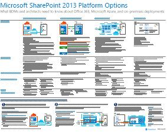

# Modelos de arquitectura para SharePoint, Exchange, Skype Empresarial y Lync

Los pósteres de TI de este artículo describen los modelos arquitectónicos y las opciones de implementación de SharePoint, Exchange, Skype empresarial y Lync. También proporcionan información de diseño para implementar SharePoint en Microsoft Azure.
  
Mediante el uso de Microsoft 365, puede proporcionar servicios de colaboración y comunicación familiares a través de la nube. Con algunas excepciones, la experiencia del usuario permanece igual tanto si está manteniendo una implementación local o usando Microsoft 365. 

Esta experiencia de usuario unificada complica la decisión de dónde poner cada carga de trabajo. También plantea preguntas:
  
- ¿Cómo elegir una plataforma para cargas de trabajo individuales?
    
- ¿Tiene sentido conservar los servicios locales?
    
- ¿En qué escenario es una implementación híbrida adecuada?
    
- ¿Cómo encaja Azure en la imagen?
    
- ¿Qué configuraciones de las cargas de trabajo de Office Server admite Azure?
    
> [!TIP]
> La mayoría de los pósters de este artículo están disponibles en varios idiomas. Los idiomas disponibles son chino, Inglés, Francés, alemán, Italiano, Japonés, Coreano, Portugués, Ruso y español. Para descargar un póster en uno de estos idiomas, en la imagen en miniatura de póster, seleccione **más idiomas**.
  
Háganoslo saber lo que piensa. Envíenos un correo electrónico a [cloudadopt@microsoft.com](mailto:cloudadopt@microsoft.com). 
  
Use los siguientes vínculos para obtener los pósteres que necesita:
  
- **Modelos arquitectónicos** : Use estos recursos para determinar la plataforma y configuración ideales para SharePoint 2016 y Skype empresarial 2015.
    
  - [Modelos arquitectónicos de Microsoft SharePoint 2016](architectural-models-for-sharepoint-exchange-skype-for-business-and-lync.md#SP2016_ArchModel)
    
  - [Bases de datos de SharePoint Server 2016](architectural-models-for-sharepoint-exchange-skype-for-business-and-lync.md#SP2016_Databases)
    
  - [Modelos de arquitectura de Microsoft Skype empresarial 2015](architectural-models-for-sharepoint-exchange-skype-for-business-and-lync.md#SfB2015_ArchModel)
    
- **Plataforma** : Use estos recursos para determinar la plataforma y configuración ideales para SharePoint 2013, Exchange 2013 y Lync 2013.
    
  - [Opciones de plataforma para SharePoint 2013](architectural-models-for-sharepoint-exchange-skype-for-business-and-lync.md#SP2013_Options)
    
  - [Opciones de plataforma de Exchange 2013](architectural-models-for-sharepoint-exchange-skype-for-business-and-lync.md#Exch2013_options)
    
  - [Opciones de plataforma Lync 2013](architectural-models-for-sharepoint-exchange-skype-for-business-and-lync.md#Lync2013_Options)
    
- **SharePoint server 2013 en Azure** : Use estos pósteres de TI para diseñar y configurar cargas de trabajo de sharepoint Server 2013 en los servicios de infraestructura de Azure.
    
  - [Sitios de Internet en Azure con SharePoint Server 2013](architectural-models-for-sharepoint-exchange-skype-for-business-and-lync.md#Azure_sharepoint2013)
    
  - [Ejemplo de diseño: sitios de Internet en Azure para SharePoint 2013](architectural-models-for-sharepoint-exchange-skype-for-business-and-lync.md#DesignSampleInternetSites)
    
  - [Recuperación ante desastres de SharePoint en Azure](architectural-models-for-sharepoint-exchange-skype-for-business-and-lync.md#sharepoint_recovery_Azure)
    
## Pósteres de modelos de arquitectura

Los pósteres de TI para SharePoint 2016 y Skype empresarial 2015 proporcionan una forma de comparar los métodos de implementación en un formato fácil de imprimir. Los pósteres enumeran todas las opciones de configuración o de plataforma. Proporcionan la siguiente información para cada opción:
  
- **Información general** : breve resumen de la plataforma, que incluye un diagrama conceptual.
    
- **Recomendado para** : escenarios comunes que son ideales para la plataforma.
    
- **Requisitos de licencia** : las licencias necesarias para la implementación.
    
- **Tareas de arquitectura** : decisiones que debe tomar como arquitecto.
    
- **Tareas o responsabilidades de profesionales de ti** : responsabilidades diarias que el personal de ti necesita planear.
    

### Modelos de arquitectura de Microsoft SharePoint Server 2016

|Item|Description|
|---|---|
|[          ](https://www.microsoft.com/download/details.aspx?id=52650)   [PDF](https://download.microsoft.com/download/4/F/A/4FA0F94B-EE2F-41DB-A047-D9864FEF41E9/SharePoint2016ArchitecturalModels.pdf)  \| [Visio](https://download.microsoft.com/download/4/F/A/4FA0F94B-EE2F-41DB-A047-D9864FEF41E9/SharePoint2016ArchitecturalModels.vsdx)  \| [Más idiomas](https://www.microsoft.com/download/details.aspx?id=52650)|Este póster de ti describe las configuraciones locales de SharePoint Online, Azure y SharePoint que los responsables de la toma de decisiones empresariales y los arquitectos de soluciones necesitan conocer.    - **SharePoint Online (SaaS)** : consuma SharePoint a través de un modelo de suscripción de software como servicio (SaaS).   - **Entorno híbrido de SharePoint** : mueva los sitios y las aplicaciones de SharePoint a la nube a su propio ritmo.   - **SharePoint en Azure (IaaS)** : Extienda el entorno local a Azure e implemente servidores de SharePoint 2016. (Este modelo se recomienda para entornos de alta disponibilidad o recuperación ante desastres y entornos de desarrollo y pruebas).   - **SharePoint local** : Planee, implemente, mantenga y personalice su entorno de SharePoint en un centro de recursos que mantenga.|
   

### Bases de datos de SharePoint Server 2016

|Item|Description|
|---|---|
|   [PDF](https://download.microsoft.com/download/D/5/D/D5DC1121-8BC5-4953-834F-1B5BB03EB691/DBrefguideSPS2016_tabloid.pdf)  \| [Visio](https://download.microsoft.com/download/D/5/D/D5DC1121-8BC5-4953-834F-1B5BB03EB691/DBrefguideSPS2016_tabloid.vsdx)  \| [Más idiomas](https://www.microsoft.com/download/details.aspx?id=55041)|Este póster de ti es una referencia rápida de las bases de datos de SharePoint Server 2016. Verá los detalles de cada base de datos:    - Tamaño   - Instrucciones de escalado   - Patrones de E/S   - Requisitos     La primera página muestra las bases de datos del sistema de SharePoint y las aplicaciones de servicio que tienen varias bases de datos. En la segunda página se muestran todas las aplicaciones de servicio que tienen las bases de datos únicas.     Para obtener más información, vea [tipos y descripciones de bases de datos en SharePoint Server 2016](https://docs.microsoft.com/SharePoint/technical-reference/database-types-and-descriptions).|
   

### Modelos de arquitectura de Microsoft Skype Empresarial 2015

|Item|Description|
|---|---|
|   [PDF](https://download.microsoft.com/download/7/7/4/7741262C-A60D-41F7-863B-99BF5964FBFE/Skype%20for%20Business%20Architectural%20Models.pdf)  \| [Visio](https://download.microsoft.com/download/7/7/4/7741262C-A60D-41F7-863B-99BF5964FBFE/Skype%20for%20Business%20Architectural%20Models.vsd)  \| [Más idiomas](https://www.microsoft.com/download/details.aspx?id=55022)|En este póster se describe Skype empresarial online, local, híbrido y central de conmutación (PBX) de nube. También se describe la integración con las configuraciones de Exchange y SharePoint que los responsables de la toma de decisiones empresariales y los arquitectos de soluciones necesitan conocer.    El póster está destinado a los profesionales de ti a mejorar el conocimiento de los modelos arquitectónicos fundamentales a través de los cuales se pueden usar Skype empresarial online y Skype empresarial local.   Comience con la configuración que mejor se adapte a las necesidades y los planes de su organización. Considere y use otras configuraciones según sea necesario. Por ejemplo, es posible que quiera considerar la integración con Exchange y SharePoint o una solución que aproveche la oferta de PBX en la nube de Microsoft.|
   
## Pósteres de opciones de plataforma

Los pósteres de TI para SharePoint 2013, Exchange 2013 y Lync 2013 proporcionan una forma de comparar los métodos de implementación de un vistazo. En cada póster se enumeran todas las configuraciones o opciones de plataforma. Proporciona la siguiente información para cada opción:
  
- **Información general** : breve resumen de la plataforma, que incluye un diagrama conceptual.
    
- **Recomendado para** : escenarios comunes que son ideales para la plataforma.
    
- **Requisitos de licencia** : las licencias necesarias para la implementación.
    
- **Tareas de arquitectura** : decisiones que debe tomar como arquitecto.
    
- **Tareas o responsabilidades de profesionales de ti** : responsabilidades diarias que el personal de ti necesita planear.
    

## Opciones de plataforma para SharePoint 2013

|Item|Description|
|---|---|
|   [PDF](https://go.microsoft.com/fwlink/p/?LinkId=324594)  \| [Visio](https://go.microsoft.com/fwlink/p/?LinkId=324593)  \| [Más idiomas](https://www.microsoft.com/download/details.aspx?id=40332)|Para los arquitectos y los responsables de decisiones empresariales, este póster muestra las opciones de plataforma para SharePoint 2013, SharePoint en Microsoft 365, híbrido local con Microsoft 365, Azure y implementaciones solo locales. Incluye información general sobre cada arquitectura, recomendaciones, requisitos de licencia y listas de tareas de arquitectos y profesionales de TI para cada plataforma. El póster destaca varias soluciones de SharePoint en Azure.|
   

## Opciones de plataforma para Exchange 2013

|Item|Description|
|---|---|
|[          ](https://www.microsoft.com/download/details.aspx?id=42676)   [PDF](https://go.microsoft.com/fwlink/p/?LinkID=398740)  \| [Visio](https://go.microsoft.com/fwlink/p/?LinkID=398742)  \| [Más idiomas](https://www.microsoft.com/download/details.aspx?id=42676)|Para los arquitectos y los responsables de decisiones empresariales, este póster describe las opciones de plataforma para Exchange 2013. Los clientes pueden elegir entre Exchange Online y Microsoft 365, un entorno híbrido de Exchange, Exchange Server local y Exchange hospedado. El póster detalla cada opción de arquitectura, incluidos los escenarios ideales para cada uno, los requisitos de licencia y las responsabilidades del profesional de ti.|
   

## Opciones de plataforma para Lync 2013

|Item|Description|
|---|---|
|[          ](https://www.microsoft.com/download/details.aspx?id=41677)   [PDF](https://go.microsoft.com/fwlink/p/?LinkID=391837)  \| [Visio](https://go.microsoft.com/fwlink/p/?LinkID=391839)  \| [Más idiomas](https://www.microsoft.com/download/details.aspx?id=41677)|Para los arquitectos y los responsables de decisiones empresariales, este póster describe las opciones de plataforma para Lync 2013. Los clientes pueden elegir entre Lync Online con Microsoft 365, una implementación híbrida de Lync, Lync Server local y Lync hospedado. El póster de ti detalla cada opción de arquitectura, incluidos los escenarios ideales para cada uno, los requisitos de licencia y las responsabilidades del profesional de ti.|
   

## Pósteres de soluciones de SharePoint en Azure

Los pósteres de TI para SharePoint en Azure muestran soluciones basadas en Azure que usan SharePoint Server 2013.
  

### Sitios de Internet en Microsoft Azure con SharePoint Server 2013

|Item|Description|
|---|---|
|[          ](https://www.microsoft.com/download/details.aspx?id=41992)   [PDF](https://go.microsoft.com/fwlink/p/?LinkId=392552)  \| [Visio](https://go.microsoft.com/fwlink/p/?LinkId=392551)  \| [Más idiomas](https://www.microsoft.com/download/details.aspx?id=41992)|En este póster se describen las principales actividades de diseño y la arquitectura recomendada para los sitios orientados a Internet en Azure.     Para más información, consulte los siguientes artículos:     - [Sitios de Internet en Azure con SharePoint Server 2013](internet-sites-in-microsoft-azure-using-sharepoint-server-2013.md)   - [Arquitecturas de Azure para SharePoint 2013](microsoft-azure-architectures-for-sharepoint-2013.md)|
   

### Sitios de Internet en Azure para SharePoint 2013

|Item|Description|
|---|---|
|[          ](https://www.microsoft.com/download/details.aspx?id=41991)   [PDF](https://go.microsoft.com/fwlink/p/?LinkId=392549)  \| [Visio](https://go.microsoft.com/fwlink/p/?LinkId=392548)  \| [Más idiomas](https://www.microsoft.com/download/details.aspx?id=41991)|Use este ejemplo de diseño como punto de partida para su propia arquitectura de un sitio orientado a Internet en Azure con SharePoint Server 2013.    Para más información, consulte los siguientes artículos:     - [Sitios de Internet en Azure con SharePoint Server 2013](internet-sites-in-microsoft-azure-using-sharepoint-server-2013.md)   - [Arquitecturas de Azure para SharePoint 2013](microsoft-azure-architectures-for-sharepoint-2013.md)|
   

### Recuperación ante desastres de SharePoint en Microsoft Azure

|Item|Description|
|---|---|
|[          ](https://www.microsoft.com/download/details.aspx?id=41993)   [PDF](https://go.microsoft.com/fwlink/p/?LinkId=392555)  \| [Visio](https://go.microsoft.com/fwlink/p/?LinkId=392554)  \| [Más idiomas](https://www.microsoft.com/download/details.aspx?id=41993)|En este póster de TI se muestran los principios de arquitectura de un entorno de recuperación ante desastres en Azure.    Para obtener más información, consulte los siguientes artículos:     - [Recuperación ante desastres de SharePoint Server 2013 en Azure](sharepoint-server-2013-disaster-recovery-in-microsoft-azure.md)   - [Arquitecturas de Azure para SharePoint 2013](microsoft-azure-architectures-for-sharepoint-2013.md)|
   
## Vea también

- [Centro de soluciones y arquitectura de Microsoft 365](../solutions/solution-architecture-center.md)
  
- [Modelos de arquitectura de la nube de Microsoft](../solutions/cloud-architecture-models.md)
  
- [Guías del laboratorio de pruebas de 365 de Microsoft](m365-enterprise-test-lab-guides.md)
  
- [Soluciones híbridas](hybrid-solutions.md)

