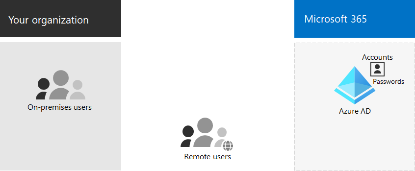

# Microsoft 365 identidad de solo nube

*Este artículo afecta tanto a Office 365 Enterprise como a Microsoft 365 Enterprise*

Si ha elegido el modelo de identidad de solo nube, ya tiene un inquilino de Azure Active Directory (Azure AD) para que su suscripción Microsoft 365 almacene todos los usuarios, grupos y contactos. Después de configurar la protección para cuentas de administrador en el paso [2](protect-your-global-administrator-accounts.md) y cuentas de usuario en el paso [3](microsoft-365-secure-sign-in.md) de esta solución, ya está listo para empezar a crear las nuevas cuentas y grupos que necesita su organización.

Estos son los componentes básicos de la identidad de solo nube.
 

Los usuarios y sus cuentas de usuario en las organizaciones se pueden clasificar de varias maneras. Por ejemplo, algunos son empleados y tienen un estado permanente. Algunos son proveedores, contratistas o socios que tienen un estado temporal. Algunos son usuarios externos que no tienen cuentas de usuario, pero que aún deben tener acceso a servicios y recursos específicos para admitir la interacción y la colaboración. Por ejemplo:

- Cuentas de espacio empresarial que representan a usuarios de su organización a los que asigna una licencia para servicios en la nube

- Cuentas entre empresas (B2B) que representan a usuarios externos a la organización a los que invita a participar en colaboración

Hacer un balance de los tipos de usuarios de la organización. ¿Cuáles son las agrupaciones? Por ejemplo, puede agrupar usuarios por función o propósito de alto nivel para su organización.

Además, algunos servicios en la nube se pueden compartir con usuarios externos a la organización sin cuentas de usuario. También necesitará identificar estos grupos de usuarios.

Puede usar grupos en Azure AD para varios fines que simplifican la administración de su entorno en la nube. Por ejemplo, con Azure AD grupos, puede:

- Use licencias basadas en grupos para asignar licencias de Microsoft 365 a sus cuentas de usuario automáticamente en cuanto se agregan como miembros.
- Agregue cuentas de usuario a grupos específicos dinámicamente en función de los atributos de cuenta de usuario, como el nombre del departamento.
- Aprovisionar automáticamente a los usuarios para aplicaciones de Software como Servicio (SaaS) y proteger el acceso a esas aplicaciones con autenticación multifactor (MFA) y otras directivas de acceso condicional.
- Aprovisionar permisos y niveles de acceso para los equipos y SharePoint de grupo en línea.

## Pasos siguientes para la identidad de solo nube

- [Administrar cuentas de usuario](manage-microsoft-365-accounts.md)
- [Asignar licencias a cuentas de usuario](assign-licenses-to-user-accounts.md)
- [Administrar grupos y pertenencia a grupos](manage-microsoft-365-groups.md)
- [Administrar contraseñas de cuentas de usuario](manage-microsoft-365-passwords.md)
