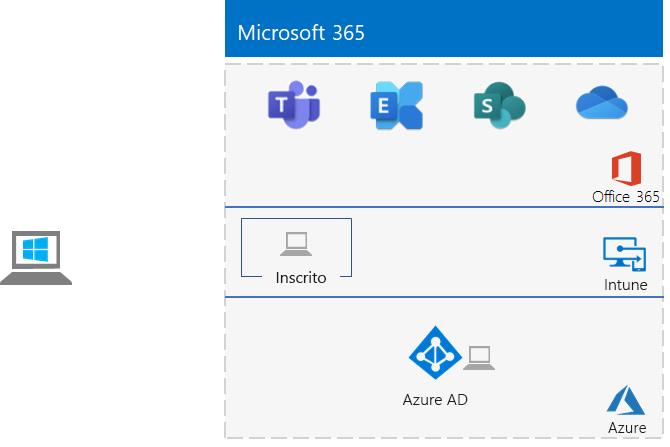

# <a name="identity-and-device-access-prerequisites-for-cloud-only-in-your-microsoft-365-test-environment"></a><span data-ttu-id="e3288-103">Requisitos previos de acceso de dispositivos e identidades solo para la nube en el entorno de prueba de Microsoft 365</span><span class="sxs-lookup"><span data-stu-id="e3288-103">Identity and device access prerequisites for cloud only in your Microsoft 365 test environment</span></span>

<span data-ttu-id="e3288-104">*Esta guía del entorno de pruebas solo se puede usar para Entornos de prueba de Microsoft 365 para empresas.*</span><span class="sxs-lookup"><span data-stu-id="e3288-104">*This Test Lab Guide can only be used for Microsoft 365 for enterprise test environments.*</span></span>

<span data-ttu-id="e3288-105">[Las configuraciones de](../security/office-365-security/microsoft-365-policies-configurations.md) acceso a dispositivos e identidades son un conjunto de configuraciones recomendadas y directivas de acceso condicional para proteger el acceso a todos los servicios integrados con Azure Active Directory (Azure AD).</span><span class="sxs-lookup"><span data-stu-id="e3288-105">[Identity and device access configurations](../security/office-365-security/microsoft-365-policies-configurations.md) are a set of recommended configurations and conditional access policies to protect access to all services that are integrated with Azure Active Directory (Azure AD).</span></span>

<span data-ttu-id="e3288-106">En este artículo describe cómo configurar un entorno de prueba de Microsoft 365 que cumpla con los requisitos de la [configuración de requisitos previos solo para la nube](../security/office-365-security/identity-access-prerequisites.md#prerequisites) para el acceso de dispositivos e identidades.</span><span class="sxs-lookup"><span data-stu-id="e3288-106">This article describes how to configure a Microsoft 365 test environment that meets the requirements of the [cloud only prerequisite configuration](../security/office-365-security/identity-access-prerequisites.md#prerequisites) for identity and device access.</span></span>

<span data-ttu-id="e3288-107">Existen ocho fases para configurar el entorno de pruebas:</span><span class="sxs-lookup"><span data-stu-id="e3288-107">There are eight phases to setting up this test environment:</span></span>

1. <span data-ttu-id="e3288-108">Crear el entorno de prueba ligero</span><span class="sxs-lookup"><span data-stu-id="e3288-108">Build out your lightweight test environment</span></span>
2. <span data-ttu-id="e3288-109">Configurar ubicaciones con nombre</span><span class="sxs-lookup"><span data-stu-id="e3288-109">Configure named locations</span></span>
3. <span data-ttu-id="e3288-110">Configurar el autoservicio de restablecimiento de contraseñas</span><span class="sxs-lookup"><span data-stu-id="e3288-110">Configure self-service password reset</span></span>
4. <span data-ttu-id="e3288-111">Configurar la autenticación multifactor</span><span class="sxs-lookup"><span data-stu-id="e3288-111">Configure multifactor authentication</span></span>
5. <span data-ttu-id="e3288-112">Habilitar el registro automático de dispositivos de equipos Windows unidos a un dominio</span><span class="sxs-lookup"><span data-stu-id="e3288-112">Enable automatic device registration of domain-joined Windows computers</span></span>
6. <span data-ttu-id="e3288-113">Configurar la protección con contraseña de Azure AD</span><span class="sxs-lookup"><span data-stu-id="e3288-113">Configure Azure AD password protection</span></span> 
7. <span data-ttu-id="e3288-114">Habilitar Azure AD Identity Protection</span><span class="sxs-lookup"><span data-stu-id="e3288-114">Enable Azure AD Identity Protection</span></span>
8. <span data-ttu-id="e3288-115">Habilitar la autenticación moderna para Exchange Online y Skype Empresarial Online</span><span class="sxs-lookup"><span data-stu-id="e3288-115">Enable modern authentication for Exchange Online and Skype for Business Online</span></span>

## <a name="phase-1-build-out-your-lightweight-microsoft-365-test-environment"></a><span data-ttu-id="e3288-116">Fase 1: Crear el entorno de prueba ligero de Microsoft 365</span><span class="sxs-lookup"><span data-stu-id="e3288-116">Phase 1: Build out your lightweight Microsoft 365 test environment</span></span>

<span data-ttu-id="e3288-117">Siga las instrucciones de [Configuración básica ligera](lightweight-base-configuration-microsoft-365-enterprise.md).</span><span class="sxs-lookup"><span data-stu-id="e3288-117">Follow the instructions in [Lightweight base configuration](lightweight-base-configuration-microsoft-365-enterprise.md).</span></span>
<span data-ttu-id="e3288-118">Esta es la configuración resultante.</span><span class="sxs-lookup"><span data-stu-id="e3288-118">Here is the resulting configuration.</span></span>


 
## <a name="phase-2-configure-named-locations"></a><span data-ttu-id="e3288-120">Fase 2: Configurar ubicaciones con nombre</span><span class="sxs-lookup"><span data-stu-id="e3288-120">Phase 2: Configure named locations</span></span>

<span data-ttu-id="e3288-121">En primer lugar, determine las direcciones IP públicas o los intervalos de direcciones usados por su organización.</span><span class="sxs-lookup"><span data-stu-id="e3288-121">First, determine the public IP addresses or address ranges used by your organization.</span></span>

<span data-ttu-id="e3288-122">A continuación, siga las instrucciones de [Configurar ubicaciones con nombre en Azure Active Directory](https://docs.microsoft.com/azure/active-directory/reports-monitoring/quickstart-configure-named-locations) para agregar las direcciones o intervalos de direcciones como ubicaciones con nombre.</span><span class="sxs-lookup"><span data-stu-id="e3288-122">Next, follow the instructions in [Configure named locations in Azure Active Directory](https://docs.microsoft.com/azure/active-directory/reports-monitoring/quickstart-configure-named-locations) to add the addresses or address ranges as named locations.</span></span> 

## <a name="phase-3-configure-self-service-password-reset"></a><span data-ttu-id="e3288-123">Fase 3: Configurar el restablecimiento de contraseña de autoservicio</span><span class="sxs-lookup"><span data-stu-id="e3288-123">Phase 3: Configure self-service password reset</span></span>

<span data-ttu-id="e3288-124">Siga las instrucciones en la [Guía de entorno de pruebas, fase 3 de la operación de restablecimiento de contraseña](password-reset-m365-ent-test-environment.md#phase-3-configure-and-test-password-reset).</span><span class="sxs-lookup"><span data-stu-id="e3288-124">Follow the instructions in [Phase 3 of the password reset Test Lab Guide](password-reset-m365-ent-test-environment.md#phase-3-configure-and-test-password-reset).</span></span> 

<span data-ttu-id="e3288-125">Al habilitar la contraseña para las cuentas en un determinado grupo de Azure AD, agregue estas cuentas al grupo de **Restablecimiento de contraseña**:</span><span class="sxs-lookup"><span data-stu-id="e3288-125">When enabling password reset for the accounts in a specific Azure AD group, add these accounts to the **Password reset** group:</span></span>

- <span data-ttu-id="e3288-126">Usuario 2</span><span class="sxs-lookup"><span data-stu-id="e3288-126">User 2</span></span>
- <span data-ttu-id="e3288-127">Usuario 3</span><span class="sxs-lookup"><span data-stu-id="e3288-127">User 3</span></span>
- <span data-ttu-id="e3288-128">Usuario 4</span><span class="sxs-lookup"><span data-stu-id="e3288-128">User 4</span></span>
- <span data-ttu-id="e3288-129">Usuario 5</span><span class="sxs-lookup"><span data-stu-id="e3288-129">User 5</span></span>

<span data-ttu-id="e3288-130">Pruebe el restablecimiento de contraseña solo de la cuenta Usuario 2.</span><span class="sxs-lookup"><span data-stu-id="e3288-130">Test password reset only for the User 2 account.</span></span>

## <a name="phase-4-configure-multi-factor-authentication"></a><span data-ttu-id="e3288-131">Fase 4: Configurar la autenticación multifactor</span><span class="sxs-lookup"><span data-stu-id="e3288-131">Phase 4: Configure multi-factor authentication</span></span>

<span data-ttu-id="e3288-132">Siga las instrucciones en [Guía del laboratorio de pruebas, fase 2 de la autenticación multifactor ](multi-factor-authentication-microsoft-365-test-environment.md#phase-2-enable-and-test-multi-factor-authentication-for-the-user-2-account) para las cuentas de usuario siguientes:</span><span class="sxs-lookup"><span data-stu-id="e3288-132">Follow the instructions in [Phase 2 of the multi-factor authentication Test Lab Guide](multi-factor-authentication-microsoft-365-test-environment.md#phase-2-enable-and-test-multi-factor-authentication-for-the-user-2-account) for the following user accounts:</span></span>

- <span data-ttu-id="e3288-133">Usuario 2</span><span class="sxs-lookup"><span data-stu-id="e3288-133">User 2</span></span>
- <span data-ttu-id="e3288-134">Usuario 3</span><span class="sxs-lookup"><span data-stu-id="e3288-134">User 3</span></span>
- <span data-ttu-id="e3288-135">Usuario 4</span><span class="sxs-lookup"><span data-stu-id="e3288-135">User 4</span></span>
- <span data-ttu-id="e3288-136">Usuario 5</span><span class="sxs-lookup"><span data-stu-id="e3288-136">User 5</span></span>

<span data-ttu-id="e3288-137">Pruebe la autenticación multifactor solo para la cuenta Usuario 2.</span><span class="sxs-lookup"><span data-stu-id="e3288-137">Test multi-factor authentication only for the User 2 account.</span></span>

## <a name="phase-5-enable-automatic-device-registration-of-domain-joined-windows-computers"></a><span data-ttu-id="e3288-138">Fase 5: Habilitar el registro automático de dispositivos de equipos Windows unidos a un dominio</span><span class="sxs-lookup"><span data-stu-id="e3288-138">Phase 5: Enable automatic device registration of domain-joined Windows computers</span></span> 

<span data-ttu-id="e3288-139">Sigue [estas instrucciones para](https://docs.microsoft.com/azure/active-directory/devices/hybrid-azuread-join-plan) habilitar el registro automático de dispositivos de equipos Windows unidos a un dominio.</span><span class="sxs-lookup"><span data-stu-id="e3288-139">Follow [these instructions](https://docs.microsoft.com/azure/active-directory/devices/hybrid-azuread-join-plan) to enable automatic device registration of domain-joined Windows computers.</span></span>

## <a name="phase-6-configure-azure-ad-password-protection"></a><span data-ttu-id="e3288-140">Fase 6: Configurar la protección con contraseña de Azure AD</span><span class="sxs-lookup"><span data-stu-id="e3288-140">Phase 6: Configure Azure AD password protection</span></span> 

<span data-ttu-id="e3288-141">Siga [estas instrucciones para](https://docs.microsoft.com/azure/active-directory/authentication/concept-password-ban-bad) bloquear contraseñas no seguras conocidas y sus variantes.</span><span class="sxs-lookup"><span data-stu-id="e3288-141">Follow [these instructions](https://docs.microsoft.com/azure/active-directory/authentication/concept-password-ban-bad) to block known weak passwords and their variants.</span></span>

## <a name="phase-7-enable-azure-ad-identity-protection"></a><span data-ttu-id="e3288-142">Fase 7: Habilitación de Azure AD Identity Protection</span><span class="sxs-lookup"><span data-stu-id="e3288-142">Phase 7: Enable Azure AD Identity Protection</span></span>

<span data-ttu-id="e3288-143">Siga las instrucciones en la [Guía de laboratorio de pruebas, fase 2 de Azure AD Identity Protection](azure-ad-identity-protection-microsoft-365-test-environment.md#phase-2-use-azure-ad-identity-protection).</span><span class="sxs-lookup"><span data-stu-id="e3288-143">Follow the instructions in [Phase 2 of the Azure AD Identity Protection Test Lab Guide](azure-ad-identity-protection-microsoft-365-test-environment.md#phase-2-use-azure-ad-identity-protection).</span></span> 

## <a name="phase-8-enable-modern-authentication-for-exchange-online-and-skype-for-business-online"></a><span data-ttu-id="e3288-144">Fase 8: Habilitar autenticación moderna para Exchange Online y Skype Empresarial Online</span><span class="sxs-lookup"><span data-stu-id="e3288-144">Phase 8: Enable modern authentication for Exchange Online and Skype for Business Online</span></span>

<span data-ttu-id="e3288-145">Para Exchange Online, siga [estas instrucciones](https://docs.microsoft.com/Exchange/clients-and-mobile-in-exchange-online/enable-or-disable-modern-authentication-in-exchange-online#enable-or-disable-modern-authentication-in-exchange-online-for-client-connections-in-outlook-2013-or-later).</span><span class="sxs-lookup"><span data-stu-id="e3288-145">For Exchange Online, follow [these instructions](https://docs.microsoft.com/Exchange/clients-and-mobile-in-exchange-online/enable-or-disable-modern-authentication-in-exchange-online#enable-or-disable-modern-authentication-in-exchange-online-for-client-connections-in-outlook-2013-or-later).</span></span> 

<span data-ttu-id="e3288-146">Para Skype Empresarial Online:</span><span class="sxs-lookup"><span data-stu-id="e3288-146">For Skype for Business Online:</span></span>

1. <span data-ttu-id="e3288-147">Conéctese a [Skype Empresarial Online](https://docs.microsoft.com/SkypeForBusiness/set-up-your-computer-for-windows-powershell/set-up-your-computer-for-windows-powershell)</span><span class="sxs-lookup"><span data-stu-id="e3288-147">Connect to [Skype for Business Online](https://docs.microsoft.com/SkypeForBusiness/set-up-your-computer-for-windows-powershell/set-up-your-computer-for-windows-powershell).</span></span>

2. <span data-ttu-id="e3288-148">Ejecute este comando.</span><span class="sxs-lookup"><span data-stu-id="e3288-148">Run this command.</span></span>

  ```powershell
  Set-CsOAuthConfiguration -ClientAdalAuthOverride Allowed
  ```

3. <span data-ttu-id="e3288-149">Compruebe que el cambio se realizó correctamente con este comando.</span><span class="sxs-lookup"><span data-stu-id="e3288-149">Verify that the change was successful with this command.</span></span>

  ```powershell
  Get-CsOAuthConfiguration
  ```

<span data-ttu-id="e3288-150">El resultado es un entorno de prueba que cumple los requisitos de la configuración de [requisitos](../security/office-365-security/identity-access-prerequisites.md#prerequisites) previos de solo nube para el acceso a dispositivos e identidades.</span><span class="sxs-lookup"><span data-stu-id="e3288-150">The result is a test environment that meets the requirements of the [cloud-only prerequisite configuration](../security/office-365-security/identity-access-prerequisites.md#prerequisites) for identity and device access.</span></span> 

## <a name="next-step"></a><span data-ttu-id="e3288-151">Paso siguiente</span><span class="sxs-lookup"><span data-stu-id="e3288-151">Next step</span></span>

<span data-ttu-id="e3288-152">Use [Directivas comunes de acceso a dispositivos e identidades](identity-access-policies.md) para configurar las directivas que se basan en los requisitos previos y protegen dispositivos e identidades.</span><span class="sxs-lookup"><span data-stu-id="e3288-152">Use [Common identity and device access policies](identity-access-policies.md) to configure the policies that build on the prerequisites and protect identities and devices.</span></span>

## <a name="see-also"></a><span data-ttu-id="e3288-153">Ver también</span><span class="sxs-lookup"><span data-stu-id="e3288-153">See also</span></span>

[<span data-ttu-id="e3288-154">Guías de laboratorio de pruebas de identidad adicionales</span><span class="sxs-lookup"><span data-stu-id="e3288-154">Additional identity Test Lab Guides</span></span>](m365-enterprise-test-lab-guides.md#identity)

[<span data-ttu-id="e3288-155">Guía básica de identidad</span><span class="sxs-lookup"><span data-stu-id="e3288-155">Identity roadmap</span></span>](identity-roadmap-microsoft-365.md)

[<span data-ttu-id="e3288-156">Guías de entornos de pruebas de Microsoft 365 para empresas</span><span class="sxs-lookup"><span data-stu-id="e3288-156">Microsoft 365 for enterprise Test Lab Guides</span></span>](m365-enterprise-test-lab-guides.md)

[<span data-ttu-id="e3288-157">Información general de Microsoft 365 Enterprise</span><span class="sxs-lookup"><span data-stu-id="e3288-157">Microsoft 365 for enterprise overview</span></span>](microsoft-365-overview.md)

[<span data-ttu-id="e3288-158">Documentación para Microsoft 365 Enterprise</span><span class="sxs-lookup"><span data-stu-id="e3288-158">Microsoft 365 for enterprise documentation</span></span>](https://docs.microsoft.com/microsoft-365-enterprise/)
