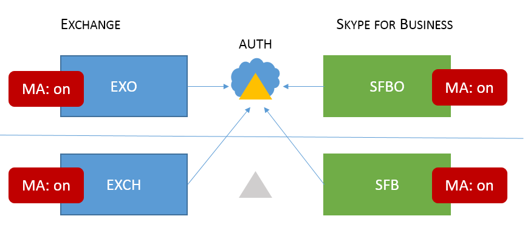

# <a name="how-to-configure-skype-for-business-on-premises-to-use-hybrid-modern-authentication"></a>Cómo configurar Skype Empresarial local para usar la autenticación moderna híbrida

*Este artículo afecta tanto a Office 365 Enterprise como a Microsoft 365 Enterprise*

La autenticación moderna, es un método de administración de identidades que ofrece autenticación y autorización de usuarios más seguras, está disponible para los entornos híbridos de Skype Empresarial server local y exchange, y skype empresarial de dominio dividido.
  
 **Importante** ¿Desea obtener más información sobre la autenticación moderna (MA) y por qué prefiere usarla en su empresa u organización? Consulte [este documento para](hybrid-modern-auth-overview.md) obtener información general. Si necesita saber qué topologías de Skype Empresarial son compatibles con MA, esto se documenta aquí.
  
 **Antes de empezar,** uso estos términos:
  
- Autenticación moderna (MA)

- Autenticación moderna híbrida (HM)

- Exchange local (EXCH)

- Exchange Online (EXO)

- Skype Empresarial local (SFB)

- Skype Empresarial Online (SFBO)

Además, si un gráfico de este artículo tiene un objeto atenuado o atenuado, significa que el elemento que se muestra en gris no se incluye en la configuración específica de MA. 
  
## <a name="read-the-summary"></a>Leer el resumen

Este resumen desglosa el proceso en pasos que, de lo contrario, podrían perderse durante la ejecución y es bueno para que una lista de comprobación general realice un seguimiento de dónde se encuentra en el proceso.
  
1. En primer lugar, asegúrese de que cumple todos los requisitos previos.

1. Dado que **muchos requisitos previos** son comunes tanto para Skype Empresarial como para Exchange, consulte el artículo de información general de la lista de comprobación [previa a la consulta.](hybrid-modern-auth-overview.md) Haga esto  *antes*  de comenzar cualquiera de los pasos de este artículo.

1. Recopila la información específica de HM que necesitarás en un archivo o OneNote.

1. Activa la autenticación moderna para EXO (si aún no está activada).

1. Activar la autenticación moderna para SFBO (si aún no está activada).

1. Active la autenticación moderna híbrida para Exchange local.

1. Active la autenticación moderna híbrida para Skype Empresarial local.

Estos pasos activan MA para SFB, SFBO, EXCH y EXO; es decir, todos los productos que pueden participar en una configuración HM de SFB y SFBO (incluidas las dependencias de EXCH/EXO). En otras palabras, si los usuarios están en buzones de correo creados en cualquier parte del entorno híbrido (EXO + SFBO, EXO + SFB, EXCH + SFBO o EXCH + SFB), el producto terminado tendrá este aspecto:
  

  
Como puede ver, hay cuatro lugares diferentes para activar MA. Para obtener la mejor experiencia de usuario, se recomienda activar MA en las cuatro ubicaciones. Si no puede activar MA en todas estas ubicaciones, ajuste los pasos para activar MA solo en las ubicaciones necesarias para su entorno.
  
Consulte el [tema compatibilidad de Skype Empresarial con MA para](https://technet.microsoft.com/library/mt803262.aspx) obtener topologías compatibles.
  
 **Importante** Compruebe que ha cumplido todos los requisitos previos antes de comenzar. Encontrará esa información en información general sobre la autenticación moderna [híbrida y requisitos previos.](hybrid-modern-auth-overview.md)
  
## <a name="collect-all-hma-specific-info-youll-need"></a>Recopilar toda la información específica de HM que necesitarás

Después de comprobar de nuevo que cumples los [requisitos previos](hybrid-modern-auth-overview.md) para usar la autenticación moderna (consulta la nota anterior), debes crear un archivo para contener la información que necesitarás para configurar HM en los pasos siguientes. Ejemplos usados en este artículo:
  
- **Dominio SIP/SMTP**

  - Ex. contoso.com (está federada con Office 365)

- **Identificación del inquilino**

  - GUID que representa el inquilino de Office 365 (en el inicio de sesión de contoso.onmicrosoft.com).

- **Direcciones URL del servicio web SFB 2015 CU5**

necesitará direcciones URL de servicios web internos y externos para todos los grupos de servidores de SfB 2015 implementados. Para obtener estos datos, ejecute lo siguiente desde el Shell de administración de Skype Empresarial:
  
```powershell
Get-CsService -WebServer | Select-Object PoolFqdn, InternalFqdn, ExternalFqdn | FL
```

- Ex. Interno: https://lyncwebint01.contoso.com

- Ex. Externo: https://lyncwebext01.contoso.com

Si usa un servidor Standard Edition, la dirección URL interna estará en blanco. En este caso, use el fqdn del grupo de servidores para la dirección URL interna.
  
## <a name="turn-on-modern-authentication-for-exo"></a>Activar la autenticación moderna para EXO

Siga las instrucciones aquí: [Exchange Online: cómo habilitar su espacio empresarial para la autenticación moderna.](https://social.technet.microsoft.com/wiki/contents/articles/32711.exchange-online-how-to-enable-your-tenant-for-modern-authentication.aspx)
  
## <a name="turn-on-modern-authentication-for-sfbo"></a>Activar la autenticación moderna para SFBO

Siga las instrucciones aquí: [Skype Empresarial Online: habilite su espacio empresarial para la autenticación moderna.](https://social.technet.microsoft.com/wiki/contents/articles/34339.skype-for-business-online-enable-your-tenant-for-modern-authentication.aspx)
  
## <a name="turn-on-hybrid-modern-authentication-for-exchange-on-premises"></a>Activar la autenticación moderna híbrida para Exchange local

Siga las instrucciones aquí: [Cómo configurar Exchange Server local para usar la autenticación moderna híbrida.](configure-exchange-server-for-hybrid-modern-authentication.md)
  
## <a name="turn-on-hybrid-modern-authentication-for-skype-for-business-on-premises"></a>Activar la autenticación moderna híbrida para Skype Empresarial local

### <a name="add-on-premises-web-service-urls-as-spns-in-azure-active-directory"></a>Agregar direcciones URL de servicios web locales como SPN en Azure Active Directory

Ahora deberá ejecutar comandos para agregar las direcciones URL (recopiladas anteriormente) como entidades de servicio en SFBO.
  
 **Nota** Los nombres de entidad de seguridad de servicio (SPN) identifican los servicios web y los asocian con una entidad de seguridad (como un nombre de cuenta o grupo) para que el servicio pueda actuar en nombre de un usuario autorizado. Los clientes que se autentican en un servidor usan la información incluida en los SPN.
  
1. En primer lugar, conéctese a Azure Active Directory (Azure AD) [con estas instrucciones.](https://docs.microsoft.com/powershell/azure/active-directory/overview?view=azureadps-1.0)

2. Ejecute este comando local para obtener una lista de direcciones URL de servicio web SFB.

   Tenga en cuenta que AppPrincipalId comienza por `00000004` . Esto corresponde a Skype Empresarial Online.

   Tome nota de (y captura de pantalla para una comparación posterior) del resultado de este comando, que incluirá una dirección URL de SE y WS, pero principalmente consta de SPN que comienzan por `00000004-0000-0ff1-ce00-000000000000/` .

```powershell
Get-MsolServicePrincipal -AppPrincipalId 00000004-0000-0ff1-ce00-000000000000 | Select -ExpandProperty ServicePrincipalNames
```

3. Si faltan **las** direcciones URL de SFB internas o externas de la implementación local (por ejemplo, y tendremos que agregar esos registros específicos https://lyncwebint01.contoso.com a esta https://lyncwebext01.contoso.com) lista.

    Asegúrese de reemplazar las  *direcciones URL de ejemplo* siguientes por las direcciones URL reales en los comandos Agregar.
  
```powershell
$x= Get-MsolServicePrincipal -AppPrincipalId 00000004-0000-0ff1-ce00-000000000000
$x.ServicePrincipalnames.Add("https://lyncwebint01.contoso.com/")
$x.ServicePrincipalnames.Add("https://lyncwebext01.contoso.com/")
Set-MSOLServicePrincipal -AppPrincipalId 00000004-0000-0ff1-ce00-000000000000 -ServicePrincipalNames $x.ServicePrincipalNames
```
  
4. Compruebe que los nuevos registros se agregaron ejecutando el comando **Get-MsolServicePrincipal** desde el paso 2 de nuevo y mirando el resultado. Compare la lista o captura de pantalla de antes con la nueva lista de SPN. También puede hacer una captura de pantalla de la nueva lista de los registros. Si se ha realizado correctamente, verá las dos direcciones URL nuevas en la lista. En nuestro ejemplo, la lista de SPN incluirá ahora las direcciones URL específicas https://lyncwebint01.contoso.com y https://lyncwebext01.contoso.com/ .

### <a name="create-the-evosts-auth-server-object"></a>Crear el objeto de servidor de autenticación de EvoSTS

Ejecute el siguiente comando en el Shell de administración de Skype Empresarial.
  
```powershell
New-CsOAuthServer -Identity evoSTS -MetadataURL https://login.windows.net/common/FederationMetadata/2007-06/FederationMetadata.xml -AcceptSecurityIdentifierInformation $true -Type AzureAD
```

### <a name="enable-hybrid-modern-authentication"></a>Habilitar la autenticación moderna híbrida

Este es el paso que realmente activa MA. Todos los pasos anteriores se pueden ejecutar con antelación sin cambiar el flujo de autenticación de cliente. Cuando esté listo para cambiar el flujo de autenticación, ejecute este comando en el Shell de administración de Skype Empresarial.

```powershell
Set-CsOAuthConfiguration -ClientAuthorizationOAuthServerIdentity evoSTS
```

## <a name="verify"></a>Comprobar

Una vez que habilite HM, el siguiente inicio de sesión de un cliente usará el nuevo flujo de autenticación. Ten en cuenta que al activar HM no se desencadenará una nueva autenticación para ningún cliente. Los clientes se reautentifiquen en función de la duración de los tokens de autenticación o los certificados que tengan.
  
Para probar que HM funciona después de habilitarla, salga de un cliente de Windows SFB de prueba y asegúrese de hacer clic en "Eliminar mis credenciales". Vuelva a iniciar sesión. El cliente ahora debe usar el flujo de autenticación moderna y su inicio de sesión ahora incluirá un mensaje de **Office 365** para una cuenta "Trabajo o escuela", que se ve justo antes de que el cliente se pone en contacto con el servidor e inicia sesión.
  
También debe comprobar la "Información de configuración" de los clientes de Skype Empresarial para obtener una "autoridad de OAuth". Para ello en el equipo cliente, mantenga presionada la tecla CTRL al mismo tiempo que haga clic con el botón secundario en el icono de Skype Empresarial en la bandeja de notificaciones de Windows. Haga **clic en Información** de configuración en el menú que aparece. En la ventana "Información de configuración de Skype Empresarial" que aparecerá en el escritorio, busque lo siguiente:
  

  
También debe mantener presionada la tecla CTRL al mismo tiempo que hace clic con el botón secundario en el icono del cliente de Outlook (también en la bandeja de notificaciones de Windows) y hacer clic en "Estado de conexión". Busque la dirección SMTP del cliente en un tipo AuthN de "Bearer", que representa el token de portador usado \* en OAuth.
  
## <a name="related-articles"></a>Artículos relacionados

[Vuelva a vincular a la introducción a la autenticación moderna.](hybrid-modern-auth-overview.md)
  
¿Necesita saber cómo usar la autenticación moderna (ADAL) para sus clientes de Skype Empresarial? We've got steps [here](https://technet.microsoft.com/library/mt710548.aspx).
