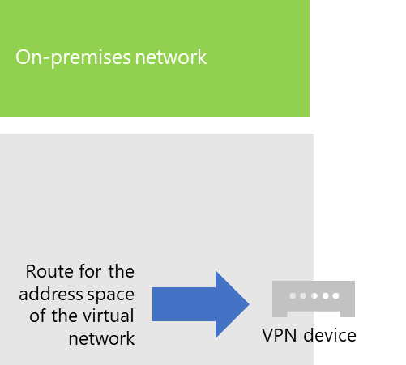
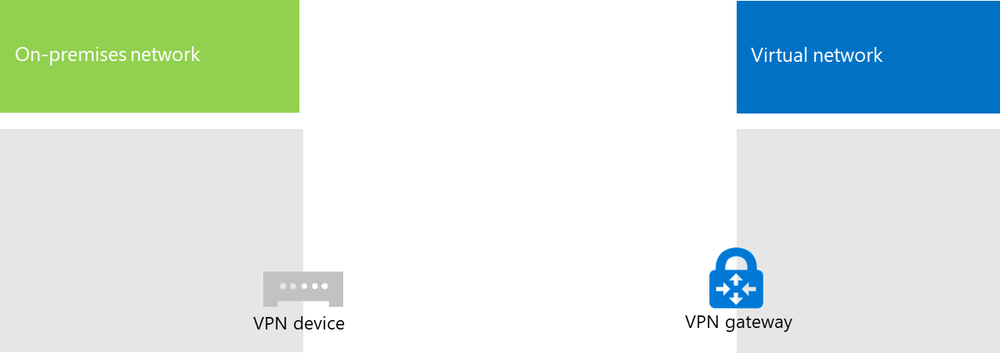

# <a name="connect-an-on-premises-network-to-a-microsoft-azure-virtual-network"></a>Conectar una red local con una red virtual de Microsoft Azure

A cross-premises Azure virtual network is connected to your on-premises network, extending your network to include subnets and virtual machines hosted in Azure infrastructure services. This connection lets computers on your on-premises network to directly access virtual machines in Azure and vice versa. 

Por ejemplo, un servidor de sincronización de directorios que se ejecuta en una máquina virtual de Azure debe consultar los controladores de dominio locales para ver si hay cambios en las cuentas y sincronizar esos cambios con la suscripción de Microsoft 365. En este artículo se muestra cómo configurar una red virtual de Azure entre locales mediante una conexión de red privada virtual (VPN) de sitio a sitio que está lista para hospedar máquinas virtuales de Azure.

## <a name="configure-a-cross-premises-azure-virtual-network"></a>Configuración de una red virtual de Azure entre locales

Your virtual machines in Azure don't have to be isolated from your on-premises environment. To connect Azure virtual machines to your on-premises network resources, you must configure a cross-premises Azure virtual network. The following diagram shows the required components to deploy a cross-premises Azure virtual network with a virtual machine in Azure.
  

 
In the diagram, there are two networks connected by a site-to-site VPN connection: the on-premises network and the Azure virtual network. The site-to-site VPN connection is:

- Se realiza entre dos puntos de conexión direccionables que se encuentran en Internet de acceso público.
- Se termina con un dispositivo VPN en la red local y una Azure VPN Gateway en la red virtual de Azure.

The Azure virtual network hosts virtual machines. Network traffic originating from virtual machines on the Azure virtual network gets forwarded to the VPN gateway, which then forwards the traffic across the site-to-site VPN connection to the VPN device on the on-premises network. The routing infrastructure of the on-premises network then forwards the traffic to its destination.

>[!Note]
>You can also use [ExpressRoute](https://azure.microsoft.com/services/expressroute/), which is a direct connection between your organization and Microsoft's network. Traffic over ExpressRoute does not travel over the public Internet. This article does not describe the use of ExpressRoute.
>
  
Para configurar la conexión VPN entre la red virtual de Azure y su red local, siga estos pasos: 
  
1. **Local:** Defina y cree una ruta de red local para el espacio de direcciones de la red virtual de Azure que señale a su dispositivo de VPN local.
    
2. **Microsoft Azure:** cree una red virtual de Azure con una conexión VPN de sitio a sitio. 
    
3. **Local:** configure el dispositivo VPN de hardware o software local para finalizar la conexión VPN, que usa el Protocolo de seguridad de Internet (IPsec).
    
Después de establecer la conexión VPN de sitio a sitio, agregue máquinas virtuales de Azure a las subredes de la red virtual.
  
## <a name="plan-your-azure-virtual-network"></a>Planear la red virtual de Azure
<a name="PlanningVirtual"></a>

### <a name="prerequisites"></a>Requisitos previos
<a name="Prerequisites"></a>

- An Azure subscription. For information about Azure subscriptions, go to the [How To Buy Azure page](https://azure.microsoft.com/pricing/purchase-options/).
    
- Un espacio de direcciones IPv4 privadas que está disponible y que se puede asignar a la red virtual y sus subredes, con suficiente espacio para albergar el incremento en el número de máquinas virtuales necesarias ahora y en el futuro.
    
- An available VPN device in your on-premises network to terminate the site-to-site VPN connection that supports the requirements for IPsec. For more information, see [About VPN devices for site-to-site virtual network connections](/azure/vpn-gateway/vpn-gateway-about-vpn-devices).
    
- Cambios en la infraestructura de enrutamiento de modo que el tráfico enrutado al espacio de direcciones de la red virtual de Azure se reenvía al dispositivo VPN que hospeda a la conexión VPN de sitio a sitio.
    
- Un proxy web que da acceso a Internet a los equipos que están conectados a la red local y la red virtual de Azure.
    
### <a name="solution-architecture-design-assumptions"></a>Suposiciones de diseño de la arquitectura de la solución

En la siguiente lista se representan las elecciones de diseño que se han tomado para la arquitectura de esta solución. 
  
- This solution uses a single Azure virtual network with a site-to-site VPN connection. The Azure virtual network hosts a single subnet that can contain multiple virtual machines. 
    
- You can use the Routing and Remote Access Service (RRAS) in Windows Server 2016 or Windows Server 2012 to establish an IPsec site-to-site VPN connection between the on-premises network and the Azure virtual network. You can also use other options, such as Cisco or Juniper Networks VPN devices.
    
- The on-premises network might still have network services like Active Directory Domain Services (AD DS), Domain Name System (DNS), and proxy servers. Depending on your requirements, it might be beneficial to place some of these network resources in the Azure virtual network.
    
For an existing Azure virtual network with one or more subnets, determine whether there is remaining address space for an additional subnet to host your needed virtual machines, based on your requirements. If you don't have remaining address space for an additional subnet, create an additional virtual network that has its own site-to-site VPN connection.
  
### <a name="plan-the-routing-infrastructure-changes-for-the-azure-virtual-network"></a>Planear los cambios de infraestructura de enrutamiento de la red virtual de Azure

Debe configurar la infraestructura de enrutamiento local para reenviar tráfico destinado para el espacio de direcciones de la red virtual de Azure al dispositivo VPN local que está hospedando la conexión VPN de sitio a sitio.
  
El método exacto de actualizar su infraestructura de enrutamiento depende de cómo administra la información de enrutamiento, que puede ser:
  
- Actualizaciones de tabla de enrutamiento basadas en configuración manual.
    
- Actualizaciones de tabla de enrutamiento basadas en protocolos de enrutamiento, como Protocolo de información de enrutamiento (RIP) o Abrir ruta de acceso más corta primero (OSPF).
    
Consulte con su especialista en enrutamiento para asegurarse de que el tráfico destinado a la red virtual de Azure se reenvía al dispositivo de VPN local.
  
### <a name="plan-for-firewall-rules-for-traffic-to-and-from-the-on-premises-vpn-device"></a>Planear para reglas de firewall para tráfico desde el dispositivo VPN local y hacia el dispositivo

Si el dispositivo VPN está en una red perimetral que tiene un firewall entre la red perimetral e Internet, es posible que deba configurar el firewall para las siguientes reglas a fin de permitir la conexión de VPN de sitio a sitio.
  
- Tráfico al dispositivo VPN (entrante desde Internet):
    
  - Dirección IP de destino del dispositivo VPN y protocolo IP 50
    
  - Dirección IP de destino del dispositivo VPN y puerto de destino UDP 500
    
  - Dirección IP de destino del dispositivo VPN y puerto de destino UDP 4500
    
- Tráfico desde el dispositivo VPN (saliente a Internet):
    
  - Dirección IP de origen del dispositivo VPN y protocolo IP 50
    
  - Dirección IP de origen del dispositivo VPN y puerto de origen UDP 500
    
  - Dirección IP de origen del dispositivo VPN y puerto de origen UDP 4500
    
### <a name="plan-for-the-private-ip-address-space-of-the-azure-virtual-network"></a>Planear el espacio de direcciones IP privadas de la red virtual de Azure

El espacio de direcciones IP privadas de la red virtual de Azure debe poder albergar las direcciones utilizadas por Azure para hospedar a la red virtual con al menos una subred que tenga suficientes direcciones para sus máquinas virtuales de Azure.
  
Para determinar el número de direcciones necesarias para la subred, cuente el número de máquinas virtuales que necesita ahora, estime el crecimiento futuro y luego use la siguiente tabla para determinar el tamaño de la subred.
  
|**Número de máquinas virtuales necesarias**|**Número de bits de host necesarios**|**Tamaño de la subred**|
|:-----|:-----|:-----|
|1-3  <br/> |3  <br/> |/29  <br/> |
|4-11  <br/> |4  <br/> |/28  <br/> |
|12-27  <br/> |5  <br/> |/27  <br/> |
|28-59  <br/> |6  <br/> |/26  <br/> |
|60-123  <br/> |7   <br/> |/25  <br/> |
   
### <a name="planning-worksheet-for-configuring-your-azure-virtual-network"></a>Planear la hoja de cálculo para configurar la red virtual de Azure
<a name="worksheet"> </a>

Antes de crear una red virtual de Azure para hospedar las máquinas virtuales, debe determinar la configuración necesaria en las tablas siguientes.
  
Para la configuración de la red virtual, rellene la Tabla V.
  
 **Tabla V: Configuración de la red virtual entre locales**
  
|**Elemento**|**Elemento Configuration**|**Descripción**|**Valor**|
|:-----|:-----|:-----|:-----|
|1.  <br/> |Nombre de la red virtual  <br/> |Nombre que se va a asignar a la red virtual de Azure (por ejemplo, DirSyncNet).  <br/> | |
|2.  <br/> |Ubicación de la red virtual  <br/> |Centro de datos de Azure que contendrá la red virtual (por ejemplo, Oeste de EE. UU.).  <br/> |  <br/> |
|3.  <br/> |Dirección IP del dispositivo VPN  <br/> |Dirección IPv4 pública de la interfaz del dispositivo VPN en Internet. Colabore con su departamento de TI para determinar esta dirección.  <br/> |  <br/> |
|4.  <br/> |Espacio de direcciones de la red virtual  <br/> |The address space (defined in a single private address prefix) for the virtual network. Work with your IT department to determine this address space. The address space should be in Classless Interdomain Routing (CIDR) format, also known as network prefix format. An example is 10.24.64.0/20.  <br/> | <br/> |
|5.  <br/> |Clave compartida IPsec  <br/> |A 32-character random, alphanumeric string that will be used to authenticate both sides of the site-to-site VPN connection. Work with your IT or security department to determine this key value and then store it in a secure location. Alternately, see [Create a random string for an IPsec preshared key](https://social.technet.microsoft.com/wiki/contents/articles/32330.create-a-random-string-for-an-ipsec-preshared-key.aspx).  <br/> | <br/> |
   
Rellene la Tabla S para las subredes de esta solución.
  
- For the first subnet, determine a 28-bit address space (with a /28 prefix length) for the Azure gateway subnet. See [Calculating the gateway subnet address space for Azure virtual networks](/archive/blogs/solutions_advisory_board/calculating-the-gateway-subnet-address-space-for-azure-virtual-networks) for information about how to determine this address space.
    
- Para la segunda subred, especifique un nombre descriptivo, un único espacio de direcciones IP basado en el espacio de direcciones de la red virtual y una finalidad descriptiva.
    
Work with your IT department to determine these address spaces from the virtual network address space. Both address spaces should be in CIDR format.
  
 **Tabla S: Subredes de la red virtual**
  
|**Elemento**|**Nombre de la subred**|**Espacio de direcciones de la subred**|**Finalidad**|
|:-----|:-----|:-----|:-----|
|1.  <br/> |GatewaySubnet  <br/> |  <br/> |Subred usada por la puerta de enlace de Azure.  <br/> |
|2.  <br/> |  <br/> |  <br/> |  <br/> |
   
For the on-premises DNS servers that you want the virtual machines in the virtual network to use, fill in Table D. Give each DNS server a friendly name and a single IP address. This friendly name does not need to match the host name or computer name of the DNS server. Note that two blank entries are listed, but you can add more. Work with your IT department to determine this list.
  
 **Tabla D: Servidores DNS locales**
  
|**Elemento**|**Nombre descriptivo del servidor DNS**|**Dirección IP del servidor DNS**|
|:-----|:-----|:-----|
|1.  <br/> |  <br/> |  <br/> |
|2.  <br/> |  <br/> |  <br/> |
   
To route packets from the Azure virtual network to your organization network across the site-to-site VPN connection, you must configure the virtual network with a local network. This local network has a list of the address spaces (in CIDR format) for all of the locations on your organization's on-premises network that the virtual machines in the virtual network must reach. This can be all of the locations on the on-premises network or a subset. The list of address spaces that define your local network must be unique and must not overlap with the address spaces used for this virtual network or your other cross-premises virtual networks.
  
For the set of local network address spaces, fill in Table L. Note that three blank entries are listed but you will typically need more. Work with your IT department to determine this list.
  
 **Tabla L: Prefijos de direcciones para la red local**
  
|**Elemento**|**Espacio de direcciones de la red local**|
|:-----|:-----|
|1.  <br/> |  <br/> |
|2.  <br/> |  <br/> |
|3.  <br/> |  <br/> |
   
## <a name="deployment-roadmap"></a>Guía de implementación
<a name="DeploymentRoadmap"> </a>

La creación de la red virtual entre locales y la adición de máquinas virtuales en Azure consta de tres fases:
  
- Fase 1: Prepare la red local.
    
- Fase 2: Cree la red virtual entre locales en Azure.
    
- Fase 3 (opcional): Agregue máquinas virtuales.
    
### <a name="phase-1-prepare-your-on-premises-network"></a>Fase 1: Prepare la red local.
<a name="Phase1"></a>

You must configure your on-premises network with a route that points to and ultimately delivers traffic destined for the address space of the virtual network to the router on the edge of the on-premises network. Consult with your network administrator to determine how to add the route to the routing infrastructure of your on-premises network.
  
Esta es la configuración resultante.
  

  
### <a name="phase-2-create-the-cross-premises-virtual-network-in-azure"></a>Fase 2: Cree la red virtual entre locales en Azure.
<a name="Phase2"></a>

First, open an Azure PowerShell prompt. If you have not installed Azure PowerShell, see [Get started with Azure PowerShell](/powershell/azure/get-started-azureps).

 
A continuación, inicie sesión en su cuenta de Azure con este comando.
  
```powershell
Connect-AzAccount
```

Obtenga su nombre de suscripción mediante el comando siguiente.
  
```powershell
Get-AzSubscription | Sort SubscriptionName | Select SubscriptionName
```

Set your Azure subscription with these commands. Replace everything within the quotes, including the < and > characters, with the correct subscription name.
  
```powershell
$subscrName="<subscription name>"
Select-AzSubscription -SubscriptionName $subscrName
```

Next, create a new resource group for your virtual network. To determine a unique resource group name, use this command to list your existing resource groups.
  
```powershell
Get-AzResourceGroup | Sort ResourceGroupName | Select ResourceGroupName
```

Cree el nuevo grupo de recursos con estos comandos.
  
```powershell
$rgName="<resource group name>"
$locName="<Table V - Item 2 - Value column>"
New-AzResourceGroup -Name $rgName -Location $locName
```

A continuación, cree la red virtual de Azure.
  
```powershell
# Fill in the variables from previous values and from Tables V, S, and D
$rgName="<name of your new resource group>"
$locName="<Azure location of your new resource group>"
$vnetName="<Table V - Item 1 - Value column>"
$vnetAddrPrefix="<Table V - Item 4 - Value column>"
$gwSubnetPrefix="<Table S - Item 1 - Subnet address space column>"
$SubnetName="<Table S - Item 2 - Subnet name column>"
$SubnetPrefix="<Table S - Item 2 - Subnet address space column>"
$dnsServers=@( "<Table D - Item 1 - DNS server IP address column>", "<Table D - Item 2 - DNS server IP address column>" )
$locShortName=(Get-AzResourceGroup -Name $rgName).Location

# Create the Azure virtual network and a network security group that allows incoming remote desktop connections to the subnet that is hosting virtual machines
$gatewaySubnet=New-AzVirtualNetworkSubnetConfig -Name "GatewaySubnet" -AddressPrefix $gwSubnetPrefix
$vmSubnet=New-AzVirtualNetworkSubnetConfig -Name $SubnetName -AddressPrefix $SubnetPrefix
New-AzVirtualNetwork -Name $vnetName -ResourceGroupName $rgName -Location $locName -AddressPrefix $vnetAddrPrefix -Subnet $gatewaySubnet,$vmSubnet -DNSServer $dnsServers
$rule1=New-AzNetworkSecurityRuleConfig -Name "RDPTraffic" -Description "Allow RDP to all VMs on the subnet" -Access Allow -Protocol Tcp -Direction Inbound -Priority 100 -SourceAddressPrefix Internet -SourcePortRange * -DestinationAddressPrefix * -DestinationPortRange 3389
New-AzNetworkSecurityGroup -Name $SubnetName -ResourceGroupName $rgName -Location $locShortName -SecurityRules $rule1
$vnet=Get-AzVirtualNetwork -ResourceGroupName $rgName -Name $vnetName
$nsg=Get-AzNetworkSecurityGroup -Name $SubnetName -ResourceGroupName $rgName
Set-AzVirtualNetworkSubnetConfig -VirtualNetwork $vnet -Name $SubnetName -AddressPrefix $SubnetPrefix -NetworkSecurityGroup $nsg
$vnet | Set-AzVirtualNetwork
```

Esta es la configuración resultante.
  

  
Después, use estos comandos para crear las puertas de enlace para la conexión VPN de sitio a sitio.
  
```powershell
# Fill in the variables from previous values and from Tables V and L
$vnetName="<Table V - Item 1 - Value column>"
$localGatewayIP="<Table V - Item 3 - Value column>"
$localNetworkPrefix=@( <comma-separated, double-quote enclosed list of the local network address prefixes from Table L, example: "10.1.0.0/24", "10.2.0.0/24"> )
$vnetConnectionKey="<Table V - Item 5 - Value column>"
$vnet=Get-AzVirtualNetwork -Name $vnetName -ResourceGroupName $rgName
# Attach a virtual network gateway to a public IP address and the gateway subnet
$publicGatewayVipName="PublicIPAddress"
$vnetGatewayIpConfigName="PublicIPConfig"
New-AzPublicIpAddress -Name $vnetGatewayIpConfigName -ResourceGroupName $rgName -Location $locName -AllocationMethod Dynamic
$publicGatewayVip=Get-AzPublicIpAddress -Name $vnetGatewayIpConfigName -ResourceGroupName $rgName
$vnetGatewayIpConfig=New-AzVirtualNetworkGatewayIpConfig -Name $vnetGatewayIpConfigName -PublicIpAddressId $publicGatewayVip.Id -SubnetId $vnet.Subnets[0].Id
# Create the Azure gateway
$vnetGatewayName="AzureGateway"
$vnetGateway=New-AzVirtualNetworkGateway -Name $vnetGatewayName -ResourceGroupName $rgName -Location $locName -GatewayType Vpn -VpnType RouteBased -IpConfigurations $vnetGatewayIpConfig
# Create the gateway for the local network
$localGatewayName="LocalNetGateway"
$localGateway=New-AzLocalNetworkGateway -Name $localGatewayName -ResourceGroupName $rgName -Location $locName -GatewayIpAddress $localGatewayIP -AddressPrefix $localNetworkPrefix
# Create the Azure virtual network VPN connection
$vnetConnectionName="S2SConnection"
$vnetConnection=New-AzVirtualNetworkGatewayConnection -Name $vnetConnectionName -ResourceGroupName $rgName -Location $locName -ConnectionType IPsec -SharedKey $vnetConnectionKey -VirtualNetworkGateway1 $vnetGateway -LocalNetworkGateway2 $localGateway
```

Esta es la configuración resultante.
  

  
Next, configure your on-premises VPN device to connect to the Azure VPN gateway. For more information, see [About VPN Devices for site-to-site Azure Virtual Network connections](/azure/vpn-gateway/vpn-gateway-about-vpn-devices).
  
Para configurar el dispositivo VPN, necesita lo siguiente:
  
- La dirección IPv4 pública de la puerta de enlace de VPN para la red virtual. Use el comando **Get-AzPublicIpAddress -Name $vnetGatewayIpConfigName -ResourceGroupName $rgName** para mostrar esta dirección.
    
- La clave precompartida IPsec para la conexión VPN de sitio a sitio (Tabla V, elemento 5, columna Valor).
    
Esta es la configuración resultante.
  

  
### <a name="phase-3-optional-add-virtual-machines"></a>Fase 3 (opcional): Agregar máquinas virtuales

Create the virtual machines you need in Azure. For more information, see [Create a Windows virtual machine with the Azure portal](https://go.microsoft.com/fwlink/p/?LinkId=393098).
  
Use la configuración siguiente:
  
- On the **Basics** tab, select the same subscription and resource group as your virtual network. You will need these later to sign in to the virtual machine. In the **Instance details** section, choose the appropriate virtual machine size. Record the administrator account user name and password in a secure location. 
    
- On the **Networking** tab, select the name of your virtual network and the subnet for hosting virtual machines (not the GatewaySubnet). Leave all other settings at their default values.
    
Verify that your virtual machine is using DNS correctly by checking your internal DNS to ensure that Address (A) records were added for you new virtual machine. To access the Internet, your Azure virtual machines must be configured to use your on-premises network's proxy server. Contact your network administrator for additional configuration steps to perform on the server.
  
Esta es la configuración resultante.
  

  
## <a name="next-step"></a>Paso siguiente
  
[Implementación de la sincronización de directorios de Microsoft 365 en Microsoft Azure](deploy-microsoft-365-directory-synchronization-dirsync-in-microsoft-azure.md)