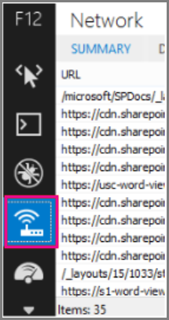

# <a name="content-delivery-networks-cdns"></a>Redes de entrega de contenido (CDN)

*Este artículo afecta tanto a Office 365 Enterprise como a Microsoft 365 Enterprise*

Las redes CDN ayudan a mantener Office 365 rápido y confiable para los usuarios finales. Los servicios en la nube como Office 365 usan redes CDN para almacenar en caché los recursos estáticos más cerca de los exploradores que les solicitan que acelere las descargas y reduzca la latencia percibida del usuario final. La información de este tema le ayudará a obtener información sobre las redes de entrega de contenido (CDN) y cómo las usa Office 365.

## <a name="what-exactly-is-a-cdn"></a>¿Qué es exactamente una red CDN?

Una red CDN es una red distribuida geográficamente que consta de servidores proxy y de archivos en centros de datos conectados por redes troncales de alta velocidad. Las redes CDN se usan para reducir la latencia y los tiempos de carga de un conjunto especificado de archivos y objetos en un sitio web o servicio. Una red CDN puede tener muchos miles de puntos de conexión para un mantenimiento óptimo de las solicitudes entrantes desde cualquier ubicación.

Las redes CDN se usan normalmente para proporcionar descargas más rápidas de contenido genérico para un sitio web o servicio, como archivos javascript, iconos e imágenes, y también pueden proporcionar acceso privado al contenido del usuario, como archivos en bibliotecas de documentos de SharePoint Online, archivos multimedia de streaming y código personalizado.

La mayoría de los servicios en la nube empresariales usan las redes CDN. Los servicios en la nube como Office 365 tienen millones de clientes descargando una combinación de contenido propietario (como correos electrónicos) y contenido genérico (como iconos) a la vez. Es más eficaz colocar imágenes que todos usan, como iconos, lo más cerca posible del equipo del usuario. No resulta práctico que todos los servicios en la nube compilen centros de datos de CDN que almacenan este contenido genérico en cada área metropolitana, o incluso en todos los principales centros de Internet de todo el mundo, por lo que algunas de estas redes CDN se comparten.

## <a name="how-do-cdns-make-services-work-faster"></a>¿Cómo hacen las redes CDN para que los servicios funcionen más rápido?

La descarga de objetos comunes como imágenes de sitio e iconos una y otra vez puede tomar ancho de banda de red que se puede usar mejor para descargar contenido personal importante, como correo electrónico o documentos. Dado que Office 365 usa una arquitectura que incluye redes CDN, los iconos, scripts y otro contenido genérico se pueden descargar desde servidores más cercanos a los equipos cliente, lo que hace que las descargas sean más rápidas. Esto significa un acceso más rápido al contenido personal, que se almacena de forma segura en Office 365 centros de datos.

Las redes CDN ayudan a mejorar el rendimiento del servicio en la nube de varias maneras:

- Las redes CDN desplazan parte de la carga de descarga de archivos y de red del servicio en la nube, lo que libera los recursos del servicio en la nube para atender el contenido del usuario y otros servicios al reducir la necesidad de atender solicitudes de recursos estáticos.
- Las redes CDN están diseñadas para proporcionar acceso a archivos de baja latencia mediante la implementación de redes de alto rendimiento y servidores de archivos y el aprovechamiento de protocolos de red actualizados, como [HTTP/2](https://en.wikipedia.org/wiki/HTTP/2) , con compresión y multiplexación de solicitudes altamente eficientes.
- Las redes CDN usan muchos puntos de conexión distribuidos globalmente para que el contenido esté disponible lo más cerca posible de los usuarios.

## <a name="the-office-365-cdn"></a>La red CDN de Office 365

La red de entrega de contenido (CDN) integrada Office 365 permite a los administradores de Office 365 proporcionar un mejor rendimiento para las páginas de SharePoint Online de su organización mediante el almacenamiento en caché de recursos estáticos más cerca de los exploradores que los solicitan, lo que ayuda a acelerar las descargas y reducir la latencia. El Office 365 CDN usa el [protocolo HTTP/2](https://en.wikipedia.org/wiki/HTTP/2) para mejorar las velocidades de compresión y descarga.

> [!NOTE]
> La red CDN de Office 365 solo está disponible para los inquilinos en la nube **de producción** (en todo el mundo). Actualmente, los inquilinos de las nubes del Gobierno de EE. UU., China y Alemania no admiten la red CDN de Office 365.

La CDN de Office 365 se compone de varias redes CDN que permite hospedar archivos estáticos en varias ubicaciones u _orígenes_ y a realizar la entrega desde redes de alta velocidad globales. Según el tipo de contenido que quiera hospedar en la CDN de Office 365, puede agregar orígenes **públicos**, **privados** o ambos.


El contenido en orígenes **públicos** dentro de la CDN de Office 365 es accesible de forma anónima y cualquier persona que tenga la URL a los activos hospedado puede acceder. Dado que el acceso al contenido en orígenes públicos es anónimo, solo debe usarlos para almacenar en caché contenido genérico no confidencial, como archivos Javascript, scripts, iconos e imágenes. La CDN de Office 365 se usa de forma predeterminada para descargar activos de recurso genéricos como las aplicaciones cliente de Office 365 desde un origen público.

**Los orígenes privados** dentro de la red CDN de Office 365 proporcionan acceso privado al contenido del usuario, como bibliotecas de documentos de SharePoint Online, sitios e imágenes propietarias. El acceso al contenido de orígenes privados está protegido con tokens generados de forma dinámica, por lo que pueden acceder los usuarios con permisos para la ubicación de almacenamiento o de biblioteca de documentos original. Los orígenes privados en la CDN de Office 365 solo pueden usarse para el contenido de SharePoint Online y solo se puede acceder a los activos mediante el redireccionamiento de su espacio empresarial de SharePoint Online.

La red CDN de Office 365 se incluye como parte de la suscripción a SharePoint Online.

Para obtener más información sobre cómo usar la red CDN de Office 365, vea [Uso de la red de entrega de contenido Office 365 con SharePoint Online](use-microsoft-365-cdn-with-spo.md).

Para ver una serie de vídeos breves que proporcionan información conceptual y howto sobre el uso de la red CDN de Office 365, visite el [canal de YouTube Patrones y prácticas para desarrolladores de SharePoint](https://aka.ms/sppnp-videos).

## <a name="other-microsoft-cdns"></a>Otras redes CDN de Microsoft

Aunque no forma parte de la red CDN de Office 365, puede usar estas redes CDN en el inquilino de Office 365 para acceder a bibliotecas de desarrollo de SharePoint, código personalizado y otros fines que se encuentran fuera del ámbito de la red CDN de Office 365.

### <a name="azure-cdn"></a>CDN de Azure

>[!NOTE]
>A partir del tercer trimestre de 2020, SharePoint Online comenzará a almacenar en caché vídeos en Azure CDN para admitir una mejor reproducción y confiabilidad de vídeo. Los vídeos más populares se transmitirán desde el punto de conexión de CDN más cercano al usuario. Estos datos permanecerán dentro del límite de Microsoft Purview. Se trata de un servicio gratuito para todos los inquilinos y no requiere ninguna acción del cliente para configurarla.

Puede usar **Azure CDN** para implementar su propia instancia de CDN para hospedar elementos web personalizados, bibliotecas y otros recursos de recursos, lo que le permite aplicar claves de acceso al almacenamiento de la red CDN y ejercer un mayor control sobre la configuración de la red CDN. El uso de Azure CDN no es gratuito y requiere una suscripción de Azure.

Para obtener más información sobre cómo configurar una instancia de Azure CDN, consulte [Inicio rápido: Integración de una cuenta de Azure Storage con Azure CDN](/azure/cdn/cdn-create-a-storage-account-with-cdn).

Para obtener un ejemplo de cómo se puede usar Azure CDN para hospedar elementos web de SharePoint, consulte [Implementación del elemento web del lado cliente de SharePoint en Azure CDN](/sharepoint/dev/spfx/web-parts/get-started/deploy-web-part-to-cdn).

Para obtener información sobre el módulo de PowerShell de Azure CDN, consulte [Administración de Azure CDN con PowerShell](/azure/cdn/cdn-manage-powershell).

### <a name="microsoft-ajax-cdn"></a>Microsoft Ajax CDN

**Ajax CDN** de Microsoft es una red CDN de solo lectura que ofrece muchas bibliotecas de desarrollo populares, como jQuery (y todas sus demás bibliotecas), ASP.NET Ajax, Bootstrap, Knockout.js y otras.
  
Para incluir estos scripts en el proyecto, simplemente reemplace las referencias a estas bibliotecas disponibles públicamente por referencias a la dirección cdn en lugar de incluirlas en el propio proyecto. Por ejemplo, use el código siguiente para vincular a jQuery:

``` html
<script src=https://ajax.aspnetcdn.com/ajax/jquery-2.1.1.js> </script>
```

Para obtener más información sobre cómo usar la red CDN de Microsoft Ajax, consulte [CdN de Microsoft Ajax](/aspnet/ajax/cdn/overview).

## <a name="how-does-office-365-use-content-from-a-cdn"></a>¿Cómo usa Office 365 contenido de una red CDN?

Independientemente de la red CDN que configure para el inquilino de Office 365, el proceso básico de recuperación de datos es el mismo.

1. El cliente (un explorador o una aplicación cliente de Office) solicita datos de Office 365.

2. Office 365 devuelve los datos directamente al cliente o, si los datos forman parte de un conjunto de contenido hospedado por la red CDN, redirige el cliente a la dirección URL de la red CDN.

    a. Si los datos ya están almacenados en caché en un origen _público_ , el cliente descarga los datos directamente desde la ubicación de red CDN más cercana al cliente.

    b. Si los datos ya están almacenados en caché en un origen _privado_, el servicio CDN comprueba los permisos de la cuenta de usuario de Office 365 en el origen. Si tiene permisos, SharePoint Online genera dinámicamente una dirección URL personalizada compuesta por la ruta de acceso al recurso en la red CDN y dos tokens de acceso, y devuelve la dirección URL personalizada al cliente. A continuación, el cliente descarga los datos directamente desde la ubicación de CDN más cercana al cliente mediante la dirección URL personalizada.

3. Si los datos no se almacenan en caché en la red CDN, el nodo cdn solicita los datos de Office 365 y, a continuación, almacena en caché los datos durante un tiempo después de que el cliente descargue los datos.

La red CDN determina el centro de datos más cercano al explorador del usuario y, mediante el redireccionamiento, descarga los datos solicitados desde allí. El redireccionamiento de la red CDN es rápido y puede ahorrar mucho tiempo de descarga a los usuarios.

## <a name="how-should-i-set-up-my-network-so-that-cdns-work-best-with-office-365"></a>¿Cómo debo configurar mi red para que las redes CDN funcionen mejor con Office 365?

Minimizar la latencia entre los clientes de la red y los puntos de conexión de CDN es la consideración clave para garantizar un rendimiento óptimo. Puede usar los procedimientos recomendados [descritos en Administración de puntos de conexión de Office 365](managing-office-365-endpoints.md) para asegurarse de que la configuración de red permite a los exploradores cliente acceder directamente a la red CDN en lugar de enrutar el tráfico de la red CDN a través de servidores proxy centrales para evitar la introducción de latencia innecesaria.

También puede leer [Office 365 Principios de conectividad de red](./microsoft-365-network-connectivity-principles.md) para comprender los conceptos subyacentes a la optimización del rendimiento de Office 365 red.

## <a name="is-there-a-list-of-all-the-cdns-that-office-365-uses"></a>¿Hay una lista de todas las redes CDN que Office 365 usa?

Las redes CDN en uso por Office 365 siempre están sujetas a cambios y, en muchos casos, hay varios asociados de red CDN configurados en caso de que uno no esté disponible. Las redes CDN principales usadas por Office 365 son:

|CDN  |Empresa  |Uso  |Vínculo  |
|---------|---------|---------|---------|
|Office 365 CDN     |Microsoft Azure         |Recursos genéricos en orígenes públicos, contenido de usuario de SharePoint en orígenes privados         |[Microsoft Azure CDN](/azure/frontdoor/)         |
|CDN de Azure     |Microsoft         |Código personalizado, soluciones de SharePoint Framework         |[Microsoft Azure CDN](/azure/frontdoor/)         |
|CdN de Microsoft Ajax (solo lectura)     |Microsoft         |Bibliotecas comunes para Ajax, jQuery, ASP.NET, Bootstrap, Knockout.js, etc.         |[Microsoft Ajax CDN](/aspnet/ajax/cdn/overview)         |

## <a name="what-performance-gains-does-a-cdn-provide"></a>¿Qué mejoras de rendimiento proporciona una red CDN?

Hay muchos factores implicados en la medición de diferencias específicas en el rendimiento entre los datos descargados directamente de Office 365 y los datos descargados de una red CDN específica, como la ubicación relativa al inquilino y al punto de conexión de CDN más cercano, el número de recursos de una página que proporciona la red CDN y los cambios transitorios en la latencia de red y el ancho de banda. Sin embargo, una prueba A/B simple puede ayudar a mostrar la diferencia en el tiempo de descarga de un archivo específico.

En las capturas de pantalla siguientes se muestra la diferencia en la velocidad de descarga entre la ubicación del archivo nativo en Office 365 y el mismo archivo hospedado en [Microsoft Ajax Content Delivery Network](/aspnet/ajax/cdn/overview). Estas capturas de pantalla se encuentran en la pestaña **Red** de las herramientas para desarrolladores de Internet Explorer 11. En estas capturas de pantalla se muestra la latencia en la popular biblioteca jQuery. Para abrir esta pantalla, en Internet Explorer, presione **F12** y seleccione la pestaña **Red** , que se simboliza con un icono de Wi-Fi.
  

  
En esta captura de pantalla se muestra la biblioteca cargada en la galería de páginas maestras en el propio sitio de SharePoint Online. El tiempo necesario para cargar la biblioteca es de 1,51 segundos.
  

  
En la segunda captura de pantalla se muestra el mismo archivo entregado por la red CDN de Microsoft. Esta vez la latencia es de alrededor de 496 milisegundos. Se trata de una gran mejora y muestra que se afeita todo un segundo el tiempo total para descargar el objeto.
  


## <a name="is-my-data-safe"></a>¿Mis datos están seguros?

Nos preocupamos mucho por proteger los datos que ejecutan su empresa. Los datos almacenados en la red CDN de Office 365 se cifran tanto en tránsito como en reposo, y el acceso a los datos de la red CDN de SharePoint Office 365 se protege mediante Office 365 permisos de usuario y autorización de token. Las solicitudes de datos en la red CDN de SharePoint de Office 365 deben ser remitidas (redirigidas) desde el inquilino de Office 365 o no se generará un token de autorización.

Para asegurarse de que los datos permanecen seguros, se recomienda no almacenar nunca contenido de usuario u otros datos confidenciales en una red CDN pública. Dado que el acceso a los datos de una red CDN pública es anónimo, las redes CDN públicas solo deben usarse para hospedar contenido genérico, como archivos de script web, iconos, imágenes y otros recursos no confidenciales.

> [!NOTE]
> Los proveedores de CDN de terceros pueden tener estándares de privacidad y cumplimiento que difieren de los compromisos descritos por el Centro de confianza de Office 365. Es posible que los datos almacenados en caché a través del servicio CDN no se ajusten a los Términos de procesamiento de datos (DPT) de Microsoft y que estén fuera de los límites de cumplimiento del Centro de confianza de Office 365.

Para obtener información detallada sobre la privacidad y la protección de datos para Office 365 proveedores de red CDN, visite lo siguiente:  

- Más información sobre Office 365 privacidad y protección de datos en el Centro de [confianza de Microsoft](https://www.microsoft.com/trustcenter)
- Obtenga más información sobre la privacidad y la protección de datos de [Akamai](https://www.akamai.com/us/en/about/compliance/data-protection-at-akamai.jsp) en el Centro de confianza de privacidad de Akamai.
- Más información sobre la privacidad y la protección de datos de Azure en el [Centro de confianza de Azure](https://azure.microsoft.com/overview/trusted-cloud/)

## <a name="how-can-i-secure-my-network-with-all-these-3rd-party-services"></a>¿Cómo puedo proteger mi red con todos estos servicios de terceros?

El uso de un amplio conjunto de servicios de asociados permite Office 365 escalar y cumplir los requisitos de disponibilidad y mejorar la experiencia del usuario al usar Office 365. Los servicios de terceros Office 365 aprovecha incluyen listas de revocación de certificados, como crl.microsoft.com o sa.symcb.com, y cdN, como r3.res.outlook.com. Cada FQDN de CDN generado por Office 365 es un FQDN personalizado para Office 365. Si se le envía a un FQDN a petición de Office 365, puede estar seguro de que el proveedor de cdn controla el FQDN y el contenido subyacente en esa ubicación.
  
Para los clientes que quieran separar las solicitudes destinadas a un centro de datos de Microsoft o Office 365 de las solicitudes destinadas a un tercero, hemos escrito instrucciones sobre [la administración de puntos de conexión de Office 365](https://support.office.com/article/99cab9d4-ef59-4207-9f2b-3728eb46bf9a).

## <a name="is-there-a-list-of-all-the-fqdns-that-leverage-cdns"></a>¿Hay una lista de todos los FQDN que aprovechan las redes CDN?

La lista de FQDN y cómo aprovechan las redes CDN cambia con el tiempo. Consulte nuestra página publicada [Office 365 direcciones URL e intervalos de direcciones IP](./urls-and-ip-address-ranges.md) para ponerse al día de los FQDN más recientes que aprovechan las REDES CDN.

También puede usar el [servicio web de direcciones IP y direcciones IP de Office 365](microsoft-365-ip-web-service.md) para solicitar las direcciones URL de Office 365 actuales y los intervalos de direcciones IP con formato CSV o JSON.

## <a name="can-i-use-my-own-cdn-and-cache-content-on-my-local-network"></a>¿Puedo usar mi propia red CDN y almacenar en caché contenido en mi red local?

Estamos buscando continuamente nuevas formas de satisfacer las necesidades de nuestros clientes y estamos explorando actualmente el uso de soluciones de proxy de almacenamiento en caché y otras soluciones de CDN locales.

Aunque no forma parte de la Office 365 RED CDN, también puede usar **Azure CDN** para hospedar elementos web personalizados, bibliotecas y otros recursos de recursos, lo que le permite aplicar claves de acceso al almacenamiento de la red CDN y ejercer un mayor control sobre la configuración de la red CDN. El uso de Azure CDN no es gratuito y requiere una suscripción de Azure. Para obtener más información sobre cómo configurar una instancia de Azure CDN, consulte [Inicio rápido: Integración de una cuenta de Azure Storage con Azure CDN](/azure/cdn/cdn-create-a-storage-account-with-cdn).

## <a name="im-using-azure-expressroute-for-office-365-does-that-change-things"></a>Estoy usando Azure ExpressRoute para Office 365, ¿eso cambia las cosas?

[Azure ExpressRoute para Office 365](azure-expressroute.md) proporciona una conexión dedicada a Office 365 infraestructura que se separa de la red pública de Internet. Esto significa que los clientes seguirán teniendo que conectarse a través de conexiones que no son de ExpressRoute para conectarse a redes CDN y a otra infraestructura de Microsoft que no se incluya explícitamente en la lista de servicios admitidos por ExpressRoute. Para obtener más información sobre cómo enrutar el tráfico específico, como las solicitudes destinadas a redes CDN, consulte [Office 365 administración del tráfico de red](routing-with-expressroute.md).

## <a name="can-i-use-cdns-with-sharepoint-server-on-premises"></a>¿Puedo usar redes CDN con SharePoint Server local?

El uso de redes CDN solo tiene sentido en un contexto de SharePoint Online y debe evitarse con SharePoint Server. Esto se debe a que todas las ventajas en torno a la ubicación geográfica no se cumplen si el servidor se encuentra en el entorno local o geográficamente cerca de todos modos. Además, si hay una conexión de red a los servidores donde se hospeda, el sitio puede usarse sin una conexión a Internet y, por tanto, no puede recuperar los archivos de la red CDN. De lo contrario, debe usar una red CDN si hay una disponible y estable para la biblioteca y los archivos que necesita para su sitio.
  
Este es un vínculo breve que se puede usar para volver: [https://aka.ms/o365cdns]()
  
## <a name="see-also"></a>Vea también

[Principios de conectividad de red de Office 365](./microsoft-365-network-connectivity-principles.md)

[Evaluar la red de Office 365](assessing-network-connectivity.md)

[Administrar puntos de conexión de Office 365](managing-office-365-endpoints.md)

[Direcciones URL e intervalos de direcciones IP de Office 365](./urls-and-ip-address-ranges.md)

[Uso de la red de entrega de contenido de Office 365 con SharePoint Online](use-microsoft-365-cdn-with-spo.md)

[Centro de confianza de Microsoft](https://www.microsoft.com/trustcenter)

[Ajustar el rendimiento de Office 365](tune-microsoft-365-performance.md)
