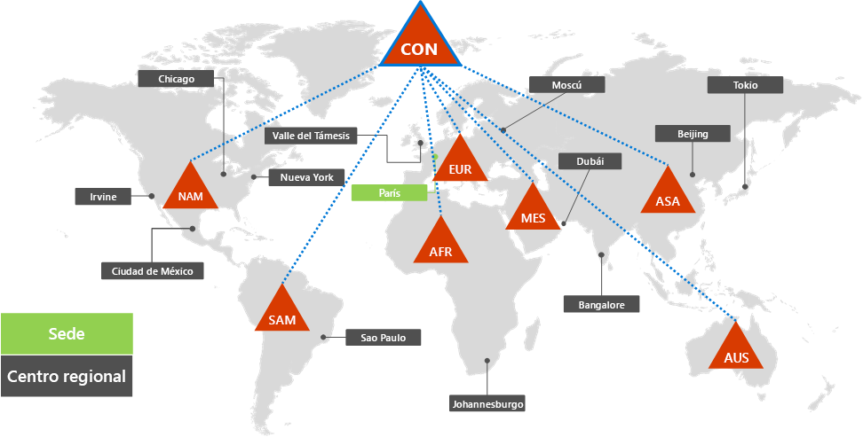
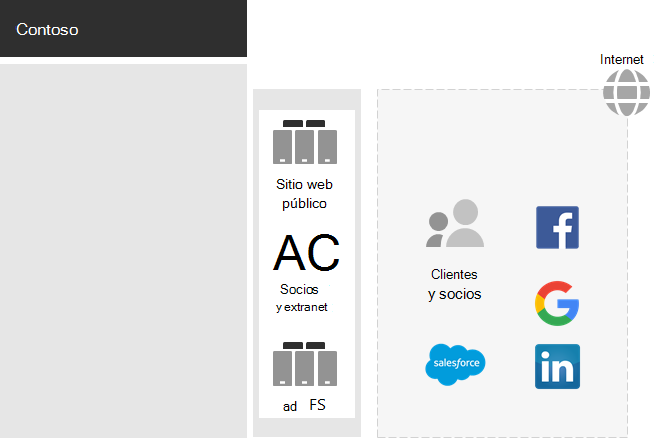
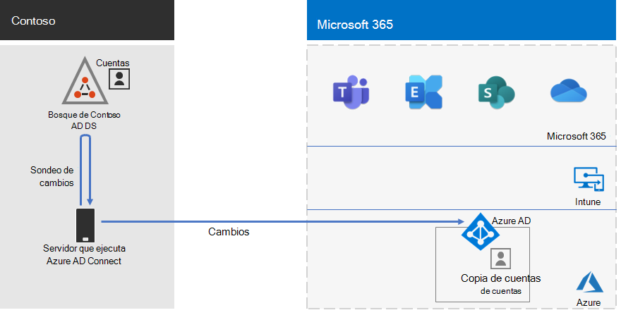
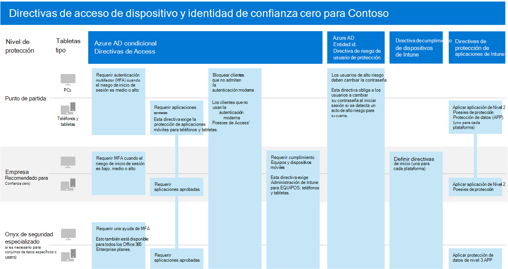

# Identidad para Contoso CorporationIdentity for the Contoso Corporation

Microsoft proporciona una Identidad como servicio (IDaaS) en su oferta en la nube con Azure Active Directory (Azure AD).Microsoft provides an Identity as a Service (IDaaS) across its cloud offerings with Azure Active Directory (Azure AD). Para adoptar Microsoft 365 para empresas, la solución IDaaS de Contoso tuvo que aprovechar su proveedor de identidades local y seguir incluyendo la autenticación federada con sus proveedores de identidades de terceros de confianza existentes.To adopt Microsoft 365 for enterprise, Contoso's IDaaS solution had to leverage their on-premises identity provider and still include federated authentication with their existing trusted, third-party identity providers.

## Bosque de Active Directory Domain Services de ContosoContoso's Active Directory Domain Services forest

Contoso usa un único bosque de Active Directory Domain Services (AD DS) para contoso.com con siete subdominios, uno para cada región del mundo.Contoso uses a single Active Directory Domain Services (AD DS) forest for contoso.com with seven sub-domains, one for each region of the world. La sede, las oficinas regionales y las oficinas satélite contienen controladores de dominio para la autenticación y la autorización local.The headquarters, regional hub offices, and satellite offices contain domain controllers for local authentication and authorization.

Este es el bosque de Contoso con dominios regionales para las distintas partes del mundo que contienen centros regionales.Here is the Contoso forest with regional domains for the different parts of the world that contain regional hubs.

 
Contoso quería usar las cuentas y los grupos del bosque contoso.com para la autenticación y la autorización de sus cargas de trabajo y servicios en Microsoft 365.Contoso wanted to use the accounts and groups in the contoso.com forest for authentication and authorization for its Microsoft 365 workloads and services.

## Infraestructura de autenticación federada de ContosoContoso's federated authentication infrastructure

Contoso permite lo siguiente:Contoso allows:

- Que los clientes usen sus cuentas de Microsoft, Facebook o Google Mail para iniciar sesión en su sitio web público.Customers to use their Microsoft, Facebook, or Google Mail accounts to sign in to their public web site.
- Que los proveedores y partners usen sus cuentas de LinkedIn, Salesforce o Google Mail para iniciar sesión en la extranet de partners.Vendors and partners to use their LinkedIn, Salesforce, or Google Mail accounts to sign in to the partner extranet.

Esta es la red perimetral de Contoso con un sitio web público, una extranet de partners y un conjunto de servidores de Active Directory Federation Services (AD FS).Here is the Contoso DMZ containing a public web site, a partner extranet, and a set of Active Directory Federation Services (AD FS) servers. La red perimetral está conectada al Internet que contiene clientes, partners y servicios de Internet.The DMZ is connected to the Internet that contains customers, partners, and Internet services.

 
Los servidores de AD FS de la red perimetral facilitan autenticar las credenciales de cliente en sus proveedores de identidad para el acceso al sitio web público y las credenciales de partner para el acceso a la extranet de partners.AD FS servers in the DMZ facilitate the authentication of customer credentials by their identity providers for access to the public web site and partner credentials for access to the partner extranet.

Contoso decidió mantener esta infraestructura y dedicarla a la autenticación de clientes y partners.Contoso decided to keep this infrastructure and dedicate it to customer and partner authentications. Los arquitectos de identidad de Contoso están investigando la conversión de esta infraestructura en las soluciones de Azure AD [B2B](https://docs.microsoft.com/azure/active-directory/b2b/hybrid-organizations) y [B2C](https://docs.microsoft.com/azure/active-directory-b2c/solution-articles)Contoso identity architects are investigating the conversion of this infrastructure to Azure AD [B2B](https://docs.microsoft.com/azure/active-directory/b2b/hybrid-organizations) and [B2C](https://docs.microsoft.com/azure/active-directory-b2c/solution-articles) solutions.

## Identidad híbrida con sincronización de hash de contraseña para la autenticación basada en la nubeHybrid identity with password hash synchronization for cloud-based authentication

Contoso quería aprovechar su bosque local de AD DS para la autenticación para los recursos de nube de Microsoft 365.Contoso wanted to leverage its on-premises AD DS forest for authentication to Microsoft 365 cloud resources. Optó por la sincronización de hash de contraseñas (PHS).It decided on password hash synchronization (PHS).

PHS sincroniza el bosque de AD DS local con el inquilino de Azure AD de su suscripción de Microsoft 365 para empresas, copiando las cuentas de usuario y grupo y una versión hash de las contraseñas de cuentas de usuario.PHS synchronizes the on-premises AD DS forest with the Azure AD tenant of their Microsoft 365 for enterprise subscription, copying user and group accounts and a hashed version of user account passwords. 

Para realizar la sincronización continua de directorios, Costoso ha implementado la herramienta Azure AD Connect en un servidor de su centro de datos de París.To perform the ongoing directory synchronization, Contoso has deployed the Azure AD Connect tool on a server in its Paris datacenter. 

Este es el servidor que ejecuta Azure AD Connect y que sondea el bosque AD DS de Contoso en busca de cambios, para después sincronizar dichos cambios con la cuenta empresarial de Azure AD.Here is the server running Azure AD Connect polling the Contoso AD DS forest for changes and then synchronizing those changes with the Azure AD tenant.

 
## Directivas de Acceso Condicional a identidades y dispositivosConditional Access policies for identity and device access

Contoso creó un conjunto de [directivas de Acceso Condicional](identity-access-policies.md) de Azure AD e Intune de tres niveles de protección:Contoso created a set of Azure AD and Intune [Conditional Access policies](identity-access-policies.md) for three protection levels:

- Protección **básica**, que se aplica a todas las cuentas de usuario**Baseline** protections apply to all user accounts
- Protección **confidencial**, que se aplica al personal directivo y al personal ejecutivo**Sensitive** protections apply to senior leadership and executive staff
- Protección **altamente regulada**, que se aplica a usuarios específicos de los departamentos financiero, legal y de investigación que tienen acceso a datos altamente regulados.**Highly Regulated** protections apply to specific users in the finance, legal, and research departments that have access to highly regulated data

Este es el conjunto resultante de directivas de acceso condicional a identidades.Here is Contoso's resulting set of identity and device Conditional Access policies.

 
## Paso siguienteNext step

[Obtenga información acerca de](contoso-win10.md) cómo Contoso aprovecha su infraestructura de Microsoft Endpoint Configuration Manager para implementar y mantener Windows 10 Enterprise actual en su organización.[Learn](contoso-win10.md) how Contoso is leveraging its Microsoft Endpoint Configuration Manager infrastructure to deploy and keep current Windows 10 Enterprise across its organization.

## Vea tambiénSee also

[Mapa de ruta de identidad para Microsoft 365Identity roadmap for Microsoft 365](identity-roadmap-microsoft-365.md)

[Información general de Microsoft 365 EnterpriseMicrosoft 365 for enterprise overview](microsoft-365-overview.md)

[Guías del laboratorio de pruebasTest lab guides](m365-enterprise-test-lab-guides.md)
