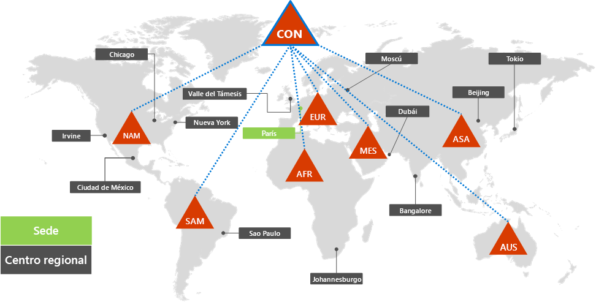
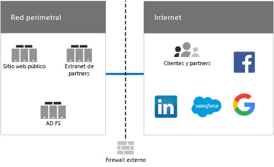
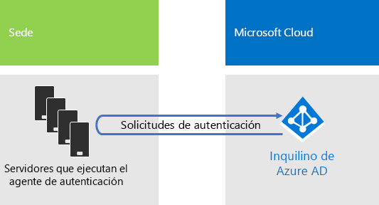
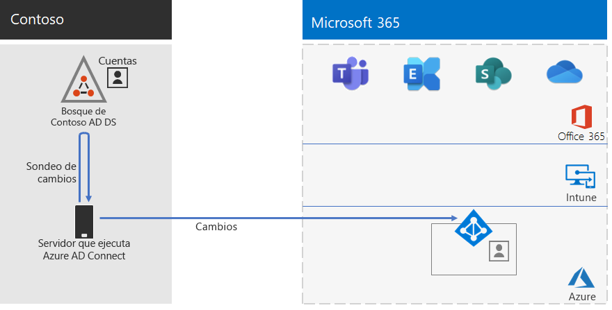
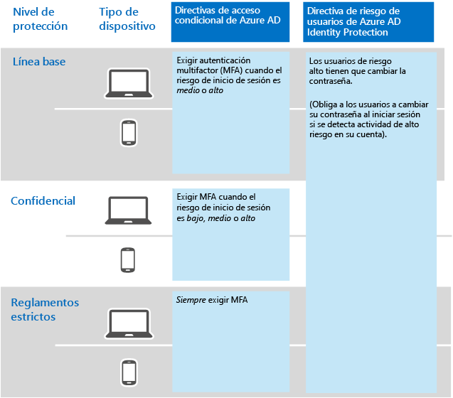

# Identidad para Contoso Corporation

**Resumen:** Cómo Contoso aprovecha la Identidad como servicio (IDaaS) y proporciona autenticación basada en la nube a sus empleados y autenticación federada a sus partners y clientes.

Microsoft proporciona una Identidad como servicio (IDaaS) en sus ofertas de nube con Azure Active Directory (AD). Para adoptar Microsoft 365 Enterprise, la solución IDaaS de Contoso tuvo que aprovechar su proveedor de identidades local e incluir la autenticación federada con sus proveedores de confianza existentes de identidades de terceros.

## Bosque de Windows Server AD de Contoso

Contoso usa un único bosque de Windows Server Active Directory (AD) para contoso.com con siete subdominios, uno para cada región del mundo. La sede, las oficinas de hubs regionales y las oficinas satélite contienen controladores de dominio para la autenticación local y la autorización.

La figura 1 muestra el bosque de Contoso con dominios regionales para las distintas partes del mundo que contienen centros regionales.

 
**Figura 1: Bosque y dominios de Contoso en todo el mundo**

Contoso quiere usar las cuentas y los grupos del bosque contoso.com para la autenticación y la autorización de sus aplicaciones y cargas de trabajo basadas en la nube.

## Infraestructura de autenticación federada de Contoso

Contoso permite lo siguiente:

- Que los clientes usen sus cuentas de Microsoft, Facebook o Google Mail para iniciar sesión en su sitio web público.
- Que los proveedores y partners usen sus cuentas de LinkedIn, Salesforce o Google Mail para iniciar sesión en la extranet de partners.

La figura 2 muestra la red perimetral de Contoso con un sitio web público, una extranet de partners y un conjunto de servidores de Servicios de federación de Active Directory (AD FS). La red perimetral está conectada a Internet que contiene clientes y partners, y servicios de Internet.

**Figura 2: Soporte de Contoso para la autenticación federada para clientes y partners**
 
Los servidores de los Servicios de federación de Active Directory (AD FS) de la red perimetral autentican las credenciales de cliente para el acceso al sitio web público y las credenciales de partner para el acceso a la extranet de partners.

Contoso decidió mantener esta infraestructura y dedicarla a autenticaciones de partners y clientes. Los ingenieros de identidad de Contoso están investigando la conversión de esta infraestructura a Azure AD [B2B](https://docs.microsoft.com/azure/active-directory/b2b/hybrid-organizations) y soluciones [B2C](https://docs.microsoft.com/azure/active-directory-b2c/solution-articles).

## Identidad híbrida con autenticación de paso a través para la autenticación basada en la nube

Contoso quería aprovechar su bosque de Windows Server AD local para la autenticación para los recursos de nube de Microsoft 365. Se decidió por la autenticación de paso a través (PTA) con sincronización de hash de contraseñas (PHS).

### Autenticación PTA

Contoso usa la PTA para la autenticación de credenciales de usuario. Cuando un usuario de Contoso accede a los recursos en la nube, pasa las credenciales que envía se pasan desde Azure AD a un servidor que ejecuta a un agente de autenticación del centro de datos de la sede de Contoso. Uno de estos servidores de agente de autenticación valida las credenciales de usuario en nombre de Azure AD.

La figura 3 muestra un conjunto de servidores de la sede de Contoso que ejecutan el agente de autenticación, con las solicitudes de proceso de autenticación pasadas desde Azure AD. 

 
**Figura 3: Infraestructura de autenticación de paso a través de Contoso**

Contoso eligió la PTA para satisfacer sus requisitos de seguridad, que establecen que se evalúe todo intento de autenticación para detectar cambios inmediatos en los estados de cuentas de usuario, directivas de contraseñas y horas de inicio de sesión efectuados en el bosque de Windows Server AD local.

### PHS

PHS sincroniza el bosque de Windows Server AD local con el inquilino de Azure AD de la suscripción de Microsoft 365 Enterprise, copiando cuentas de usuario y de grupo y una versión cifrada mediante hash de contraseñas de cuentas de usuario. Contoso se decidió por PHS para proporcionar un método alternativo de autenticación directamente con el inquilino de Azure AD en caso de que la PTA no esté disponible.

Para realizar la sincronización de directorios continua, Contoso ha implementado la herramienta Azure AD Connect en un servidor de su centro de datos de París. La figura 4 muestra el servidor que ejecuta Azure AD Connect sondeando el bosque de Windows Server AD de Contoso para detectar cambios, y sincronizando luego los cambios con el inquilino de Azure AD.

 
**Figura 4: Infraestructura de sincronización PHS de directorios de Contoso**

## Directivas de acceso condicional de identidades

Contoso creó un conjunto de [directivas de acceso condicional](identity-access-policies.md) de Azure AD para garantizar que se aplique la autenticación multifactor y los cambios de contraseña cuando Azure AD determine que una solicitud de autenticación puede suponer una vulnerabilidad de inicio de sesión.

La figura 5 muestra el conjunto resultante de directivas de acceso condicional de identidad.

 
**Figura 5: Directivas de acceso condicional basado en la identidad de Contoso**

## Paso siguiente

[Obtenga información sobre](contoso-win10.md) cómo aprovecha Contoso su infraestructura de System Center Configuration Manager para implementar y mantener actualizado Windows 10 Enterprise en la organización.

## Vea también

[Identidad para Microsoft 365 Enterprise](identity-infrastructure.md)

[Guía de implementación](deploy-microsoft-365-enterprise.md)

[Guías del laboratorio de pruebas](m365-enterprise-test-lab-guides.md)
