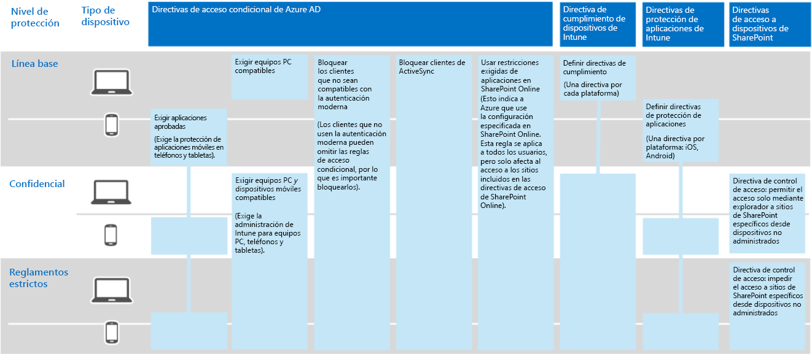
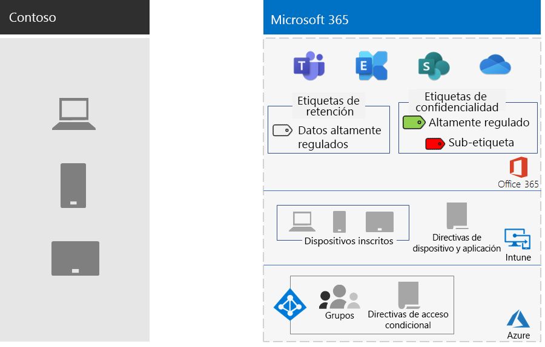

# Protección de la información en Contoso CorporationInformation protection for the Contoso Corporation

Contoso se toma en serio la seguridad y la protección de la información. Por ejemplo, la filtración o destrucción de la propiedad intelectual en la que se describen diseños de productos y técnicas de fabricación propietarias les colocaría en desventaja con respecto a la competencia.Contoso is serious about their information security and protection. For example, leakage or destruction of their intellectual property describing product designs and proprietary manufacturing techniques would place them at a competitive disadvantage.

Antes de mover a la nube sus activos digitales confidenciales y más valiosos, se han asegurado de que los requisitos locales de clasificación y protección de la información se admitieran e implementaran en los servicios basados en la nube de Microsoft 365 Enterprise.Before moving their sensitive and most valuable digital assets to the cloud, they made sure that their on-premises information classification and protection requirements were supported and implemented in the cloud-based services of Microsoft 365 Enterprise.

## Clasificación de seguridad de datos de ContosoContoso's data security classification

Contoso realizó un análisis de los datos y determinó los niveles siguientes.Contoso performed an analysis of their data and determined the following levels.

||||
|:-------|:-----|:-----|
| **Nivel 1: Base de referencia****Level 1: Baseline** | **Nivel 2: Confidencial****Level 2: Sensitive** | **Nivel 3: Altamente regulado****Level 3: Highly regulated** |
| Los datos están cifrados y solo están disponibles para los usuarios autenticados.Data is encrypted and available only to authenticated users     Se proporciona para todos los datos almacenados de forma local y en almacenamiento y cargas de trabajo basadas en la nube, como Office 365. Los datos se encriptan mientras residen en el servicio y en tránsito entre el servicio y los dispositivos de cliente.Provided for all data stored on premises and in cloud-based storage and workloads, such as Office 365. Data is encrypted while it resides in the service and in transit between the service and client devices.    Algunos ejemplos de datos de nivel 1 son las comunicaciones empresariales normales (correo electrónico) y los archivos de empleados administrativos, de ventas y de soporte técnico.Examples of Level 1 data are normal business communications (email) and files for administrative, sales, and support workers. | Nivel 1 más autenticación segura y protección contra la pérdida de datos.Level 1 plus strong authentication and data loss protection:     La autenticación segura incluye la Azure Multi-Factor Authentication con validación de SMS.Strong authentication includes Azure Multi-Factor Authentication (MFA) with SMS validation. La prevención de pérdida de datos garantiza que la información crítica o confidencial no sale de nube de Microsoft.Data loss prevention ensures that sensitive or critical information does not travel outside the on-premises network.    Algunos ejemplos de datos de nivel 2 son la información jurídica y financiera, y los datos de investigación y desarrollo de productos nuevos.Examples of Level 2 data are financial and legal information and research and development data for new products. | Características del nivel 2 además de los niveles más altos de cifrado, autenticación y auditoría.Level 2 plus the highest levels of encryption, authentication, and auditing.      Los niveles más altos de cifrado de datos en reposo y en la nube, conformes con la normativa regional, combinados con MFA con tarjetas inteligentes y alertas y auditoría pormenorizada.The highest levels of encryption for data at rest and in the cloud, compliant with regional regulations, combined with multi-factor authentication with smart cards and granular auditing and alerting.     Algunos ejemplos de datos de nivel 3 son la información de identificación personal de clientes y partners, las especificaciones de ingeniería de productos y las técnicas de fabricación propietarias.Examples of Level 3 data are customer and partner personally identifiable information, product engineering specifications, and proprietary manufacturing techniques.  |
||||

## Directivas de información de ContosoContoso's information policies
En la tabla siguiente se enumeran las directivas de información de Contoso.The following table lists Contoso's information policies.

|||||
|:-------|:-----|:-----|:-----|
|  | **Acceso****Access** | **Retención de datos****Data retention** | **Protección de la información****Information protection** |
| Valor empresarial bajo (Nivel 1: Básico)Low business value (Level 1: Baseline) | Se permite el acceso a todo el mundoAllow access to all  | 6 meses6 months | Se usa el cifrado.Use encryption |
| Valor empresarial medio (Nivel 2: Confidencial)Medium business value (Level 2: Sensitive) | Se permite el acceso a subcontratistas, partners y empleados de ContosoAllow access to Contoso employees, subcontractors, and partners     Se usa MFA, seguridad de la capa de transporte (TLS) y administración de aplicaciones móviles (MAM).Use multi-factor authentication (MFA), Transport Layer Security (TLS), and Mobile Application Management (MAM) | 2 años2 years  | Se usan valores de hash para la integridad de datos.Use hash values for data integrity  |
| Valor empresarial alto (Nivel 3: Altamente regulado)High business value (Level 3: Highly regulated) | Se permite el acceso a ejecutivos y clientes potenciales de ingeniería y producción.Allow access to executives and leads in engineering and manufacturing     Rights Management System (RMS) solo con dispositivos de red administrados.Rights Management System (RMS) with managed network devices only  | 7 años7 years  | Se usan firmas digitales para evitar el rechazo.Use digital signatures for non-repudiation  |
|||||

## Ruta de Contoso a la protección de la información con Microsoft 365 EnterpriseContoso’s path to information protection with Microsoft 365 Enterprise

Contoso siguió los pasos siguientes para preparar Microsoft 365 Enterprise para sus requisitos de protección de la información:Contoso used the following steps to prepare Microsoft 365 Enterprise for their information protection requirements:

1. Identificó qué información se iba a proteger.Identified what information to protect

   Contoso realizó una revisión exhaustiva de los activos digitales existentes en sitios locales de SharePoint y recursos compartidos de archivos, y los clasificó todos.Contoso did an extensive review of their existing digital assets located on on-premises SharePoint sites and file shares and classified each one.

2. Determinó las directivas de acceso, retención y protección de la información para los niveles de datos.Determined access, retention, and information protection policies for data levels

   En función de los niveles de datos, Contoso determinó requisitos de directiva detallados que se usaron para proteger los activos digitales al cambiarlos a la nube.Based on the data levels, Contoso determined detailed policy requirements, which were used to protect existing digital assets as they were moved to the cloud.

3. Creó etiquetas de confidencialidad para los diferentes niveles de información.Created sensitivity labels and their settings for the different levels of information

   Contoso creó etiquetas de confidencialidad para sus niveles de datos con una etiqueta altamente regulada que incluye cifrado, permisos y marcas de agua.Contoso created sensitivity labels for their data levels, with sensitive and highly regulated label including encryption, permissions, and watermarks.

4. Creó sitios de SharePoint protegidos para datos confidenciales y altamente regulados con permisos para bloquear el accesoCreated protected SharePoint Online sites for sensitive and highly regulated data with permissions that lock down access

   Los sitios confidenciales y altamente regulados se configuraron como [sitios aislados](https://docs.microsoft.com/office365/enterprise/isolated-sharepoint-online-team-sites), en los que se personalizaron los permisos de sitio de grupo de SharePoint predeterminados.Both sensitive and highly regulated sites were configured as [isolated sites](https://docs.microsoft.com/office365/enterprise/isolated-sharepoint-online-team-sites), in which the default SharePoint Online team site permissions were customized to Azure Active Directory (Azure AD) groups. También se configuraron sitios confidenciales y altamente regulados en SharePoint con la etiqueta de retención correspondiente.Sensitive and highly regulated SharePoint Online sites were also configured with a corrresponding retention label. Los archivos almacenados en los sitios de SharePoint altamente regulados están protegidos con la etiqueta de confidencialidad Altamente regulado.Files stored in highly regulated SharePoint Online sites are protected with the Highly Regulated sensitivity label. Para obtener más información, vea el escenario de[sitios de SharePoint para datos altamente regulados](teams-sharepoint-online-sites-highly-regulated-data.md).For more information, see the [Microsoft Teams and SharePoint Online sites for highly regulated data](teams-sharepoint-online-sites-highly-regulated-data.md) scenario.

5.  Se han movido los datos de los sitios de SharePoint locales y los recursos compartidos de archivos a los nuevos sitios de SharePoint.Moved data from on-premises SharePoint sites and file shares to their new SharePoint Online sites

    Los archivos que se han migrado a los nuevos sitios de SharePoint heredaron las etiquetas de retención predeterminadas asignadas al sitio.The files migrated to the new SharePoint Online sites inherited the default retention labels assigned to the site.

6.  Se formó a los empleados sobre cómo usar las etiquetas de confidencialidad para los documentos nuevos, cómo interactuar con el departamento de TI de Contoso al crear nuevos sitios de SharePoint y almacenar siempre los activos digitales en sitios de SharePoint.Trained employees on how to use sensitivity labels for new documents, how to interact with Contoso IT when creating new SharePoint Online sites, and to always store digital assets on SharePoint Online sites

    Considerando el aspecto más difícil de la transición a la nube de la protección de la información, los departamentos de TI y administración de Contoso tuvieron que cambiar los hábitos incorrectos de almacenamiento de la información por parte de los empleados de la organización para que etiquetaran y almacenaran siempre sus recursos digitales en la nube, absteniéndose de usar archivos compartidos locales, y nunca usaran servicios de almacenamiento en la nube de terceros o memorias USB.Considered the hardest part of the information protection transition for the cloud, Contoso IT and management needed to change the bad information storage habits of the organization’s employees to always store and label their digital assets in the cloud, refrain from using on-premises file shares, and never use third-party cloud storage services or USB drives.

## Directivas de acceso condicional para la protección de la informaciónConditional access policies for information protection

Junto con la infraestructura de administración de identidad y dispositivos móviles, y como parte de su implementación de Exchange Online y SharePoint, Contoso configuró el siguiente conjunto de directivas de acceso condicional y las aplicó los grupos adecuados:In conjunction with their identity and mobile device management infrastructure and as part of their rollout of Exchange Online and SharePoint Online, Contoso configured the following set of conditional access policies and applied them to the appropriate Azure AD groups:

- [Directivas de acceso a aplicaciones administradas y no administradas en dispositivosManaged and unmanaged application access on devices policies](identity-access-policies.md)
- [Directivas de acceso de Exchange OnlineExchange Online access policies](secure-email-recommended-policies.md)
- [Directivas de acceso a SharePointSharePoint Online access policies](sharepoint-file-access-policies.md)

Aquí se muestra el conjunto resultante de directivas de protección de la información de Contoso.Figure 1 shows Contoso's resulting set of policies for information protection.

>[!Note]
>Contoso también configuró directivas de acceso condicional adicionales para identidad e inicio de sesión.Contoso also configured additional Conditional Access policies for identity and sign-in. Vea [Identidad para Contoso Corporation](contoso-identity.md#conditional-access-policies-for-identity-and-device-access).Identity for the Contoso Corporation
>

Estas directivas garantizan que:These policies ensure that:

- Las aplicaciones permitidas y las acciones que pueden realizar con los datos de la organización se definen mediante directivas de protección de aplicaciones.Apps are allowed and the actions they can take with your organization data are defined by app protection policies.
- Los equipos y dispositivos móviles deben ser compatibles.PCs and mobile devices must be compliant.
- Exchange Online usa el cifrado de mensajes de Office 365 para Exchange Online.Exchange Online uses Office 365 message encryption for Exchange Online.
- SharePoint usa las restricciones que exige la aplicación.SharePoint Online uses app enforced restrictions.
- SharePoint usa directivas de control de acceso para el acceso de solo explorador y para bloquear el de los dispositivos no administrados.SharePoint Online uses access control policies for browser-only access and to block access for unmanaged devices.

## Asignación de características de Microsoft 365 Enterprise a los niveles de datos de ContosoMapping Microsoft 365 Enterprise features to Contoso's data levels

En la tabla siguiente se muestra la asignación de los niveles de datos de Contoso a las características de protección de la información de Microsoft 365 Enterprise.The following table shows the mapping the Contoso's data levels to information protection features in Microsoft 365 Enterprise.

|||||
|:-------|:-----|:-----|:-----|
| | **Office 365****Office 365** | **Windows 10 y Office 365 ProPlus****Windows 10 and Office 365 ProPlus** | **EMS****EMS** |
| Nivel 1: Base de referenciaLevel 1: Baseline  | Directivas de acceso condicional de SharePoint y Exchange OnlineSharePoint and Exchange Online Conditional Access policies   Permisos en los sitios de SharePointPermissions on SharePoint Online sites | Etiquetas de confidencialidadSensitivity labels   BitLockerBitLocker   Windows Information ProtectionWindows Information Protection | Directivas de acceso condicional de dispositivos y directivas de administración de aplicaciones móvilesDevice conditional access policies and Mobile Application Management policies |
| Nivel 2: ConfidencialLevel 2: Sensitive | Nivel 1 más:Level 1 plus:     Etiquetas de confidencialidadSensitivity labels   Las etiquetas de retención de Office 365 en los sitios de SharePointOffice 365 labels on SharePoint Online sites   Prevención de pérdida de datos de Office 365 para SharePoint y Exchange OnlineOffice 365 Data Loss Prevention for SharePoint Online and Exchange Online   Sitios de SharePoint aisladosIsolated SharePoint Online sites  | Nivel 1 más:Level 1 plus:     Etiquetas de confidencialidad en activos digitalesSensitivity labels on digital assets  | Nivel 1Level 1 |
| Nivel 3: Altamente reguladoLevel 3: Highly regulated | Nivel 2 más:Level 2 plus:    Cifrado y protección Bring Your Own Key (BYOK) de la información de secretos empresarialesBring Your Own Key (BYOK) encryption and protection for trade secret information   Azure Key Vault para las aplicaciones de línea de negocio que interactúan con los servicios de Office 365Azure Key Vault for line of business applications that interact with Office 365 services | Nivel 2Level 2 | Nivel 1Level 1 |
|||||

Esta es la configuración de protección de la información resultante de Contoso.Here is Contoso's resulting information protection configuration.

## Paso siguienteNext step

[Vea](contoso-security-summary.md) cómo Contoso ha usado las características de seguridad de Microsoft 365 Enterprise para la administración de la identidad, el acceso y la seguridad, la protección contra amenazas y la protección de la información.[See](contoso-security-summary.md) how Contoso has used the security features across Microsoft 365 Enterprise for identity and access management, threat protection, information protection, and security management.

## Vea tambiénSee also

[Protección de la información para Microsoft 365 EnterpriseInformation protection for Microsoft 365 Enterprise](infoprotect-infrastructure.md)

[Guía de implementaciónDeployment guide](deploy-microsoft-365-enterprise.md)

[Guías del laboratorio de pruebasTest lab guides](m365-enterprise-test-lab-guides.md)

